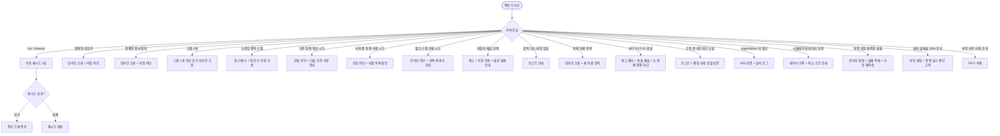

# SCR-H1001 자동화 정책 라이브러리 페이지

## 1. 화면 메타 정보

이 문서는 자동화 정책 라이브러리 페이지에 대한 자기완결형 요구사항 정의서입니다. 다른 문서를 함께 보지 않아도 이 한 장만으로 이 화면에 들어가는 모든 영역, 모든 버튼, 모든 다이얼로그, 모든 권한, 모든 예외 처리, 그리고 이 화면을 지탱하는 운영 정책까지 전부 이해하고 구현할 수 있도록 작성합니다.

| 항목 | 값 |
|---|---|
| 작성일 | 2026-05-22 |
| 버전 | v1.0 |
| 상태 | 최신 통합본 반영 (정합화 완료) |
| 도메인 | D10 본사관리 |
| 화면 ID | SCR-H1001 |
| 화면명 | 자동화 정책 라이브러리 |
| 화면 유형 | 본사 정책 관리 화면 |
| 라우트 (URL) | `/hq/automation-policies` |
| 플랫폼 | 데스크톱(기본), 태블릿 |
| 우선순위 | P0 (출시 필수) |
| 기능코드 | HQ-09 |
| 계약코드 | 파생 기획 (계약 코드 없음) |
| 계약 상태 | 파생 기획 (본사 정책 운영 보강) |
| 부모 기능 prefix | HQ |
| Lv1 코드 | HQ-09 |
| Lv2 / Lv3 세분화 | HQ-09-01 ~ HQ-09-10 (정책 세트 카드, 정책 테이블, 스텝 미리보기, 사용 현황, 정책 생성, 정책 수정, 스텝 구성, 지점 수정 허용 범위, 사용 중지, 정책 복제) |
| 연계 화면 | SCR-092 지점관리, SCR-080A 지점 자동화 적용, SCR-097 감사로그 |
| 호출 다이얼로그 | DLG-H1001-001 정책세트편집 |

## 2. 화면 개요와 목적

자동화 정책 라이브러리는 본사가 전사 자동화 정책 세트를 관리하는 화면입니다. 만료 알림·운영 자동화 정책을 세트 단위로 생성·수정·중지하고, 정책별 스텝(기준일·채널·템플릿·필수 여부)을 라이브러리화하여 지점에 적용합니다. 고정 D-day 대신 본사가 입력한 기준일 step 리스트 구조를 사용하며, 본사가 정책 설계 도구로 사용하는 운영 화면입니다.

이 화면이 다루는 운영 흐름은 매우 다양합니다. 본사 슈퍼관리자가 신규 시즌 만료 알림 정책을 수립할 때는 [+ 정책 세트] → DLG-H1001-001로 스텝 3개(D-30/D-7/D-1)를 입력하고 기본 정책으로 지정하면 신규 지점 등록 시 자동으로 적용됩니다. 본사 운영 담당자가 지점별 SMS 수신 거부율 증가에 대응할 때는 기존 정책의 [편집]으로 특정 스텝의 채널을 카카오로 변경하고, 영향 범위(지점 수)를 고지받은 후 저장합니다. 정책 시뮬레이션으로 사전 검증할 때는 정책 세트 선택 → [시뮬레이션]으로 가상 회원 데이터로 스텝 발송 타이밍을 미리 확인합니다. 정책 롤백이 필요할 때는 수정 후 발송 오류 급증 시 [롤백]으로 이전 버전을 1클릭 복원할 수 있습니다. 신규 지점군 전용 정책 생성에서는 적용 범위를 "특정 지점군"으로 선택해 지방 거점 지점에만 정책을 배포합니다. 본사 컴플라이언스 담당자는 SCR-097에서 정책 수정 이력을 전수 조회해 규정 준수 증빙을 확보합니다. 중복 스텝 정책 충돌 해소에서는 동일 기준일 스텝 중복 경고를 받은 후 기준일을 조정합니다. 사용 중인 정책 세트 복제 후 변형에서는 [복제]로 원본을 보존하면서 변형 버전을 별도로 운영합니다.

따라서 이 화면은 단순한 정책 목록이 아니라, 본사 자동화 정책의 모든 운영 결정이 모이는 정책 설계 도구로 동작해야 합니다.

## 3. 진입 경로와 인접 화면

자동화 정책 라이브러리에 진입하는 경로는 다음과 같습니다.

첫 번째 경로는 사이드바입니다. 본사관리 메뉴 아래 "자동화 정책 라이브러리" 항목을 클릭하면 진입합니다. 슈퍼관리자/primary만 메뉴가 보이고 다른 권한자는 메뉴 자체가 숨겨집니다.

두 번째 경로는 지점 관리(SCR-092)의 신규 지점 등록 후 "본사 표준 정책 미설정" 경고에서 [정책 라이브러리로 이동] 링크를 누르는 경우입니다.

세 번째 경로는 본사 대시보드나 알림 센터에서 "정책 발송 실패율 급증" 알림 클릭입니다.

네 번째 경로는 외부 연동 알림 세트(SET-EXT-01)와 본 정책 라이브러리 충돌 시 알림에서의 진입입니다.

다섯 번째 경로는 감사 로그(SCR-097)에서 정책 수정 이력을 추적하다가 정책 상세로 진입하는 경우입니다.

이 화면에서 빠져나가는 인접 화면은 DLG-H1001-001 정책 세트 편집 다이얼로그, 지점 관리(SCR-092)의 지점별 적용 현황, 지점 자동화 적용(SCR-080A)의 지점 측 적용 정책 수립, 감사 로그(SCR-097)의 정책 수정 이력입니다.

## 4. 레이아웃과 UI 구성

자동화 정책 라이브러리는 위에서 아래로 흐르는 세로형 레이아웃이며, 정책 세트 카드와 테이블이 좌측에, 스텝 미리보기와 사용 현황 패널이 우측에 배치됩니다. 화면은 위에서부터 다음과 같이 구성됩니다.

가장 위에는 페이지 헤더가 있습니다. 헤더 좌측에는 "자동화 정책 라이브러리" 페이지 타이틀과 등록된 정책 세트 수가 표시됩니다. 헤더 우측에는 [+ 정책 세트] 버튼이 배치되어 신규 정책 등록을 시작합니다. 검색창에는 정책명을 입력할 수 있고 사용 상태 필터(전체/사용중/중지) 드롭다운이 함께 배치됩니다.

헤더 아래에는 정책 세트 카드 영역(PolicySetCards)이 있습니다. 카드는 그리드 형태로 배치되며 각 카드에는 정책 성격(만료 알림/운영 자동화), 적용 범위(전사/특정 지점군), 사용중 지점 수, 사용 상태(사용중/중지) 배지, 기본 여부(기본 정책) 배지, 액션 버튼([편집]/[중지]/[복제])이 표시됩니다. 중지된 정책은 카드 전체에 약간의 흐림(opacity 60%)이 들어가 활성 정책과 구분됩니다.

정책 세트 카드 아래에는 정책 테이블(PolicyTable)이 있습니다. 컬럼은 정책명, 스텝 수, 적용 범위(전사/특정), 사용중 지점 수, 마지막 수정자, 마지막 수정일, 액션([편집]/[중지])입니다. 정렬과 검색이 가능합니다.

화면 우측에는 두 개의 패널이 있습니다. 상단에는 스텝 미리보기 패널(StepPreviewPanel)이 있고, 선택된 정책 세트의 스텝 카드 리스트(기준일 + 채널 + 템플릿명 + 필수/선택)가 기준일 기준 정렬로 표시되며 인라인 편집이 가능합니다. 하단에는 사용 현황 패널(UsageStatusPanel)이 있고, 사용중 지점 목록(지점명 + 활성 스텝 수), 미적용 지점(지점명 + 사유), 변경 영향 범위(정책 변경 시 영향받는 지점 수)가 표시됩니다.

정책 세트가 0개인 신규 본사에는 카드 영역 자리에 "자동화 정책이 없습니다" 안내와 [+ 정책 세트] CTA가 표시됩니다.

페이지 가장 아래에는 [정책 PDF 내보내기] 버튼이 있어 선택된 정책 세트(스텝 목록 포함)를 PDF로 내보낼 수 있습니다.

## 5. 탭 구성과 탭별 동작

이 화면은 별도의 상위 탭을 가지지 않습니다. 모든 정책 세트가 카드와 테이블 두 가지 뷰로 동시에 표시되며 사용자가 자유롭게 선택합니다.

사용 상태 필터 드롭다운(전체/사용중/중지)이 사실상 탭과 같은 역할을 합니다. 사용중 정책만, 중지된 정책만, 전체 정책을 빠르게 전환할 수 있습니다.

스텝 미리보기 패널은 카드/테이블에서 선택된 정책 세트에 따라 동기화되어 표시됩니다.

## 6. 버튼·아이콘·링크 액션 전체 정의

이 화면에 등장하는 모든 클릭 가능한 요소를 빠짐없이 정의합니다.

페이지 헤더의 [+ 정책 세트] 버튼은 DLG-H1001-001(정책 세트 편집)을 호출하며 새 정책 세트 생성 모드로 열립니다.

검색창은 정책명을 입력하면 즉시 카드와 테이블 모두에서 검색됩니다.

사용 상태 필터 드롭다운은 즉시 카드와 테이블을 필터링합니다.

정책 세트 카드 클릭은 카드 우측에 슬라이드 인 또는 우측 패널에 스텝 미리보기와 사용 현황을 표시합니다. 카드의 [편집] 버튼은 DLG-H1001-001을 호출하여 기존 정책 편집 모드로 열며, [중지] 버튼은 사용 중지 확인 다이얼로그를 호출하고 [복제] 버튼은 새 이름 입력 후 정책 복제를 트리거합니다.

정책 테이블 행 클릭은 카드 클릭과 동일하게 스텝 미리보기 패널을 갱신합니다. 컬럼 헤더 클릭은 정렬 토글, 행의 [편집]/[중지] 버튼은 카드와 동일하게 동작합니다.

스텝 미리보기 패널의 스텝 카드는 인라인 편집 가능합니다. 기준일·채널·템플릿 필드를 직접 클릭해서 수정할 수 있으며, 변경 즉시 저장됩니다. 인라인 편집은 권한이 있을 때만 활성화됩니다.

사용 현황 패널의 사용중 지점 목록 클릭은 SCR-080A 지점 자동화 적용으로 이동하며, 해당 지점의 적용 현황을 확인할 수 있습니다.

[정책 PDF 내보내기] 버튼은 선택된 정책 세트(스텝 목록 + 버전 정보 포함)를 PDF로 다운로드합니다. 헤더에 생성자·생성일·버전 번호가 자동 삽입됩니다.

기본 정책 배지가 있는 카드의 [중지] 버튼은 비활성화 또는 "기본 정책은 중지할 수 없습니다" 안내로 차단됩니다. 다른 정책을 기본으로 지정해야 중지가 가능합니다.

정책 시뮬레이션은 정책 세트를 선택한 후 [시뮬레이션] 버튼으로 트리거됩니다. 가상 회원 데이터(이용권 만료일 임의 설정)에 정책을 적용하여 스텝 발송 타이밍을 미리보기로 보여줍니다. 결과는 화면 내 임시 표시이며 저장되지 않습니다.

[롤백] 버튼은 정책 카드 또는 상세 패널에서 노출되며, 클릭 시 이전 버전 스냅샷 목록을 보여주고 사용자가 복원할 버전을 선택하면 영향 지점에 자동 재적용됩니다.

지점 수정 허용 범위 설정은 DLG-H1001-001 안에서 처리되지만, 카드에 현재 허용 범위가 배지(토글 허용 / 채널만 / 변경 불가)로 표시되어 한눈에 확인 가능합니다.

권한 외 사용자(슈퍼관리자가 아닌)가 직접 URL로 접근하면 403으로 차단되고 본사 대시보드로 자동 이동됩니다.

모든 버튼은 클릭 후 응답이 돌아오기 전까지 자동으로 비활성화됩니다.

## 7. 호출되는 모달 동작

이 화면에서 호출되는 모달은 DLG-H1001-001 정책 세트 편집 다이얼로그 한 가지입니다.

### 7-1. DLG-H1001-001 정책 세트 편집 다이얼로그

정책 세트 편집 다이얼로그는 본사가 자동화 정책 세트를 생성하거나 수정하는 모달이며, [+ 정책 세트] 또는 카드의 [편집] 버튼으로 트리거됩니다.

모달 상단에는 "정책 세트 편집" 제목이 표시되고, 그 아래에 입력 폼이 네 섹션으로 구성됩니다.

기본정보 섹션에서는 정책명(필수, 전사 중복 불가, 1~50자, 특수문자 허용·이모지 차단), 적용 범위(전사 / 특정 지점군 선택), 사용 상태(사용중/중지), 기본 여부(기본 정책 지정 여부) 토글이 있습니다.

적용 범위 섹션에서는 전사 또는 특정 지점군 선택이며, 특정 지점군 선택 시 지점 검색 + 멀티 선택이 가능합니다.

스텝 리스트 섹션에서는 기준일(음수 = 만료 전 N일, 양수 = 만료 후 N일), 채널(SMS/카카오/앱푸시 다중 선택), 템플릿(본사 등록 템플릿에서 선택), 필수 여부(필수/권장/선택), 지점 토글 허용 여부(스텝별 독립 설정)를 입력합니다. 동일 기준일 중복 시 경고 배너가 표시되지만 사용자 확인 후 저장은 허용됩니다.

지점 수정 허용 범위 섹션에서는 스텝별로 ① 스텝별 토글 허용(스텝 ON/OFF 가능) ② 채널만 변경 허용 ③ 변경 불가 3단계 중 하나를 선택합니다.

저장 버튼 클릭 시 검증을 거친 후 정책 세트가 저장되고 부모 화면(카드/테이블)이 갱신됩니다. 영향 범위가 있으면 "{개수}개 지점에 즉시 적용됩니다" 고지 다이얼로그가 표시되고 확정 시 적용됩니다.

검증 실패 케이스는 정책명 미입력("정책명을 입력해주세요"), 정책명 전사 중복("이미 사용 중인 정책명이에요"), 스텝 0개 저장 시도("스텝을 최소 1개 이상 추가해주세요")이며 인라인 오류로 차단됩니다.

권한은 superAdmin/primary만 사용할 수 있고 owner 이하는 모달 진입 자체가 차단됩니다.

DLG-H1001-001의 상세한 동작 정의는 별도 폴더(DLG-H1001-001 정책세트편집 다이얼로그)에 정의되어 있습니다.

사용 중지 확인 다이얼로그는 별도 모달이지만 정책 세트 편집 다이얼로그가 아닌 가벼운 확인 모달입니다. "현재 {개수}개 지점에 적용 중입니다. 중지하면 신규 적용만 차단됩니다" 안내와 확인/취소 버튼이 표시되고, 확정 시 카드 상태가 "중지"로 변경됩니다. 기본 정책은 중지 불가입니다.

## 8. 토스트와 확인 팝업과 알럿

자동화 정책 라이브러리에서 발생하는 알림성 UI는 다음과 같습니다.

성공 토스트는 "정책 세트를 생성했어요", "정책 세트를 수정했어요", "정책 세트를 중지했어요", "정책 세트를 복제했어요", "이전 버전으로 롤백했어요" 같은 결과 문구를 표시합니다.

실패 토스트는 "정책 세트 저장에 실패했어요", "정책명이 이미 사용 중이에요", "스텝을 최소 1개 이상 추가해주세요", "기본 정책은 중지할 수 없습니다", "사용 중인 지점이 있어 삭제할 수 없습니다" 같은 문구와 보조 액션을 표시합니다.

영향 범위 고지 다이얼로그는 정책 수정 저장 시 "{개수}개 지점에 즉시 적용됩니다" 안내와 확정 버튼이 표시됩니다. 영향 범위가 0개이면 별도 고지 없이 즉시 저장됩니다.

기준일 중복 스텝 경고 배너는 DLG-H1001-001 안에서 표시되고 강제 저장은 허용하지만 이중 발송 책임은 운영자에게 있다는 안내가 함께 표시됩니다.

SET-EXT-01 외부 연동 충돌 경고 배지는 충돌 정책 카드에 빨강 강조로 표시되고 호버 시 충돌 상세 패널이 표시됩니다. 충돌 해소 전에는 두 번째 정책 적용이 차단됩니다.

권한 외 접근은 알럿 형태로 차단되고 본사 대시보드로 자동 이동됩니다.

비활성 채널 선택 경고는 "해당 채널은 현재 비활성 상태입니다" 안내가 표시되며 저장은 허용되지만 발송 시 실패 가능성이 함께 안내됩니다.

스텝 채널 다중 선택 시 동일 시점에 2개 채널로 발송됨을 알리는 중복 발송 의도 명시 팝업이 표시되어 운영자가 의도를 명확히 확인합니다.

발송 실패율 임계값(30%) 초과 감지 시 자동 알림이 발송되고 정책 일시 중단 고려 안내가 운영자에게 발송됩니다.

## 9. 데이터 흐름과 외부 연동

이 화면은 본사 정책 운영의 중심이므로 데이터 흐름이 복잡합니다.

화면 진입 시점에 정책 세트 목록 API가 호출됩니다. 응답에는 등록된 모든 정책 세트와 각 정책의 스텝 수·사용중 지점 수·사용 상태가 포함됩니다. RLS는 슈퍼관리자에게만 적용되며 일반 권한자는 화면 접근 자체가 차단됩니다.

신규 지점 등록 이벤트(SCR-092)가 발생하면 기본 정책 세트가 자동 적용됩니다(SET-DEFAULT 트리거).

정책 수정 배포 이벤트는 저장 확정 시 영향 범위 내 지점의 정책 캐시가 무효화되고 재적용 배치가 실행됩니다.

정책 롤백 이벤트는 롤백 확정 시 이전 버전 스냅샷이 복원되고 영향 지점에 재적용 트리거가 발생합니다.

SET-EXT-01 충돌 감지 배치는 정책 적용 범위 변경 시 외부 연동 알림 세트와의 충돌을 감지하여 충돌 지점 목록을 생성하고 경고 배지를 갱신합니다.

발송 실패 모니터링은 스텝 발송 실행 후 실패율 임계값(30%) 초과 시 자동 알림 + 정책 일시 중단 고려 안내가 발송됩니다.

버전 스냅샷 보존 배치는 정책 수정 저장 시 이전 버전 스냅샷이 DB에 저장됩니다(최대 10개 보존, FIFO 삭제).

알림 센터(NFR-19)는 정책 중지·충돌·배포 실패 이벤트 발생 시 superAdmin에게 인앱 알림을 발송합니다.

시뮬레이션 처리는 [시뮬레이션 실행] 클릭 시 가상 회원 데이터에 정책을 대입하여 스텝 타이밍을 계산하고 결과를 임시 렌더링합니다. DB에는 저장되지 않습니다.

채널 가용성 검증 배치는 스텝 저장 시 선택 채널이 테넌트 활성 채널 목록과 대조되어 비활성 채널 경고 플래그가 설정됩니다.

정책 내보내기 배치는 [PDF 내보내기] 클릭 시 정책 세트 + 스텝 목록 + 버전 정보가 PDF로 생성됩니다.

감사 로그는 정책 세트 생성·수정·중지·복제·롤백 모든 이벤트에 대해 SCR-097에 자동 기록됩니다. 기록 필드는 `policy_set_id`, `actor_id`, `action`, `diff_snapshot`, `affected_branch_count`입니다.

화면에서 호출하는 주요 API 엔드포인트는 다음과 같습니다. 정책 목록 `GET /api/hq/automation-policies`, 정책 생성 `POST /api/hq/automation-policies`, 정책 수정 `PUT /api/hq/automation-policies/:id`, 정책 중지 `POST /api/hq/automation-policies/:id/disable`, 정책 복제 `POST /api/hq/automation-policies/:id/duplicate`.

## 10. 화면 상태와 예외 처리

자동화 정책 라이브러리는 다음 상태들을 가질 수 있습니다.

로딩 상태에서는 카드와 테이블 영역에 스켈레톤이 표시됩니다.

정상 상태는 가장 일반적인 상태로, 모든 정책 세트가 카드와 테이블에 표시되고 스텝 미리보기와 사용 현황 패널이 활성화됩니다.

빈 데이터 상태는 정책 세트가 0개인 신규 본사 상태이며, "자동화 정책이 없습니다" 안내와 [+ 정책 세트] CTA가 표시됩니다.

편집 중 상태는 DLG-H1001-001이 열린 상태입니다.

검증 실패 상태는 정책명 필수·스텝 0개·기준일 중복 등 검증 오류가 발생한 상태이며 인라인 오류로 표시됩니다.

중지된 정책 상태는 카드에 흐림 처리와 "중지" 배지가 표시된 상태입니다.

기본 정책 상태는 카드에 "기본" 배지가 표시되고 중지/삭제가 차단된 상태입니다.

영향 범위 고지 상태는 정책 수정 저장 시 "{개수}개 지점에 즉시 적용됩니다" 다이얼로그가 표시된 상태입니다.

SET-EXT-01 충돌 상태는 외부 연동 세트와 충돌이 감지된 정책에 경고 배지가 표시된 상태입니다.

롤백 처리 중 상태는 [롤백] 클릭 후 이전 버전 복원이 진행되는 동안이며, 카드가 비활성화되고 진행 표시가 됩니다.

처리 중 상태는 저장·삭제·내보내기 같은 액션 진행 중일 때이며 주요 버튼이 비활성화됩니다.

권한 부족 상태는 superAdmin/primary 외 접근이 차단된 상태입니다.

오류 상태는 API 실패 시이며 토스트와 재시도 버튼이 제공됩니다.

예외 케이스별 처리는 다음과 같습니다.

스텝 0개 저장 시도 시 "스텝을 최소 1개 이상 추가해주세요" 인라인 오류로 저장이 차단됩니다.

기준일 중복 스텝 입력 시 경고 배너가 표시되고 사용자 확인 후 저장은 허용됩니다.

사용 중지 시 기존 지점 영향 고지가 표시되고 확정 시에만 중지됩니다.

기본 정책 중지 시도 시 "기본 정책은 중지할 수 없습니다" 차단되고 다른 정책 기본 지정 후 재시도 안내가 표시됩니다.

정책 삭제 시 사용 중인 지점이 존재하면 삭제 차단됩니다.

지점 수정 허용 범위 "변경 불가"인 스텝은 지점 측 편집 UI가 비활성화되고 잠금 아이콘이 표시됩니다.

필수 스텝 삭제 시도 시 "필수 스텝은 삭제할 수 없습니다" 차단되고 선택 스텝으로 변경 후 삭제 가능합니다.

정책 수정 후 영향 범위 0개이면 별도 고지 없이 즉시 저장됩니다.

영향 범위 {개수}개 시 "{개수}개 지점에 즉시 적용됩니다" 고지 다이얼로그 후 확정됩니다.

롤백 대상 버전 없음 시 "롤백 가능한 이전 버전이 없습니다" 안내가 표시됩니다.

정책 복제 시 이름 중복 시 "이미 같은 이름의 정책 세트가 있어요" 인라인 오류로 차단됩니다.

superAdmin 외 접근은 화면 진입 자체가 차단되고 403 처리됩니다.

비활성 채널 선택은 경고 표시 후 저장 허용되지만 발송 시 실패 가능성이 안내됩니다.

SET-EXT-01 충돌 시 경고 배지와 충돌 상세 패널이 표시되고 충돌 해소 전 두 번째 정책 적용이 차단됩니다.

정책 수정 중 네트워크 오류 시 "저장에 실패했습니다. 다시 시도해주세요" 토스트가 표시되고 편집 내용이 로컬에 임시 보존됩니다.

시뮬레이션 데이터 부족 시 "시뮬레이션에 필요한 데이터가 부족합니다" 안내와 최소 조건 안내가 표시됩니다.

영향 지점 재적용 실패 시 관리자 알림 + 실패 지점 목록 노출 + 수동 재적용 버튼이 제공됩니다.

## 11. 권한별 처리

이 화면은 본사 권한 정책이 가장 엄격하게 적용되는 화면입니다.

슈퍼관리자(superAdmin)와 본사 최고관리자(primary)만 전사 정책 세트를 생성·수정·중지·복제·롤백할 수 있습니다.

Owner(지점장) 이하 모든 권한자는 본 화면에 접근할 수 없습니다. 사이드바에 메뉴가 보이지 않고, 직접 URL 접근 시 403 처리됩니다. 지점별 자동화 적용은 SCR-080A 지점 자동화 적용에서 본사가 허용한 범위 안에서만 가능합니다.

스텝 별 지점 수정 허용 범위는 본사가 정책 단위로 설정하며, 지점은 이 범위 안에서만 수정 가능합니다. ① 스텝별 토글 허용 ② 채널만 변경 허용 ③ 변경 불가 3단계입니다.

필수 스텝은 본사 superAdmin만 필수↔선택 변경이 가능하며, 지점에서는 OFF 토글 불가입니다.

기본 정책 지정/해제는 본사 superAdmin만 가능하며 전사에 1개만 지정 가능합니다.

모든 정책 변경은 감사 로그에 기록되어 본사 컴플라이언스 추적이 가능합니다.

권한 외 사용자의 직접 URL 접근 시도는 그 자체가 보안 이벤트로 감사 로그에 기록됩니다.

## 12. 메인 흐름

자동화 정책 라이브러리의 핵심 동작 흐름입니다.

```mermaid
flowchart TD
    A([자동화 정책 라이브러리 진입]) --> B{권한 검증}
    B -->|superAdmin / primary| C[정책 세트 카드 + 테이블 로드]
    B -->|기타| D[403 + 자동 이동]
    C --> E{사용자 액션}
    E -->|+ 정책 세트| F[DLG-H1001-001 생성 모드]
    E -->|카드/행 선택| G[스텝 미리보기 + 사용 현황 패널 갱신]
    E -->|편집| H[DLG-H1001-001 수정 모드]
    E -->|중지| I[중지 확인 다이얼로그]
    E -->|복제| J[새 이름 입력 + 복제]
    E -->|롤백| K[이전 버전 선택 + 복원]
    E -->|시뮬레이션| L[가상 회원 데이터 + 결과 임시 표시]
    E -->|PDF 내보내기| M[정책 세트 + 스텝 PDF 다운로드]
    F -->|저장| N[검증 + 저장 + 감사 로그 + 영향 범위 고지]
    H -->|저장| N
    I -->|확정 + 기본 정책 아님| O[중지 + 신규 적용 차단 + 감사 로그]
    I -->|기본 정책| P["기본 정책은 중지 불가" 차단]
    J --> Q[복제 후 "중지" 상태로 생성]
    K --> R[이전 버전 복원 + 영향 지점 재적용 + 감사 로그]
```

## 13. 에러와 예외 흐름



## 14. 핵심 디자인 요청사항

이 화면이 본사 정책 운영자에게 잘 작동하려면 다음 디자인 원칙이 시각적으로 명확해야 합니다.

본사 화면은 정책 설계 도구처럼 보여야 합니다. 카드에서 정책 성격·범위·사용중 지점 수가 한눈에 읽히도록 카드 헤더에 정책명, 본문에 핵심 정보, 풋터에 액션 버튼이 일관되게 배치됩니다.

정책 세트 카드는 그리드 형태로 배치되어 정책 수를 한눈에 인지할 수 있어야 합니다. 기본 정책 배지(별 모양 또는 "기본")와 사용중/중지 배지가 명확히 표시됩니다.

스텝 편집은 표 편집보다 카드 리스트와 인라인 편집 조합이 적합합니다. 각 스텝이 카드 형태로 표시되어 기준일·채널·템플릿·필수 여부가 직관적으로 인식되도록 합니다.

기준일 음수/양수 표시는 일관됩니다. 음수(만료 전 N일)는 "D-30", 양수(만료 후 N일)는 "D+7" 형태로 표시되어 시점이 명확히 인식됩니다.

채널 표시(SMS/카카오/앱푸시)는 작은 아이콘과 함께 색상 코딩됩니다. 다중 채널 선택 시 모든 아이콘이 함께 표시되어 동일 시점 다중 발송 의도가 명확합니다.

지점 수정 허용 범위 배지(토글 허용/채널만/변경 불가)는 색상으로 구분되어 지점 측 자유도가 한눈에 인식됩니다.

영향 범위 표시는 "사용중 N개 지점" 형태로 명확히 노출되어 정책 변경의 파급력을 즉시 인지하게 합니다.

SET-EXT-01 충돌 경고 배지는 빨강 톤으로 강조되어 즉시 주의를 끌고, 호버 시 충돌 상세 패널이 펼쳐집니다.

[시뮬레이션] 버튼은 점선 테두리 또는 secondary 톤으로 표시되어 실제 발송이 아닌 미리보기임을 시각적으로 알립니다.

[롤백] 버튼은 노랑 톤으로 표시되어 되돌리기 액션임을 인지하게 합니다.

진행 스피너와 로딩 스켈레톤은 본사 대시보드와 동일한 톤으로 통일됩니다.

모바일/태블릿에서는 카드가 1열 또는 2열로 자동 재배치되고 스텝 미리보기 패널은 하단으로 이동됩니다.

## 15. 운영 정책 (이 화면에 연결된 부분)

자동화 정책 라이브러리는 본사 자동화 정책의 중심 도구이므로 운영 정책을 풀어 적습니다.

본 화면은 superAdmin/primary 계정만 접근 가능하며 그 외 계정은 403으로 차단됩니다.

고정 D-day 대신 본사가 입력한 기준일 step 리스트 구조를 사용합니다. 기준일은 음수(이용권 만료 전 N일)와 양수(만료 후 N일) 모두 허용됩니다.

정책명은 필수이며 전사 중복 불가입니다. 1~50자, 특수문자 허용(괄호·하이픈), 이모지 차단입니다.

스텝은 최소 1개 이상 등록되어야 저장 가능합니다.

동일 정책 세트 내 기준일 중복 시 경고 표시 후 사용자 확인이 필요합니다. 강제 저장은 허용되지만 이중 발송 책임은 운영자에게 있습니다.

사용 중지된 정책은 신규 적용만 차단되고 기존 사용 지점은 그대로 동작합니다. 중지 전 영향 범위(지점 수) 고지가 필수입니다.

기본 정책 세트는 전사에 1개만 지정 가능하며, 신규 지점 등록 시 자동 적용됩니다. 기본 정책은 중지·삭제 불가이며 다른 세트를 기본으로 지정 후 변경해야 합니다.

지점 수정 허용 범위는 3단계로 정해져 있습니다. ① 스텝별 토글 허용(스텝 ON/OFF 가능) ② 채널만 변경 허용 ③ 변경 불가. 스텝별로 독립 설정 가능합니다.

필수 스텝(required)은 지점에서 OFF 토글 불가입니다. 필수↔선택 변경은 본사 superAdmin 전용입니다.

정책 버전 관리는 수정 시 이전 버전 스냅샷을 보존하여 롤백 가능합니다. 최대 보존 버전 수는 10개이며 FIFO 삭제됩니다.

롤백은 이전 버전 선택 시 현재 정책을 해당 버전으로 즉시 교체하고 영향 지점에 재적용 트리거가 발생합니다.

시뮬레이션은 실제 발송 없이 가상 회원에 정책을 적용하여 스텝 발송 타이밍을 미리보기합니다. 결과는 화면 내 임시 표시이며 저장되지 않습니다.

정책 충돌 감지는 동일 지점에 2개 이상의 정책 세트가 겹쳐 적용될 경우 충돌 경고를 노출합니다. 충돌 해소 전까지 두 번째 정책 적용이 차단됩니다.

정책 복제는 기존 세트 전체를 복사하여 새 이름으로 저장됩니다. 복제 직후 상태는 "중지"이며 명시적으로 활성화해야 합니다.

채널 가용성 검증은 스텝 저장 시 선택 채널(SMS/카카오/앱푸시)이 테넌트 내 활성화된 채널인지 검증합니다. 비활성 채널 선택 시 경고가 표시됩니다.

SET-EXT-01 페어링은 외부 연동 알림 세트와 본 정책 라이브러리가 동일 지점에 중복 적용 시 SET-EXT-01이 우선순위를 가집니다. 충돌 표시는 필수입니다.

감사 로그 필드는 정책 세트 생성·수정·중지·복제·롤백 모두에 대해 SCR-097에 기록됩니다. `policy_set_id`, `actor_id`, `action`, `diff_snapshot`, `affected_branch_count`가 저장됩니다.

정책 삭제 조건은 사용 중인 지점이 0개이고 기본 정책이 아닌 경우에만 가능합니다. 삭제 시 버전 이력도 함께 삭제됩니다.

스텝 채널 다중 선택은 동일 기준일 스텝에 채널을 2개 이상 선택하면 동일 시점에 2개 채널로 발송됩니다. 중복 발송 의도 명시 팝업이 표시됩니다.

적용 범위 변경 시 "전사 → 특정 지점군" 변경 시 기존 전사 적용 지점 중 범위 외 지점에는 자동 해제 알림이 발송됩니다.

스텝 순서는 기준일 오름차순 자동 정렬이며 동일 기준일 내 순서는 등록 순으로 유지됩니다.

정책 내보내기는 정책 세트 전체(스텝 목록 포함)를 PDF로 내보낼 수 있으며, 헤더에 생성자·생성일·버전 번호가 자동 삽입됩니다.

본사 자동화 정책 운영의 핵심은 다음 흐름으로 정리됩니다. 본사에서 정책 세트와 step 등록 → 지점에서 상품군별 적용 정책 수립(SCR-080A) → 대상 회원 자동 산출 → 스텝별 발송 → 발송 이력 저장 → 상담/재등록 후속 액션 연결.

운영 예외 처리는 다음과 같이 정해져 있습니다. 수신 동의가 없는 채널은 자동 제외, 동일 회원에게 같은 날 중복 성격의 알림이 많으면 묶음 처리, 담당 FC가 없는 회원은 지점 공용 큐로 발송, 지점이 정책을 바꾸면 변경 시점 이후 대상부터 새 정책 적용.

회원앱/관리자 웹 연계는 회원앱 알림 목록이 자동화 발송 이력과 일관되어야 하며, 관리자 웹에서는 발송 여부뿐 아니라 후속 처리 상태까지 봐야 합니다. 만료 알림은 단순 발송으로 끝나지 않고 상담/결제 액션 큐와 연결됩니다.

FC 액션 큐에는 만료 예정 재등록 상담을 단일 업무로 표시하되, D-7/D-14/D-30 버킷 분해는 이번 퍼블리싱 범위에서 제외됩니다.

환불 → 재결제 복귀율은 자동화·재등록 KPI로 추가하지 않습니다.

본사 화면은 "정책 설계"가 중심이고, 지점 화면은 "무엇을 적용 중인지"가 중심입니다. 고정 D-day UI가 아닌 정책 스텝 리스트 UI로 설계해야 합니다.

이상의 모든 정책은 이 화면을 구현하고 운영하는 사람이 별도 문서 없이 이 한 장만 보면 이해할 수 있도록 풀어 적었습니다. 정책이 바뀌면 이 문서가 함께 갱신되어야 하며, 코드 변경과 정책 변경은 항상 짝지어 진행됩니다.
