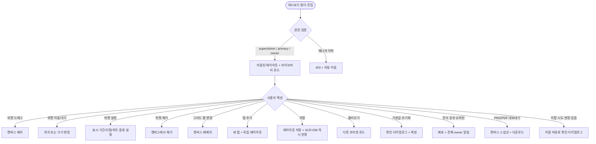
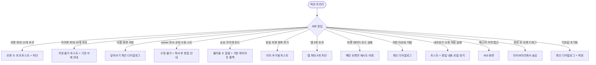

# SCR-H1002 커스텀 대시보드 빌더 페이지

## 1. 화면 메타 정보

이 문서는 커스텀 대시보드 빌더 페이지에 대한 자기완결형 요구사항 정의서입니다. 다른 문서를 함께 보지 않아도 이 한 장만으로 이 화면에 들어가는 모든 영역, 모든 동작, 모든 위젯, 모든 권한, 모든 예외 처리, 그리고 이 화면을 지탱하는 운영 정책까지 전부 이해하고 구현할 수 있도록 작성합니다.

| 항목 | 값 |
|---|---|
| 작성일 | 2026-05-22 |
| 버전 | v1.0 |
| 상태 | 최신 통합본 반영 (정합화 완료) |
| 도메인 | D10 본사관리 |
| 화면 ID | SCR-H1002 |
| 화면명 | 커스텀 대시보드 빌더 |
| 화면 유형 | 본사 도구 화면 |
| 라우트 (URL) | `/dashboard/builder` |
| 플랫폼 | 데스크톱(기본), 태블릿 |
| 우선순위 | P1 (고도화) |
| 기능코드 | HQ-10 |
| 계약코드 | 파생 기획 |
| 계약 상태 | 파생 기획 (본사 운영 도구 보강) |
| 부모 기능 prefix | HQ |
| Lv1 코드 | HQ-10 |
| Lv2 / Lv3 세분화 | HQ-10-01 ~ HQ-10-08 (위젯 라이브러리, 캔버스 배치, 위젯 개별 설정, 레이아웃 옵션, 레이아웃 저장, 레이아웃 불러오기, 기본값 초기화, 대시보드 반영) |
| 연계 화면 | SCR-090 본사대시보드, SCR-097 감사로그 |
| 호출 다이얼로그 | 없음 (인라인 확인 모달) |

## 2. 화면 개요와 목적

커스텀 대시보드 빌더는 위젯을 드래그앤드롭 방식으로 배치하여 자신만의 대시보드를 구성하는 화면입니다. 자주 확인하는 지표와 정보를 원하는 레이아웃으로 배치하여 업무 효율을 높이며, 여러 레이아웃 프리셋을 저장·불러오기로 관리할 수 있습니다. 본사 경영진은 매일 아침 보고용 프리셋을, Owner(지점장)은 지점 운영 현황 한눈 파악용 프리셋을, 본사 운영팀은 전사 공유 대시보드를 각각 자기 역할에 맞게 구성할 수 있습니다.

이 화면이 다루는 운영 흐름은 매우 다양합니다. 본사 CFO가 매일 아침 전사 매출·신규 회원 수·이탈률 위젯 3종을 상단에 배치한 전용 프리셋을 로드하여 일일 브리핑에 활용합니다. Owner(지점장)은 소속 지점의 오늘 출석·미납 회원·이번 주 수업 현황 위젯을 2열 레이아웃으로 구성하여 출근 즉시 확인합니다. 본사 운영팀은 superAdmin이 공통 레이아웃을 "전사 공유"로 설정하면 모든 owner 계정의 기본 대시보드에 반영됩니다. 지표 탭 분리 운영에서는 매출·회원·출석을 별도 탭으로 분리하여 목적별로 빠르게 전환할 수 있고, 각 탭은 독립 레이아웃으로 저장됩니다. 위젯 자동 갱신 주기 설정에서는 실시간성이 중요한 체크인 위젯은 30초마다, 매출 집계 위젯은 10분마다 갱신 주기를 개별 설정하여 서버 부하를 최적화합니다. 캐시 기반 빠른 로드에서는 대형 데이터 위젯에 캐시(최대 5분)를 적용하여 대시보드 진입 지연을 최소화합니다. 팀 교체·역할 변경 시에는 [기본값 초기화] 후 새 역할에 맞는 위젯 세트를 처음부터 구성합니다.

따라서 이 화면은 단순한 위젯 편집기가 아니라, 역할별로 다른 운영 시야를 맞춤화하는 본사 도구로 동작해야 합니다.

## 3. 진입 경로와 인접 화면

커스텀 대시보드 빌더에 진입하는 경로는 다음과 같습니다.

첫 번째 경로는 사이드바입니다. 본사관리 메뉴 아래 "커스텀 대시보드 빌더" 항목을 클릭하면 진입합니다.

두 번째 경로는 본사 대시보드(SCR-090) 또는 슈퍼 대시보드(SCR-091)의 "대시보드 편집" 또는 "레이아웃 변경" 링크 클릭입니다.

세 번째 경로는 환영 배너의 "내 대시보드 만들기" 가이드 링크입니다.

이 화면에서 빠져나가는 인접 화면은 본사 대시보드(SCR-090, 저장 후 즉시 반영), 슈퍼 대시보드(SCR-091, 본사 슈퍼관리자의 경우), 감사 로그(SCR-097, 전사 공유 레이아웃 변경 추적)입니다.

## 4. 레이아웃과 UI 구성

커스텀 대시보드 빌더는 좌측 위젯 라이브러리 패널과 우측 캔버스 영역의 좌우 분할 레이아웃입니다.

가장 위에는 페이지 헤더가 있습니다. 헤더 좌측에는 "커스텀 대시보드 빌더" 페이지 타이틀과 현재 편집 중인 레이아웃 이름이 표시됩니다. 헤더 우측에는 [저장], [불러오기], [기본값 초기화], [PNG/PDF 내보내기] 버튼이 배치됩니다. 변경 사항이 있을 때 [저장] 버튼이 강조되어 활성 상태가 됩니다.

페이지 헤더 아래의 좌측 패널은 위젯 라이브러리입니다. 카테고리별 분류(매출 / 회원 / 출석 / 수업 / 공지 / 할 일 등)가 상단 탭으로 표시되고, 각 카테고리 안에는 위젯 카드가 썸네일 미리보기와 위젯명으로 나열됩니다. 위젯 검색창이 상단에 있어 위젯명을 입력해 빠르게 찾을 수 있습니다. 권한별 위젯 필터링이 적용되어 superAdmin은 전체 위젯, Owner(지점장)은 지점 관련 위젯만 표시됩니다.

페이지 헤더 아래의 우측 영역은 캔버스입니다. 그리드 라인이 표시되어 위젯 배치 위치를 가시화하고, 그리드 열 수 토글(2/3/4열)과 그리드 선 표시/숨김 토글이 헤더 영역에 함께 배치됩니다. 캔버스 내부에는 현재 레이아웃의 위젯이 배치되어 있고, 위젯은 드래그로 이동, 모서리 드래그로 크기 조절이 가능합니다. 위젯 카드 우측 상단에는 설정 아이콘(톱니바퀴)과 제거 아이콘(X)이 호버 시 표시됩니다. 위젯 설정 클릭은 위젯 내부의 표시 기간·지점·차트 종류 같은 세부 옵션 패널을 열고, 제거 클릭은 위젯을 캔버스에서 제거합니다.

캔버스 상단에는 탭 영역이 있어 매출 탭·회원 탭·출석 탭처럼 목적별 레이아웃을 최대 5개까지 분리해서 관리할 수 있습니다. 각 탭은 독립 레이아웃으로 저장됩니다.

캔버스가 빈 상태에서는 "위젯을 추가하여 대시보드를 구성해보세요" 안내가 표시되고 좌측 라이브러리가 강조됩니다.

캔버스 하단에는 위젯 자동 갱신 주기 설정(10초/30초/1분/5분/수동)이 있어 위젯별로 갱신 주기를 조정할 수 있습니다.

## 5. 탭 구성과 탭별 동작

이 화면은 두 가지 탭 구조를 가집니다.

첫째는 위젯 라이브러리 패널의 카테고리 탭입니다. 매출/회원/출석/수업/공지/할 일 같은 카테고리를 좌측 패널 상단에서 전환할 수 있습니다.

둘째는 캔버스 상단의 대시보드 탭입니다. 최대 5개까지 분리 가능하며 각 탭은 독립 레이아웃으로 저장됩니다. 매출 탭·회원 탭·출석 탭 같은 목적별 분리가 일반적입니다.

탭 추가는 [+ 탭 추가] 버튼으로 트리거되며 탭 이름 입력 모달이 표시됩니다. 5개 초과 시 차단됩니다.

탭 삭제는 탭 우클릭 또는 탭 호버 시 표시되는 X 버튼으로 트리거됩니다.

## 6. 버튼·아이콘·링크 액션 전체 정의

페이지 헤더의 [저장] 버튼은 현재 레이아웃을 저장하며, 변경 사항이 있을 때만 활성화됩니다. 저장 시 본사 대시보드(SCR-090)에 즉시 반영됩니다.

[불러오기] 버튼은 저장된 레이아웃 목록 드롭다운을 열며 선택 시 캔버스에 즉시 반영됩니다.

[기본값 초기화] 버튼은 확인 다이얼로그를 표시한 후 시스템 기본 레이아웃으로 복원합니다.

[PNG/PDF 내보내기] 버튼은 캔버스 스냅샷 + 실시간 데이터를 파일로 다운로드합니다.

좌측 위젯 라이브러리에서 위젯 카드를 캔버스로 드래그하면 위젯이 배치됩니다.

캔버스 위젯의 모서리를 드래그하면 크기가 조절되고, 위젯 본체를 드래그하면 위치가 이동됩니다. 그리드에 스냅됩니다.

위젯 우측 상단의 설정 아이콘은 표시 기간·지점·차트 종류 설정 패널을 열고, 제거 아이콘은 위젯을 캔버스에서 제거합니다.

캔버스 헤더의 그리드 열 수 토글(2/3/4열)은 즉시 그리드를 재배치합니다.

그리드 선 표시/숨김 토글은 그리드 라인을 토글합니다.

탭 추가/삭제 액션은 위에서 설명한 대로입니다.

위젯 자동 갱신 주기 설정은 위젯별로 적용됩니다.

전사 공유 레이아웃 설정은 superAdmin만 가능하며 슈퍼관리자가 [전사 공유] 토글을 켜면 전체 owner 계정의 기본 대시보드에 반영됩니다.

저장되지 않은 상태에서 화면 이탈 시도는 "저장되지 않은 변경 사항이 있습니다" 확인 다이얼로그로 차단됩니다.

수동 새로고침 버튼은 캔버스 위젯의 캐시를 즉시 무효화하고 재요청합니다.

## 7. 호출되는 모달 동작

이 화면에서는 인라인 확인 모달만 호출되며 별도 다이얼로그 페이지는 없습니다.

기본값 초기화 확인 모달은 [기본값 초기화] 클릭 시 표시되며 "현재 레이아웃이 기본 레이아웃으로 초기화됩니다. 복구할 수 없습니다" 안내와 확인/취소 버튼이 표시됩니다.

저장 미완료 이탈 모달은 변경 사항이 있는 상태에서 화면 이탈 시 표시되며 [저장 후 이동] / [그냥 이동] / [취소] 3개 옵션이 제공됩니다.

레이아웃 이름 입력 모달은 [저장]을 처음 누를 때 또는 [다른 이름으로 저장] 시 표시됩니다. 이름 중복 시 "같은 이름의 레이아웃이 이미 있습니다. 덮어쓰시겠습니까?" 확인이 추가됩니다.

탭 추가 모달은 새 탭 이름 입력 폼이 표시됩니다. 5개 초과 시 "탭은 최대 5개까지 생성할 수 있습니다" 차단됩니다.

전사 공유 레이아웃 배포 확인 모달은 superAdmin이 [전사 공유] 토글을 켤 때 표시되며 영향 범위와 확인이 필요합니다.

## 8. 토스트와 확인 팝업과 알럿

성공 토스트는 "레이아웃을 저장했어요", "위젯을 추가했어요", "기본값으로 초기화했어요", "전사에 배포되었어요" 같은 결과 문구를 표시합니다.

실패 토스트는 "캔버스에 추가할 수 있는 위젯 수를 초과했습니다(최대 12개)", "프리셋을 더 이상 저장할 수 없습니다(최대 10개)", "저장에 실패했습니다", "본사에서 배포한 레이아웃은 수정할 수 없습니다" 같은 문구를 표시합니다.

위젯 데이터 로드 실패 시 해당 위젯에만 "데이터를 불러오지 못했습니다 [재시도]"가 표시되고 다른 위젯은 정상 표시됩니다.

권한 없는 위젯 드래그 시도는 라이브러리에서 해당 위젯이 숨김 처리되어 드래그 자체가 불가합니다.

매니저 이하 접근 시도는 403 화면으로 차단됩니다.

## 9. 데이터 흐름과 외부 연동

화면 진입 시점에 사용자별 저장된 레이아웃 목록 API와 위젯 라이브러리 API가 호출됩니다.

레이아웃 저장은 `POST /api/dashboard/layouts` 또는 `PUT /api/dashboard/layouts/:id`로 처리되며 저장 즉시 본사 대시보드(SCR-090)의 캐시가 무효화되어 즉시 반영됩니다.

전사 공유 레이아웃 배포 이벤트는 superAdmin의 [전사 공유] 저장 시 전체 owner 계정의 기본 대시보드 레이아웃이 교체되고 NFR-19 알림 센터를 통해 인앱 알림이 발송됩니다.

위젯 자동 갱신 스케줄러는 설정된 갱신 주기(10초~5분)에 따라 해당 위젯 데이터 API를 재호출하고 캐시를 갱신합니다.

캐시 무효화 이벤트는 수동 새로고침 버튼 클릭 시 전체 위젯 캐시가 즉시 만료되고 재요청됩니다.

레이아웃 내보내기 배치는 [PNG/PDF 내보내기] 클릭 시 캔버스 스냅샷 + 실시간 데이터를 취합하여 파일을 생성합니다.

손상 프리셋 감지 배치는 불러오기 시 JSON 스키마를 검증하며 실패 시 기본 레이아웃으로 폴백하고 오류 로그가 기록됩니다.

프리셋 FIFO 관리는 프리셋 최대 10개 한도 초과 저장 시도 시 사용자에게 기존 프리셋 삭제를 요청합니다(자동 삭제 안 함).

감사 로그는 전사 공유 레이아웃 생성·수정·삭제 시 SCR-097에 기록됩니다. 개인 레이아웃 변경은 미기록입니다.

화면에서 호출하는 주요 API는 다음과 같습니다. 레이아웃 목록 `GET /api/dashboard/layouts`, 저장 `POST /api/dashboard/layouts`, 수정 `PUT /api/dashboard/layouts/:id`, 삭제 `DELETE /api/dashboard/layouts/:id`, 위젯 라이브러리 `GET /api/dashboard/widgets`.

## 10. 화면 상태와 예외 처리

기본 상태는 저장된 레이아웃이 편집 모드로 로드된 상태입니다.

위젯 드래그 중 상태는 사용자가 라이브러리에서 위젯을 드래그하는 동안이며 캔버스에 배치 가능 위치가 시각적으로 표시됩니다.

수정 중 상태는 변경 사항이 있을 때이며 [저장] 버튼이 강조됩니다.

저장 완료 상태는 저장 후 본사 대시보드 반영 완료 상태입니다.

빈 캔버스 상태는 위젯이 0개일 때이며 "위젯을 추가하여 대시보드를 구성해보세요" 안내가 표시됩니다.

권한 부족 상태는 매니저 이하 접근 시이며 403으로 차단됩니다.

위젯 최대 개수 초과 시도 시 "캔버스에 추가할 수 있는 위젯 수를 초과했습니다(최대 12개)" 토스트와 추가 차단이 일어납니다.

저장 미완료 이탈 시 확인 다이얼로그가 표시됩니다.

기본값 초기화 실행 시 복구 불가 확인 다이얼로그가 표시됩니다.

위젯 데이터 로드 실패 시 해당 위젯만 "데이터를 불러오지 못했습니다 [재시도]" 표시되고 나머지는 정상 표시됩니다.

전사 공유 레이아웃 수정 시도(owner) 시 "본사에서 배포한 레이아웃은 수정할 수 없습니다" 안내와 복사 후 편집 유도가 표시됩니다.

동일 위젯 중복 추가 시도(제한 위젯) 시 "이미 추가된 위젯입니다" 토스트로 차단됩니다.

프리셋 이름 중복 저장 시 덮어쓰기 확인 다이얼로그가 표시됩니다.

권한 외 위젯 드래그 시도는 라이브러리에서 숨김 처리되어 드래그 자체 불가입니다.

손상된 프리셋 불러오기 시 "레이아웃을 불러올 수 없습니다" 오류와 기본 레이아웃 자동 폴백이 일어납니다.

탭 최대 개수 초과 시 "탭은 최대 5개까지 생성할 수 있습니다" 토스트로 차단됩니다.

네트워크 오류로 저장 실패 시 "저장에 실패했습니다. 다시 시도해주세요" 토스트와 편집 내용 로컬 유지로 처리됩니다.

## 11. 권한별 처리

superAdmin와 primary는 전체 위젯 라이브러리에 접근 가능하며 레이아웃 구성·저장·전사 공유 모두 가능합니다.

Owner(지점장)은 지점 관련 위젯만 라이브러리에 표시됩니다. 전사 집계 위젯은 superAdmin/primary 전용입니다. 레이아웃 구성·저장은 가능하지만 전사 공유는 불가합니다. 본사가 배포한 전사 공유 레이아웃은 읽기 전용으로 표시되며 복사(Copy) 후 개인 편집이 가능합니다.

매니저(manager) 이하 권한자(fc, trainer, staff, front, readonly)는 본 화면에 접근할 수 없습니다. 사이드바에 메뉴가 보이지 않고 직접 URL 접근 시 403 처리됩니다.

권한별 위젯 가시성은 위젯 라이브러리에서 계정 권한 기반 필터링이 적용됩니다. 권한 외 위젯은 숨김 처리되어 드래그 자체가 불가합니다.

## 12. 메인 흐름

## 13. 에러와 예외 흐름

## 14. 핵심 디자인 요청사항

좌우 분할 레이아웃이 명확해야 합니다. 좌측 라이브러리 패널은 약 25~30% 폭, 우측 캔버스는 70~75% 폭으로 시각적 비율이 일관되어야 합니다.

위젯 카드는 썸네일 미리보기와 함께 표시되어 드래그 전에 위젯의 모양을 미리 확인할 수 있도록 합니다.

드래그앤드롭의 시각적 피드백이 부드러워야 합니다. 드래그 중 위젯은 약간의 그림자와 함께 떠 있는 듯한 효과, 캔버스의 배치 가능 위치는 점선 또는 강조 색상으로 미리보기 됩니다.

그리드 라인은 옅은 회색으로 표시되어 배치 시 시각적 가이드를 제공하고, 토글로 숨길 수 있어 깔끔한 미리보기도 가능합니다.

탭 영역은 캔버스 상단에 명확히 배치되어 다중 탭 운영이 가능함을 알립니다.

[저장] 버튼은 변경 사항이 있을 때 primary 컬러로 강조되어 저장 필요성을 인지하게 합니다.

[기본값 초기화]는 secondary 또는 destructive 톤으로 표시되어 신중한 액션임을 알립니다.

전사 공유 레이아웃은 자물쇠 아이콘과 함께 표시되어 읽기 전용임을 명확히 합니다.

진행 스피너와 로딩 스켈레톤은 본사 대시보드와 동일한 톤으로 통일됩니다.

## 15. 운영 정책 (이 화면에 연결된 부분)

매니저 이하 계정은 본 화면 접근이 차단됩니다. 403 처리됩니다.

Owner(지점장)은 본인 소속 지점 관련 위젯만 라이브러리에 표시됩니다. 전사 집계 위젯은 superAdmin/primary 전용입니다.

그리드 열 수는 2/3/4열만 선택 가능하며 위젯 크기는 그리드에 스냅됩니다. 자유 픽셀 크기 조절은 불가합니다.

위젯 최대 개수는 캔버스당 최대 20개이고 초과 시 추가 차단됩니다(운영 정책에 따라 변경 가능, 기본 안내는 12개).

레이아웃 프리셋은 계정별 최대 10개 저장 가능합니다. 초과 시 기존 프리셋 삭제 후 저장 가능합니다.

전사 공유 레이아웃은 superAdmin만 생성 가능합니다. 공유된 레이아웃은 owner 계정에서 읽기 전용으로 표시되며 복사 후 개인 편집이 가능합니다.

탭 분리는 대시보드 내 탭을 최대 5개까지 생성 가능하며 각 탭은 독립 레이아웃으로 저장됩니다.

위젯 자동 갱신 주기는 위젯별 갱신 주기 설정 가능(10초/30초/1분/5분/수동)이며 기본값은 5분입니다.

캐시 정책은 데이터 위젯이 설정된 갱신 주기를 캐시 TTL로 사용하며 수동 새로고침 시 캐시가 즉시 무효화됩니다.

저장 미완료 이탈 경고는 변경 사항이 저장되지 않은 상태에서 화면 이탈 시 확인 다이얼로그가 표시됩니다.

기본값 초기화는 현재 편집 레이아웃을 시스템 기본 레이아웃으로 복원하며 복구 불가 조건으로 확인 다이얼로그가 필수입니다.

저장 즉시 반영은 저장 시점에 메인 대시보드(SCR-090 등)에 즉시 반영됩니다.

차트 종류는 위젯별 지원 차트 타입(막대/선/도넛/숫자 카드/테이블) 중 선택 가능하며 위젯 설정 패널에서 전환됩니다.

중복 위젯은 동일 위젯의 복수 배치 허용 여부가 위젯 타입별 설정에 따릅니다. 기본적으로 동일 위젯 1개 제한입니다.

손상 프리셋 폴백은 불러오기 시 손상된 레이아웃이 기본 레이아웃으로 자동 폴백됩니다.

레이아웃 내보내기는 현재 대시보드 캔버스를 PNG/PDF로 내보낼 수 있으며 실시간 데이터 스냅샷이 포함됩니다.

권한별 위젯 가시성은 위젯 라이브러리가 계정 권한 기반 필터링됩니다. 권한 외 위젯은 숨김 처리되어 드래그 불가합니다.

감사 로그는 전사 공유 레이아웃 생성·수정·삭제 시 SCR-097에 기록됩니다. 개인 레이아웃 변경은 미기록입니다.

이상의 모든 정책은 이 화면을 구현하고 운영하는 사람이 별도 문서 없이 이 한 장만 보면 이해할 수 있도록 풀어 적었습니다. 정책이 바뀌면 이 문서가 함께 갱신되어야 하며, 코드 변경과 정책 변경은 항상 짝지어 진행됩니다.
