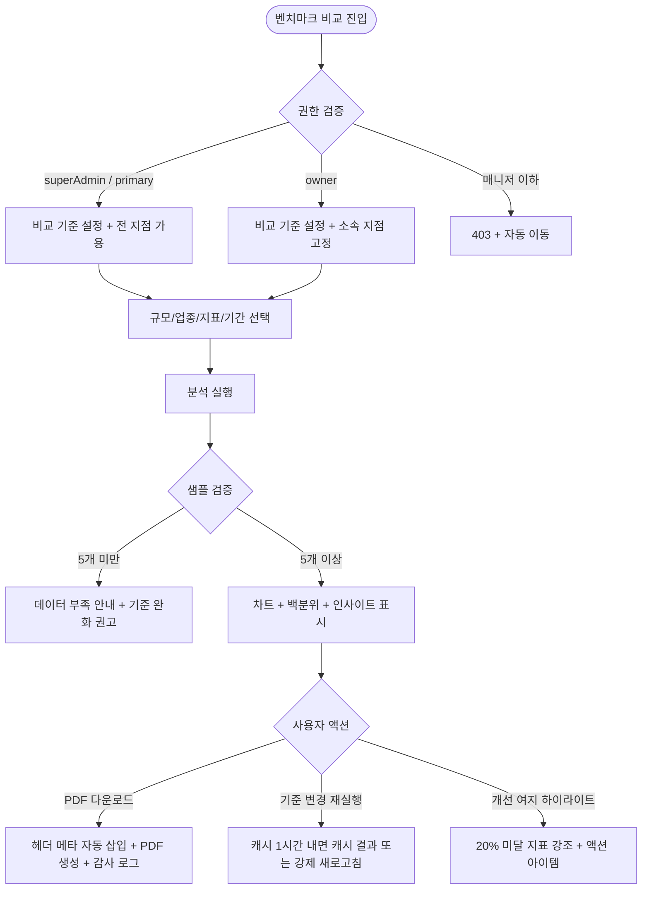

# SCR-H1003 벤치마크 비교 페이지

## 1. 화면 메타 정보

| 항목 | 값 |
|---|---|
| 작성일 | 2026-05-22 |
| 버전 | v1.0 |
| 상태 | 최신 통합본 반영 (정합화 완료) |
| 도메인 | D10 본사관리 |
| 화면 ID | SCR-H1003 |
| 화면명 | 벤치마크 비교 |
| 화면 유형 | 본사 분석 화면 |
| 라우트 (URL) | `/benchmark` |
| 플랫폼 | 데스크톱(기본), 태블릿 |
| 우선순위 | P1 (고도화) |
| 기능코드 | HQ-11 |
| 계약코드 | 파생 기획 |
| 부모 기능 prefix | HQ |
| Lv1 코드 | HQ-11 |
| Lv2 / Lv3 세분화 | HQ-11-01 ~ HQ-11-06 (비교 기준 설정, 분석 실행, 비교 막대 차트, 백분위 표시, 인사이트 요약, 내보내기) |
| 연계 화면 | SCR-091 슈퍼대시보드, SCR-093 지점성과리포트, SCR-097 감사로그 |
| 호출 다이얼로그 | 없음 |

## 2. 화면 개요와 목적

벤치마크 비교는 유사한 규모·업종의 다른 센터와 자사 지점의 KPI를 익명으로 비교 분석하는 화면입니다. 업계 평균·상위 25% 대비 우리 센터의 위치를 파악하여 강점/개선 여지를 도출하고 경쟁력 강화 전략 수립에 활용합니다. 본사 전략팀이 분기 전략 회의 자료로, Owner(지점장)이 신규 오픈 6개월 차 경쟁력 진단으로, 본사 운영팀이 상위 25% 진입 목표 설정에 사용하는 화면입니다.

이 화면이 다루는 운영 흐름은 다양합니다. 본사 전략팀이 분기 임원 보고를 준비할 때는 규모·업종·지표(매출·유지율)를 선택하고 분기 기준 분석을 실행한 후 PDF로 내보내어 업계 대비 백분위 + 강점/개선 항목 보고서를 만듭니다. Owner(지점장)이 신규 오픈 6개월 차 경쟁력을 진단할 때는 소속 지점 + 소규모·헬스 + 출석률·신규 회원 수 + 월간 분석을 실행해 동급 센터 평균 대비 위치를 확인합니다. 상위 25% 진입 목표 설정에서는 지표별 상위 25% 수치와 현재 지점 수치의 gap을 산출해 액션 플랜 근거를 확보합니다. 전월 대비 개선 추이에서는 이번 달 분석 결과 + 전월 결과를 나란히 비교해 개선 여부를 시각적으로 확인합니다. 익명 비교 신뢰성 확인에서는 비교 대상 센터의 식별 정보가 미노출되어 경쟁사 정보 보호가 보장됩니다. 본사 superAdmin은 감사 로그에서 벤치마크 분석 실행 이력을 전수 확인합니다.

## 3. 진입 경로와 인접 화면

진입 경로는 사이드바 "벤치마크 비교" 메뉴 클릭, 슈퍼 대시보드 또는 KPI 대시보드의 "벤치마크 분석" 링크, 알림 센터의 "분석 완료" 알림입니다.

빠져나가는 인접 화면은 PDF 다운로드(파일), SCR-097 감사 로그(분석 실행 이력)입니다.

## 4. 레이아웃과 UI 구성

페이지 헤더에는 "벤치마크 비교" 타이틀과 [PDF 다운로드] 버튼이 배치됩니다.

비교 기준 설정 패널은 상단에 위치하며 비교 대상 센터 규모(소/중/대), 비교 대상 업종(헬스/필라테스/PT샵), 비교 지표(매출/회원 유지율/출석율/신규 회원, 최대 6종 다중 선택), 기간(월간/분기/연간) 토글이 배치됩니다. 우측에 [분석 실행] 버튼이 있습니다.

분석 결과 영역은 분석 실행 후 표시됩니다. 비교 막대 차트는 우리 지점 vs 업계 평균 vs 상위 25% 3개 막대를 지표별로 보여주고, 백분위 표시는 지표별 우리 지점의 위치(예: "상위 35%")를 강조 표시합니다. 개선 여지가 큰 지표(업계 평균 대비 20% 이상 미달)는 하이라이트 색상으로 강조됩니다.

인사이트 요약 패널은 강점 지표 목록(업계 평균 대비 우수), 개선 필요 지표 목록(미달 항목), 액션 아이템 제안(시스템 정의 텍스트, 커스텀 편집 불가)을 표시합니다.

페이지 하단에는 데이터 기준일 표시(예: "데이터 기준일: 2026-05-22")가 작게 표시됩니다.

샘플 부족 시(동급 그룹 5개 미만) 결과는 미노출되고 "비교 가능한 동일 규모·업종 센터 데이터가 부족합니다. 비교 기준을 완화해보세요" 안내가 표시됩니다.

## 5. 탭 구성과 탭별 동작

별도의 탭 구조는 없습니다. 기간 토글(월간/분기/연간)이 작은 단위의 뷰 전환을 제공합니다.

## 6. 버튼·아이콘·링크 액션 전체 정의

규모(소/중/대), 업종(헬스/필라테스/PT샵 등) 선택은 즉시 적용되지만 분석은 [분석 실행] 클릭으로 시작됩니다.

비교 지표 다중 선택은 최대 6개이며 초과 시 "지표는 최대 6개까지 선택 가능합니다" 토스트로 차단됩니다.

기간 토글(월간/분기/연간)은 분석 실행 시 적용됩니다.

[분석 실행] 버튼은 데이터 수집 처리 표시 후 결과 차트와 인사이트를 표시합니다. 30초 초과 시 타임아웃 안내와 재시도 버튼이 제공됩니다.

[PDF 다운로드] 버튼은 결과를 PDF로 저장합니다. 헤더에 비교 기준·기간·생성 일시·생성자가 자동 삽입되며 누락 시 PDF 생성이 차단됩니다.

분석 결과 캐시는 동일 조건(규모·업종·지표·기간) 재실행 시 1시간 내 캐시 결과를 반환하며 강제 새로고침 옵션이 제공됩니다.

Owner(지점장)은 본인 소속 지점을 기준점으로만 비교 가능하며 타 지점은 RLS로 차단됩니다.

superAdmin은 복수 지점을 선택해 지점별 결과를 나란히 비교 가능합니다.

## 7. 호출되는 모달 동작

별도의 다이얼로그는 호출되지 않습니다. 모든 액션은 인라인으로 처리됩니다.

## 8. 토스트와 확인 팝업과 알럿

성공 토스트는 "분석 완료", "PDF 다운로드 완료" 같은 결과 문구를 표시합니다.

실패 토스트는 "비교 가능한 센터 데이터가 부족합니다", "지표를 1개 이상 선택해주세요", "최대 6개까지 선택 가능합니다", "데이터 수집에 시간이 걸리고 있습니다" 같은 문구와 보조 액션을 표시합니다.

샘플 부족 안내는 결과 미노출 + 기준 완화 권고 메시지로 표시됩니다.

매니저 이하 접근은 403 화면으로 차단됩니다.

## 9. 데이터 흐름과 외부 연동

[분석 실행] 클릭 시 `POST /api/benchmark/analyze`가 호출되며 응답으로 비교 차트와 인사이트 데이터가 반환됩니다.

벤치마크 풀 데이터 갱신 배치는 매월 1일 03:00에 실행되어 전사 센터 KPI를 집계·익명화한 후 풀 DB가 갱신됩니다.

분석 결과 캐시는 동일 조건 재실행 시 1시간 TTL 캐시가 반환됩니다.

개선 여지 하이라이트 배치는 분석 결과 생성 시 업계 평균 대비 20% 미달 지표에 플래그를 자동 설정합니다.

PDF 생성 배치는 [PDF 다운로드] 클릭 시 차트 스냅샷 + 인사이트 텍스트 + 헤더 메타를 취합하여 PDF 파일을 생성합니다.

샘플 임계치 검증 이벤트는 분석 실행 전 풀 내 센터 수를 카운트하여 5개 미만 시 분석 차단 플래그를 설정합니다.

알림 센터(NFR-19)는 샘플 부족으로 분석 차단 시 운영 담당자에게 "벤치마크 풀 데이터 부족" 알림을 발송합니다.

전월 비교 데이터 조회는 분석 실행 시 동일 조건 전월 결과를 조회하여 증감을 산출합니다.

액션 아이템 매핑 배치는 하이라이트 지표 확정 시 시스템 정의 액션 아이템 텍스트를 매핑하여 인사이트 요약 패널을 갱신합니다.

감사 로그는 분석 실행·PDF 내보내기 모두에 대해 SCR-097에 actor_id·branch_id·criteria·executed_at으로 자동 기록됩니다.

화면에서 호출하는 주요 API는 `POST /api/benchmark/analyze`, `GET /api/benchmark/export/pdf`입니다.

## 10. 화면 상태와 예외 처리

초기 상태는 비교 기준 설정 패널만 표시되고 차트가 비어 있습니다.

로딩 상태는 벤치마크 데이터 수집 중이며 처리 표시가 나타납니다.

결과 표시 상태는 차트와 인사이트가 표시된 상태입니다.

데이터 부족 상태는 비교 가능한 동일 규모 센터 데이터가 부족할 때이며 안내가 표시됩니다.

권한 부족 상태는 매니저 이하 접근 시 차단됩니다.

분석 타임아웃(30초 초과) 상태는 안내와 재시도 버튼이 제공됩니다.

캐시 만료 후 재실행 상태는 로딩 표시 후 새 결과가 표시되며 캐시 기준일이 갱신됩니다.

예외 케이스별 처리는 비교 샘플 부족(동급 5개 미만) 시 차트 미노출 + 기준 완화 안내, 지표 미선택 시 인라인 오류 + 분석 차단, 지표 최대 개수 초과 시 토스트 + 추가 선택 차단, 분석 타임아웃 시 안내 + 재시도, 전월 데이터 없음 시 비교 컬럼 "-" 표시, PDF 내보내기 실패 시 토스트 + 재시도, Owner(지점장) 타 지점 접근 시 RLS 차단, 매니저 이하 접근 시 403, 결과 로딩 실패 시 재시도 버튼, 캐시 만료 후 재실행 시 새 결과, 업종/규모 미선택 시 인라인 오류, 데이터 기준일 표시 누락 시 시스템 자동 처리입니다.

## 11. 권한별 처리

superAdmin/primary는 전체 지점 벤치마크 비교가 가능하며 비교 기준 설정·내보내기 모두 가능합니다. 복수 지점 선택으로 지점별 결과를 나란히 비교 가능합니다.

Owner(지점장)은 소속 지점 벤치마크만 가능하며 비교 기준 설정은 가능합니다. RLS로 타 지점 데이터 접근이 차단됩니다.

매니저 이하 권한자는 본 화면에 접근할 수 없습니다.

## 12. 메인 흐름



## 13. 에러와 예외 흐름

```mermaid
flowchart TD
    A([액션 트리거]) --> B{서버 응답}
    B -->|샘플 부족 5개 미만| C[차트 미노출 + 완화 권고]
    B -->|지표 미선택| D[인라인 오류 + 차단]
    B -->|지표 6개 초과| E[토스트 + 차단]
    B -->|타임아웃 30초| F[안내 + 재시도 버튼]
    B -->|전월 데이터 없음| G[비교 컬럼 "-"]
    B -->|PDF 실패| H[토스트 + 재시도]
    B -->|owner 타 지점 시도| I[RLS 차단]
    B -->|매니저 이하| J[403]
    B -->|로딩 실패| K[재시도 버튼]
    B -->|규모/업종 미선택| L[인라인 오류]
```

## 14. 핵심 디자인 요청사항

비교 막대 차트는 우리 지점·업계 평균·상위 25% 3개 막대가 명확히 색상 구분되어 시각화되어야 합니다.

백분위 표시(예: "상위 35%")는 큰 폰트로 강조되어 본인 위치가 즉시 인식됩니다.

개선 여지 지표는 하이라이트 색상(예: 빨강 강조)으로 표시되어 액션 우선순위가 명확해야 합니다.

익명 처리가 시각적으로 명확합니다. 비교 대상 센터명은 표시되지 않고 "센터 A", "센터 B" 또는 무작위 코드로만 표시됩니다.

전월 대비 증감 화살표는 초록 ↑ / 빨강 ↓로 일관됩니다.

## 15. 운영 정책 (이 화면에 연결된 부분)

매니저 이하 계정은 본 화면 접근이 차단됩니다.

익명 처리 정책은 비교 데이터가 서버 측에서 센터 식별자(이름·주소·사업자번호)를 제거한 후 제공되도록 합니다. 화면에 타 센터 명칭이 미노출됩니다.

동급 그룹화 기준은 규모(소/중/대 = 회원 수 기준)와 업종(헬스/필라테스/PT샵 등) 조합으로 풀을 그룹화합니다.

샘플 임계치는 동급 그룹 내 비교 가능 센터 수가 5개 미만이면 결과를 노출하지 않습니다. 안내 메시지와 함께 기준 완화가 권고됩니다.

백분위 산출은 선택된 규모·업종 풀 내에서 산출되며 풀 외 센터는 제외됩니다.

상위 25% 기준선은 풀 내 상위 사분위(Q3) 값으로 자동 계산됩니다.

전월 대비 표시는 동일 조건으로 전월 분석이 존재하면 증감 화살표·수치가 표시됩니다. 전월 데이터 없으면 "-"로 표시됩니다.

Owner(지점장) 지점 고정은 본인 소속 지점(`branchId`)을 기준점으로만 비교 가능합니다. 타 지점 데이터는 RLS로 차단됩니다.

superAdmin 복수 지점 비교는 복수 지점을 선택하여 지점별 결과를 나란히 비교 가능합니다.

PDF 헤더 자동 삽입은 비교 기준·기간·생성 일시·생성자가 미포함 시 PDF 생성이 차단됩니다.

분석 결과 캐시는 동일 조건 재실행 시 1시간 내 캐시 결과가 반환됩니다. 강제 새로고침 옵션이 제공됩니다.

개선 여지 하이라이트 기준은 업계 평균 대비 20% 이상 미달 지표를 자동 하이라이트 처리합니다.

액션 아이템 자동 제안은 하이라이트된 지표에 대해 시스템 정의 액션 아이템 텍스트가 자동 노출됩니다. 커스텀 편집 불가입니다.

분석 실행 타임아웃은 30초 초과 시 타임아웃 안내와 재시도 버튼이 제공됩니다.

감사 로그는 분석 실행·PDF 내보내기 모두에 대해 SCR-097에 `actor_id`, `branch_id`, `criteria`, `executed_at`이 저장됩니다.

데이터 갱신 주기는 벤치마크 풀 데이터가 매월 1일 03:00 배치로 갱신됩니다. 실시간 갱신은 미지원입니다.

지표 다중 선택은 비교 지표가 최대 6개까지 동시 선택 가능합니다.

결과 유효 기간 표시는 결과 화면 상단에 "데이터 기준일: YYYY-MM-DD"가 표시됩니다.

이상의 모든 정책은 이 화면을 구현하고 운영하는 사람이 별도 문서 없이 이 한 장만 보면 이해할 수 있도록 풀어 적었습니다. 정책이 바뀌면 이 문서가 함께 갱신되어야 하며, 코드 변경과 정책 변경은 항상 짝지어 진행됩니다.
