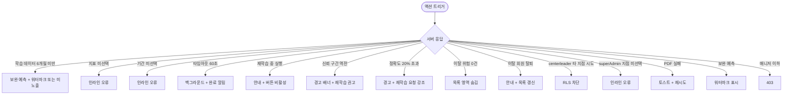

# SCR-H1004 예측 분석 페이지

## 1. 화면 메타 정보

| 항목 | 값 |
|---|---|
| 작성일 | 2026-05-22 |
| 버전 | v1.0 |
| 상태 | 최신 통합본 반영 (정합화 완료) |
| 도메인 | D10 본사관리 |
| 화면 ID | SCR-H1004 |
| 화면명 | 예측 분석 |
| 화면 유형 | 본사 AI 분석 화면 |
| 라우트 (URL) | `/analytics/forecast` |
| 플랫폼 | 데스크톱(기본), 태블릿 |
| 우선순위 | P1 (고도화) |
| 기능코드 | HQ-EXT-03 |
| 계약코드 | 파생 기획 |
| 부모 기능 prefix | HQ |
| Lv1 코드 | HQ-EXT-03 |
| Lv2 / Lv3 세분화 | HQ-EXT-03-01 ~ HQ-EXT-03-08 (예측 항목 선택, 예측 실행, 결과 차트, 신뢰 구간 시나리오, 예측 인사이트, 시나리오 비교 테이블, 회원 상세 연동, 내보내기) |
| 연계 화면 | SCR-091 슈퍼대시보드, SCR-094 KPI대시보드, SCR-M004 회원상세, SCR-097 감사로그 |
| 호출 다이얼로그 | 없음 |

## 2. 화면 개요와 목적

예측 분석은 AI 기반 분석을 활용하여 향후 매출·신규 회원·이탈·출석율 등을 예측하는 본사 화면입니다. 과거 데이터 패턴을 학습하여 미래 운영 계획 수립과 선제적 대응(이탈 위험 회원 케어 등)에 활용합니다. 본사 CFO 분기 매출 예측 보고용, 본사 운영팀 이탈 위험 회원 선제 케어용, Owner(지점장) 신규 회원 유입 예측 기반 스태프 스케줄링용으로 사용됩니다.

운영 흐름은 다양합니다. 본사 CFO가 분기 시작 전 향후 3개월 매출 예측(낙관/기본/보수 시나리오)을 확인해 이사회 보고서에 활용합니다. 본사 운영팀은 이탈 위험도 임계값 이상 회원 목록을 주간 단위로 확인하고 FC에게 케어 액션을 배정합니다. 신규 회원 유입 예측으로 스태프 스케줄링에서는 향후 1개월 신규 회원 수 예측을 근거로 상담 스태프 인력 계획을 수립합니다. 모델 재학습 주기 관리에서는 데이터 적재량이 일정 수준을 넘으면 자동 재학습 트리거가 발동되고 관리자가 재학습 완료 알림을 확인합니다. 예측 정확도 모니터링에서는 이전 예측값과 실제값을 비교하여 모델 정확도(MAPE 등)를 정기 검토하고 정확도 저하 시 재학습을 수동 트리거합니다. 신규 지점 데이터 부족 대응에서는 오픈 6개월 미만 지점이 학습 데이터 부족 안내를 수신하고 유사 규모 지점 집계 데이터로 보완 예측을 제공받습니다. 임계 알림 자동 발송은 이탈 위험 회원 수가 전주 대비 20% 이상 급증하면 운영팀에 자동 알림이 발송되어 즉각 대응을 유도합니다.

## 3. 진입 경로와 인접 화면

진입 경로는 사이드바 "예측 분석" 메뉴 클릭, 슈퍼 대시보드의 "예측 분석" 링크, KPI 대시보드의 위기 지점 식별 후 진입, 알림 센터의 "이탈 위험 급증" 알림 클릭입니다.

빠져나가는 인접 화면은 회원 상세(SCR-M004, 이탈 위험 회원 케어), PDF 다운로드, SCR-097 감사 로그입니다.

## 4. 레이아웃과 UI 구성

페이지 헤더에 "예측 분석" 타이틀과 [PDF 다운로드] 버튼이 배치됩니다.

예측 항목 선택 패널은 상단에 위치하며 예측 지표(매출/신규 회원 수/이탈 회원 수/출석율), 예측 기간(향후 1개월/3개월/6개월/12개월), 대상 지점(단일/복수)이 선택됩니다. 우측에 [예측 실행] 버튼이 있습니다.

분석 결과 영역은 예측 실행 후 표시됩니다. 통합 선 차트는 과거 실적 + 예측 값을 보여주며 예측 구간은 점선·밴드로 구분됩니다. 신뢰 구간 시나리오 밴드는 낙관/기본/보수 3개 시나리오를 표시하고 95% 신뢰 구간 밴드가 함께 표시됩니다. 학습 데이터 기간 안내는 예측 근거 데이터 기간을 명시합니다. 차트 마우스 오버 시 시점별 예측 수치와 신뢰 구간이 툴팁으로 표시됩니다.

예측 인사이트 패널은 예측 근거 요인(계절성/최근 추이/이벤트 영향), 이탈 위험 회원 목록(회원 이름 + 이탈 위험도 수치), 권장 대응 액션 제안을 표시합니다.

시나리오 비교 테이블은 낙관/기본/보수 시나리오별 예측 수치를 비교 표시합니다.

모델 정확도 패널은 MAPE 기준 정확도와 임계 초과 시 "모델 재학습을 권장합니다" 경고 배너 + [재학습 요청] 버튼이 표시됩니다.

데이터 부족 지점은 "예측에 필요한 데이터가 부족합니다(최소 6개월)" 안내와 유사 규모 보완 예측이 가능하면 워터마크 "참고용 보완 예측입니다"와 함께 표시됩니다.

## 5. 탭 구성과 탭별 동작

별도의 탭 구조는 없습니다. 예측 지표 토글(매출/신규/이탈/출석율)이 분석 실행 시 적용됩니다.

## 6. 버튼·아이콘·링크 액션 전체 정의

예측 지표 선택(매출/신규/이탈/출석율)과 예측 기간(1/3/6/12개월), 대상 지점 선택은 즉시 적용되지만 분석은 [예측 실행] 클릭으로 시작됩니다.

[예측 실행] 버튼은 AI 처리 표시 + 예상 처리 시간 안내 후 결과를 표시합니다. 60초 초과 시 백그라운드 처리 전환 + 완료 시 알림이 발송됩니다.

결과 차트 마우스 오버는 시점별 예측 수치와 신뢰 구간 툴팁을 표시합니다.

차트 시점 점 클릭은 해당 시점의 상세 화면으로 이동할 수 있습니다.

이탈 위험 회원 목록의 회원명 클릭은 SCR-M004 회원 상세로 이동합니다. 이미 탈퇴한 회원의 경우 "이미 탈퇴한 회원입니다" 안내와 목록이 자동 갱신됩니다.

[재학습 요청] 버튼은 모델 정확도 저하 감지 시 강조 표시되며 클릭 시 재학습 배치 큐에 등록되고 완료 후 알림이 발송됩니다. 재학습 중에는 [예측 실행] 버튼이 비활성됩니다.

[PDF 다운로드] 버튼은 차트 스냅샷 + 시나리오 수치 + 이탈 위험 목록 + 생성 메타를 PDF로 다운로드합니다. CFO 보고서 전용 템플릿(표지·요약·시나리오 테이블·이탈 목록) 옵션을 선택할 수 있습니다.

[재실행] 버튼은 최신 데이터 반영 예측을 다시 실행합니다.

데이터 부족 지점에서 유사 규모 보완 예측이 노출되면 워터마크 "참고용 보완 예측입니다"와 함께 표시됩니다.

## 7. 호출되는 모달 동작

별도의 다이얼로그는 호출되지 않습니다. 모델 재학습 요청은 인라인 확인 모달로 처리됩니다.

## 8. 토스트와 확인 팝업과 알럿

성공 토스트는 "예측 완료", "재학습 요청을 보냈어요", "PDF 다운로드 완료" 같은 결과 문구를 표시합니다.

실패 토스트는 "AI 분석에 시간이 걸리고 있습니다", "예측 지표를 선택해주세요", "지점을 1개 이상 선택해주세요", "모델 재학습 중입니다 - 완료 후 재실행해주세요" 같은 문구를 표시합니다.

신뢰 구간 역전 이상값(보수 > 기본) 시 경고 배너 "예측 신뢰 구간에 이상이 감지되었습니다. 모델 재학습을 권장합니다"가 표시됩니다.

모델 정확도 20% 초과 시 경고 배너와 [재학습 요청] 버튼 강조가 표시됩니다.

이탈 위험 급증(전주 대비 20%) 시 자동 알림이 발송됩니다.

매니저 이하 접근은 403 화면으로 차단됩니다.

## 9. 데이터 흐름과 외부 연동

[예측 실행] 클릭 시 `POST /api/forecast/analyze`가 호출되며 응답으로 예측 차트, 시나리오, 인사이트 데이터가 반환됩니다.

자동 재학습 배치는 신규 데이터 누적이 이전 학습 대비 10% 이상 증가하면 트리거됩니다. 최소 갱신 주기는 주 1회입니다.

이탈 위험 급증 알림 배치는 이탈 위험 회원 수가 전주 대비 20% 증가 시 NFR-19를 통해 운영팀에 인앱 알림을 발송합니다.

재학습 완료 알림 배치는 재학습 완료 시 superAdmin과 요청자에게 "모델 재학습이 완료되었습니다" 인앱 알림을 발송합니다.

예측 백그라운드 처리는 실행 타임아웃(60초) 시 백그라운드 큐로 전환되며 완료 후 인앱 알림 + 결과 페이지 이동 링크가 발송됩니다.

이탈 위험 회원 목록 갱신 배치는 매일 06:00에 전일 기준 위험도를 재산출하고 임계값 기준 목록을 갱신합니다.

정확도 모니터링 배치는 매주 월요일 04:00에 이전 예측값 vs 실제값을 비교하여 MAPE를 산출하고 임계 초과 시 경고 플래그를 설정합니다.

PDF 생성 배치는 [PDF 다운로드] 클릭 시 차트 스냅샷·시나리오 수치·이탈 목록·메타를 취합하여 PDF를 생성합니다.

보완 예측 매핑 배치는 학습 데이터 부족 지점이 예측 실행 시 유사 규모 지점 집계 데이터를 조회하여 보완 예측값을 산출하고 워터마크 플래그를 설정합니다.

회원 탈퇴 이벤트는 이탈 위험 목록에서 해당 회원이 자동 제거되도록 합니다.

감사 로그는 예측 실행·재학습 요청·PDF 내보내기 모두에 대해 SCR-097에 `actor_id`, `branch_ids`, `metric`, `period`, `executed_at`이 자동 기록됩니다.

화면에서 호출하는 주요 API는 `POST /api/forecast/analyze`, `GET /api/forecast/churn-risk`, `GET /api/forecast/export/pdf`입니다.

## 10. 화면 상태와 예외 처리

초기 상태는 예측 항목 설정 패널만 표시됩니다.

분석 중 상태는 AI 처리 중 표시 + 예상 처리 시간 안내가 표시됩니다.

결과 표시 상태는 예측 차트 + 인사이트 + 시나리오 비교가 표시됩니다.

데이터 부족 상태는 학습 최소 데이터(6개월) 미달 시 안내가 표시되며 보완 예측 가능 시 워터마크와 함께 표시됩니다.

권한 부족 상태는 매니저 이하 접근 시 차단됩니다.

타임아웃 상태는 60초 초과 시 백그라운드 처리 안내가 표시됩니다.

재학습 중 상태는 [예측 실행] 버튼이 비활성화되고 "모델 재학습 중입니다" 안내가 표시됩니다.

신뢰 구간 이상값 상태는 경고 배너가 표시됩니다.

모델 정확도 저하 상태는 경고 배너 + [재학습 요청] 강조가 표시됩니다.

예외 케이스별 처리는 학습 데이터 부족(6개월 미만) 시 안내 + 보완 예측 제공, 예측 지표 미선택 시 인라인 오류 + 차단, 예측 기간 미선택 시 인라인 오류 + 차단, 예측 타임아웃(60초) 시 안내 + 백그라운드 처리, 모델 재학습 중 실행 시도 시 안내 + 버튼 비활성, 신뢰 구간 역전 시 경고 배너, 모델 정확도 20% 초과 시 경고 배너 + [재학습 요청] 강조, 이탈 위험 0건 시 목록 숨김, 이탈 위험 회원 클릭 → 탈퇴 회원 시 안내 + 목록 갱신, Owner(지점장) 타 지점 선택 시도 시 RLS 차단, superAdmin 지점 미선택 시 인라인 오류, PDF 실패 시 토스트 + 재시도, 보완 예측 시 워터마크 표시, 매니저 이하 접근 시 403입니다.

## 11. 권한별 처리

슈퍼관리자/primary는 전체 지점 예측 분석이 가능하며 항목·기간 설정, 내보내기, 재학습 요청이 가능합니다.

Owner(지점장)은 소속 지점 예측만 가능하며 항목·기간 설정이 가능합니다. RLS로 타 지점 데이터 접근이 차단됩니다.

매니저 이하 권한자는 본 화면에 접근할 수 없습니다.

## 12. 메인 흐름

```mermaid
flowchart TD
    A([예측 분석 진입]) --> B{권한 검증}
    B -->|superAdmin / primary| C[설정 패널 + 전 지점 가용]
    B -->|owner| D[설정 패널 + 소속 지점 고정]
    B -->|매니저 이하| E[403]
    C --> F[지표/기간/지점 선택]
    D --> F
    F --> G[예측 실행]
    G --> H{학습 데이터}
    H -->|6개월 미만| I[보완 예측 또는 미노출]
    H -->|6개월 이상| J{처리 시간}
    J -->|60초 이내| K[즉시 결과 표시]
    J -->|60초 초과| L[백그라운드 + 완료 알림]
    K --> M[차트 + 시나리오 + 인사이트 + 이탈 위험 목록]
    M --> N{사용자 액션}
    N -->|차트 호버| O[툴팁 표시]
    N -->|회원 클릭| P[SCR-M004 또는 "탈퇴 회원" 안내]
    N -->|PDF 다운로드| Q[CFO 템플릿 선택 옵션 + 생성 + 감사 로그]
    N -->|재학습 요청| R[배치 큐 등록 + 완료 알림]
    N -->|모델 정확도 저하| S[경고 + 재학습 권고]
```

## 13. 에러와 예외 흐름



## 14. 핵심 디자인 요청사항

통합 선 차트는 과거 실적과 예측 값이 명확히 구분되어야 합니다. 과거 실적은 실선, 예측은 점선·밴드로 시각화됩니다.

신뢰 구간 밴드는 낙관/기본/보수 시나리오가 다른 색상으로 시각화되고 95% 신뢰 구간이 함께 표시됩니다.

이탈 위험도 수치는 0.7 이상이 빨강 강조로 표시되어 우선 케어 대상이 즉시 인식됩니다.

권장 대응 액션 카드는 다음 액션 버튼이 primary 컬러로 표시되어 실행이 자연스럽게 이어집니다.

모델 정확도 경고 배너는 노랑 또는 주황 톤으로 표시되고 [재학습 요청] 버튼이 강조됩니다.

보완 예측은 워터마크 "참고용 보완 예측입니다"가 차트 위에 표시되어 정식 예측과 시각적으로 구분됩니다.

진행 스피너와 로딩 스켈레톤은 본사 대시보드와 동일한 톤으로 통일됩니다.

## 15. 운영 정책 (이 화면에 연결된 부분)

매니저 이하 계정은 본 화면 접근이 차단됩니다.

학습 최소 데이터 기간은 6개월입니다. 미충족 시 유사 규모 지점 집계 보완 예측이 제공됩니다(가능한 경우).

예측 모델은 선형 회귀 + 계절성 분해(시계열 회귀 모델)이며 지표별 독립 모델이 적용됩니다.

3개 시나리오 필수 제공은 예측 결과가 낙관/기본/보수 시나리오를 항상 함께 제공한다는 정책입니다. 단일 수치만 노출은 금지됩니다.

신뢰 구간 표시는 95% 신뢰 구간 밴드가 함께 표시됩니다.

모델 갱신 주기는 자동 재학습이 신규 데이터 누적량이 이전 학습 대비 10% 이상 증가 시 트리거됩니다. 최소 갱신 주기는 주 1회입니다.

수동 재학습은 운영팀이 [재학습 요청] 버튼으로 수동 트리거 가능합니다. 재학습 중 예측 실행은 차단됩니다.

모델 정확도 표시는 MAPE 기준이며 정확도 20% 초과 시 "모델 재학습을 권장합니다" 경고 배너가 표시됩니다.

이탈 위험 임계값은 위험도 점수 0.7 이상 회원을 이탈 위험 목록에 노출합니다. 임계값은 운영 정책에 따라 조정 가능합니다.

이탈 위험 급증 알림은 이탈 위험 회원 수가 전주 대비 20% 이상 증가 시 운영팀 자동 알림이 발송됩니다.

Owner(지점장) 지점 고정은 소속 지점(`branchId`)으로만 예측 실행이 가능합니다. RLS가 적용됩니다.

superAdmin 복수 지점 예측은 복수 지점 선택 시 지점별 독립 예측 결과가 나란히 표시됩니다.

데이터 스냅샷 기반은 예측 결과가 실행 시점 스냅샷 기반이며 최신 데이터 반영을 위해 재실행이 필요합니다. 결과 화면에 "데이터 기준일: YYYY-MM-DD HH:mm"이 표시됩니다.

예측 실행 타임아웃은 60초 초과 시 백그라운드 처리 전환되며 완료 후 인앱 알림이 발송됩니다.

PDF 내보내기는 차트 스냅샷 + 시나리오 수치 + 이탈 위험 목록 + 생성 메타가 포함됩니다.

감사 로그는 예측 실행·재학습 요청·PDF 내보내기에 대해 SCR-097에 `actor_id`, `branch_ids`, `metric`, `period`, `executed_at`이 저장됩니다.

신규 지점 보완 예측 표시는 학습 데이터 부족 지점에 유사 규모 집계 보완 예측이 노출 시 "참고용 보완 예측입니다" 워터마크가 표시됩니다.

CFO 분기 보고서 템플릿은 PDF 내보내기 시 CFO 보고서 전용 템플릿(표지·요약·시나리오 테이블·이탈 목록) 선택 옵션이 제공됩니다.

이상의 모든 정책은 이 화면을 구현하고 운영하는 사람이 별도 문서 없이 이 한 장만 보면 이해할 수 있도록 풀어 적었습니다. 정책이 바뀌면 이 문서가 함께 갱신되어야 하며, 코드 변경과 정책 변경은 항상 짝지어 진행됩니다.
