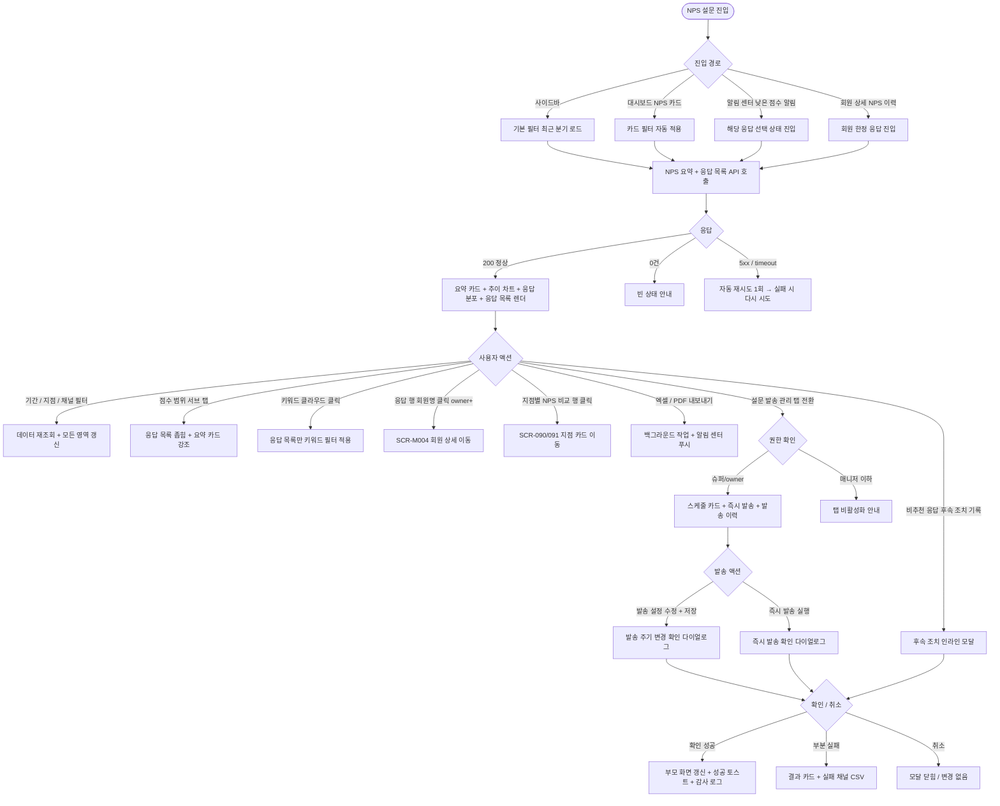

# SCR-H1005 NPS 설문 페이지

## 1. 화면 메타 정보

이 문서는 NPS 설문 페이지에 대한 자기완결형 요구사항 정의서입니다. 다른 문서를 함께 보지 않아도 이 한 장만으로 이 화면에 들어가는 모든 영역, 모든 버튼, 모든 다이얼로그, 모든 권한, 모든 예외 처리, 그리고 이 화면을 지탱하는 운영 정책까지 전부 이해하고 구현할 수 있도록 작성합니다.

| 항목 | 값 |
|---|---|
| 작성일 | 2026-05-22 |
| 버전 | v1.0 |
| 상태 | 최신 통합본 반영 (정합화 완료) |
| 도메인 | D10 본사관리 |
| 화면 ID | SCR-H1005 |
| 화면명 | NPS 설문 |
| 화면 유형 | 분석·운영 통합 화면 (NPS Analytics & Survey Operation Screen) |
| 라우트 (URL) | `/nps` |
| 플랫폼 | 데스크톱(기본), 태블릿 |
| 우선순위 | P1 (고도화 우선) |
| 기능코드 | HQ-13 |
| 계약코드 | HQ-13 |
| 계약 상태 | 파생 기획 (본사 통합 운영 확장) |
| 부모 기능 prefix | HQ |
| Lv1 코드 | HQ-13 |
| Lv2 / Lv3 세분화 | HQ-13-01 ~ HQ-13-08 (NPS 요약 카드, 추이 차트, 응답 분포, 응답 목록, 키워드 분석, 기간 필터, 설문 발송 관리, 내보내기) |
| 연계 화면 | SCR-090 본사대시보드, SCR-091 슈퍼대시보드, SCR-097 감사로그, SCR-M004 회원상세, SCR-104 알림센터 |
| 호출 다이얼로그 | 즉시 발송 확인 다이얼로그(인라인), 발송 주기 변경 확인 다이얼로그(인라인), 후속 조치 기록 다이얼로그(인라인) |

## 2. 화면 개요와 목적

NPS 설문 페이지는 본사 CX팀과 슈퍼관리자가 전 지점 회원의 만족도(NPS, Net Promoter Score)를 한 화면에서 조회·분석하고, 설문 발송 스케줄과 채널을 직접 운영하는 D10 본사관리 도메인의 분석·운영 통합 화면입니다. NPS는 추천자 비율에서 비추천자 비율을 뺀 값(-100 ~ +100)으로 자동 산출되며, 0~6점의 비추천 응답이 접수되는 즉시 담당 owner·FC에게 인앱 알림이 발송되어 24시간 안에 후속 케어가 시작되도록 설계되어 있습니다. 자유 의견은 형태소 분석과 빈도 계산을 거쳐 키워드 클라우드로 노출되며, 운영자는 부정 키워드를 클릭해 관련 응답만 일괄 검토할 수 있습니다.

이 화면이 다루는 운영 흐름은 다음과 같이 다양합니다. 본사 CX팀은 매월 초 전월 NPS 점수와 추이를 확인해 서비스 개선 우선순위를 정하고, 본사 운영팀은 0~3점의 낮은 점수 응답에 대해 담당 FC를 배정하여 24시간 안에 개인 연락을 진행합니다. 본사 슈퍼관리자는 지점별 NPS 비교 테이블에서 하위 지점을 식별해 서비스 교육 대상을 선별하고, 키워드 클라우드에서 반복 등장하는 부정 키워드("락커", "청결", "주차")를 클릭해 관련 응답을 일괄 검토하며 시설·서비스 개선 과제를 도출합니다. 발송 관리 패널에서는 SMS·카카오·앱푸시 채널별 응답률을 비교한 후 응답률이 가장 높은 채널로 발송 설정을 조정하고, 이벤트·캠페인 직후에는 즉시 발송으로 긴급 피드백을 수집합니다. 익명 응답 정책에 따라 회원명·연락처는 owner 이상 권한에서만 노출되고 매니저 이하 계정은 본 화면 진입 자체가 차단됩니다.

따라서 이 화면은 단순한 차트 모음이 아니라, 만족도 신호를 즉시 후속 케어 액션으로 전환하는 운영 사이클의 출발점이자 회원 경험 개선의 단일 진입점으로 동작해야 합니다.

## 3. 진입 경로와 인접 화면

NPS 설문 페이지에 진입하는 경로는 다음과 같이 여러 가지가 있고, 각 경로마다 진입 직후 화면의 초기 상태가 조금씩 달라집니다.

첫 번째 경로는 사이드바입니다. 좌측 사이드바의 "본사관리" 메뉴 아래 "NPS 설문" 항목을 클릭하면 진입합니다. 이 경우 URL은 단순히 `/nps`가 되고, 화면은 기본 상태(기간 필터: 최근 분기, 점수 범위 필터: 전체, 탭: NPS 결과)로 시작합니다.

두 번째 경로는 본사 대시보드(SCR-090) 또는 슈퍼 대시보드(SCR-091)의 NPS 요약 카드 클릭입니다. 대시보드에 노출된 "최근 분기 NPS" 카드나 "비추천 응답 N건" 카드를 누르면 본 화면으로 이동하면서 카드에 대응하는 필터가 URL 쿼리 파라미터로 자동 적용된 상태로 열립니다. 예를 들어 "비추천 응답 N건" 카드를 누르면 `/nps?score=0-6&period=this-month`처럼 비추천자만 필터링된 상태로 진입합니다.

세 번째 경로는 알림 센터(SCR-104)의 낮은 점수 자동 알림 클릭입니다. 0~3점의 응답이 접수되면 담당 owner·FC에게 인앱 알림이 즉시 발송되는데, 알림을 누르면 해당 응답이 자동 선택된 상태로 NPS 응답 목록에 진입합니다. 응답을 확인한 운영자는 그 자리에서 후속 조치 내용을 텍스트로 기록할 수 있고, 기록 후에는 "처리 완료" 배지가 응답 행에 표시됩니다.

네 번째 경로는 회원 상세(SCR-M004)에서 "NPS 응답 이력" 링크를 누른 경우입니다. 이 경우 해당 회원의 모든 NPS 응답이 필터링된 상태로 열려, 운영자가 한 회원의 만족도 변화를 시계열로 추적할 수 있습니다.

다섯 번째 경로는 외부 도구에서 공유받은 북마크·딥링크입니다. URL 쿼리 파라미터로 기간·점수 범위·키워드·지점 필터가 모두 보존되므로 매월 정기 보고용 URL을 북마크해두고 동일 조건으로 반복 조회할 수 있습니다.

이 화면에서 빠져나가는 인접 화면으로는, 응답 행의 회원명 클릭으로 진입하는 회원 상세(SCR-M004), 지점별 NPS 비교 테이블 행 클릭으로 진입하는 본사 대시보드 또는 슈퍼 대시보드(SCR-090/091)의 지점 카드, 설문 발송·설정 변경·후속 조치 등록 이벤트가 모두 기록되는 감사 로그(SCR-097), 그리고 낮은 점수 알림이 푸시되는 알림 센터(SCR-104)가 있습니다.

## 4. 레이아웃과 UI 구성

NPS 설문 페이지는 위에서 아래로 흐르는 세로형 단일 컬럼 레이아웃을 기본으로 하며, 상단 탭으로 NPS 결과 분석과 설문 발송 관리가 분리되어 있습니다. 데스크톱에서는 가로 폭을 충분히 활용해 두 단 그리드(좌측 차트·우측 응답 목록)가 동시에 보이고, 태블릿에서는 단 그리드가 무너지면서 세로 스택으로 재배치됩니다.

가장 위에는 페이지 헤더가 있습니다. 헤더 좌측에는 "NPS 설문"이라는 페이지 타이틀과 함께 현재 기간 필터가 적용된 NPS 점수가 큰 숫자로 노출됩니다. 점수 아래에는 전기간 대비 증감(`+8.3pt` 같은 형태)이 작은 글씨로 따라붙고, 본사 권한자에게는 "전 지점 합산" 주석이 함께 보입니다. 헤더 우측에는 기간 필터 드롭다운(이번 주 / 이번 달 / 분기 / 연간 / 사용자 지정), 지점 필터 드롭다운(전체 지점 / 개별 지점), 채널 필터 드롭다운(SMS / 카카오 / 앱푸시 / 전체), [엑셀 내보내기] 버튼, [PDF 내보내기] 버튼이 차례로 배치됩니다. 권한이 없는 계정에서는 내보내기 버튼이 아예 노출되지 않습니다.

페이지 헤더 바로 아래에는 상위 탭 두 개가 있습니다. 기본 진입은 "NPS 결과" 탭이며, 두 번째 탭은 "설문 발송 관리"입니다. NPS 결과 탭은 분석 화면, 설문 발송 관리 탭은 운영 화면으로 성격이 분리되어 있고, URL 쿼리 파라미터(`?tab=result` / `?tab=send`)로 탭 상태가 보존됩니다.

### 4-1. NPS 결과 탭

NPS 결과 탭의 가장 위에는 NPS 요약 카드 3개가 가로로 배치됩니다. 첫 번째 카드는 "전체 NPS 점수"로 -100 ~ +100 범위에서 현재 점수와 게이지가 표시되며, 카드 아래에는 응답자 총수가 작게 따라옵니다. 두 번째 카드는 "응답자 분류 비율"로 추천자(9~10) / 중립(7~8) / 비추천(0~6)의 3등분 도넛 차트와 비율(%)이 동시에 노출됩니다. 세 번째 카드는 "전기간 대비 변화"로 직전 동일 기간 대비 NPS 점수 증감을 절댓값과 증감률(%)로 함께 표시합니다. 카드 호버 시 약간의 그림자 변화로 클릭 가능 영역임을 알리고, 카드 클릭은 해당 분류에 맞는 필터를 자동 적용합니다.

요약 카드 아래에는 NPS 추이 차트가 있습니다. X축은 기간 필터 단위(주/월/분기), Y축은 NPS 점수(-100 ~ +100)인 선 차트이며, 같은 차트 위에 응답자 수가 보조 막대로 함께 표시됩니다. 차트 우측 범례에서 응답자 수 보조 막대를 토글로 끄거나 켤 수 있습니다. 추이 차트 호버 시 해당 시점의 NPS 점수, 응답자 수, 추천자/중립/비추천 분포가 툴팁으로 노출됩니다.

추이 차트 아래에는 응답 분포 영역이 있습니다. 좌측에는 0~10점 점수별 응답 수를 보여주는 막대 차트가 있고, 우측에는 지점별 NPS 비교 테이블이 표시됩니다. 지점별 비교 테이블의 컬럼은 지점명, 응답자 수, NPS 점수, 전기간 대비 증감, 추천자 비율, 비추천자 비율 순서이며, NPS 점수 컬럼은 색상 코딩(+30 이상 초록, 0 ~ +29 노랑, -1 이하 빨강)으로 위기 지점을 즉시 식별할 수 있게 합니다. 응답이 0건인 지점은 "-"로 표시되고 전체 평균 산출에서 제외됩니다. 본사 권한자가 아닌 owner는 자기 지점 한 줄만 표시됩니다.

응답 분포 아래에는 자유 의견 키워드 클라우드가 있습니다. 자유 의견 응답이 10건 이상 누적된 경우에만 활성화되며 그 미만일 때는 "키워드 분석에 필요한 응답이 부족합니다"라는 안내가 표시됩니다. 키워드는 빈도가 높은 순서로 크기가 커지고, 부정 빈도(비추천 응답 안에 등장한 빈도)가 높은 키워드는 빨강 계열, 긍정 빈도가 높은 키워드는 초록 계열로 시각적으로 분리됩니다. 키워드를 클릭하면 해당 키워드를 포함한 응답만 응답 목록 영역에 필터링되고, 필터 칩이 키워드 클라우드 위에 표시되어 X로 해제할 수 있습니다.

키워드 클라우드 아래에는 응답 목록 테이블이 있습니다. 컬럼은 좌측부터 점수 배지(0~10), 응답일(YYYY-MM-DD HH:mm), 자유 의견(최대 100자 미리보기), 회원 정보(owner 이상에서만 회원명·연락처 노출, 그 외 권한에서는 익명 처리), 소속 지점(본사 통합 모드에서만 노출), 후속 조치 상태 배지(미처리 / 처리 완료) 순서입니다. 행 우측 끝에는 [후속 조치 기록] 버튼이 있고, 비추천 응답(0~6점)에 한정해 활성화됩니다. 점수 배지는 추천자 9~10은 초록, 중립 7~8은 회색, 비추천 0~6은 빨강 계열로 강하게 구분되며, 점수가 0~3인 응답은 점수 배지 옆에 작은 경고 아이콘이 함께 표시되어 즉시 후속 케어가 필요함을 알립니다.

응답 목록 위에는 점수 범위 필터 탭이 있습니다. 전체 / 추천자(9~10) / 중립(7~8) / 비추천(0~6) 4종 옵션을 옆으로 펼쳐 보이며, 각 탭 우측에 해당 점수의 응답 수가 작은 배지로 표시됩니다. 어느 탭이 선택되었는지는 URL 쿼리 파라미터 `score`로 반영되며, 페이지 새로고침이나 북마크에서도 그대로 유지됩니다.

응답 목록 하단에는 페이지네이션 영역이 있습니다. 페이지당 표시 건수 선택 드롭다운(20·50·100), 페이지 번호 이동 컨트롤, 총 건수가 표시됩니다.

### 4-2. 설문 발송 관리 탭

설문 발송 관리 탭은 운영 화면이며 슈퍼관리자·primary·owner만 접근 가능합니다. 매니저 이하 권한자는 이 탭 자체가 비활성화되거나 보이지 않습니다.

가장 위에는 현재 발송 스케줄 카드가 있습니다. 카드에는 현재 설정된 발송 주기(월 1회 / 분기 1회), 발송 대상(활성 회원 전체 / 특정 이용권 보유 회원), 발송 채널(SMS / 카카오 / 앱푸시), 다음 발송 예정일과 발송 예정 대상 수 미리보기가 표시됩니다. 카드 우측에는 [수정] 버튼이 있고, 누르면 발송 설정 패널이 인라인으로 펼쳐집니다.

발송 설정 패널에서는 발송 주기 라디오(월 1회 / 분기 1회), 발송 대상 라디오(활성 회원 전체 / 특정 이용권 보유 회원, 후자 선택 시 이용권 선택 드롭다운 노출), 발송 채널 다중 선택 체크박스(SMS / 카카오 / 앱푸시), 발송 시각 입력(기본 09:00, 최소 06:00 ~ 최대 22:00 범위)을 설정할 수 있습니다. 발송 채널을 변경하면 우측에 채널별 최근 3개월 응답률 비교 카드가 함께 표시되어 운영자가 응답률이 높은 채널을 선택할 수 있도록 돕습니다. 설정 패널 하단에는 [저장] 버튼과 [취소] 버튼이 있고, 저장 시 기존 발송 스케줄이 새 주기로 교체된다는 확인 다이얼로그가 표시됩니다.

스케줄 카드 아래에는 [즉시 발송] 영역이 있습니다. 즉시 발송 영역에는 발송 대상 미리보기(예: "활성 회원 1,234명 대상"), 발송 채널 다중 선택, [즉시 발송 실행] 버튼이 있고, 버튼을 누르면 "{인원수}명에게 즉시 발송됩니다. 계속하시겠습니까?" 확인 다이얼로그가 인라인으로 표시되어 확정해야 발송이 시작됩니다. 발송 대상이 0명이면 [즉시 발송 실행] 버튼이 비활성화되고 "발송 대상 회원이 없습니다. 발송 조건을 확인해주세요" 안내가 함께 표시됩니다.

가장 아래에는 최근 발송 이력 테이블이 있습니다. 컬럼은 발송일, 발송 주기(정기/즉시), 발송 채널, 발송 대상 수, 응답 수, 응답률(%), 후속 알림 발송 수, 액션(상세 보기) 순서이며 행 클릭은 해당 발송의 응답 결과로 NPS 결과 탭을 자동 전환합니다.

## 5. 탭 구성과 탭별 동작

이 화면은 상위 탭 2개와 NPS 결과 탭 내부의 점수 범위 서브 탭 4개로 구성됩니다.

상위 탭은 "NPS 결과"(분석)와 "설문 발송 관리"(운영)로 나뉘며, NPS 결과 탭이 기본 진입입니다. 탭을 전환해도 기간 필터·지점 필터·채널 필터 같은 공통 필터는 그대로 유지되고, 데이터 fetch만 새로 일어납니다. 매니저 이하 권한자가 직접 URL로 설문 발송 관리 탭에 접근하면 탭 자체가 비활성화되고 안내 토스트가 표시됩니다.

점수 범위 서브 탭은 NPS 결과 탭의 응답 목록 위에 위치하며 전체 / 추천자(9~10) / 중립(7~8) / 비추천(0~6) 4종입니다. 어느 탭을 누르든 기간·지점·채널·키워드 필터는 그대로 유지되고 점수 범위 조건만 변경됩니다. 비추천 탭은 운영팀이 가장 자주 사용하는 빠른 진입점이므로 탭 자체에 빨강 점선 강조가 적용되어 시선이 가도록 디자인됩니다.

자유 의견 키워드 클라우드에서 키워드를 클릭한 경우는 탭과 별개로 동작하는 추가 필터입니다. 키워드 필터가 적용되면 응답 목록 영역만 추가로 좁혀지고, 요약 카드와 추이 차트는 그대로 유지됩니다. 이는 운영자가 부정 키워드 응답을 살펴보면서도 전체 추세는 잃지 않게 하려는 의도입니다.

## 6. 버튼·아이콘·링크 액션 전체 정의

이 화면에 등장하는 모든 클릭 가능한 요소를 빠짐없이 정의합니다.

페이지 헤더의 기간 필터 드롭다운은 이번 주 / 이번 달 / 분기 / 연간 / 사용자 지정의 5종 옵션을 제공하며, 선택 즉시 모든 차트·카드·응답 목록이 동시에 갱신됩니다. 사용자 지정을 누르면 시작일·종료일을 직접 입력하는 캘린더 팝업이 열리며, 최대 2년 범위까지 선택 가능합니다. 2년을 초과하면 "최대 2년까지 조회 가능합니다" 토스트가 표시되고 필터가 초기화됩니다.

지점 필터 드롭다운은 본사 통합 모드 권한자(슈퍼관리자·primary)에게만 활성화되며, 전체 지점 / 개별 지점 옵션을 제공합니다. owner(Owner(지점장))는 자기 지점이 자동 선택된 상태로 고정되어 드롭다운이 비활성화됩니다.

채널 필터 드롭다운은 SMS / 카카오 / 앱푸시 / 전체 옵션을 제공하며, 응답 데이터를 채널별로 좁혀 조회할 때 사용합니다.

[엑셀 내보내기] 버튼은 현재 기간 필터 안의 모든 응답을 엑셀로 다운로드합니다. 필터링된 결과만 받는 것이 아니라 선택 기간 전체 응답을 다운로드하므로, 클릭 시 "선택 기간 전체 응답이 다운로드됩니다" 안내 팝업이 먼저 표시됩니다. 1만 건 이상이면 백그라운드 처리로 전환되고 완료 후 알림 센터에 다운로드 링크가 푸시됩니다. 권한이 없는 계정에서는 버튼이 노출되지 않습니다.

[PDF 내보내기] 버튼은 요약 카드, 추이 차트, 지점별 비교, 키워드 클라우드의 스냅샷과 헤더 메타(기간·생성자·생성일)를 묶어 PDF로 생성합니다. 생성 실패 시 "PDF 생성에 실패했습니다. 다시 시도해주세요" 토스트가 표시되고 재시도 안내가 따라옵니다.

NPS 요약 카드 3개는 모두 클릭 가능합니다. "전체 NPS 점수" 카드는 클릭해도 추가 동작이 없고 호버 시 산출 공식 툴팁(`(추천자 비율 - 비추천자 비율) × 100`)만 표시됩니다. "응답자 분류 비율" 카드 안의 추천/중립/비추천 영역을 클릭하면 점수 범위 서브 탭이 자동 전환됩니다. "전기간 대비 변화" 카드는 클릭하면 추이 차트의 직전 동일 기간이 함께 표시되도록 비교 모드가 켜집니다.

추이 차트의 데이터 포인트는 클릭하면 해당 시점으로 기간 필터가 좁혀지면서 그 시점의 응답만 응답 목록에 표시됩니다. 마우스 휠 스크롤이나 차트 위 드래그로 기간 범위를 직접 좁힐 수도 있습니다.

점수별 막대 차트의 막대는 클릭 시 해당 점수 응답만 응답 목록에 필터링됩니다. 다중 선택은 지원하지 않으며, 다른 막대를 누르면 이전 선택이 해제됩니다.

지점별 NPS 비교 테이블의 행 클릭은 본사 권한자에 한해 해당 지점의 대시보드(SCR-090) 또는 슈퍼 대시보드(SCR-091)의 지점 상세 카드로 이동합니다. owner는 자기 지점만 표시되므로 행 클릭 동작이 비활성화됩니다.

자유 의견 키워드 클라우드의 키워드 클릭은 응답 목록에 해당 키워드 필터를 적용합니다. 같은 키워드를 다시 누르면 필터가 해제되고, 키워드 클라우드 위 필터 칩의 X 버튼을 눌러도 해제됩니다. 다중 키워드 선택은 지원하지 않으며, 다른 키워드를 누르면 이전 선택이 자동 교체됩니다.

응답 목록의 점수 배지 호버 시 응답의 자유 의견 전체 텍스트가 툴팁으로 노출됩니다. 자유 의견이 100자를 넘으면 목록 셀에는 100자 미리보기와 "..." 표시가, 호버 툴팁에서는 전체 텍스트가 노출됩니다.

응답 목록의 회원명 클릭은 owner 이상 권한에서만 활성화되며, 클릭 시 회원 상세(SCR-M004)의 NPS 응답 이력 탭으로 이동합니다. FC·매니저 권한자는 회원명이 익명("회원***")으로 노출되고 클릭 자체가 차단됩니다.

응답 목록의 [후속 조치 기록] 버튼은 비추천 응답(0~6점)에 한해 활성화됩니다. 클릭 시 인라인 입력 패널이 열려 운영자가 후속 조치 내용을 텍스트로 기록할 수 있고, 저장 시 응답 행에 "처리 완료" 배지가 표시되며 감사 로그에 INSERT됩니다. 이미 처리 완료된 응답에서는 버튼 라벨이 [기록 수정]으로 바뀌고, 마지막 기록 시각이 함께 표시됩니다.

설문 발송 관리 탭의 스케줄 카드 [수정] 버튼은 설정 패널을 인라인으로 펼치고, 저장 시 "기존 발송 스케줄이 새 주기로 교체됩니다" 확인 다이얼로그가 표시됩니다. 취소 버튼은 변경 사항을 폐기하고 패널을 닫습니다.

설문 발송 관리 탭의 [즉시 발송 실행] 버튼은 인라인 확인 다이얼로그를 거쳐 즉시 발송 API를 호출합니다. 발송 대상 0명일 때는 비활성화되며, 클릭하더라도 안내 토스트만 표시되고 API는 호출되지 않습니다.

최근 발송 이력 테이블의 행 클릭은 NPS 결과 탭으로 자동 전환하면서 해당 발송 건의 응답만 필터링된 상태로 보여줍니다.

모든 버튼은 클릭 후 응답이 돌아오기 전까지 자동으로 비활성화되어 더블클릭이나 연타로 인한 중복 요청이 차단됩니다.

## 7. 호출되는 모달 동작

이 화면에서 호출되는 다이얼로그는 별도 컴포넌트 ID를 가진 다이얼로그(DLG)가 아니라 인라인 확인 다이얼로그 3종이며, 각각 어떤 트리거로 열리고 어떤 입력을 받고 확인/취소를 누르면 부모 화면에서 어떤 변화가 일어나는지가 모두 달라집니다.

### 7-1. 즉시 발송 확인 다이얼로그 (인라인)

즉시 발송 확인 다이얼로그는 설문 발송 관리 탭의 [즉시 발송 실행] 버튼을 누르면 인라인으로 열리는 yes/no 확인 모달입니다. 상단에 "{인원수}명에게 즉시 발송됩니다. 계속하시겠습니까?"라는 제목이 표시되고, 그 아래에 발송 대상 수, 발송 채널, 발송 예정 시각이 카드 형태로 정리되어 노출됩니다. 채널이 다중 선택된 경우 채널별 발송 대상 수와 예상 응답률이 함께 표시되어 운영자가 마지막으로 점검할 수 있게 합니다.

하단에는 [발송 실행] 버튼과 [취소] 버튼이 있습니다. [발송 실행] 버튼을 누르면 모달이 로딩 상태로 전환되어 버튼이 비활성화되고, 백엔드에 즉시 발송 요청이 전송됩니다. 성공하면 모달이 닫히고 부모 화면 상단에 "{인원수}명에게 즉시 발송했습니다" 성공 토스트가 표시되며, 최근 발송 이력 테이블의 가장 위에 새 행이 추가됩니다. [취소] 또는 ESC를 누르면 모달이 즉시 닫히고 변경 없이 부모 화면이 유지됩니다.

발송 도중 일부 채널이 실패한 경우 모달이 닫히지 않고 "성공 N건 / 실패 M건"이라는 결과 카드가 표시되며, 실패 사유별 분류와 실패 회원 목록 CSV 다운로드 링크가 함께 제공됩니다. 카카오 알림톡 실패가 일정 비율 이상이면 SMS로 자동 폴백되며, 폴백 사실이 결과 카드에 명시됩니다. 즉시 발송 권한은 슈퍼관리자·primary·owner에 한정되며, 그 외 권한자에게는 모달 호출 전 부모 화면 버튼 자체가 비활성화 또는 hidden 처리됩니다.

### 7-2. 발송 주기 변경 확인 다이얼로그 (인라인)

발송 주기 변경 확인 다이얼로그는 설문 발송 관리 탭의 스케줄 카드에서 발송 설정 패널을 펼친 후 [저장] 버튼을 누르면 인라인으로 열리는 확인 모달입니다. 상단에는 "기존 발송 스케줄이 새 주기로 교체됩니다"라는 제목과 함께 변경 전 주기(예: 월 1회), 변경 후 주기(예: 분기 1회), 변경 전 다음 발송 예정일, 변경 후 다음 발송 예정일이 화살표 형태로 시각화됩니다. 발송 대상이나 채널이 함께 변경된 경우 각 항목의 전·후 값이 동시에 표시되어 한 번에 비교할 수 있게 합니다.

하단에는 [저장 확정] 버튼과 [취소] 버튼이 있습니다. [저장 확정]을 누르면 새 설정이 저장되고 기존 발송 스케줄은 즉시 교체됩니다. 변경 직후 다음 발송 예정일이 갱신되고, 변경 이벤트는 감사 로그(SCR-097)에 actor_id, branch_id, action=SURVEY_SCHEDULE_UPDATE, before, after, timestamp로 기록됩니다. [취소] 또는 ESC를 누르면 변경 없이 모달이 닫히고 발송 설정 패널은 그대로 유지됩니다.

설정 변경 중 다른 운영자가 같은 스케줄을 동시 편집해 optimistic lock 위반이 발생한 경우 "다른 운영자가 동시에 편집했어요" 안내 모달이 표시되며, 사용자는 최신 데이터를 새로고침한 뒤 다시 시도해야 합니다.

### 7-3. 후속 조치 기록 다이얼로그 (인라인)

후속 조치 기록 다이얼로그는 NPS 결과 탭의 응답 목록에서 비추천 응답(0~6점)의 [후속 조치 기록] 버튼을 누르면 인라인으로 열리는 입력 모달입니다. 상단에는 "후속 조치 기록"이라는 제목이 표시되고, 그 아래에 대상 응답의 점수, 응답일, 자유 의견 전체 텍스트, 회원 정보(owner 이상에서만 회원명·연락처 노출)가 컨텍스트 카드 형태로 정리됩니다.

이어서 후속 조치 유형 드롭다운(전화 연락 / 방문 상담 / 환불 처리 / 기타)과 조치 상세 내용 입력 텍스트 영역(최대 500자), 후속 조치 일시 선택(기본값: 현재 시각, 과거 시각도 선택 가능)이 있습니다. 텍스트 영역에는 입력 글자 수 카운터가 함께 표시되어 운영자가 한계를 확인할 수 있습니다.

하단에는 [저장] 버튼과 [취소] 버튼이 있습니다. [저장]을 누르면 후속 조치 기록이 응답에 연결되어 저장되고, 응답 목록의 후속 조치 상태 배지가 "미처리"에서 "처리 완료"로 즉시 변경되며, 기록 일시가 행 옆에 작은 글씨로 표시됩니다. 기록 이벤트는 감사 로그(SCR-097)에 actor_id, response_id, action=NPS_FOLLOWUP_RECORD, action_type, content, timestamp로 INSERT됩니다. [취소] 또는 ESC를 누르면 변경 없이 모달이 닫히고, 입력 도중인 경우 "변경 사항이 사라집니다. 닫으시겠습니까?" 확인을 한 번 더 묻습니다.

이미 처리 완료된 응답에서 [기록 수정] 버튼을 누르면 같은 모달이 기존 기록이 채워진 상태로 열리며, 저장 시 기록 이력이 누적 보존됩니다. 후속 조치 기록은 owner·FC 이상에서 가능하고, 그 외 권한자에게는 버튼 자체가 비활성화됩니다.

## 8. 토스트와 확인 팝업과 알럿

NPS 설문 페이지에서 발생하는 모든 알림성 UI는 다음과 같은 패턴으로 동작합니다.

성공 토스트는 우측 상단에 녹색 계열로 5초 동안 표시되며, "{인원수}명에게 즉시 발송했습니다", "설문 스케줄이 저장되었습니다", "후속 조치가 기록되었습니다", "엑셀 다운로드가 시작되었습니다", "PDF가 생성되었습니다" 같은 짧은 문구로 결과를 알려줍니다. 토스트를 클릭하면 결과 상세(예: 최근 발송 이력 행, 다운로드 링크)로 이동하는 경우도 있습니다.

실패 토스트는 우측 상단에 빨강 계열로 표시되며, "데이터를 불러올 수 없습니다", "권한이 없어요", "다른 운영자가 동시에 편집했어요", "PDF 생성에 실패했습니다. 다시 시도해주세요", "발송 대상 회원이 없습니다" 같은 문구와 함께 "다시 시도" 또는 "필터 확인" 같은 보조 액션 버튼이 따라옵니다. 자동 재시도가 가능한 네트워크 오류는 1회까지 자동으로 다시 시도된 다음 사용자 액션을 기다립니다.

부분 결과 알림은 즉시 발송 도중 일부 채널이 실패했을 때 토스트가 아닌 결과 카드 형태로 모달 안에 머무릅니다. "성공 N건 / 실패 M건"처럼 두 가지 숫자가 동시에 표시되며, 채널별 실패 사유 분류와 실패 회원 목록 CSV 다운로드 링크가 함께 제공됩니다. 카카오 알림톡 실패 비율이 임계값(예: 30%) 이상이면 SMS로 자동 폴백되었음이 결과 카드에 명시됩니다.

확인 팝업은 일반적인 yes/no 형태입니다. 발송 주기 변경 시 "기존 발송 스케줄이 새 주기로 교체됩니다", 즉시 발송 시 "{인원수}명에게 즉시 발송됩니다. 계속하시겠습니까?", 후속 조치 기록 입력 도중 닫기 시 "변경 사항이 사라집니다. 닫으시겠습니까?" 같은 형태로 노출됩니다. 엑셀 내보내기 전에는 "선택 기간 전체 응답이 다운로드됩니다" 안내 팝업이 별도로 표시됩니다.

알럿은 차단형 안내로 사용됩니다. 매니저 이하 권한자가 직접 URL로 `/nps`에 접근하면 페이지 본문이 가려지고 "이 화면에 접근할 권한이 없습니다. 3초 후 대시보드로 이동합니다"라는 메시지가 표시된 후 자동 이동합니다. 키워드 분석에 필요한 응답이 10건 미만인 경우 키워드 클라우드 영역에 "키워드 분석에 필요한 응답이 부족합니다"라는 인라인 안내가 표시됩니다.

낮은 점수 자동 알림은 토스트가 아니라 알림 센터(SCR-104)로 전달되는 인앱 푸시입니다. 0~3점 응답이 접수되면 담당 owner·FC에게 즉시 푸시되며, 알림 발송 실패 시 3회까지 재시도된 다음 실패하면 관리자에게 인앱 알림이 별도로 전달됩니다.

## 9. 데이터 흐름과 외부 연동

이 화면은 여러 데이터 소스와 외부 연동에 의존합니다. 화면 단위로 어떤 데이터가 어디서 오고 어디로 가는지를 모두 풀어 씁니다.

화면 진입 시점에는 NPS 요약 조회 API와 응답 목록 조회 API가 동시에 호출됩니다. 요청에는 현재 기간 필터, 지점 필터, 채널 필터, 점수 범위, 키워드 필터, 페이지 번호, 페이지당 건수가 모두 쿼리 파라미터로 들어가며, 본사 통합 모드일 때는 `branchId` 파라미터가 빠지거나 `all`로 전달됩니다. 응답으로는 NPS 점수, 전기간 대비 증감, 분류 비율, 추이 차트 데이터, 응답 분포, 지점별 NPS 비교, 응답 배열, 총 건수, 페이지 정보가 한 번에 내려옵니다.

NPS 점수 산출은 응답 수집 후 NPS 점수 산출 배치가 자동으로 수행합니다. 배치는 추천자 비율과 비추천자 비율을 계산해 `(추천자 비율 - 비추천자 비율) × 100` 공식을 적용하고, 결과를 캐시 테이블에 적재합니다. 캐시 TTL은 1시간이며 캐시가 만료되거나 비어 있는 경우에만 실시간 쿼리로 폴백합니다. 산출 범위는 -100 ~ +100으로 강제 고정됩니다.

자유 의견 키워드 클라우드 데이터는 키워드 추출 배치(매 정시 시간 단위 배치)가 자동 생성합니다. 새로 누적된 자유 의견을 형태소 분석기로 토큰화하고, 불용어(은/는/이/가 같은 조사·접속사)를 제거한 다음 빈도 계산을 수행해 상위 50개 키워드를 캐시에 저장합니다. 부정 빈도(비추천 응답에 등장한 빈도)와 긍정 빈도(추천자 응답에 등장한 빈도)를 분리 집계해 키워드별 색상 분류 근거로 사용합니다.

낮은 점수 자동 알림은 0~3점 응답이 접수되는 즉시 트리거됩니다. 응답 INSERT 트랜잭션 직후 후처리 이벤트가 발생하고, 알림 센터(SCR-104, NFR-19) API를 통해 담당 owner와 담당 FC에게 인앱 푸시가 전달됩니다. 알림 발송이 실패하면 최대 3회까지 백오프(exponential backoff) 재시도된 후 실패 시 관리자에게 별도 알림이 발송됩니다.

지점별 NPS 비교 데이터는 일별 정산 배치(매일 03:00)가 갱신합니다. 전일까지의 응답을 지점별로 그룹화해 NPS 점수, 응답자 수, 전기간 대비 증감, 추천자·비추천자 비율을 산출하고 색상 분류 임계값(+30 이상 초록, 0 ~ +29 노랑, -1 이하 빨강)을 적용합니다. 응답이 0건인 지점은 "-"로 표시되고 전체 평균 산출에서 제외됩니다.

설문 발송 스케줄러는 설정된 주기(월 1회 / 분기 1회)에 도달하면 자동으로 발송 대상을 조회하고 선택 채널(SMS / 카카오 / 앱푸시)로 설문 링크를 발송합니다. 발송 대상은 활성 회원 전체 또는 특정 이용권 보유 회원 중 선택되며, 발송 직전에 대상 수가 0명이면 자동 차단되고 운영자에게 알림이 발송됩니다. 즉시 발송은 스케줄 외 운영자가 직접 트리거하며, [즉시 발송] 확인 다이얼로그를 거쳐 동일한 발송 API를 호출합니다.

엑셀·PDF 내보내기는 백그라운드 작업으로 분리됩니다. 사용자가 [엑셀 내보내기] 또는 [PDF 내보내기] 버튼을 누르면 즉시 "다운로드가 시작되었습니다" 토스트가 뜨고, 실제 파일 생성은 백그라운드에서 진행됩니다. 응답 1만 건을 초과하면 백그라운드 처리로 전환되며 완료된 파일 링크가 알림 센터에 푸시됩니다. PDF는 요약 카드·추이 차트·지점별 비교·키워드 클라우드의 스냅샷에 헤더 메타(기간·생성자·생성일·버전 번호)가 자동 삽입됩니다.

모든 운영 이벤트(설문 발송, 설정 변경, 후속 조치 등록, 내보내기)는 감사 로그 시스템(SCR-097)에 비동기로 INSERT됩니다. 기록되는 필드는 `actor_id`(운영자 ID), `branch_id`(지점 ID, 본사 통합은 `all`), `action`(작업 종류), `target_count`(대상 수), `before`(변경 전 값), `after`(변경 후 값), `timestamp`(처리 시각)입니다. 감사 로그 INSERT는 작업 결과 응답이 사용자에게 돌아간 후 5초 안에 보장됩니다.

응답 데이터 보존 기간은 3년입니다. 보존 기간이 만료된 응답은 응답 익명화 배치(매일 04:00)가 회원 식별 정보를 자동 익명화 처리합니다. 익명화 이후에는 점수와 자유 의견만 보존되며 회원명·연락처는 영구 제거됩니다.

화면에서 호출하는 주요 API 엔드포인트는 다음과 같습니다. NPS 요약 조회 `GET /api/nps/summary`, 응답 목록 조회 `GET /api/nps/responses`, 키워드 클라우드 조회 `GET /api/nps/keywords`, 설문 스케줄 저장 `POST /api/nps/survey/schedule`, 즉시 발송 실행 `POST /api/nps/survey/send`, 후속 조치 기록 `POST /api/nps/responses/:id/followup`, 내보내기 `GET /api/nps/export?format=xlsx|pdf`.

## 10. 화면 상태와 예외 처리

NPS 설문 페이지는 다음 상태들을 가질 수 있고, 각 상태마다 사용자에게 보이는 모습이 달라집니다.

로딩 중 상태에서는 요약 카드·추이 차트·응답 분포·응답 목록 자리에 모두 스켈레톤이 표시됩니다. 헤더의 필터와 탭은 미리 렌더되지만 상호작용은 잠시 막혀 있습니다.

정상 데이터 상태는 200 응답과 함께 응답이 한 건 이상 존재할 때 표시되는 가장 일반적인 상태입니다. 모든 카드·차트·테이블이 정상 렌더되고 권한에 맞게 액션 버튼이 활성/비활성으로 동작합니다.

선택 기간 응답 없음 상태는 기간·지점·채널 필터를 적용한 결과가 0건일 때 표시됩니다. 차트와 응답 목록 자리에 "선택한 기간에 응답이 없습니다" 안내와 함께 "기간 조정" 버튼이 표시되어, 사용자가 다른 기간으로 즉시 전환할 수 있습니다.

설문 미발송 상태는 발송 이력 자체가 0건인 신규 본사에서 표시됩니다. NPS 결과 탭에는 "발송 이력이 없습니다. 설문을 설정하고 발송해보세요" CTA가 큰 일러스트와 함께 표시되며, CTA를 누르면 설문 발송 관리 탭으로 자동 이동합니다.

키워드 분석 응답 부족 상태는 자유 의견 응답이 10건 미만일 때 표시됩니다. 키워드 클라우드 영역에 "키워드 분석에 필요한 응답이 부족합니다. 응답이 10건 이상 누적되면 키워드 분석이 활성화됩니다"라는 안내가 표시되고, 키워드 클라우드 자체는 노출되지 않습니다.

오류 상태는 서버에서 5xx 응답이 오거나 네트워크 타임아웃이 발생했을 때 표시됩니다. 화면 중앙에 큰 에러 아이콘과 "데이터를 불러올 수 없습니다. 잠시 후 다시 시도해 주세요" 메시지, 그리고 [다시 시도] 버튼이 표시됩니다. 자동 재시도가 1회까지 백그라운드에서 일어나고, 그래도 실패하면 사용자의 액션을 기다립니다.

접근 불가 상태는 매니저 이하 권한자가 직접 URL로 접근했을 때 표시됩니다. 페이지 본문이 전부 가려지고 "이 화면에 접근할 권한이 없습니다"라는 메시지와 함께 3초 카운트다운이 진행되어 대시보드로 자동 이동합니다.

발송 진행 중 상태는 즉시 발송 확인 다이얼로그에서 [발송 실행]을 누른 직후의 상태입니다. 다이얼로그가 로딩 표시로 전환되고, 부모 화면의 [즉시 발송 실행] 버튼이 비활성화됩니다.

배치 미완료 상태는 일별 정산 배치(03:00)가 아직 끝나지 않았거나 실패한 경우입니다. 페이지 상단에 "XX:XX 기준 데이터" 배너가 표시되며, 키워드 클라우드와 지점별 비교 데이터는 전일 기준 데이터로 폴백됩니다.

예외 케이스별 처리는 다음과 같이 정의됩니다.

네트워크 오류(5xx 또는 timeout)가 발생하면 자동 재시도 1회 후 사용자 액션을 기다립니다. 그래도 실패하면 [다시 시도] 버튼이 표시됩니다.

권한 없는 계정이 진입하면 접근 제한 화면이 표시되고 대시보드로 자동 이동합니다. 모든 권한 차단 이벤트는 감사 로그에 기록되어 사후에 권한 우회 시도를 추적할 수 있게 합니다.

발송 대상 0명일 때 즉시 발송을 시도하면 "발송 대상 회원이 없습니다. 발송 조건을 확인해주세요" 안내가 표시되고 [즉시 발송 실행] 버튼이 비활성화됩니다.

발송 주기 변경 시 기존 스케줄과 충돌하면 "기존 발송 스케줄이 새 주기로 교체됩니다" 확인 다이얼로그가 표시되고, 확정해야 교체됩니다.

낮은 점수 알림 발송이 실패하면 최대 3회까지 자동 재시도되고, 그래도 실패하면 관리자에게 별도 알림이 발송되어 수동 대응이 안내됩니다.

엑셀 다운로드가 1만 건을 초과하면 백그라운드 처리로 전환되며, "다운로드에 시간이 걸릴 수 있습니다" 안내 후 완료 시 알림 센터에 다운로드 링크가 푸시됩니다.

키워드 분석 응답이 10건 미만이면 키워드 클라우드가 미노출되고 안내 메시지만 표시됩니다.

지점별 NPS 비교에서 특정 지점 응답이 0건이면 "-"로 표시되고 전체 평균 산출에서 제외됩니다.

PDF 내보내기 실패 시 "PDF 생성에 실패했습니다. 다시 시도해주세요" 토스트가 표시되고 재시도 안내가 따라옵니다.

중복 응답이 제출되면(동일 회원이 동일 발송 건에 두 번 응답) 최초 응답만 유효 처리되고 이후 응답은 회원 앱 측에서 "이미 응답하신 설문입니다" 안내로 차단됩니다.

FC가 회원 식별 정보(회원명·연락처)에 접근하려 시도하면 점수와 의견만 노출되고 회원 정보는 익명("회원***") 처리됩니다.

Owner(지점장)이 타 지점 응답에 접근하려 시도하면 RLS(Row-Level Security)에 의해 차단되고 자기 지점 응답만 노출됩니다.

배치 미완료(03:00 일별 배치 실패) 상태에서는 상단 배너에 "XX:XX 기준 데이터"가 명시되며, 사용자는 데이터의 최신성을 인지한 상태로 화면을 사용할 수 있습니다.

## 11. 권한별 처리

이 화면은 권한에 따라 진입 가능 여부, 보이는 영역, 가능한 액션이 모두 달라집니다. 각 권한별로 어떻게 동작해야 하는지를 빠짐없이 정의합니다.

superAdmin와 primary는 모든 기능을 사용할 수 있습니다. 화면 진입에 제약이 없고, 헤더에서 지점 필터 드롭다운이 전 지점 옵션을 제공하며 본사 통합 모드로 전 지점 합산 NPS를 조회할 수 있습니다. 통합 모드에서는 응답 목록의 "소속 지점" 컬럼이 자동 표시되고 지점별 NPS 비교 테이블이 전 지점 데이터로 렌더됩니다. 회원명·연락처는 owner 이상 권한이므로 슈퍼관리자도 노출되며, 응답 후속 조치 기록, 설문 발송 관리, 즉시 발송, 발송 주기 변경, 엑셀·PDF 내보내기, 모든 액션을 수행할 수 있습니다.

Owner(지점장)은 자기 지점의 NPS 결과만 조회할 수 있습니다. 본사 통합 모드 토글은 비활성화되며 지점 필터는 자기 지점이 자동 선택된 상태로 고정됩니다. 회원명·연락처는 노출되며, 응답 후속 조치 기록, 자기 지점 한정 설문 발송 관리, 즉시 발송, 발송 주기 변경, 엑셀·PDF 내보내기(자기 지점 한정)를 수행할 수 있습니다. 지점별 NPS 비교 테이블은 자기 지점 한 줄만 표시되며, 행 클릭으로 다른 지점 상세에 진입할 수 없습니다.

매니저(manager)는 본 화면 자체에 접근할 수 없습니다. 사이드바에 NPS 설문 메뉴가 보이지 않고, 직접 URL로 접근하면 접근 제한 화면이 표시되며 대시보드로 자동 이동됩니다.

FC(피트니스 코치, fc)도 본 화면 자체에 접근할 수 없습니다. 다만 비추천 응답 후속 케어를 위해 알림 센터로 전달된 낮은 점수 알림을 통해 개별 응답에 한정한 회원 상세(SCR-M004)의 NPS 응답 이력 탭에는 접근할 수 있고, 그 화면에서 후속 조치 기록이 가능합니다.

트레이너(trainer), 스태프(staff), 프런트(front), 읽기 전용(readonly)도 본 화면에 접근할 수 없습니다. 사이드바에 메뉴가 보이지 않고, 직접 URL로 접근하면 접근 제한 화면이 표시됩니다.

권한 외에도 운영 모드에 따라 일부 영역이 추가로 보이거나 숨겨집니다. 본사 통합 모드는 슈퍼관리자·primary에게만 활성화되고, owner에게는 자기 지점 한정 모드만 제공됩니다. 회원명·연락처 노출은 owner 이상 권한에서만 가능하며, 그 외 권한에서는 익명 처리("회원***") 됩니다(현재 본 화면 접근 권한자 모두 owner 이상이므로 익명 처리는 회원 상세 화면에서 FC 접근 시에 주로 적용됩니다).

권한이 부족해서 액션이 차단된 경우의 사용자 경험은 단계별로 일관됩니다. 첫째, 사이드바·헤더 같은 1차 진입점에서는 메뉴 자체가 숨겨집니다. 둘째, 화면 내부의 버튼은 권한이 부족하면 아예 보이지 않거나(내보내기·즉시 발송) 비활성화 상태로 표시됩니다. 셋째, 직접 URL 접근으로 화면까지 도달한 경우에는 백엔드 응답이 403이 되어 "권한이 없어요" 토스트가 표시되고 변경이 적용되지 않습니다. 모든 권한 차단 이벤트는 감사 로그에 기록되어, 사후에 권한 우회 시도를 추적할 수 있게 합니다.

## 12. 메인 흐름

NPS 설문 페이지의 핵심 동작 흐름을 다이어그램으로 표현합니다. 사용자가 화면에 진입한 시점부터 후속 케어 액션까지 이르는 가장 일반적인 정상 흐름입니다.



## 13. 에러와 예외 흐름

에러와 예외 상황에서의 분기를 별도 흐름으로 표현합니다.

```mermaid
flowchart TD
    A([액션 트리거]) --> B{서버 응답}
    B -->|5xx / timeout| C[자동 재시도 1회]
    C --> D{재시도 성공?}
    D -->|성공| E[정상 흐름 복귀]
    D -->|실패| F[다시 시도 버튼 + 사용자 대기]
    B -->|401 / 403 권한 부족| G["권한이 없어요" 토스트]
    G --> H[버튼 비활성화 + 감사 로그]
    B -->|409 optimistic lock| I["다른 운영자가 편집했어요" 모달]
    I --> J[새로고침 후 재시도 안내]
    B -->|발송 대상 0명| K["발송 대상 회원이 없어요" 안내]
    K --> L[발송 조건 확인 안내]
    B -->|즉시 발송 부분 실패| M["성공 N / 실패 M" 결과 카드]
    M --> N[채널별 실패 CSV 다운로드]
    B -->|카카오 알림톡 실패 임계 초과| O[SMS 자동 폴백]
    O --> P[폴백 사실 결과 카드 명시]
    B -->|낮은 점수 알림 발송 실패| Q[3회 백오프 재시도]
    Q --> R{재시도 성공?}
    R -->|성공| S[알림 발송 완료]
    R -->|실패| T[관리자 인앱 알림 + 수동 대응 안내]
    B -->|키워드 분석 응답 10건 미만| U[키워드 클라우드 미노출 안내]
    B -->|지점별 NPS 응답 0건| V[지점 - 표시 + 평균 제외]
    B -->|엑셀 1만 건 초과| W[백그라운드 처리 + 완료 시 알림 센터 푸시]
    B -->|PDF 생성 실패| X["PDF 생성 실패" 토스트 + 재시도]
    B -->|중복 응답 제출| Y[최초 응답만 유효 + 회원 앱 차단 안내]
    B -->|FC 회원 정보 접근| Z[익명 처리 회원***]
    B -->|owner 타 지점 접근| AA[RLS 차단 + 자기 지점만 노출]
    B -->|배치 03:00 실패| AB[전일 데이터 + "XX:XX 기준" 배너]
    B -->|응답 보존 3년 만료| AC[익명화 배치 자동 처리]
```

## 14. 핵심 디자인 요청사항

이 화면이 운영자에게 잘 작동하려면 다음 디자인 원칙이 시각적으로 명확히 드러나야 합니다. 색상 토큰·간격·폰트 같은 일반적 디자인 시스템 규칙은 별도로 다루고, 여기서는 NPS 설문 화면에 고유한 디자인 요청만 적습니다.

점수 배지는 색상과 라벨이 동시에 인식되어야 합니다. 추천자(9~10)는 초록 계열, 중립(7~8)은 회색 계열, 비추천(0~6)은 빨강 계열로 강하게 구분되며, 점수가 0~3인 응답은 점수 배지 옆에 작은 경고 아이콘이 함께 표시되어 즉시 후속 케어가 필요함을 알립니다. 색맹 운영자를 고려해 텍스트 라벨이 색상과 함께 항상 표시됩니다.

NPS 점수 카드는 게이지 형태로 -100 ~ +100 범위를 시각화합니다. 0점을 기준으로 좌우가 빨강·초록 그라데이션으로 분리되어, 점수가 양수인지 음수인지가 한눈에 들어와야 합니다. 카드 호버 시 NPS 산출 공식 툴팁이 표시되어 신규 운영자가 점수의 의미를 학습할 수 있도록 돕습니다.

응답자 분류 도넛 차트는 추천/중립/비추천 3등분으로 시각화되며, 각 영역을 클릭하면 점수 범위 서브 탭이 자동 전환됩니다. 클릭 가능성이 명확히 드러나도록 호버 시 영역 확대 애니메이션이 적용됩니다.

추이 차트는 NPS 점수 선과 응답자 수 보조 막대가 한 차트에 함께 표시되며, 보조 막대는 토글로 끄거나 켤 수 있어 차트 가독성을 운영자가 직접 조절할 수 있습니다. 같은 차트에 직전 동일 기간 비교 모드가 켜지면 전기간 선이 점선으로 함께 노출되어 비교가 즉시 가능해야 합니다.

지점별 NPS 비교 테이블은 색상 코딩(초록/노랑/빨강)으로 위기 지점을 즉시 식별 가능하게 합니다. 정렬 기본값은 NPS 점수 낮은 순(위기 지점 우선)이며, 색상이 한 화면 안에서 분포되어 운영자가 시각적으로 패턴을 잡을 수 있어야 합니다.

자유 의견 키워드 클라우드는 빈도에 따라 폰트 크기가 달라지며, 부정 빈도가 높은 키워드는 빨강 계열, 긍정 빈도가 높은 키워드는 초록 계열로 색상이 분리됩니다. 키워드 호버 시 빈도 수와 등장한 응답 수가 툴팁으로 표시되어 클릭 전에 컨텍스트를 파악할 수 있어야 합니다.

응답 목록 테이블은 행 간격을 충분히 넓게, 자유 의견 미리보기 폰트를 일반 텍스트보다 약간 크게 잡아 가독성을 우선합니다. 점수 배지는 좌측 첫 컬럼에 배치되어 시선이 먼저 도달하도록 하고, 후속 조치 상태 배지는 우측 끝에 배치되어 미처리 응답이 시각적으로 드러나도록 합니다.

즉시 발송 확인 다이얼로그는 발송 대상 수, 채널, 예상 응답률이 한눈에 비교 가능하도록 카드 형태로 정리됩니다. 다중 채널 발송 시 채널별 발송 대상 수와 예상 응답률이 함께 표시되어 운영자가 마지막으로 점검할 수 있어야 합니다.

후속 조치 기록 다이얼로그의 텍스트 영역에는 입력 글자 수 카운터가 함께 표시되어 운영자가 한계(500자)를 명확히 인지할 수 있어야 합니다.

진행 스피너와 로딩 스켈레톤은 동일한 톤으로 통일하여, 운영자가 어떤 영역이 로딩 중인지 직관적으로 파악할 수 있어야 합니다. 백그라운드 작업(엑셀·PDF·즉시 발송)은 시작 시 토스트 안내와 함께 알림 센터 푸시로 완료를 알리는 비동기 흐름이 시각적으로 일관되게 표현됩니다.

## 15. 운영 정책 (이 화면에 연결된 부분)

이 화면은 단순한 분석 도구가 아니라 회원 경험 운영의 정책 결정이 그대로 반영된 도구입니다. 다른 문서를 보지 않아도 이 화면을 구현·운영하는 사람이 알아야 할 정책을 모두 풀어 씁니다.

NPS 점수는 운영 정의에 따라 명확히 분리됩니다. 점수는 `(추천자 비율 - 비추천자 비율) × 100` 공식으로 자동 산출되며, 범위는 -100 ~ +100으로 강제 고정됩니다. 점수 분류는 추천자(9~10) / 중립(7~8) / 비추천(0~6)으로 운영 표준이며, 운영 정책 변경 없이는 임의로 분류 기준을 바꿀 수 없습니다. 일정 기간 동안 응답이 0건인 경우 NPS 점수는 "-"로 표시되며 전체 평균 산출에서 제외됩니다.

익명 응답 정책은 회원 신뢰 확보의 핵심 정책입니다. 응답자 회원명·연락처는 owner 이상 권한에서만 노출되며, 매니저 이하 권한에서는 본 화면 접근 자체가 차단됩니다. FC가 회원 상세에서 NPS 응답 이력에 접근할 때는 회원명·연락처가 익명("회원***") 처리되며, 점수와 자유 의견만 확인할 수 있습니다. 응답 데이터의 보존 기간은 3년이며, 보존 기간이 만료된 응답은 응답 익명화 배치(매일 04:00)가 자동으로 회원 식별 정보를 제거합니다.

낮은 점수 자동 알림 정책은 부정 피드백의 즉각 후속 대응을 보장합니다. 0~3점 응답이 접수되는 즉시 담당 owner와 담당 FC에게 인앱 알림(NFR-19 알림 센터)을 통해 즉시 푸시됩니다. 알림 발송이 실패하면 최대 3회까지 백오프 재시도되고, 그래도 실패하면 관리자에게 별도 알림이 발송되어 수동 대응이 안내됩니다. 후속 조치는 24시간 안에 개인 연락을 통해 불만을 해소하는 것이 운영 표준이며, 운영자는 본 화면의 [후속 조치 기록] 버튼으로 조치 내용을 텍스트로 기록해 처리 완료 배지를 받아야 합니다.

키워드 분석 정책은 데이터 품질 확보를 위한 정책입니다. 자유 의견 응답이 10건 이상 누적된 경우에만 키워드 클라우드가 활성화되며, 미만일 때는 "응답 부족" 안내가 표시됩니다. 키워드 추출은 형태소 분석과 빈도 계산을 결합한 방식이며, 불용어(은/는/이/가 같은 조사·접속사)는 자동으로 제거됩니다. 부정 빈도(비추천 응답에 등장한 빈도)와 긍정 빈도(추천자 응답에 등장한 빈도)를 분리 집계해 키워드별 색상 분류 근거로 사용합니다.

설문 발송 정책은 채널 응답률 최적화의 운영 결과입니다. 발송 주기는 월 1회 또는 분기 1회 중 선택할 수 있으며, 발송 시점은 설정일 기준 다음 주기 시작일 자정입니다. 발송 채널은 SMS / 카카오 / 앱푸시 중 다중 선택 가능하며, 채널별 응답률 통계가 매월 1일 03:00 배치로 집계되어 발송 관리 패널에 표시됩니다. 발송 대상은 활성 회원 전체 또는 특정 이용권 보유 회원 중 선택하며, 발송 직전 대상 수가 0명이면 자동 차단됩니다.

즉시 발송 정책은 이벤트·캠페인 직후 긴급 피드백 수집을 위한 정책입니다. 정기 스케줄과 별도로 즉시 발송이 가능하며, [즉시 발송 실행] 버튼을 누르면 발송 대상 수와 채널을 확인하는 인라인 모달이 표시됩니다. 즉시 발송 권한은 슈퍼관리자·primary·owner에 한정되며, 발송 대상이 0명인 경우 자동 차단됩니다. 발송 주기 변경 시 기존 스케줄과 충돌하면 "기존 스케줄이 새 주기로 교체됩니다" 확인 다이얼로그가 표시되고 확정해야 교체됩니다.

세그먼트별 NPS 분석은 부정 응답 원인 파악의 정밀 분석 정책입니다. 이용권 종류·가입 기간·연령대 필터를 적용하면 해당 세그먼트의 NPS가 독립 산출되며, 본사 CX팀이 특정 세그먼트의 불만 집중도를 파악해 타깃 개선 액션을 실행할 수 있게 합니다.

지점별 NPS 비교 정책은 본사 차원의 위기 지점 식별 정책입니다. 색상 코딩은 +30 이상 초록, 0 ~ +29 노랑, -1 이하 빨강이며, 응답이 0건인 지점은 "-"로 표시되고 전체 평균 산출에서 제외됩니다. 정렬 기본값은 NPS 점수 낮은 순(위기 지점 우선)이며, 본사 슈퍼관리자는 하위 지점을 식별해 서비스 교육 대상으로 선별할 수 있습니다.

중복 응답 방지 정책은 응답 데이터 신뢰성 확보를 위한 정책입니다. 동일 회원이 동일 발송 건에 중복 응답을 시도하면 최초 응답만 유효 처리되고 이후 응답은 회원 앱 측에서 "이미 응답하신 설문입니다" 안내로 차단됩니다. 발송 건이 다르면 같은 회원이 여러 응답을 할 수 있으며, 시계열 추적은 회원 상세의 NPS 응답 이력 탭에서 가능합니다.

내보내기 정책은 데이터 유출 통제와 외부 공유 편의를 모두 보장하는 정책입니다. 엑셀 내보내기는 현재 필터와 무관하게 선택 기간 전체 응답이 다운로드되며, 다운로드 전 안내 팝업이 필수로 표시됩니다. 1만 건 이상이면 백그라운드 처리로 전환되며 완료 시 알림 센터에 다운로드 링크가 푸시됩니다. PDF 내보내기는 요약 카드·추이 차트·지점별 비교·키워드 클라우드의 스냅샷을 묶어 생성하며, 헤더에 기간·생성자·생성일·버전 번호가 자동 삽입됩니다. 본사 통합 모드 다운로드는 슈퍼관리자·primary에게만 허용됩니다.

감사 로그 정책은 모든 운영 이벤트의 추적성을 보장합니다. 설문 발송·설정 변경·후속 조치 등록·내보내기 모든 액션은 SCR-097 감사 로그에 비동기로 INSERT되며, 5초 안에 조회 가능해야 합니다. 기록되는 필드는 actor_id, branch_id, action, target_count, before, after, timestamp이며 권한 우회 시도와 같은 차단 이벤트도 함께 기록됩니다.

배치 운영 정책은 데이터 최신성과 운영 안정성을 보장합니다. NPS 점수 산출 배치는 응답 수집 후 자동 트리거되며 캐시 TTL은 1시간입니다. 키워드 추출 배치는 매 정시 시간 단위로 자동 갱신됩니다. 지점별 NPS 비교 데이터는 일별 정산 배치(매일 03:00)가 갱신하며, 배치 실패 시 전일 데이터로 폴백되고 상단 배너에 기준 시각이 명시됩니다. 채널별 응답률 통계 배치는 매월 1일 03:00에 실행됩니다.

권한 정책은 회원 데이터 보호와 운영 효율을 동시에 보장합니다. 본 화면 접근은 슈퍼관리자·primary·owner에 한정되며, 매니저 이하 권한자는 사이드바 메뉴 자체가 보이지 않습니다. owner는 자기 지점 한정으로 모든 액션이 가능하지만 통합 모드는 사용할 수 없으며, FC는 본 화면 자체에 접근할 수 없지만 알림 센터를 통해 개별 응답의 후속 케어는 회원 상세 화면에서 수행할 수 있습니다. 권한 우회 시도는 백엔드 403으로 차단되고 감사 로그에 기록됩니다.

이상의 모든 정책은 이 화면을 구현하고 운영하는 사람이 별도 문서 없이 이 한 장만 보면 이해할 수 있도록 풀어 적었습니다. 정책이 바뀌면 이 문서가 함께 갱신되어야 하며, 코드 변경과 정책 변경은 항상 짝지어 진행됩니다.
