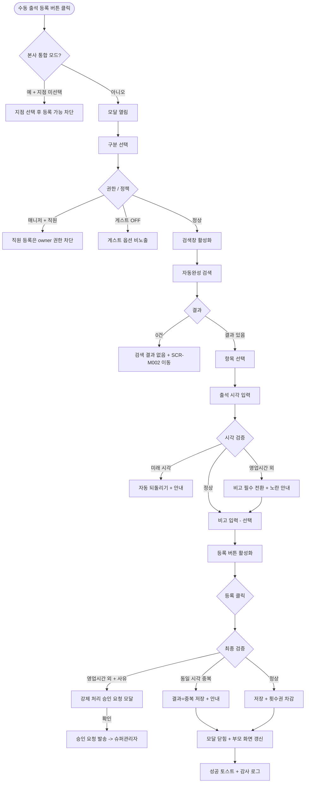

# DLG-I001 수동 출석 등록 다이얼로그

## 1. 다이얼로그 메타 정보

이 문서는 수동 출석 등록 다이얼로그에 대한 자기완결형 요구사항 정의서입니다. 다른 문서를 함께 보지 않아도 이 문서 한 장만으로 수동 출석 등록 다이얼로그의 모든 입력, 모든 검증, 모든 권한, 모든 예외 처리, 그리고 이 다이얼로그를 지탱하는 운영 정책까지 전부 이해하고 구현할 수 있도록 작성합니다.

| 항목 | 값 |
|---|---|
| 작성일 | 2026-05-22 |
| 버전 | v1.0 |
| 상태 | 최신 통합본 반영 (D11 재번호화 DLG-I001 확정) |
| 도메인 | D11 통합운영 |
| 다이얼로그 ID | DLG-I001 |
| 다이얼로그명 | 수동 출석 등록 |
| 다이얼로그 유형 | 입력 모달 (Input Modal) |
| 부모 화면 | SCR-I001 통합 출석 관리 |
| 우선순위 | P0 (출시 필수) |
| 기능코드 | IoT-07 (통합 출석 관리) |
| 계약코드 | RSV-04 (출결 처리 정본) |
| 부모 기능 prefix | IoT |
| Lv1 코드 | IoT-07 |
| Lv2 / Lv3 세분화 | IoT-07-04 (수동 출석 등록 - 구분 선택·자동완성·시각 수정·비고 입력) |
| 연계 화면 | SCR-I001 통합 출석 관리(부모), SCR-097 감사 로그, SCR-M004 회원 상세 |
| 관련 정책 | SCR-I002 키오스크 설정의 출입 규칙(영업시간), 본사 통합 모드 정책 |

## 2. 다이얼로그 개요와 목적

수동 출석 등록 다이얼로그는 키오스크·QR 등 기기를 통한 정상 출석이 불가능한 상황에서 관리자가 직접 회원 또는 직원의 출석을 수동으로 등록하는 모달입니다. 별도 기기 없이 admin 시스템에서 직접 출석 처리가 가능하며, 키오스크 장애·QR 인식 실패·게스트 방문·직원 출퇴근 누락·외부 행사 출석 같은 다양한 보완 운용 상황에서 사용됩니다.

이 다이얼로그가 다루는 운영 흐름은 다양합니다. 키오스크가 오프라인이 되었거나 KIO-103 얼굴인식 5회 연속 실패가 발생한 회원에 대해 프런트가 즉시 수동 등록으로 보완하고, 회원앱 미설치 회원이나 신규 가입 회원이 회원번호로 키오스크 인증 실패할 때 프런트가 이름으로 회원을 찾아 수동 등록하며, 직원 출퇴근이 키오스크 사용 불가 정책 또는 키오스크 장애로 누락되면 owner가 사후 정리로 수동 등록합니다. 게스트 방문(체험 회원·VIP 방문) 시에도 게스트 정책 ON 지점에서 수동 등록으로 출석을 적재합니다. 본사 통합 모드 사용 중에는 지점이 선택되지 않은 상태에서 수동 등록이 차단되어 데이터가 잘못된 지점에 묶이지 않도록 합니다.

따라서 이 다이얼로그는 단순한 입력 폼이 아니라, 회원/직원 구분에 따른 권한 분리(매니저는 회원만, owner는 직원 가능) · 영업시간 외 차단과 강제 처리 승인 흐름 · 중복 검출과 검수 대기 분리 · 본사 통합 모드 지점 선택 강제 · 횟수권 자동 차감 · 감사 로그 기록까지 모두 반영된 출석 보완 입력 도구로 동작해야 합니다.

## 3. 진입 경로

수동 출석 등록 다이얼로그는 SCR-I001 통합 출석 관리에서 다음 경로로 호출됩니다.

첫 번째 경로는 페이지 헤더의 "수동 출석 등록" 버튼 클릭입니다. 운영자가 부모 화면을 보면서 수동 등록이 필요한 회원을 식별한 직후 헤더 버튼을 누르는 가장 일반적인 진입입니다.

두 번째 경로는 SCR-I001의 검색 결과가 0건일 때 표시되는 "수동 출석 등록" CTA 버튼입니다. 운영자가 회원을 검색했지만 출석 이력이 없는 경우, 그 회원이 방금 방문했을 가능성이 있어 즉시 수동 등록으로 안내됩니다.

세 번째 경로는 SCR-I001의 실패 로그 필터 결과 행에서 "수동 등록" 행 액션을 선택한 경우입니다. 키오스크 실패로 적재된 회원을 수동 등록으로 보완하는 흐름이며, 이 경우 모달이 열릴 때 대상 회원이 자동으로 검색창에 채워진 상태로 진입합니다.

키오스크 장애 상황에서 수동 출석 보완이 필요한 경우(예: SCR-I008 키오스크 운영 현황에서 장애 키오스크를 인지한 직후)에도 진입 경로는 별도로 두지 않고, 운영자가 SCR-I001 통합 출석 관리로 이동한 뒤 헤더의 "수동 출석 등록" 버튼을 통해 동일하게 처리합니다. 이는 본 다이얼로그의 부모 화면을 SCR-I001 단일로 유지해 진입 경로의 양방향 매핑을 단순화하기 위한 정책입니다.

본사 통합 모드 사용 중인 본사 권한자가 직접 헤더 버튼을 누르면 모달이 열리는 대신 "지점 선택 후 등록 가능합니다" 안내가 표시되고 차단됩니다.

## 4. 레이아웃과 UI 구성

수동 출석 등록 다이얼로그는 SCR-I001 통합 출석 관리 화면 위에 오버레이로 표시되는 모달 팝업입니다. 모달은 화면 중앙에 정렬되며, 본문 폭은 약 480 ~ 560px 정도로 입력 항목을 한 컬럼으로 명확하게 배치하는 크기로 설계됩니다.

모달 상단에는 "수동 출석 등록"이라는 제목이 표시되고 우측 상단에 닫기(X) 버튼이 있습니다. 제목 아래에는 짧은 운영 설명 "키오스크·QR 인증이 불가한 회원의 출석을 직접 등록합니다"가 작은 글씨로 안내됩니다.

본문에는 입력 항목 4개가 세로로 배치됩니다.

첫 번째 항목은 "구분" 선택입니다. 회원 / 직원의 2개 옵션을 라디오 또는 토글 형태로 표시합니다. 기본값은 "회원"이며, 매니저 권한에서는 "직원" 옵션이 비활성화되어 있고 "직원 등록은 센터장 이상 권한이 필요합니다" 툴팁이 표시됩니다. owner 이상에서만 직원 옵션이 활성화됩니다. 게스트 정책 ON 지점에서는 "게스트" 옵션이 추가로 노출됩니다.

두 번째 항목은 "이름 또는 번호 검색" 자동완성 검색창입니다. 회원명·회원번호·연락처·사번을 동시에 OR 조건으로 검색합니다. 검색은 최소 2자 이상 입력 시 300ms 디바운스로 동작하며, 자동완성 드롭다운에 최대 10개 결과가 표시됩니다. 각 결과 항목에는 회원명·회원번호 또는 사번·이용권 상태(만료 임박은 주황·만료는 회색)·연락처 끝 4자리가 표시되어 운영자가 동명이인을 정확히 구분할 수 있습니다. 검색 결과가 0건이면 드롭다운 자리에 "검색 결과가 없습니다" 안내와 함께 SCR-M002 회원 등록 화면 이동 링크가 노출됩니다. 강사 권한에서는 본인 담당 회원만 검색 결과에 노출됩니다.

세 번째 항목은 "출석 시각" 입력입니다. 기본값은 현재 시각이며, 날짜 + 시간 캘린더 + 시간 피커 위젯으로 수정 가능합니다. 미래 시각은 인라인 차단되며 "현재 시각 이후로는 등록할 수 없습니다" 안내가 표시됩니다. 과거 시각은 입력 가능하나 영업시간 외 시각(SCR-I002의 출입 허용 시간 외)이면 영업시간 외 처리 경고가 표시됩니다.

네 번째 항목은 "비고" 입력입니다. 선택 항목이며 자유 텍스트 입력란(최대 200자)입니다. 수동 등록 사유(키오스크 장애·QR 인식 실패·회원 요청·게스트 방문·본사 정책 예외 등)를 자유롭게 입력합니다. 사전 정의된 사유 칩(키오스크 장애·얼굴인식 실패·QR 인식 실패·회원 요청·본사 정책 예외·기타)을 클릭으로 빠르게 입력할 수 있는 단축 버튼도 입력란 아래에 함께 제공됩니다. 영업시간 외 등록 시에는 비고 입력이 필수로 전환되며, 사유 입력 없이는 저장이 차단됩니다.

모달 하단에는 두 버튼이 있습니다. "등록" 버튼은 필수 항목(구분·검색 결과 선택·출석 시각)이 모두 채워져야 활성화되며, 비활성 상태에서는 회색 톤으로 표시되어 운영자가 어떤 항목이 미입력인지 인지할 수 있게 합니다. "취소" 버튼은 입력 내용을 폐기하고 모달을 닫습니다. ESC 키 또는 배경 클릭으로도 취소와 동일하게 동작하지만, 입력 도중이면 "변경 사항이 사라집니다. 닫으시겠습니까?" 확인 팝업이 한 번 더 표시됩니다.

## 5. 다이얼로그 동작과 입력 검증

수동 출석 등록 다이얼로그는 사용자의 입력에 따라 단계적으로 검증을 수행합니다.

구분 선택 단계에서는 매니저 권한 사용자가 "직원" 옵션을 선택하려고 하면 옵션이 비활성화되어 있어 클릭 불가입니다. owner 이상에서만 "직원" 선택이 가능하며, 직원 선택 시 검색 결과 영역에 직원 데이터만 표시됩니다.

검색 단계에서는 입력값이 2자 미만이면 자동완성이 동작하지 않고, 2자 이상부터 300ms 디바운스로 검색이 실행됩니다. 검색 결과 0건이면 드롭다운 자리에 "검색 결과가 없습니다 - 회원 등록 화면으로 이동" 안내가 표시됩니다. 결과 항목을 선택하면 검색창 아래에 선택된 회원/직원의 정보 카드(이름·회원번호 또는 사번·이용권 상태·연락처)가 한 줄로 표시되어 운영자가 선택한 대상을 재확인할 수 있게 합니다.

출석 시각 입력 단계에서는 다음 검증이 수행됩니다. 미래 시각 입력 시 인라인 빨강 안내 "현재 시각 이후로는 등록할 수 없습니다"가 표시되고 시각이 자동으로 현재 시각으로 되돌아갑니다. 영업시간 외 시각(SCR-I002의 출입 허용 시간 외) 입력 시 노란 안내 "영업시간 외 시각입니다. 사유를 입력해주세요"가 표시되고 비고 입력이 필수로 전환됩니다.

비고 입력 단계는 일반적으로 선택이지만, 영업시간 외 등록·동일 분 단위 중복 등록·과거 24시간을 초과한 등록 시 필수로 전환됩니다.

"등록" 버튼 클릭 시점에 최종 검증이 수행됩니다. 동일 회원·동일 분 단위 시각에 이미 출석 데이터가 있으면 결과 = 중복으로 저장하면서 "이미 같은 시각에 출석 데이터가 있습니다. 중복으로 저장되었습니다" 안내가 표시됩니다. 본사 통합 모드에서 지점 미선택 상태이면 등록이 차단됩니다.

등록 성공 시 모달이 닫히면서 부모 화면 SCR-I001의 출석 테이블 상단에 새 행이 슬라이드 다운으로 추가되고 1.5초 동안 노란색 하이라이트가 적용됩니다. 실시간 출석 확인 카드 영역에도 새 카드가 4 ~ 5초 강조되며 알림음이 1회 재생됩니다. 우측 상단에 "출석이 등록되었습니다" 성공 토스트가 표시됩니다.

횟수권을 가진 회원은 출석 등록 시 이용 횟수가 자동으로 1회 차감되며, 차감 결과가 회원 상세에 즉시 반영됩니다. 잔여 횟수가 0이 되면 다음 출석 시도 시 비고에 "잔여 횟수 0회" 안내가 자동 부여됩니다.

본사 통합 모드의 본사 권한자가 모달을 열려고 하면 모달이 열리는 대신 "지점 선택 후 등록 가능합니다" 안내가 토스트로 표시되고 차단됩니다.

## 6. 버튼·아이콘·링크 액션 전체 정의

이 다이얼로그의 모든 클릭 가능한 요소를 빠짐없이 정의합니다.

모달 우측 상단의 닫기(X) 버튼은 입력 내용을 폐기하고 모달을 닫습니다. 입력 도중이면 "변경 사항이 사라집니다. 닫으시겠습니까?" 확인 팝업이 표시됩니다.

구분 라디오의 "회원" / "직원" / "게스트" 옵션은 클릭으로 선택됩니다. 직원은 owner 이상에서만 활성화되고, 게스트는 게스트 정책 ON 지점에서만 노출됩니다.

검색창은 텍스트 입력 후 300ms 디바운스로 자동 검색이 동작합니다. 드롭다운의 각 결과 항목은 클릭으로 선택되며, 키보드 화살표 키와 Enter 키로도 선택 가능합니다.

자동완성 드롭다운 아래의 "회원 등록 화면으로 이동" 링크(검색 결과 0건 시 노출)는 SCR-M002 회원 등록 화면으로 이동합니다. 클릭 시 본 모달의 입력 내용은 폐기됩니다.

출석 시각 입력의 날짜 캘린더 위젯과 시간 피커는 미래 날짜·미래 시각이 자동으로 차단됩니다. 캘린더에서 오늘 날짜를 누르면 시간 피커가 활성화되고, 과거 날짜는 자유롭게 선택 가능합니다.

비고 입력란의 사전 정의 사유 칩(키오스크 장애·얼굴인식 실패·QR 인식 실패·회원 요청·본사 정책 예외·기타)은 클릭으로 텍스트가 입력란에 자동 채워집니다. 같은 칩을 다시 누르면 토글되어 텍스트가 제거됩니다.

모달 하단의 "등록" 버튼은 필수 항목이 모두 채워져야 활성화됩니다. 활성 상태에서 누르면 등록 처리가 시작되고 버튼이 로딩 스피너로 바뀌면서 다른 액션이 비활성화됩니다.

모달 하단의 "취소" 버튼은 입력 내용을 폐기하고 모달을 닫습니다.

## 7. 토스트와 확인 팝업과 알럿

수동 출석 등록 다이얼로그에서 발생하는 모든 알림성 UI는 다음 패턴으로 동작합니다.

성공 토스트는 모달이 닫힌 후 부모 화면에 우측 상단으로 녹색 계열 5초간 표시됩니다. "출석이 등록되었습니다" 문구로 결과를 알려줍니다.

실패 토스트는 빨강 계열로 표시되며, "권한이 없어요", "지점 선택 후 등록 가능합니다", "동일 회원의 같은 시각 데이터가 있어요" 같은 문구가 표시됩니다. 일부 실패는 모달 내 인라인 메시지로 표시되어 운영자가 입력을 수정한 뒤 다시 시도할 수 있게 합니다.

경고 토스트 / 인라인 안내는 노랑 계열로, "영업시간 외 시각입니다. 사유를 입력해주세요", "이미 같은 시각에 출석 데이터가 있습니다. 중복으로 저장되었습니다", "잔여 횟수 0회" 같은 안내를 표시합니다.

인라인 검증 메시지는 입력 항목 옆에 즉시 표시됩니다. "현재 시각 이후로는 등록할 수 없습니다", "검색 결과가 없습니다", "비고 입력이 필요합니다" 같은 문구가 빨강 글씨로 입력 항목 아래에 노출됩니다.

확인 팝업은 모달 닫기 시 입력 도중이면 "변경 사항이 사라집니다. 닫으시겠습니까?" yes/no 팝업이 표시됩니다. 영업시간 외 등록 시에는 "영업시간 외 처리는 본사 정책으로 차단됩니다. 강제 처리 승인을 요청하시겠습니까?" 팝업이 표시될 수 있으며, 운영자가 확인하면 슈퍼관리자에게 강제 처리 승인 요청이 발송됩니다.

알럿은 권한이 부족한 사용자가 부모 화면에서 헤더 버튼을 누르려고 했을 때 부모 화면에서 차단되어 본 모달이 열리지 않으므로, 다이얼로그 내에서는 별도 알럿이 거의 발생하지 않습니다.

## 8. 데이터 흐름과 외부 연동

다이얼로그가 열릴 때 부모 화면의 컨텍스트(지점·권한·게스트 정책 여부)가 props로 전달됩니다. 본사 통합 모드 + 지점 미선택 상태이면 모달 자체가 열리지 않습니다.

검색은 `GET /api/members/search?q=...&type=member`(회원), `GET /api/staff/search?q=...&type=staff`(직원) 같은 엔드포인트로 호출되며, 강사 권한에서는 본인 담당 회원만 결과로 필터링되도록 백엔드 쿼리에 자동 조건이 추가됩니다.

수동 출석 등록은 `POST /api/attendance/manual`로 호출됩니다. 요청 본문에 회원/직원 구분, 회원 ID 또는 직원 ID, 출석 시각, 비고가 포함됩니다. 응답으로는 생성된 출석 레코드, 결과 분류(성공·중복), 횟수권 차감 결과가 함께 내려옵니다.

영업시간 외 시각 등록 시 백엔드는 SCR-I002 키오스크 설정의 출입 허용 시간을 조회해 검증합니다. 영업시간 외이면 응답에 "영업시간 외 - 강제 처리 승인 필요" 정보가 포함되고, 운영자가 확인하면 추가로 `POST /api/attendance/manual/request-force`로 강제 처리 승인 요청이 발송됩니다.

동일 회원·동일 분 단위 중복 검출은 백엔드가 자동으로 수행하며, 중복 시 결과 = 중복으로 저장되어 SCR-I001의 결과 필터에서 "중복"으로 분리 카운트됩니다. 실패와는 별도의 카운트로 분류되어 진성 실패율 측정의 정확성을 보장합니다.

횟수권 자동 차감은 회원의 이용권 정보를 조회해 자동으로 1회 차감하고, 차감 결과를 SCR-M004 회원 상세에 즉시 반영합니다. 잔여 횟수가 0이 되면 비고에 자동 메모가 추가됩니다.

본 모달의 모든 등록 액션은 SCR-097 감사 로그에 비동기로 INSERT됩니다. 기록 필드는 `actor_id`(운영자 ID), `target_member_id` 또는 `target_staff_id`, `action`(MANUAL_ATTEND), `attendance_id`, `attended_at`, `reason`(비고), `is_force_after_hours`(영업시간 외 강제 처리 여부), `timestamp`(등록 시각)입니다. 감사 로그 INSERT는 응답이 사용자에게 돌아간 후 5초 안에 보장됩니다.

성공 등록은 WebSocket으로 부모 화면 SCR-I001에 실시간 푸시되고, 회원앱 SCR-MA-111 출석 이력에도 즉시 반영됩니다. 같은 데이터 원천을 사용하므로 회원에게 보이는 이력과 관리자 화면이 완전히 일치합니다.

화면에서 호출하는 주요 API 엔드포인트는 다음과 같습니다. 검색 `GET /api/members/search` 또는 `GET /api/staff/search`, 수동 등록 `POST /api/attendance/manual`, 영업시간 외 강제 처리 요청 `POST /api/attendance/manual/request-force`.

## 9. 화면 상태와 예외 처리

수동 출석 등록 다이얼로그는 다음 상태들을 가집니다.

기본 입력 대기 상태에서는 모든 입력 항목이 비어 있고 "등록" 버튼이 비활성화 상태입니다. 운영자가 입력을 시작하면 항목별로 검증이 즉시 동작합니다.

검색 중 상태에서는 자동완성 드롭다운이 표시되고 로딩 인디케이터가 짧게 보입니다.

검색 결과 없음 상태에서는 드롭다운 자리에 "검색 결과가 없습니다" 안내와 SCR-M002 회원 등록 화면 이동 링크가 표시됩니다.

입력 완료 상태에서는 필수 항목이 모두 채워져 "등록" 버튼이 활성화됩니다.

등록 진행 중 상태에서는 "등록" 버튼이 로딩 스피너로 바뀌고 다른 입력 항목과 버튼이 모두 비활성화되어 더블클릭과 입력 수정이 차단됩니다.

등록 성공 상태에서는 모달이 닫히면서 부모 화면 SCR-I001에 새 행이 추가되고 성공 토스트가 표시됩니다.

등록 실패 상태에서는 인라인 또는 토스트로 실패 사유가 표시되고, 운영자는 입력을 수정한 뒤 다시 시도할 수 있습니다.

영업시간 외 경고 상태에서는 출석 시각 입력 옆에 노란 안내가 표시되고 비고 입력이 필수로 전환됩니다.

예외 케이스별 처리는 다음과 같이 정의됩니다.

회원 검색 결과 0건일 때는 "검색 결과가 없습니다" 인라인 안내와 SCR-M002 이동 링크가 표시됩니다. 운영자가 SCR-M002로 이동해 회원을 등록한 뒤 다시 본 모달로 돌아와 검색하면 검색됩니다.

매니저 권한에서 "직원" 옵션 선택 시도는 옵션이 비활성화되어 있어 클릭 자체가 불가능하며, 호버 시 "직원 등록은 센터장 이상 권한이 필요합니다" 툴팁이 표시됩니다.

미래 시각 입력 시 시각이 자동으로 현재 시각으로 되돌아가며 인라인 안내 "현재 시각 이후로는 등록할 수 없습니다"가 표시됩니다.

영업시간 외 시각 입력 시 노란 안내가 표시되고 비고 필수 전환됩니다. 운영자가 비고를 입력하지 않은 채 "등록"을 누르면 인라인 "사유 입력이 필요합니다"가 표시되고 저장이 차단됩니다. 비고를 입력한 후 "등록"을 누르면 강제 처리 승인 요청 확인 팝업이 표시되고, 운영자가 확인하면 슈퍼관리자에게 승인 요청이 발송됩니다.

동일 회원·동일 분 단위 시각 중복 등록 시 결과 = 중복으로 저장되고 노란 안내가 표시됩니다. 사용자는 다른 시각으로 수정해 재등록할지, 그대로 중복으로 두고 모달을 닫을지 선택합니다.

본사 통합 모드 + 지점 미선택 상태에서는 모달이 열리지 않고 "지점 선택 후 등록 가능합니다" 토스트가 표시됩니다.

강사 권한에서 담당 외 회원을 검색하면 결과에 노출되지 않습니다. 강사가 직접 회원번호를 입력해도 검색되지 않으며, 다른 회원의 출석을 수동 등록할 수 없습니다.

게스트 옵션은 게스트 정책 OFF 지점에서는 라디오에 노출되지 않습니다. 정책 ON 지점에서만 노출됩니다.

이용권이 만료된 회원도 수동 등록은 가능하지만 비고에 "이용권 만료" 안내가 자동 부여됩니다. 만료 회원에게 수동 등록은 임시 출석 처리이며, 재결제 유도의 보완 흐름으로 사용됩니다.

횟수권을 가진 회원의 잔여 횟수가 0인 경우에도 수동 등록은 가능하나 비고에 "잔여 횟수 0회" 안내가 자동 부여되어 운영자가 즉시 결제 유도를 진행할 수 있게 합니다.

권한 강등(운영자가 모달을 연 후 권한이 변경된 경우)이 발생하면 등록 시점에 백엔드가 403을 반환하고 "권한이 변경되었습니다. 새로고침해주세요" 안내가 표시됩니다.

WebSocket 연결 끊김 상태에서는 등록 자체는 정상 수행되지만 부모 화면에 새 행이 실시간으로 보이지 않을 수 있습니다. 모달이 닫힌 후 부모 화면의 30초 폴링 fallback으로 데이터가 갱신됩니다.

## 10. 권한별 처리

이 다이얼로그는 권한에 따라 가능한 액션이 달라집니다.

슈퍼관리자·primary는 본사 통합 모드에서는 모달이 열리지 않고 "지점 선택 후 등록 가능합니다" 안내가 표시됩니다. 지점 선택 후에는 owner 권한으로 동작해 회원·직원·게스트(정책 ON 지점) 모두 수동 등록 가능합니다.

owner(센터장)은 자기 지점의 회원·직원·게스트 모두 수동 등록할 수 있습니다. 영업시간 외 등록 시 사유 입력 후 슈퍼관리자 강제 처리 승인 요청이 발송되며, 승인을 받으면 정상 등록됩니다.

매니저(manager·프런트)는 회원 수동 등록만 가능합니다. 직원 옵션은 비활성화되어 있어 선택 불가이며, "직원 등록은 센터장 이상 권한이 필요합니다" 툴팁이 표시됩니다. 게스트 옵션은 정책 ON 지점에서 가능합니다.

스태프(staff)는 회원 수동 등록만 가능합니다. 매니저와 동일한 권한입니다.

강사(trainer)는 본 모달에 접근할 수 없습니다. SCR-I001 부모 화면의 헤더 버튼이 보이지 않으므로 모달을 호출할 수 없습니다.

readonly는 본 모달에 접근할 수 없습니다.

게스트 정책 OFF 지점에서는 어떤 권한자도 게스트 옵션을 사용할 수 없습니다.

권한 차단 이벤트는 감사 로그에 기록되며, 권한 우회 시도를 사후에 추적할 수 있습니다.

## 11. 메인 흐름과 예외 흐름

수동 출석 등록 다이얼로그의 정상 흐름과 예외 흐름을 다이어그램으로 표현합니다.

## 12. 핵심 디자인 요청사항

모달은 부모 화면의 중앙에 정렬되며, 배경이 어둡게 처리되어 운영자의 시선이 모달에 집중되도록 합니다. 모달 본문 폭은 약 480 ~ 560px로 입력 항목이 한 컬럼으로 명확하게 배치됩니다.

구분 라디오 옵션 3종(회원·직원·게스트)은 가로로 배치되며, 비활성 옵션(매니저의 직원·정책 OFF의 게스트)은 회색 톤으로 명확히 표시되어 운영자가 자신의 권한 범위를 즉시 인지합니다. 비활성 옵션 호버 시 권한 안내 툴팁이 부드럽게 표시됩니다.

검색창은 입력 즉시 디바운스 표시(작은 회전 인디케이터)가 입력란 우측에 보이고, 자동완성 드롭다운은 검색창 바로 아래에 부드러운 페이드인으로 표시됩니다. 각 결과 항목은 호버 시 약한 색상 변화로 클릭 가능함을 알리고, 키보드 화살표 키 이동 시에도 강조 표시가 즉시 따라옵니다. 이용권 상태 배지(만료 임박 주황·만료 회색)는 결과 항목에서 한눈에 보이도록 색상 분기됩니다.

선택된 회원·직원의 정보 카드는 검색창 아래에 한 줄로 표시되며, 사진(또는 기본 아바타)·이름·회원번호·이용권 상태가 함께 노출되어 운영자가 선택을 재확인할 수 있게 합니다.

출석 시각 입력의 캘린더와 시간 피커는 미래 날짜·미래 시각이 회색 톤으로 명확히 비활성화되어 운영자가 클릭할 수 없음을 즉시 인지합니다. 영업시간 외 시각 선택 시 시간 피커의 해당 시간대가 노란 톤으로 약하게 강조되어 영업시간 외임을 알립니다.

비고 입력란의 사전 정의 사유 칩은 입력란 아래에 가로로 배치되며, 클릭 시 약한 색상 변화로 선택 상태를 알립니다. 영업시간 외 등록 시 비고 입력란의 라벨이 "비고 (필수)"로 자동 전환되고 빨강 별표가 표시되어 필수 입력임을 명확히 합니다.

등록 진행 중에는 "등록" 버튼이 로딩 스피너로 부드럽게 전환되고 다른 입력과 버튼이 모두 비활성화됩니다. 응답이 돌아오면 모달이 부드러운 페이드아웃으로 사라지고 부모 화면의 새 행이 슬라이드 다운으로 등장합니다.

모바일에서는 모달이 풀스크린으로 전환되어 작은 화면에서도 입력이 편하게 이루어지며, 시간 피커는 모바일 OS 네이티브 위젯을 사용합니다.

진행 스피너와 로딩 스켈레톤은 다른 D11 화면과 동일한 톤으로 통일됩니다.

## 13. 운영 정책 (이 다이얼로그에 연결된 부분)

수동 출석 등록은 키오스크·QR 정상 출석의 보완 수단이라는 정책입니다. 정상 흐름은 회원이 키오스크나 회원앱 QR로 직접 출석하는 것이며, 수동 등록은 그 흐름이 불가능한 예외 상황(키오스크 장애·인식 실패·게스트 방문·직원 출퇴근 누락·외부 행사)을 위한 안전망입니다. 수동 등록이 정상 출석보다 많이 발생하는 지점은 키오스크 운영 점검이 필요한 신호로 사용됩니다.

권한 분리 정책은 단계적입니다. 회원 수동 등록은 매니저 이상, 직원 수동 등록은 owner 이상으로 분리됩니다. 직원 근태는 회사 인사 관리의 영역이므로 운영자 실수의 위험을 줄이기 위해 권한이 한 단계 더 높게 설정됩니다. 강사는 본인 담당 회원이라 하더라도 수동 등록 권한이 없으며, 본인 수업의 출석 확인만 가능합니다.

미래 시각 차단 정책은 데이터 무결성을 위한 정책입니다. 출석은 이미 일어난 사건의 기록이므로 미래 시각 입력은 논리적으로 불가능하며, 운영자의 입력 실수를 차단하기 위해 인라인 자동 되돌리기로 처리됩니다.

영업시간 외 처리 정책은 본사 정책으로 차단되며, owner가 사유 입력 후 슈퍼관리자 강제 처리 승인을 받으면 정상 등록됩니다. 연중무휴 24시간 운영 지점이나 새벽 외부 행사 같은 예외 상황을 위한 안전망이며, 모든 강제 처리는 사유와 함께 감사 로그에 기록됩니다. 강제 처리 승인 요청은 NFR-19 알림 센터로 슈퍼관리자에게 즉시 푸시됩니다.

중복 검출 정책은 동일 회원·동일 분 단위 시각 중복을 자동 감지해 결과 = 중복으로 분리 저장한다는 것입니다. 운영자의 실수로 같은 출석을 두 번 등록한 경우 또는 키오스크와 수동 등록이 동시에 일어난 경우를 잡아내며, 실패와는 별도 카운트로 분류되어 진성 실패율 측정의 정확성을 보장합니다.

본사 통합 모드 차단 정책은 본사 권한자가 통합 모드(전체 지점) 상태에서 수동 등록을 시도하면 차단된다는 것입니다. 데이터가 잘못된 지점에 묶이지 않도록 하기 위한 정책이며, 지점 선택 드롭다운에서 단일 지점을 선택해야 등록이 가능합니다. 본사 권한자가 지점을 선택하면 그 지점의 owner 권한으로 동작합니다.

횟수권 자동 차감 정책은 횟수권을 가진 회원의 출석 등록 시 이용 횟수가 자동으로 1회 차감된다는 것입니다. 키오스크 출석과 동일한 처리가 이루어져 정상 출석과 수동 출석의 데이터 일관성을 보장합니다. 잔여 횟수가 0이 되면 비고에 자동 안내가 부여되어 운영자의 결제 유도 흐름이 시작됩니다.

만료 회원 수동 등록 정책은 가능하되 비고에 "이용권 만료" 자동 부여되는 것입니다. 임시 출석 처리(체험·VIP 안내·재결제 상담을 위한 출석)를 위한 안전망이며, 운영자가 즉시 재결제 유도를 진행할 수 있도록 합니다.

게스트 출석 정책은 지점별 옵션이며, ON 지점에서만 게스트 옵션이 라디오에 노출됩니다. 게스트는 회원 ID 없이 등록되며, 락커는 "대상 아님"으로 고정 표시됩니다.

감사 로그 정책은 모든 수동 등록·강제 처리·중복 저장·권한 차단이 SCR-097에 비동기로 INSERT된다는 것입니다. `actor_id`, `target_member_id` 또는 `target_staff_id`, `action`, `attendance_id`, `attended_at`, `reason`, `is_force_after_hours`, `timestamp`가 모두 기록되어 운영 행위의 추적성을 보장합니다.

데이터 단일 원천 정책은 본 모달에서 등록한 출석이 SCR-I001 통합 출석 관리, SCR-MA-111 회원앱 출석 이력에 동시에 노출된다는 것입니다. 같은 데이터 원천을 사용하므로 회원에게 보이는 이력과 관리자 화면이 완전히 일치하며, 데이터 정합성 이슈가 발생할 여지가 없습니다.

이상의 모든 정책은 이 다이얼로그를 구현하고 운영하는 사람이 별도 문서 없이 이 한 장만 보면 이해할 수 있도록 풀어 적었습니다.
