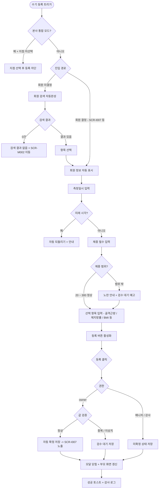

# DLG-I003 체성분 수기 등록 다이얼로그

## 1. 다이얼로그 메타 정보

이 문서는 체성분 수기 등록 다이얼로그에 대한 자기완결형 요구사항 정의서입니다. 다른 문서를 함께 보지 않아도 이 문서 한 장만으로 체성분 수기 등록 다이얼로그의 모든 입력, 모든 검증, 모든 권한, 모든 예외 처리, 그리고 이 다이얼로그를 지탱하는 운영 정책까지 전부 이해하고 구현할 수 있도록 작성합니다.

| 항목 | 값 |
|---|---|
| 작성일 | 2026-05-22 |
| 버전 | v1.0 |
| 상태 | 최신 통합본 반영 (D11 재번호화 DLG-I003 확정) |
| 도메인 | D11 통합운영 |
| 다이얼로그 ID | DLG-I003 |
| 다이얼로그명 | 체성분 수기 등록 |
| 다이얼로그 유형 | 입력 모달 (Input Modal) |
| 부모 화면 | SCR-I006 체성분 통합 관리 |
| 우선순위 | P1 |
| 기능코드 | IoT-05 (회원 건강 연동 요약 + 체성분 통합 관리) |
| 부모 기능 prefix | IoT |
| Lv1 코드 | IoT-05 |
| Lv2 / Lv3 세분화 | IoT-05-08 (수기 등록 - 회원 검색·체중 필수·선택 항목·동일 시각 중복 검수 대기) |
| 연계 화면 | SCR-I006 체성분 통합 관리(부모), SCR-I007 회원 건강 연동 요약, SCR-097 감사 로그, SCR-M004 회원 상세 |
| 관련 정책 | SCR-I006 검수 분류 정책(매칭 실패·중복·이상치), 강사 담당 회원 제한, 매니저 미확정 저장 |

## 2. 다이얼로그 개요와 목적

체성분 수기 등록 다이얼로그는 InBody 등 측정 장비 없이 관리자가 직접 체성분 수치를 수동으로 입력하는 모달입니다. 측정지 원본을 보고 수기로 전산화하거나, 장비 연동이 불가능한 환경에서 임시 등록 시 사용합니다. 본 다이얼로그는 SCR-I006 체성분 통합 관리에서 호출되며, 입력된 데이터는 검수 분류 정책에 따라 자동 확정 또는 검수 대기로 저장됩니다.

이 다이얼로그가 다루는 운영 흐름은 다양합니다. owner 또는 매니저가 회원이 외부 병원·기관에서 받아온 체성분 측정지를 보고 본 다이얼로그로 수치를 입력해 운영 데이터에 반영합니다. InBody 장비가 오프라인이거나 정전·네트워크 장애로 자동 수신이 동작하지 않는 경우에도 수기 등록으로 보완합니다. 강사가 본인 담당 회원의 외부 측정 결과를 입력할 때 사용하며, 이 경우 강사는 본인 담당 회원만 검색 결과에 노출됩니다. 같은 회원·같은 측정 시각의 중복 데이터가 발생하면 자동으로 검수 대기 상태로 저장되어 owner의 확인 후 처리가 필요합니다. 값이 정상 범위(체중 20 ~ 300kg, 골격근량 5 ~ 80kg, 체지방률 3 ~ 60%) 밖인 경우에도 값 이상치로 분류되어 검수 대기로 저장됩니다.

따라서 이 다이얼로그는 단순한 수치 입력 폼이 아니라, 회원 검색 자동완성(강사는 담당 회원 한정) · 체중 필수 + 7개 선택 입력 · 범위 검증과 이상치 자동 분류 · 동일 시각 중복 자동 검수 대기 · 권한별 확정 / 미확정 저장 분기 · 회원 건강 요약(SCR-I007) 노출 정책까지 모두 반영된 체성분 보완 입력 도구로 동작해야 합니다.

## 3. 진입 경로

체성분 수기 등록 다이얼로그는 다음 경로로 호출됩니다.

첫 번째 경로는 SCR-I006 체성분 통합 관리의 페이지 헤더 "수기 등록" 버튼 클릭입니다. 운영자가 부모 화면을 보면서 수기 등록이 필요한 회원을 식별한 직후 헤더 버튼을 누르는 가장 일반적인 진입입니다.

두 번째 경로는 SCR-I007 회원 건강 연동 요약 화면의 체성분 이력 섹션 "측정 데이터 추가" 버튼 클릭입니다. SCR-I007은 회원 종속 조회 화면이므로 본 다이얼로그를 직접 호출하지 않고 SCR-I006 체성분 통합 관리로 이동한 뒤 그 화면의 헤더 "수기 등록" 버튼을 누르는 흐름이며, 운영자가 같은 회원의 측정 이력을 SCR-I006의 측정 결과 탭에서 함께 확인할 수 있도록 설계되었습니다.

세 번째 경로는 SCR-M004 회원 상세의 체성분 이력 카드에서 "수기 등록" 액션을 선택한 경우입니다. SCR-M004(D02 회원관리 도메인)는 별도 도메인이지만 본 다이얼로그를 deep link로 호출하며, 회원이 결정된 상태로 진입합니다.

본사 통합 모드의 본사 권한자가 직접 호출하면 모달이 열리지 않고 "지점 선택 후 등록 가능합니다" 안내가 표시되고 차단됩니다. 강사가 헤더 버튼을 누르면 본인 담당 회원만 검색되도록 자동 필터링되어 모달이 열립니다.

## 4. 레이아웃과 UI 구성

체성분 수기 등록 다이얼로그는 부모 화면(SCR-I006 등) 위에 오버레이로 표시되는 모달 팝업입니다. 모달은 화면 중앙에 정렬되며, 본문 폭은 약 520 ~ 600px 정도로 입력 항목을 한 컬럼으로 명확하게 배치하는 크기로 설계됩니다.

모달 상단에는 "체성분 수기 등록"이라는 제목이 표시되고 우측 상단에 닫기(X) 버튼이 있습니다. 제목 아래에는 짧은 운영 설명이 작은 글씨로 안내됩니다.

본문에는 입력 항목 10개가 세로로 배치됩니다.

첫 번째 항목은 "회원 검색" 자동완성 검색창입니다. 이름·회원번호·연락처로 검색하며, 최소 2자 이상 입력 시 300ms 디바운스로 검색이 실행됩니다. 자동완성 드롭다운에 최대 10개 결과가 표시되며, 각 항목에는 회원명·회원번호·이용권 상태·연락처 끝 4자리가 표시되어 동명이인 구분이 가능합니다. 강사 권한에서는 본인 담당 회원만 결과에 노출됩니다. 회원을 선택하면 검색창 아래에 회원 정보 카드(사진·이름·회원번호·이용권 상태·최근 측정일)가 표시되어 운영자가 선택을 재확인할 수 있게 합니다. 진입 경로 2·3(회원이 결정된 상태)에서는 회원 검색이 자동으로 건너뛰어지고 회원 정보 카드만 표시됩니다.

두 번째 항목은 "측정일시" 입력입니다. 기본값은 현재 시각이며, 날짜 + 시간 캘린더 + 시간 피커 위젯으로 수정 가능합니다. 미래 시각은 인라인 차단되고 "현재 시각 이후로는 등록할 수 없습니다" 안내가 표시됩니다. 과거 시각은 자유롭게 입력 가능하지만, 동일 회원·동일 측정 시각에 이미 데이터가 있으면 검수 대기 상태로 저장됨이 안내됩니다.

세 번째 항목은 "체중(kg)" 필수 입력입니다. 소수점 1자리까지 입력 가능하며, 범위는 20 ~ 300kg입니다. 범위 밖 값은 노란 안내 "범위 밖 값입니다 - 값 이상치로 검수 대기 저장됩니다"가 표시되며, 저장은 가능하나 검수 대기로 분류됩니다.

네 번째 ~ 열 번째 항목은 선택 입력입니다. 골격근량(kg, 소수점 1자리, 범위 5 ~ 80kg), 체지방량(kg, 소수점 1자리), 체지방률(%, 소수점 1자리, 범위 3 ~ 60%), BMI(소수점 1자리, 범위 10 ~ 60), 기초대사량(kcal, 정수, 범위 500 ~ 3000), 체수분(L, 소수점 1자리, 범위 10 ~ 100L), 비고(자유 텍스트, 최대 200자)입니다. 모든 수치 입력은 인라인 범위 검증을 거치며, 범위 밖 값은 노란 안내가 표시됩니다.

각 입력 항목 옆에는 작은 ⓘ 아이콘이 있고, 호버 시 정상 범위와 임상 의미가 툴팁으로 표시되어 운영자가 의학 지식이 부족해도 입력이 가능합니다.

모달 하단에는 두 버튼이 있습니다. "등록" 버튼은 회원과 측정일시와 체중이 모두 채워져야 활성화되며, 비활성 상태에서는 회색 톤으로 표시됩니다. "취소" 버튼은 입력 내용을 폐기하고 모달을 닫습니다. ESC 키 또는 배경 클릭으로도 취소와 동일하게 동작하지만, 입력 도중이면 "변경 사항이 사라집니다. 닫으시겠습니까?" 확인 팝업이 한 번 더 표시됩니다.

권한 안내 배너가 모달 하단에 작게 표시됩니다. 매니저 권한에서는 "매니저 등록은 미확정 상태로 저장되며 관리자 확정이 필요합니다" 안내가, 강사 권한에서는 "강사 등록은 미확정 상태로 저장되며 관리자 확정이 필요합니다" 안내가 노출됩니다. owner는 별도 안내가 없습니다.

## 5. 다이얼로그 동작과 입력 검증

체성분 수기 등록 다이얼로그는 사용자의 입력에 따라 단계적으로 검증을 수행합니다.

회원 검색 단계에서는 입력값이 2자 미만이면 자동완성이 동작하지 않고, 2자 이상부터 300ms 디바운스로 검색이 실행됩니다. 강사 권한에서는 본인 담당 회원만 결과에 노출됩니다. 검색 결과가 0건이면 "검색 결과가 없습니다" 안내와 함께 SCR-M002 회원 등록 화면 이동 링크가 노출됩니다.

측정일시 입력 단계에서는 미래 시각 입력 시 인라인 빨강 안내 "현재 시각 이후로는 등록할 수 없습니다"가 표시되고 시각이 자동으로 현재 시각으로 되돌아갑니다. 과거 시각은 입력 가능하나 동일 회원·동일 측정 시각에 이미 데이터가 있는지 백엔드에 미리 확인하여 중복 안내가 표시됩니다.

체중 입력 단계에서는 다음 검증이 수행됩니다. 값이 비어 있으면 인라인 "체중은 필수 입력입니다" 안내가 표시되고 등록 버튼이 비활성화됩니다. 값이 20 ~ 300kg 범위 밖이면 노란 안내 "범위 밖 값입니다 - 값 이상치로 검수 대기 저장됩니다"가 표시되며 저장은 가능합니다. 소수점 2자리 이상 입력 시 자동으로 1자리로 반올림됩니다.

선택 항목 입력 단계에서는 각 항목의 범위 검증이 인라인으로 수행되며, 범위 밖 값은 노란 안내가 표시됩니다. 모든 선택 항목은 입력하지 않아도 등록 가능하며, 입력된 값만 저장됩니다.

"등록" 버튼 클릭 시점에 최종 검증이 수행됩니다. 체중과 측정일시와 회원이 모두 채워져 있고 미래 시각이 아니면 백엔드 호출이 시작됩니다.

저장 결과에 따른 분기는 다음과 같습니다. 동일 회원·동일 측정 시각 중복이 감지되면 결과가 검수 대기 상태로 저장되고 "동일 시각 데이터가 있어 검수 대기로 저장되었습니다" 안내가 표시됩니다. 값 이상치가 감지되면 검수 대기 상태로 저장됩니다. 매니저 권한 등록은 미확정 상태로 저장되며 owner 확정이 필요함이 안내됩니다. 강사 권한 등록은 미확정 상태로 저장됩니다. owner 등록은 정상 값이면 자동 확정 상태로 저장되어 SCR-I007 회원 건강 요약과 회원 상세에 즉시 노출됩니다.

등록 성공 시 모달이 닫히고 부모 화면 SCR-I006의 측정 결과 테이블이 갱신되어 새 행이 표시되며, 검수 대기로 저장된 경우 오류/검수 탭에 새 항목이 추가됩니다. 우측 상단에 성공 토스트가 표시됩니다.

본사 통합 모드의 본사 권한자가 모달을 호출하면 모달이 열리지 않고 "지점 선택 후 등록 가능합니다" 안내가 토스트로 표시됩니다.

## 6. 버튼·아이콘·링크 액션 전체 정의

이 다이얼로그의 모든 클릭 가능한 요소를 빠짐없이 정의합니다.

모달 우측 상단의 닫기(X) 버튼은 입력 내용을 폐기하고 모달을 닫습니다. 입력 도중이면 "변경 사항이 사라집니다. 닫으시겠습니까?" 확인 팝업이 표시됩니다.

회원 검색창은 텍스트 입력 후 300ms 디바운스로 자동 검색이 동작합니다. 드롭다운의 각 결과 항목은 클릭으로 선택되며, 키보드 화살표 키와 Enter 키로도 선택 가능합니다. 강사 권한에서는 본인 담당 회원만 결과에 노출됩니다.

자동완성 드롭다운 아래의 "회원 등록 화면으로 이동" 링크(검색 결과 0건 시 노출)는 SCR-M002 회원 등록 화면으로 이동합니다.

측정일시 입력의 날짜 캘린더와 시간 피커는 미래 날짜·미래 시각이 자동으로 차단됩니다. 캘린더에서 오늘 날짜를 누르면 시간 피커가 활성화되고, 과거 날짜는 자유롭게 선택 가능합니다.

각 입력 항목 옆의 ⓘ 아이콘 호버 시 정상 범위와 임상 의미가 툴팁으로 표시됩니다. 예를 들어 체지방률 옆 ⓘ에는 "남성 표준 10 ~ 20%, 여성 표준 18 ~ 28% / 범위 3 ~ 60%"가 표시됩니다.

선택 입력 항목은 모두 빈 상태로 둘 수 있으며, 빈 항목은 저장 시 null로 처리됩니다. 입력 항목 옆의 "삭제" 아이콘은 입력값을 즉시 비웁니다.

비고 입력란은 최대 200자까지 자유 텍스트 입력이 가능하며, 입력란 우측 하단에 글자 수 카운터가 작게 표시됩니다.

모달 하단의 "등록" 버튼은 회원·측정일시·체중이 모두 채워져야 활성화됩니다. 활성 상태에서 누르면 등록 처리가 시작되고 버튼이 로딩 스피너로 바뀌면서 다른 액션이 비활성화됩니다.

모달 하단의 "취소" 버튼은 입력 내용을 폐기하고 모달을 닫습니다.

## 7. 토스트와 확인 팝업과 알럿

체성분 수기 등록 다이얼로그에서 발생하는 알림성 UI는 다음 패턴으로 동작합니다.

성공 토스트는 모달이 닫힌 후 부모 화면에 우측 상단으로 녹색 계열 5초간 표시됩니다. 권한에 따라 토스트 문구가 분기됩니다. owner 등록 + 정상 값: "체성분이 등록되었습니다", 매니저 / 강사 등록: "체성분이 등록되었습니다. 관리자 확정 대기 중입니다", 중복 / 이상치: "체성분이 검수 대기로 저장되었습니다".

실패 토스트는 빨강 계열로 표시되며, "권한이 없어요", "지점 선택 후 등록 가능합니다", "체중을 입력해주세요", "현재 시각 이후로는 등록할 수 없습니다" 같은 문구가 표시됩니다. 일부 실패는 모달 내 인라인 메시지로 표시됩니다.

경고 토스트 / 인라인 안내는 노랑 계열로, "동일 시각 데이터가 있어 검수 대기로 저장됩니다", "범위 밖 값입니다 - 값 이상치로 검수 대기 저장됩니다" 같은 안내를 표시합니다.

인라인 검증 메시지는 입력 항목 옆에 즉시 표시됩니다. "체중은 필수 입력입니다", "현재 시각 이후로는 등록할 수 없습니다", "검색 결과가 없습니다" 같은 문구가 빨강 글씨로 노출됩니다. 범위 밖 값은 노랑 글씨로 표시됩니다.

확인 팝업은 모달 닫기 시 입력 도중이면 "변경 사항이 사라집니다. 닫으시겠습니까?" yes/no 팝업이 표시됩니다.

알럿은 권한이 부족한 사용자가 부모 화면에서 호출하려고 했을 때 부모 화면에서 차단되어 본 모달이 열리지 않으므로, 다이얼로그 내에서는 별도 알럿이 거의 발생하지 않습니다.

## 8. 데이터 흐름과 외부 연동

다이얼로그가 열릴 때 부모 화면의 컨텍스트(지점·권한·진입 회원 ID)가 props로 전달됩니다. 본사 통합 모드 + 지점 미선택 상태이면 모달 자체가 열리지 않습니다.

회원 검색은 `GET /api/members/search?q=...`로 호출됩니다. 강사 권한에서는 백엔드 쿼리에 본인 담당 회원 필터가 자동 추가됩니다.

회원 선택 시 `GET /api/members/:id/body-composition-summary`로 회원의 최근 측정 이력 요약을 조회해 회원 정보 카드에 표시합니다. 운영자가 같은 회원의 이전 측정값을 보면서 입력할 수 있게 합니다.

수기 등록은 `POST /api/body-composition/manual`로 호출됩니다. 요청 본문에 회원 ID, 측정일시, 체중, 선택 항목들, 비고가 포함됩니다. 응답으로는 생성된 측정 데이터, 결과 상태(확정·미확정·검수 대기), 검수 사유(중복·이상치 등)가 함께 내려옵니다.

동일 회원·동일 측정 시각 중복 검출은 백엔드가 자동 수행하며, 중복 시 결과 = 검수 대기로 저장됩니다. 5분 이내 동일 수치 반복 수신도 중복 의심으로 분류됩니다.

값 이상치 검출도 백엔드가 자동 수행합니다. 체중 20 ~ 300kg, 골격근량 5 ~ 80kg, 체지방률 3 ~ 60% 범위 밖이면 값 이상치로 분류되어 검수 대기 저장됩니다.

권한별 저장 분기는 백엔드가 결정합니다. owner 등록 + 정상 값은 자동 확정, 매니저 / 강사 등록은 미확정, 중복 / 이상치는 검수 대기로 저장됩니다. 확정된 데이터만 SCR-I007 회원 건강 요약과 SCR-M004 회원 상세에 노출됩니다.

본 모달의 모든 등록 액션은 SCR-097 감사 로그에 비동기로 INSERT됩니다. 기록 필드는 `actor_id`(운영자 ID), `target_member_id`, `action`(MANUAL_BODY_COMPOSITION), `body_composition_id`, `measured_at`, `weight`, `state`(CONFIRMED·UNCONFIRMED·REVIEW_REQUIRED), `review_reason`(중복·이상치·매니저 미확정·강사 미확정), `timestamp`입니다.

성공 등록은 부모 화면 SCR-I006의 측정 결과 테이블과 통계 카드에 즉시 반영됩니다. 검수 대기로 저장된 경우 SCR-I006의 오류/검수 탭에도 새 항목이 추가됩니다.

화면에서 호출하는 주요 API 엔드포인트는 다음과 같습니다. 회원 검색 `GET /api/members/search`, 회원 측정 요약 `GET /api/members/:id/body-composition-summary`, 수기 등록 `POST /api/body-composition/manual`.

## 9. 화면 상태와 예외 처리

체성분 수기 등록 다이얼로그는 다음 상태들을 가집니다.

기본 입력 대기 상태에서는 모든 입력 항목이 비어 있고(진입 경로 1) 또는 회원이 자동으로 채워져 있고(진입 경로 2·3), "등록" 버튼이 비활성화 상태입니다.

검색 중 상태에서는 자동완성 드롭다운이 표시되고 로딩 인디케이터가 짧게 보입니다.

검색 결과 없음 상태에서는 드롭다운 자리에 "검색 결과가 없습니다" 안내와 SCR-M002 이동 링크가 표시됩니다.

회원 선택됨 상태에서는 회원 정보 카드가 표시되고 측정값 입력 항목이 모두 활성화됩니다.

필수 항목 입력됨 상태(회원 + 측정일시 + 체중)에서는 "등록" 버튼이 활성화됩니다.

범위 밖 값 입력 상태에서는 해당 항목 옆에 노란 안내가 표시되지만 등록은 가능합니다. 등록 시 검수 대기로 저장됩니다.

동일 시각 중복 감지 상태에서는 측정일시 옆에 노란 안내 "동일 시각 데이터가 있어 검수 대기로 저장됩니다"가 미리 표시됩니다.

등록 진행 중 상태에서는 "등록" 버튼이 로딩 스피너로 바뀌고 다른 액션이 비활성화됩니다.

등록 성공 상태에서는 모달이 닫히면서 부모 화면이 갱신되고 성공 토스트가 표시됩니다.

등록 실패 상태에서는 인라인 또는 토스트로 실패 사유가 표시됩니다.

예외 케이스별 처리는 다음과 같이 정의됩니다.

회원 검색 결과 0건일 때는 "검색 결과가 없습니다" 인라인 안내와 SCR-M002 이동 링크가 표시됩니다.

강사가 담당 외 회원을 검색하면 결과에 노출되지 않습니다. 강사가 직접 회원번호로 검색해도 검색되지 않으며, 다른 회원의 체성분을 입력할 수 없습니다.

미래 시각 입력 시 시각이 자동으로 현재 시각으로 되돌아가며 인라인 안내가 표시됩니다.

체중 미입력 상태에서 등록 버튼을 누르려고 하면 버튼이 비활성화되어 있어 클릭 불가입니다. 호버 시 "체중을 입력해주세요" 툴팁이 표시됩니다.

값이 범위 밖일 때는 노란 안내가 표시되지만 등록은 가능합니다. 저장 시 검수 대기로 분류되며 운영자에게 안내됩니다.

동일 회원·동일 측정 시각 중복 등록 시 검수 대기로 저장되고 안내가 표시됩니다.

매니저 권한 등록은 미확정 상태로 저장되며, 모달 하단의 권한 안내 배너에 사전 안내됩니다. 등록 후에는 SCR-I006의 측정 결과 탭에서 "미확정" 배지로 표시되며 owner의 확정 처리가 필요합니다.

강사 권한 등록은 미확정 상태로 저장됩니다. 매니저와 동일한 흐름입니다.

본사 통합 모드 + 지점 미선택 상태에서는 모달이 열리지 않습니다.

권한 강등(운영자가 모달을 연 후 권한이 변경된 경우)이 발생하면 등록 시점에 백엔드가 403을 반환하고 "권한이 변경되었습니다" 안내가 표시됩니다.

## 10. 권한별 처리

이 다이얼로그는 권한에 따라 가능한 액션과 저장 상태가 달라집니다.

슈퍼관리자·primary는 본사 통합 모드에서는 모달이 열리지 않고 "지점 선택 후 등록 가능합니다" 안내가 표시됩니다. 지점 선택 후에는 owner 권한으로 동작합니다.

owner(Owner(지점장))은 자기 지점의 모든 회원에게 체성분 수기 등록이 가능합니다. owner 등록은 정상 값이면 자동 확정 상태로 저장되어 즉시 SCR-I007과 회원 상세에 노출됩니다. 중복 또는 이상치는 검수 대기로 저장됩니다.

매니저(manager·프런트)는 자기 지점의 모든 회원에게 수기 등록이 가능하지만, 저장은 미확정 상태로 이루어지며 owner의 확정이 필요합니다. 모달 하단의 권한 안내 배너에 사전 안내됩니다.

강사(trainer)는 본인 담당 회원에 한해 수기 등록이 가능합니다. 회원 검색 결과에 본인 담당 회원만 노출됩니다. 강사 등록도 미확정 상태로 저장되며 owner의 확정이 필요합니다.

스태프(staff)는 본 모달에 접근할 수 없습니다.

readonly는 본 모달에 접근할 수 없습니다.

본사 통합 모드의 본사 권한자는 지점 선택 후에만 owner 권한으로 등록 가능합니다.

권한 차단 이벤트는 감사 로그에 기록됩니다.

## 11. 메인 흐름과 예외 흐름

체성분 수기 등록 다이얼로그의 정상 흐름과 예외 흐름을 다이어그램으로 표현합니다.

## 12. 핵심 디자인 요청사항

모달은 부모 화면의 중앙에 정렬되며, 본문 폭은 약 520 ~ 600px로 입력 항목이 한 컬럼으로 명확하게 배치됩니다. 배경은 어둡게 처리됩니다.

회원 검색창은 모달 상단에서 가장 큰 입력으로 표시되며, 자동완성 드롭다운은 검색창 바로 아래에 부드러운 페이드인으로 표시됩니다. 강사 권한에서는 "본인 담당 회원만 검색됩니다" 작은 안내가 검색창 아래에 회색 글씨로 표시되어 검색 범위를 명확히 합니다.

선택된 회원의 정보 카드는 검색창 아래에 한 줄로 표시되며, 사진·이름·회원번호·이용권 상태·최근 측정일이 함께 노출됩니다. 최근 측정일이 표시되면 운영자가 같은 회원의 이전 측정값과 새 측정값을 비교하면서 입력할 수 있어 입력 실수 방지에 도움이 됩니다.

체중 필수 항목은 라벨에 빨강 별표가 표시되어 필수임이 명확히 드러나며, 다른 선택 항목은 별표 없이 표시됩니다. 필수 항목이 비어 있으면 라벨이 빨강 톤으로 약하게 강조됩니다.

각 입력 항목의 단위(kg·%·kcal·L)는 입력란 우측에 작게 표시되어 운영자가 단위를 혼동하지 않게 합니다.

각 입력 항목 옆의 ⓘ 아이콘은 호버 시 정상 범위와 임상 의미를 툴팁으로 표시합니다. 툴팁은 부드러운 페이드인으로 등장하며, 입력란 위쪽 또는 우측에 표시됩니다.

범위 밖 값 입력 시 입력란 아래에 노란 안내가 부드럽게 등장하며, 입력란 자체의 테두리는 노란 톤으로 약하게 강조됩니다. 운영자가 입력을 수정하면 안내가 부드럽게 사라집니다.

비고 입력란은 다른 항목보다 약간 큰 높이로 표시되어 자유 텍스트 입력이 편하게 이루어지며, 우측 하단에 글자 수 카운터(예: 35/200)가 작게 표시됩니다.

권한 안내 배너(매니저·강사용)는 모달 하단의 등록 버튼 위에 작은 카드로 표시되어, 운영자가 자신의 등록이 미확정 상태임을 등록 직전에 인지할 수 있게 합니다.

등록 진행 중에는 "등록" 버튼이 로딩 스피너로 부드럽게 전환되고 모달이 부드러운 페이드아웃으로 닫히며 부모 화면의 새 행이 슬라이드 다운으로 등장합니다.

모바일에서는 모달이 풀스크린으로 전환되어 작은 화면에서도 입력이 편하게 이루어지며, 숫자 입력은 모바일 OS 네이티브 키패드를 사용합니다.

진행 스피너와 로딩 스켈레톤은 다른 D11 화면과 동일한 톤으로 통일됩니다.

## 13. 운영 정책 (이 다이얼로그에 연결된 부분)

수기 등록은 InBody 실시간 API와 파일 업로드의 보완 수단이라는 정책입니다. 정상 흐름은 InBody 장비에서 실시간 API로 자동 적재되거나 CSV/XLSX 파일을 업로드하는 것이며, 수기 등록은 외부 병원·기관 측정지 전산화 또는 장비 장애 상황의 보완을 위한 안전망입니다. 수기 등록이 정상 채널보다 많이 발생하는 지점은 InBody 장비 운영 점검이 필요한 신호로 사용됩니다.

권한 분리 정책은 단계적입니다. owner는 모든 회원에게 자동 확정 상태로 등록 가능하고, 매니저와 강사는 미확정 상태로 등록되어 owner 확정이 필요합니다. 강사는 본인 담당 회원만 등록 가능합니다. 이는 회원의 건강 데이터가 정확해야 하므로 owner의 검토를 거치는 거버넌스 모델입니다.

체중 필수 정책은 체성분의 가장 기본 지표가 체중이라는 것입니다. 다른 수치는 측정 환경이나 장비에 따라 누락될 수 있지만 체중만큼은 항상 측정되므로 필수로 설정됩니다.

값 이상치 자동 분류 정책은 체중 20 ~ 300kg, 골격근량 5 ~ 80kg, 체지방률 3 ~ 60% 범위 밖 값을 자동으로 검수 대기로 분류한다는 것입니다. 정상 인간의 체성분 범위를 벗어나는 값은 측정 오류 가능성이 높으므로 운영자(owner)의 확인을 거칩니다. 범위 자체는 SCR-I006의 검수 분류 정책과 동일합니다.

중복 의심 자동 분류 정책은 동일 회원·동일 측정 시각 또는 5분 이내 동일 수치 반복을 자동으로 검수 대기로 분류한다는 것입니다. 운영자의 실수로 같은 측정을 두 번 입력하거나, 장비와 수기가 동시에 입력되는 경우를 잡아냅니다.

확정 데이터 노출 정책은 확정 상태(owner 등록 + 정상 값)인 데이터만 SCR-I007 회원 건강 요약과 SCR-M004 회원 상세에 노출된다는 것입니다. 미확정 / 검수 대기 상태는 SCR-I006의 측정 결과 탭에서만 보이고 회원에게는 노출되지 않습니다. 회원에게 잘못된 건강 정보가 전달되지 않도록 하는 정책입니다.

미래 시각 차단 정책은 데이터 무결성을 위한 정책입니다. 측정은 이미 일어난 사건의 기록이므로 미래 시각 입력은 논리적으로 불가능하며, 자동 되돌리기로 차단됩니다.

본사 통합 모드 차단 정책은 본사 권한자가 통합 모드 상태에서 수기 등록을 시도하면 차단된다는 것입니다. 체성분 데이터가 잘못된 지점에 묶이지 않도록 하기 위한 정책이며, 지점 선택 후에만 등록 가능합니다.

강사 담당 회원 제한 정책은 강사가 본인 담당 회원의 외부 측정 결과만 입력 가능하다는 것입니다. 강사가 다른 회원의 체성분을 임의로 입력하는 것을 방지하며, 회원 검색 결과 자체가 담당 회원으로 한정됩니다.

처리 이력 보존 정책은 모든 수기 등록·미확정 저장·검수 대기 저장·확정 처리·무시 처리·매칭이 감사 로그에 기록된다는 것입니다. `actor_id`, `target_member_id`, `action`, `body_composition_id`, `measured_at`, `weight`, `state`, `review_reason`, `timestamp`가 모두 기록되어 운영 행위의 추적성을 보장합니다.

검수 처리 단일 진입점 정책은 검수 대기·미확정 데이터의 확정 처리가 SCR-I006의 오류/검수 탭에서만 가능하다는 것입니다. 본 모달은 등록까지만 담당하고, 확정 처리는 별도 화면에서 일관되게 이루어집니다.

데이터 단일 원천 정책은 본 모달, InBody 실시간 API, 파일 업로드가 모두 동일한 데이터 모델로 저장되어 채널 컬럼으로만 구분된다는 것입니다. SCR-I006의 측정 결과 탭에서 채널과 무관하게 통합 조회되며, 검수 분류 정책도 모든 채널에 동일하게 적용됩니다.

이상의 모든 정책은 이 다이얼로그를 구현하고 운영하는 사람이 별도 문서 없이 이 한 장만 보면 이해할 수 있도록 풀어 적었습니다.
