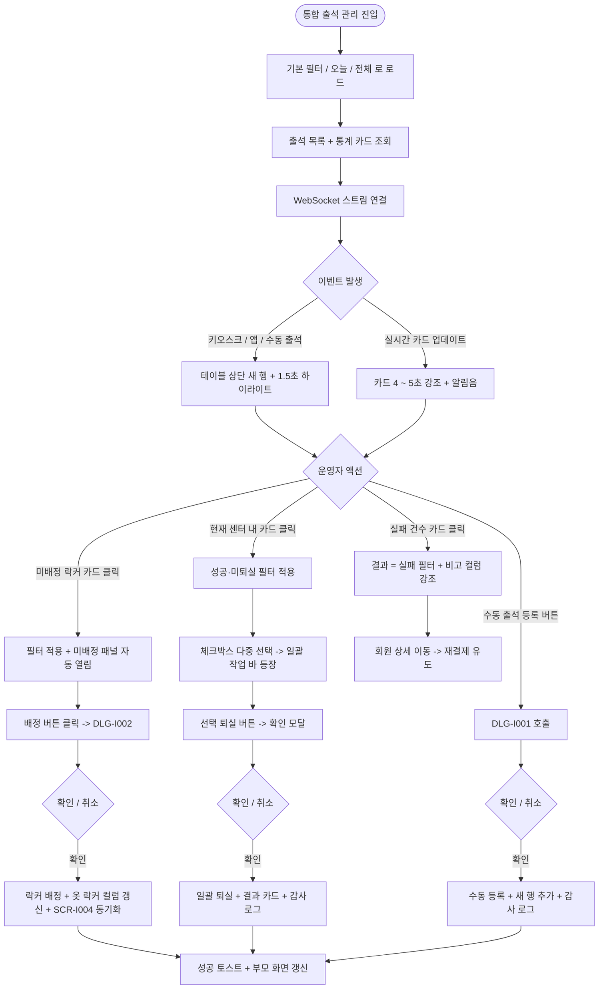

# SCR-I001 통합 출석 관리 페이지

## 1. 화면 메타 정보

이 문서는 통합 출석 관리 페이지에 대한 자기완결형 요구사항 정의서입니다. 다른 문서를 함께 보지 않아도 이 문서 한 장만으로 통합 출석 관리 페이지에 들어가는 모든 영역, 모든 버튼, 모든 모달, 모든 권한, 모든 예외 처리, 그리고 이 화면을 지탱하는 운영 정책까지 전부 이해하고 구현할 수 있도록 작성합니다.

| 항목 | 값 |
|---|---|
| 작성일 | 2026-05-22 |
| 버전 | v1.0 |
| 상태 | 최신 통합본 반영 (D11 재번호화 SCR-H1101 -> SCR-I001 완료) |
| 도메인 | D11 통합운영 |
| 화면 ID | SCR-I001 |
| 이전 ID | SCR-H1101 통합출석현황 |
| 화면명 | 통합 출석 관리 |
| 화면 유형 | 허브 화면 (Hub Screen) |
| 라우트 (URL) | `/attendance` |
| 플랫폼 | 데스크톱(기본), 태블릿, 모바일(제한 모드) |
| 우선순위 | P0 (출시 필수) |
| 기능코드 | IoT-07 (통합 출석 관리) |
| 계약코드 | RSV-04 (출결 처리 정본) |
| 계약 상태 | 계약 범위 본기능 |
| 부모 기능 prefix | IoT |
| Lv1 코드 | IoT-07 |
| Lv2 / Lv3 세분화 | IoT-07-01 ~ IoT-07-09 (통계 카드, 필터 영역, 출석 테이블, 수동 출석 등록, 행 액션, 키오스크 모니터, 실패 로그, 외부 연동, 실시간 출석 확인 카드) |
| 연계 화면 | SCR-I002 키오스크 설정, SCR-I003 IoT 연동 관리, SCR-I004 옷 락커 운영 관리, SCR-I007 회원 건강 요약, SCR-I008 키오스크 운영 현황, SCR-MA-111 회원앱 출석 이력, SCR-097 감사 로그, SCR-M004 회원 상세 |
| 호출 다이얼로그 | DLG-I001 수동출석등록, DLG-I002 옷락커배정 |
| 연계 키오스크 화면 | KIO-001 대기, KIO-101 ~ KIO-105 인증 채널, KIO-201 출석 결과 |

## 2. 화면 개요와 목적

통합 출석 관리 페이지는 회원·직원·게스트의 출석 현황을 단일 화면에서 실시간으로 통합 조회·관리하는 D11 통합운영 도메인의 첫 진입점이자 핵심 허브 화면입니다. 키오스크 QR / RFID / 얼굴인식 / 키오스크 바코드 / 키오스크 전화번호 / 회원앱 QR / 수동 입력의 7종 채널에서 발생한 모든 출석 이벤트를 동일한 데이터 모델로 집계하여, 운영자가 입장·퇴실·실패·중복·미배정 락커를 한눈에 파악하도록 합니다. 본 화면은 출석 그 자체뿐만 아니라 출석 후 후속 처리(옷 락커 배정·퇴실 처리·실패 사유 점검·재결제 유도)까지 한 화면에서 흐름이 끊기지 않도록 설계되었습니다.

이 화면이 다루는 운영 흐름은 매우 다양합니다. 프런트 매니저는 평일 06:00 ~ 09:00 / 18:00 ~ 22:00 러시아워에 키오스크와 앱 QR 출석이 동시 폭주하는 상황에서 미배정 락커와 실패 건을 실시간 감지하여 대응하고, 키오스크 KIO-103에서 얼굴인식 실패가 반복되는 회원을 즉시 식별해 수동 등록·재등록 안내를 진행합니다. 키오스크 정책의 "중복 출석 방지 시간(기본 10분)"에 걸려 실패로 기록된 회원이 실제 재방문인지 단순 재시도인지 비고로 구분하고, 만료된 회원이 키오스크에서 실패 처리되면 회원 상세로 이동해 재결제를 안내합니다. PT 강사 출퇴근 관리, 마감 시간 임박 시 "현재 센터 내" 카드 클릭으로 입장 후 미퇴실 회원 일괄 식별, 본사 통합 모드의 전 지점 출석 추이 비교, 키오스크 장애 시 수동 출석으로 보완하는 흐름까지 모두 이 한 화면에서 처리됩니다.

따라서 이 화면은 단순한 데이터 테이블이 아니라, 키오스크 단말 정책(SCR-I002) · IoT 게이트 이벤트(SCR-I003) · 옷 락커 상태(SCR-I004) · 회원앱 출석 이력(SCR-MA-111) · 본사 통합 모드 BI까지 모두 반영된 운영 허브로 동작해야 합니다.

## 3. 진입 경로와 인접 화면

통합 출석 관리 페이지에 진입하는 경로는 여러 가지이며, 각 경로마다 진입 직후 화면의 초기 상태가 달라집니다.

첫 번째 경로는 사이드바입니다. 좌측 사이드바의 "통합운영" 메뉴 아래 "통합 출석 관리" 항목을 클릭하면 진입합니다. URL은 단순히 `/attendance`가 되고, 화면은 기본 상태(기간 = 오늘, 구분 = 전체, 결과 = 전체, 채널 = 전체)로 시작하며 시간 내림차순으로 정렬됩니다.

두 번째 경로는 대시보드의 출석 지표 카드 클릭입니다. SCR-101 대시보드에서 "오늘 총 출석", "현재 센터 내", "미배정 락커", "실패 건수" 카드를 클릭하면 통합 출석 관리 페이지로 이동하면서 그 카드에 대응하는 필터가 URL 쿼리 파라미터로 자동 적용된 상태로 진입합니다. 예를 들어 "미배정 락커" 카드를 누르면 `/attendance?locker=unassigned`처럼 미배정 락커 회원만 보이는 상태로 열립니다.

세 번째 경로는 알림 센터(SCR-104)의 운영 알림 클릭입니다. "오늘 키오스크 실패 30건", "마감 시간 임박 미퇴실 12명" 같은 알림을 클릭하면 해당 회원군 필터가 자동 적용됩니다.

네 번째 경로는 SCR-I008 키오스크 운영 현황의 "최근 체크인 이벤트" 카드에서 특정 키오스크의 이벤트를 클릭하는 경우로, 해당 키오스크에서 발생한 출석만 필터링한 상태로 진입합니다.

다섯 번째 경로는 SCR-I004 옷 락커 운영 관리의 "미배정 회원 보기" 패널에서 회원을 클릭한 경우로, 해당 회원의 오늘 출석 행을 강조 표시한 상태로 진입합니다.

이 화면에서 빠져나가는 인접 화면으로는, 회원 행 클릭으로 진입하는 회원 상세(SCR-M004), 행 액션의 락커 배정 버튼으로 호출되는 DLG-I002 옷락커배정 다이얼로그, 헤더의 수동 출석 등록 버튼으로 호출되는 DLG-I001 수동출석등록 다이얼로그, 키오스크 모니터 패널에서 단말 점검으로 이동하는 SCR-I003 IoT 연동 관리, 키오스크 설정 변경이 필요할 때 이동하는 SCR-I002 키오스크 설정, 출석 정책 위반 사후 추적 시 이동하는 SCR-097 감사 로그가 있습니다.

## 4. 레이아웃과 UI 구성

통합 출석 관리 페이지는 위에서 아래로 차곡차곡 쌓이는 세로형 단일 컬럼 레이아웃을 기본으로 합니다. 데스크톱에서는 가로 폭이 충분하므로 우측 키오스크 모니터 패널이 슬라이드 인 될 때 본문 가로폭이 자동으로 축소됩니다. 태블릿에서는 본문 가로폭을 유지하면서 패널이 오버레이로 뜨고, 모바일에서는 통계 카드와 필터를 카드형 리스트로 자동 전환합니다. 화면은 위에서부터 다음 영역들이 순서대로 배치됩니다.

가장 위에는 페이지 헤더가 있습니다. 헤더 좌측에는 "통합 출석 관리"라는 페이지 타이틀과 함께, 현재 조회 중인 지점이 "전체 지점(통합)"인지 특정 지점인지를 알려주는 지점 컨텍스트 배지가 따라옵니다. 본사 통합 모드일 때는 배지 옆에 지점 선택 드롭다운이 노출됩니다. 헤더 우측에는 "수동 출석 등록", "실패 로그", "키오스크 모니터" 세 개의 버튼이 일렬로 배치되며, 권한별로 노출이 분기됩니다.

페이지 헤더 바로 아래에는 상단 통계 카드 4개가 가로로 배치됩니다. 첫 번째 카드는 "오늘 총 출석"으로 회원과 직원과 게스트의 합산 입장 수를 보여주며, 클릭 시 결과 = 전체, 기간 = 오늘 필터가 자동 적용됩니다. 두 번째 카드는 "현재 센터 내"로 입장 후 퇴실 미처리 인원 수를 보여주며, 클릭 시 결과 = 성공·미퇴실 필터가 자동 적용되어 마감 시간 임박 시 일괄 퇴실 처리의 진입점이 됩니다. 세 번째 카드는 "미배정 락커"로 출석은 완료됐으나 옷 락커 미배정 인원 수를 보여주며, 클릭 시 락커 = 미배정 필터가 적용되고 동시에 우측 미배정 회원 패널이 자동으로 펼쳐집니다. 네 번째 카드는 "실패 건수"로 금일 출석 실패(만료·중복·미등록·미수금) 건수를 보여주며, 클릭 시 결과 = 실패 필터가 적용됩니다. 통계 카드는 출석 이벤트가 들어올 때마다 실시간으로 카운트업되며, 깜빡임을 막기 위해 5초 디바운스가 적용됩니다.

상단 통계 카드 아래에는 실시간 출석 확인 카드 영역이 있습니다. 이 영역은 SCR-101 대시보드의 FC 동일인 확인 카드와 동일한 위젯으로, 최근 출석한 회원을 카드 단위로 최대 10개까지 표시합니다. 카드에는 회원 사진 또는 기본 아바타, 이름, 회원번호, 성별·나이, 보유 이용권, 만료일, 출석 시각, 출석 채널이 표시되고, 만료·만료 임박·미수금·중복·이용권 없음·사진 미등록 같은 주의 태그가 카드 상단에 색상 배지로 떠 있습니다. 동일 회원이 첫 출석 후 2시간 이내에 재출석할 경우 새 카드가 생성되지 않고 기존 카드가 갱신되며, 카드가 10개를 초과하면 가장 먼저 출석한 카드부터 자동으로 제거됩니다. 신규 이벤트가 발생할 때는 카드가 4 ~ 5초간 강조되고 알림음이 1회 재생되며 우측 상단에 토스트가 함께 뜹니다. 사진이 미등록된 회원은 기본 아바타로 표시되고 카드 하단에 "사진 필요" 태그와 함께 FC에게 현장 사진 촬영을 요청하는 토스트가 노출됩니다. 카드를 클릭하면 SCR-M004 회원 상세의 기본정보 탭으로 이동합니다.

실시간 카드 영역 아래에는 필터 바가 있습니다. 가장 왼쪽에는 통합 검색창이 있고, 회원 이름·연락처·회원번호·사번을 동시에 OR 조건으로 검색할 수 있습니다. 검색은 입력 후 300ms 디바운스가 적용되며 최소 2자 이상 입력해야 검색이 시작됩니다. 검색창 오른쪽에는 필터 드롭다운이 차례대로 배치됩니다. 기간 필터는 오늘(기본값) · 이번 주 · 이번 달 · 직접 선택의 4종이고, 구분 필터는 전체 · 회원 · 직원 · 게스트의 4종(게스트는 정책 ON 지점에서만 노출), 결과 필터는 전체 · 성공 · 실패 · 중복 · 퇴실의 5종, 채널 필터는 앱 QR · 키오스크 QR · 키오스크 RFID · 얼굴인식 · 키오스크 바코드 · 키오스크 전화번호 · 수동의 7종, 락커 상태 필터는 전체 · 미배정 · 수동배정 · 자동배정 · 대상 아님의 5종입니다. 적용된 필터는 검색 바 아래에 칩 형태로 표시되며 X 버튼으로 개별 제거하거나 "전체 해제" 링크로 일괄 초기화할 수 있습니다.

필터 바 아래에는 출석 테이블이 있습니다. 테이블의 컬럼은 좌측부터 선택 체크박스, 시간, 구분, 이름, 채널, 결과, 옷 락커, 고정 락커, 비고, 행 액션 순서로 배치됩니다. 시간 컬럼은 입장 시각을 HH:mm:ss 형식으로 표시하고 기본 정렬은 시간 내림차순(최신 상단)이며 사용자가 정렬을 변경할 수 있습니다. 구분 컬럼은 회원·직원·게스트 배지로 색상 분기되고, 이름 컬럼은 이름과 회원번호 또는 사번이 함께 표시됩니다. 채널 컬럼은 7종 채널 중 하나를 텍스트로 노출하고, 결과 컬럼은 성공(녹색)·실패(빨강)·중복(노랑)·퇴실(회색) 배지로 분기됩니다. 옷 락커 컬럼은 미배정(주황)·수동배정(번호)·자동배정(번호)·대상 아님(회색)으로 분기되어 키오스크 설정 SCR-I002의 락커 후처리 정책이 그대로 반영됩니다. 고정 락커 컬럼은 회원이 고정 락커를 보유하면 락커 번호를, 없으면 "-"를 표시합니다. 비고 컬럼은 실패 사유(이용권 만료·미등록·중복·미수금 N원·직원 출석 불가·얼굴인식 시간 초과·허용 시간 외) 또는 수동 등록 사유 메모가 표시됩니다.

WebSocket으로 신규 출석 이벤트가 들어오면 테이블 상단에 새 행이 슬라이드 다운으로 추가되고 1.5초 동안 노란색 하이라이트가 적용되어 운영자의 시선을 끕니다. 운영자가 다른 행을 보고 있는 동안에는 자동 스크롤이 일어나지 않습니다.

테이블 우측에는 미배정 회원 패널이 있습니다. 평소에는 접혀 있고, "미배정 락커" 통계 카드를 클릭하거나 헤더의 "미배정 회원 보기" 토글을 누르면 슬라이드 인으로 펼쳐집니다. 패널에는 출석 완료 + 옷 락커 미배정 회원 목록이 표시되며, 컬럼은 회원명, 출석 시각, 회원권 유형(일반·VIP 등), 배정 버튼입니다. 배정 버튼을 누르면 DLG-I002 옷락커배정 다이얼로그가 열립니다.

헤더의 "키오스크 모니터" 버튼을 누르면 우측에 키오스크 모니터 패널이 슬라이드 인 됩니다. 이 패널은 최근 5분 동안 발생한 키오스크 이벤트(KIO-201 출석 결과 분기)를 단말별로 표시하며, 5초 주기로 자동 새로고침됩니다. 이벤트 카드를 클릭하면 해당 행이 테이블에서 하이라이트되며 화면이 자동으로 스크롤됩니다.

페이지 하단에는 페이지네이션 영역이 있습니다. 좌측에는 페이지당 표시 건수 드롭다운(20·50·100), 가운데에는 페이지 번호 이동 컨트롤, 우측에는 "총 N건" 합계와 마지막 동기화 시각이 표시됩니다. 페이지당 건수와 현재 페이지 번호 모두 URL 쿼리 파라미터로 보존됩니다.

## 5. 탭 구성과 탭별 동작

이 화면은 별도 탭이 없는 단일 뷰입니다. 대신 통계 카드 클릭과 필터 칩 조합으로 데이터를 좁혀 들어가는 방식을 사용합니다. 통계 카드는 4개로 고정되어 있고, 통계 카드 외에 운영 보기 탭이나 저장 뷰 탭은 별도로 두지 않는 것이 이 화면의 설계 의도입니다. 운영자가 "현재 센터 내", "미배정 락커", "실패 건수" 통계 카드를 누르면서 자연스럽게 그 흐름을 따라가게 만드는 단순한 깊이를 선택했습니다.

다만 헤더의 "실패 로그" 버튼은 결과 = 실패 필터를 자동 적용한 상태로 화면을 다시 그리는 단축키 역할을 하며, 시각적으로는 탭 전환과 유사한 동작을 합니다. "실패 로그" 버튼을 다시 누르면 결과 필터가 해제되어 전체로 복귀합니다.

본사 통합 모드에서는 헤더 좌측의 지점 선택 드롭다운이 가상의 1차 분기 탭처럼 동작합니다. 지점을 바꾸면 데이터 fetch가 새로 일어나고 통계 카드와 테이블이 모두 재계산되며, 검색·필터·정렬은 그대로 유지됩니다. 다만 본사 통합 모드 사용자가 수동 출석 등록이나 퇴실 같은 변경 액션을 시도하면 "지점 선택 후 등록 가능합니다" 안내가 표시되고 차단됩니다.

## 6. 버튼·아이콘·링크 액션 전체 정의

이 화면에 등장하는 모든 클릭 가능한 요소를 빠짐없이 정의합니다.

상단 통계 카드 4개는 모두 클릭 가능합니다. "오늘 총 출석" 카드를 누르면 결과 = 전체, 기간 = 오늘 필터가 적용되고 다른 필터는 유지됩니다. "현재 센터 내" 카드를 누르면 결과 = 성공·미퇴실 필터가 적용되어 마감 시간 임박 시 일괄 퇴실의 진입점이 됩니다. "미배정 락커" 카드를 누르면 락커 = 미배정 필터가 적용되고 동시에 우측 미배정 회원 패널이 자동으로 펼쳐지면서 본문 가로폭이 축소됩니다. "실패 건수" 카드를 누르면 결과 = 실패 필터가 적용됩니다. 어떤 카드를 누르든 페이지는 1페이지로 리셋되고 체크박스 선택은 해제됩니다.

실시간 출석 확인 카드 영역의 각 카드는 클릭 시 SCR-M004 회원 상세의 기본정보 탭으로 이동합니다. 게스트 카드는 회원 ID가 없으므로 클릭이 비활성화되고 토스트로 "회원으로 등록되지 않은 게스트입니다"가 표시됩니다.

헤더의 "수동 출석 등록" 버튼은 DLG-I001 수동출석등록 다이얼로그를 호출합니다. 본사 통합 모드에서는 비활성화되고 "지점 선택 후 등록 가능합니다" 툴팁이 표시됩니다. 강사·readonly 권한에서는 버튼이 화면에 보이지 않습니다.

헤더의 "실패 로그" 버튼은 결과 = 실패 필터를 자동 적용하고 비고 컬럼에 실패 사유가 잘 보이도록 컬럼 폭을 자동 조정합니다. 다시 누르면 필터가 해제됩니다.

헤더의 "키오스크 모니터" 버튼은 우측에 키오스크 모니터 사이드 패널을 펼치거나 접습니다. 패널은 5초 주기로 자동 갱신되며, 이벤트 카드 클릭 시 해당 행이 테이블에서 하이라이트됩니다.

테이블 각 행의 행 액션은 결과 값과 권한에 따라 다르게 노출됩니다. 결과 = 성공인 행에는 "퇴실 처리" 버튼이 노출되고, 누르면 확인 모달 후 결과 컬럼이 "퇴실"로 즉시 전환됩니다. 옷 락커 = 미배정인 행에는 "락커 배정" 버튼이 노출되고, 누르면 DLG-I002 옷락커배정 다이얼로그가 열립니다. 회원 구분의 행을 클릭하면 SCR-M004 회원 상세로 이동하며, 게스트와 직원의 경우 행 클릭이 비활성화됩니다.

선택 체크박스가 한 명 이상 선택되면 화면 하단에 일괄 작업 바가 슬라이드 업으로 등장합니다. 일괄 작업 바에는 "n명 선택됨"이라는 표시와 함께 "전체 해제" 버튼, "선택 퇴실" 버튼이 있습니다. 선택 퇴실 버튼은 매니저 이상 권한에서만 활성화되며, 누르면 "선택한 n명을 퇴실 처리합니다. 계속하시겠습니까?"라는 확인 모달이 뜬 뒤 일괄 처리됩니다. 부분 실패가 발생하면 결과 카드와 실패 리포트가 표시됩니다.

페이지네이션의 페이지당 건수 드롭다운은 20·50·100 중 선택하며 즉시 재조회됩니다. 페이지 번호 이동 컨트롤은 이전·다음 버튼과 직접 입력을 모두 지원합니다.

모든 버튼은 클릭 후 응답이 돌아오기 전까지 자동으로 비활성화되어 더블클릭과 연타로 인한 중복 요청을 차단합니다. 수동 등록·일괄 퇴실·락커 배정 같은 변경 액션 중에는 진행 스피너가 표시되고, 같은 작업의 중복 트리거를 막기 위해 같은 버튼이 재활성화될 때까지 다른 변경 버튼도 비활성 상태로 유지됩니다.

## 7. 호출되는 모달 동작

이 화면에서 호출되는 모달은 두 가지이며, 각각의 트리거·입력·확인 후 부모 화면의 변화가 정의됩니다.

### 7-1. DLG-I001 수동 출석 등록 다이얼로그

수동 출석 등록 다이얼로그는 키오스크 장애, 얼굴인식 실패 반복, 회원앱 미설치 회원, 게스트 방문, 직원 출퇴근 누락 같은 상황에서 관리자가 직접 출석을 입력하는 모달입니다. 헤더의 "수동 출석 등록" 버튼으로 열립니다.

모달 상단에는 "수동 출석 등록"이라는 제목이 표시되고, 그 아래에 입력 항목이 배치됩니다. 구분(회원·직원)을 라디오 또는 토글로 선택한 뒤, 이름·회원번호·사번 자동완성 검색창에서 대상자를 선택합니다. 검색은 최소 2자 이상 입력 시 300ms 디바운스로 동작하며, 검색 결과가 0건이면 "검색 결과가 없습니다" 안내와 함께 신규 회원 등록 화면 진입 링크가 노출됩니다. 출석 시각은 기본값이 현재 시각이며, 미래 시각은 입력 차단됩니다. 비고 입력란은 선택이며 수동 등록 사유 메모 용도로 사용됩니다.

확인을 누르면 모달이 로딩 상태가 되고 백엔드에 등록 요청이 전송됩니다. 성공하면 모달이 닫히고 부모 화면의 출석 테이블 상단에 새 행이 추가되어 1.5초 동안 하이라이트되며, "출석이 등록되었습니다" 토스트가 노출됩니다. 횟수권을 가진 회원은 이용 횟수가 자동으로 차감됩니다. 동일 회원·동일 분 단위 시각에 이미 출석 데이터가 있으면 결과 = 중복으로 저장되고 "이미 같은 시각에 출석 데이터가 있습니다" 안내가 표시됩니다. 영업시간 외 처리는 본사 정책으로 차단되며, 사유를 추가로 입력해야 슈퍼관리자 승인 요청이 발송됩니다.

권한 분기는 매니저는 회원 수동 등록만, 직원 수동 등록은 owner 이상 권한이 필요합니다. 강사·readonly는 진입조차 불가하며 헤더 버튼이 보이지 않습니다.

### 7-2. DLG-I002 옷 락커 배정 다이얼로그

옷 락커 배정 다이얼로그는 출석 완료 후 옷 락커가 미배정 상태인 회원에게 빈 락커를 배정하는 모달입니다. 미배정 회원 패널의 "배정" 버튼이나 출석 테이블 각 행의 "락커 배정" 버튼으로 열립니다.

모달 상단에는 "옷 락커 배정"이라는 제목과 함께 대상 회원의 정보가 읽기 전용으로 표시됩니다. 회원명, 출석 시각, 회원권 유형(일반·VIP 등), 보유 중인 고정 락커 번호(있는 경우)가 한 줄로 노출됩니다. 그 아래에 빈 락커 목록이 번호 순으로 그리드 형태로 표시되며, 빈 락커는 선택 가능, 사용 중 락커는 회색 처리, 점검 중 락커는 경고 색상으로 선택 불가 상태가 됩니다. 락커 번호를 클릭하면 선택 상태가 강조되고 하단의 "배정" 버튼이 활성화됩니다.

배정을 누르면 모달이 로딩 상태가 되고, 성공 시 모달이 닫히면서 부모 화면 출석 테이블의 옷 락커 컬럼이 "수동배정(번호)"로 즉시 갱신됩니다. SCR-I004 옷 락커 운영 관리의 락커 그리드도 실시간 동기화되어 해당 락커가 "사용 중" 상태로 전환됩니다. 빈 락커가 0개인 경우 그리드 자리에 "배정 가능한 락커가 없습니다" 안내가 표시되며 "배정" 버튼이 비활성화됩니다.

권한 분기는 owner·manager·staff에서 락커 배정 가능, 강사·readonly는 진입 불가입니다.

## 8. 토스트와 확인 팝업과 알럿

통합 출석 관리 페이지에서 발생하는 모든 알림성 UI는 다음 패턴으로 동작합니다.

성공 토스트는 우측 상단에 녹색 계열로 5초간 표시되며, "출석이 등록되었습니다", "락커가 배정되었습니다", "퇴실 처리되었습니다", "n명의 출석을 처리했어요", "선택한 n명을 퇴실 처리했어요" 같은 짧은 문구로 결과를 알려줍니다. 실시간 출석 확인 카드의 신규 카드 생성 시에는 알림음이 1회 함께 재생됩니다.

실패 토스트는 빨강 계열로 표시되며, "출석 등록에 실패했어요", "권한이 없어요", "지점 선택 후 등록 가능합니다", "현재 시각 이후로는 등록할 수 없습니다", "이미 같은 시각에 출석 데이터가 있습니다", "영업시간 외 처리는 본사 정책으로 차단되었습니다", "동시 처리 충돌이 발생했어요. 잠시 후 다시 시도해주세요" 같은 문구가 표시됩니다.

부분 결과 알림은 일괄 퇴실 같은 작업이 완료되었을 때 결과 카드 형태로 화면 중앙 하단에 머무릅니다. "성공 N건 / 실패 M건"으로 두 가지 숫자가 동시에 표시되며, 본사 통합 모드의 일괄 퇴실은 회원의 실제 `branchId` 기준으로 분산 저장된 결과가 지점별로 그루핑되어 노출됩니다.

확인 팝업은 단순 yes/no 형태로, 행 액션의 "퇴실 처리" 버튼을 눌렀을 때 "이 회원을 퇴실 처리하시겠습니까?"가 뜨고, 일괄 작업 바의 "선택 퇴실"을 눌렀을 때 "선택한 n명을 퇴실 처리합니다. 계속하시겠습니까?"가 뜹니다.

알럿은 시스템 메시지로, 권한 없는 계정이 URL로 접근했을 때 페이지 본문이 가려지고 "이 화면에 접근할 권한이 없습니다. 3초 후 대시보드로 이동합니다"라는 차단형 메시지가 표시됩니다. WebSocket 연결이 끊겼을 때는 화면 상단에 노란 배너로 "실시간 연결 끊김 - 30초 폴링으로 동작 중"이라는 안내가 떠 있고, 재연결되면 자동으로 사라집니다.

## 9. 데이터 흐름과 외부 연동

이 화면은 여러 데이터 소스와 외부 연동에 의존합니다.

화면 진입 시 출석 목록 조회 API `GET /api/attendance`가 호출됩니다. 요청에는 기간, 구분, 결과, 채널, 락커 상태, 검색어, 페이지 번호, 페이지당 건수, 정렬 기준이 쿼리 파라미터로 들어가고, 본사 통합 모드일 때는 `branchId`가 빠지거나 `all`로 전달됩니다. 응답으로는 출석 배열, 총 건수, 페이지 정보와 함께 4개 통계 카드의 카운트(`/api/attendance/stats/today`)가 동시에 내려옵니다.

WebSocket 출석 스트림은 `WS /api/attendance/stream`으로 연결되며, 키오스크·앱·수동 출석 이벤트가 발생할 때마다 클라이언트에 즉시 푸시됩니다. 끊김이 발생하면 자동 재연결을 3회 시도한 후 30초 폴링으로 fallback하며, 노란 배너로 운영자에게 알립니다.

키오스크 모니터 패널은 `GET /api/attendance/recent-kiosk-events`를 5초 주기로 호출해 최근 5분 동안의 키오스크 이벤트를 새로 받아옵니다. KIO-201의 결과 분기(성공·만료·미등록·중복·미수금·직원불가·얼굴인식 시간 초과)가 그대로 반영됩니다.

수동 출석 등록은 `POST /api/attendance/manual`을 호출하며, 일괄 퇴실은 `POST /api/attendance/bulk-checkout`, 단일 퇴실은 `POST /api/attendance/:id/checkout`을 호출합니다. 옷 락커 배정은 SCR-I004의 `POST /api/lockers/clothing/:id/assign`을 호출하고, 응답 결과가 본 화면 테이블에 실시간으로 반영됩니다.

키오스크 설정 SCR-I002의 출입 규칙(중복 출석 방지 시간·만료 회원 허용·미수금 처리·직원 출석 허용·영업시간)은 본 화면의 결과 분류와 비고 자동 부여에 그대로 사용됩니다. 키오스크 단말이 본 정책을 push 또는 polling으로 수신해 KIO-201에서 실행하고, 그 결과가 본 화면 테이블에 적재되는 구조입니다.

키오스크 설정 SCR-I002의 락커 후처리 정책(출석만 / 수동 배정 대기 / 자동 배정 시도)은 본 화면의 옷 락커 컬럼에 그대로 반영됩니다. "자동 배정 시도" 정책이 활성화되어 있는 경우 출석 완료 직후 자동 배정 로직이 SCR-I002의 자동 배정 존에서 빈 락커를 찾아 배정하고, 결과가 옷 락커 컬럼에 "자동배정(번호)"로 표시됩니다. 자동 배정 실패 시에는 미배정 상태로 표시되고 키오스크에는 SCR-I002의 미배정 안내 문구가 그대로 노출됩니다.

회원앱 SCR-MA-111 출석 이력은 본 화면과 동일한 데이터 원천을 사용하므로, 키오스크나 관리자에서 등록된 출석 이벤트는 회원앱 출석 이력에도 즉시 노출됩니다.

모든 수동 등록·퇴실·락커 배정은 감사 로그 SCR-097에 비동기로 INSERT됩니다. 기록 필드는 `actor_id`(운영자 ID), `target_member_id` 또는 `target_staff_id`, `action`(MANUAL_ATTEND·CHECKOUT·BULK_CHECKOUT·LOCKER_ASSIGN), `attendance_id`, `reason`, `timestamp`입니다. 감사 로그 INSERT는 작업 결과 응답이 사용자에게 돌아간 후 5초 안에 보장됩니다.

알림 센터 NFR-19는 미배정 락커 임계 초과(예: 10명 이상), 키오스크 단말 오프라인 감지(SCR-I003 heartbeat 미수신 5분 초과), 마감 시간 임박 미퇴실 회원 다수 같은 운영 이벤트를 운영자에게 푸시합니다. 마감 시간 자동 퇴실 정책이 ON으로 설정된 지점은 운영 시간 종료 후 N분이 지나면 시스템이 자동으로 미퇴실 회원을 일괄 퇴실 처리하며, 처리 결과가 본 화면에 실시간 반영됩니다.

일별 출석 KPI 배치는 매일 23:59에 실행되어 지점별 채널 분포·실패율·미배정률을 집계해 본사 운영 보고 데이터를 갱신합니다. 이 결과는 본사 통합 BI 대시보드에서 조회됩니다.

화면에서 호출하는 주요 API 엔드포인트는 다음과 같습니다. 출석 목록 조회 `GET /api/attendance`, 통계 카드 카운트 `GET /api/attendance/stats/today`, 실시간 스트림 `WS /api/attendance/stream`, 수동 등록 `POST /api/attendance/manual`, 단일 퇴실 `POST /api/attendance/:id/checkout`, 일괄 퇴실 `POST /api/attendance/bulk-checkout`, 최근 키오스크 이벤트 `GET /api/attendance/recent-kiosk-events`.

## 10. 화면 상태와 예외 처리

통합 출석 관리 페이지는 다음 상태들을 가질 수 있고, 각 상태마다 사용자에게 보이는 모습이 달라집니다.

로딩 중 상태에서는 통계 카드와 실시간 카드와 테이블 자리에 스켈레톤이 표시됩니다. 헤더의 버튼들은 미리 렌더되지만 상호작용은 잠시 막혀 있습니다.

정상 목록 상태는 200 응답과 함께 출석 데이터가 한 건 이상 존재할 때 표시되는 가장 일반적인 상태입니다. 통계 카드, 실시간 카드, 테이블이 모두 데이터로 채워지고 페이지네이션이 활성화됩니다.

빈 상태는 어떤 필터도 적용되지 않은 상태에서 해당 기간 출석이 0건인 경우입니다. "해당 기간 출석 없음" 안내와 기간 필터 조정 안내가 표시되며, 헤더의 "수동 출석 등록" CTA가 강조됩니다.

필터 결과 없음 상태는 검색이나 필터를 적용한 결과가 0건일 때 표시됩니다. "조건에 맞는 데이터가 없습니다" 안내와 함께 "필터 초기화" 버튼이 표시됩니다.

실시간 업데이트 중 상태는 WebSocket 이벤트가 들어와 새 행이 추가되는 순간의 상태로, 새 행이 1.5초간 노란색으로 하이라이트되며 동시에 실시간 카드 영역에도 새 카드가 4 ~ 5초간 강조됩니다.

WebSocket 끊김 상태에서는 화면 상단에 노란 배너 "실시간 연결 끊김 - 30초 폴링으로 동작 중"이 떠 있고 30초 폴링으로 데이터가 갱신됩니다. 재연결 시 배너가 자동으로 사라집니다.

오류 상태는 서버 5xx 또는 네트워크 타임아웃 시 표시됩니다. 화면 중앙에 큰 에러 아이콘과 "데이터를 불러오지 못했어요" 메시지, "다시 시도" 버튼이 표시되며 자동 재시도가 1회까지 백그라운드에서 진행됩니다.

접근 불가 상태는 권한 없는 계정이 직접 URL로 접근했을 때 표시됩니다. 페이지 본문이 가려지고 3초 카운트다운 후 대시보드로 자동 이동됩니다.

본사 통합 모드 조회 전용 상태에서는 수동 출석 등록·퇴실·락커 배정 같은 변경 액션 버튼이 비활성화되고 클릭 시 "지점 선택 후 등록 가능합니다" 안내가 표시됩니다.

미배정 락커 패널 열림 상태에서는 본문 가로폭이 약 70% 정도로 축소되면서 우측 30% 폭의 미배정 회원 패널이 슬라이드 인 됩니다. 키오스크 모니터 패널이 동시에 열리면 두 패널이 세로로 쌓이거나 본문이 더 좁아집니다.

예외 케이스별 처리는 다음과 같이 정의됩니다.

만료 회원이 키오스크에서 출석을 시도하면 키오스크 설정 SCR-I002의 "만료 회원 허용"이 OFF인 경우 결과 = 실패, 비고 = "이용권 만료"로 본 화면에 적재됩니다. 행 우측에 회원 상세 이동 버튼이 강조되고, 재결제 유도 흐름의 진입점이 됩니다.

중복 출석은 키오스크 설정의 중복 방지 시간(기본 10분) 내 동일 회원 재체크인이며 결과 = 중복으로 분리 적재됩니다. 비고에 "이전 체크인 후 X분 경과"가 자동 기재되어 실패와 별도 카운트됩니다.

미등록 회원의 키오스크 출석 시도는 결과 = 실패, 비고 = "미등록"으로 적재되며, 회원 상세 이동이 불가하므로 헤더의 "수동 출석 등록"으로 안내됩니다.

미수금 회원은 키오스크 설정의 미수금 처리 정책에 따라 분기됩니다. "차단" 정책이면 결과 = 실패, "경고" 정책이면 결과 = 성공으로 적재되며 비고에 미수금 금액이 표시되어 결제 유도의 근거가 됩니다.

직원 출석 허용 OFF 상태에서 직원이 키오스크로 출석을 시도하면 결과 = 실패, 비고 = "직원 출석 불가"로 적재됩니다.

얼굴인식 시간 초과(SCR-I002의 `ka.face.stillSec` 미충족)는 결과 = 실패, 비고 = "얼굴인식 시간 초과"로 적재되며 회원 얼굴 데이터 재등록 안내의 근거가 됩니다.

영업시간 외 출석 시도는 결과 = 실패, 비고 = "허용 시간 외"로 적재됩니다.

수동 등록 시 미래 시각 입력은 인라인 차단되고, 동일 분 단위 중복은 결과 = 중복으로 저장됩니다.

WebSocket 연결 끊김은 30초 폴링으로 자동 fallback되며, 끊김이 5분 이상 지속되면 슈퍼관리자에게 디버그 알림이 발송됩니다.

본사 통합 모드의 수동 등록·퇴실 시도는 차단되며 "지점 선택 후 등록 가능" 안내가 표시됩니다.

마감 시간 후 출석 시도는 결과 = 실패, 비고 = "허용 시간 외"로 자동 분류되고, 사유 입력 후 슈퍼관리자 승인을 받으면 강제 처리가 가능합니다.

퇴실 처리 후 같은 일자 두 번째 입장은 중복이 아니라 결과 = 성공의 새 행으로 적재됩니다.

게스트 출석은 정책 ON 지점에서만 표시되며, 락커 = 대상 아님으로 고정 표시됩니다.

동시 퇴실 처리 시 lock 충돌이 발생하면 "잠시 후 다시 시도" 안내가 표시되고 한 번 더 재시도가 가능합니다.

## 11. 권한별 처리

이 화면은 권한에 따라 진입 가능 여부, 보이는 영역, 가능한 액션이 모두 달라집니다.

superAdmin와 primary는 모든 지점의 출석 현황을 조회할 수 있습니다. 헤더의 지점 선택 드롭다운으로 단일 지점을 골라야 수동 등록·퇴실·락커 배정 같은 변경 액션이 가능하며, 전체 통합 모드에서는 조회만 됩니다. 본사 통합 모드 BI 비교, 본사 정책 점검, 단말 분산 패턴 분석에 사용합니다.

Owner(지점장)은 자기 지점의 출석 현황을 조회·변경할 수 있습니다. 회원·직원·게스트 수동 등록, 단일 퇴실, 일괄 퇴실, 락커 배정, 회원 상세 이동, 키오스크 모니터 조회, 실패 로그 조회까지 모든 기능을 사용할 수 있습니다.

매니저(manager·프런트)는 자기 지점의 출석 현황을 조회·변경할 수 있지만, 직원 수동 등록은 owner 이상 권한이 필요하므로 DLG-I001 다이얼로그의 구분 라디오에서 "직원" 옵션이 비활성화됩니다. 회원 수동 등록, 단일 퇴실, 일괄 퇴실, 락커 배정은 모두 가능합니다.

스태프(staff)는 자기 지점의 출석 현황을 조회하고 락커 배정과 단일 퇴실 처리까지 수행할 수 있습니다. 수동 출석 등록은 회원 한정으로 가능하지만 직원 수동 등록은 차단됩니다. 일괄 퇴실은 owner·manager 권한 한정입니다.

강사(trainer)는 자기 지점의 출석 현황을 조회만 할 수 있고, 본인 담당 회원의 출석이 시각적으로 강조됩니다. 모든 변경 액션이 차단되며 수동 출석 등록 버튼이 화면에 보이지 않습니다.

읽기 전용(readonly)은 출석 현황 조회만 가능하며, 모든 변경 액션이 차단됩니다.

본사 통합 모드 사용 시 본사 권한자(슈퍼관리자·primary)는 헤더의 지점 선택 드롭다운으로 단일 지점을 선택해야 변경 액션을 사용할 수 있습니다. "전체 지점(통합)" 상태에서 수동 등록이나 퇴실을 시도하면 "지점 선택 후 등록 가능합니다" 안내가 표시되고 차단됩니다. 본사 통합 모드의 일괄 처리는 회원의 실제 `branchId` 기준으로 분산 저장되어 지점별로 결과가 그루핑됩니다.

권한이 부족해서 액션이 차단된 경우의 사용자 경험은 일관됩니다. 사이드바·헤더 같은 1차 진입점에서는 메뉴 자체가 숨겨지고, 화면 내부 버튼은 권한이 부족하면 보이지 않거나 비활성화되며, 클릭 가능한 상태로 도달하더라도 백엔드 응답이 403이 되어 "권한이 없어요" 토스트가 표시됩니다. 모든 권한 차단 이벤트는 감사 로그에 기록되어 사후 추적이 가능합니다.

## 12. 메인 흐름

통합 출석 관리 페이지의 핵심 동작 흐름을 다이어그램으로 표현합니다. 사용자가 화면에 진입한 시점부터 미배정 락커 처리와 일괄 퇴실까지 이르는 가장 일반적인 정상 흐름입니다.



## 13. 에러와 예외 흐름

에러와 예외 상황에서의 분기를 별도 흐름으로 표현합니다.

```mermaid
flowchart TD
    A([출석 이벤트 / 운영자 액션]) --> B{서버 응답 / 키오스크 결과}
    B -->|5xx / timeout| C[자동 재시도 1회]
    C --> D{재시도 성공?}
    D -->|성공| E[정상 흐름 복귀]
    D -->|실패| F["데이터를 불러오지 못했어요" + 다시 시도]
    B -->|만료 회원 / 만료 허용 OFF| G[결과=실패 비고="이용권 만료"]
    G --> H[회원 상세 이동 -> 재결제]
    B -->|중복 출석 10분 내| I[결과=중복 비고="X분 경과"]
    I --> J[실패 카운트와 분리 적재]
    B -->|미등록 회원| K[결과=실패 비고="미등록"]
    K --> L[수동 출석 등록 안내]
    B -->|미수금 / 차단 정책| M[결과=실패 비고="미수금 N원"]
    B -->|미수금 / 경고 정책| N[결과=성공 비고에 미수금]
    M --> O[결제 유도]
    N --> O
    B -->|직원 출석 OFF + 직원 시도| P[결과=실패 비고="직원 출석 불가"]
    B -->|얼굴인식 stillSec 미충족| Q[결과=실패 비고="얼굴인식 시간 초과"]
    B -->|영업시간 외 시도| R[결과=실패 비고="허용 시간 외"]
    R --> S[사유 입력 + 슈퍼관리자 승인 요청]
    B -->|수동 등록 미래 시각| T[인라인 차단]
    B -->|수동 등록 동일 분 중복| U[결과=중복 + 안내 토스트]
    B -->|WebSocket 끊김| V[30초 폴링 fallback + 노란 배너]
    B -->|본사 모드 변경 시도| W["지점 선택 후 등록 가능"]
    B -->|동시 퇴실 lock 충돌| X["잠시 후 다시 시도"]
    B -->|일괄 퇴실 부분 실패| Y["성공 N / 실패 M" 결과 카드]
    B -->|권한 부족| Z["권한이 없어요" + 감사 로그]
```

## 14. 핵심 디자인 요청사항

이 화면이 운영자에게 잘 작동하려면 다음 디자인 원칙이 시각적으로 명확히 드러나야 합니다.

상단 통계 카드 4개는 한눈에 비교 가능하도록 동일 크기·동일 그리드로 배치되며, 카드 안의 숫자는 가장 큰 폰트로, 라벨은 그 아래 작은 글씨로 배치합니다. 카드 호버 시 그림자와 색상 변화로 클릭 가능함이 드러나야 하고, 통계 수치가 실시간으로 카운트업될 때는 부드러운 트랜지션을 사용해 시각적으로 부담을 주지 않습니다. "실패 건수" 카드는 다른 카드보다 약간 강한 톤(빨강·주황 계열)을 사용해 장애 우선 인지를 유도합니다.

실시간 출석 확인 카드는 카드 1장이 회원 1명을 대표하는 명함처럼 디자인되어, 사진·이름·만료일·주의 태그가 한눈에 들어와야 합니다. 카드는 4 ~ 5초간 강조될 때 부드러운 펄스 애니메이션과 함께 알림음이 동시에 재생되어 청각·시각 양쪽 채널로 새 출석을 알립니다. 만료·만료 임박·미수금 태그는 강한 색(빨강·주황)을, 사진 미등록은 약한 회색 톤으로 차별화합니다.

출석 테이블은 행 간격을 충분히 넓게, 폰트 크기는 일반 텍스트보다 약간 크게 배치합니다. 결과 컬럼의 배지는 성공(녹색)·실패(빨강)·중복(노랑)·퇴실(회색)으로 색상 구분되며, 색맹 운영자를 고려해 텍스트 라벨도 항상 함께 표시됩니다. 옷 락커 컬럼의 미배정 상태는 주황 톤으로 운영자의 시선을 끌어 후속 액션을 유도합니다.

WebSocket 신규 행 진입은 슬라이드 다운 애니메이션과 노란색 하이라이트(1.5초)로 표현되며, 운영자가 다른 행을 보고 있는 동안 자동 스크롤이 일어나지 않아야 합니다. 자동 스크롤이 발생할 시점에는 "신규 N건" 배지가 테이블 상단에 떠 있고 운영자가 클릭해야 스크롤이 이동합니다.

미배정 회원 패널과 키오스크 모니터 패널은 우측 슬라이드 인으로 부드럽게 등장하며, 본문 가로폭이 동시에 축소되는 애니메이션이 함께 일어납니다. 두 패널이 동시에 열릴 때는 세로로 쌓이거나 본문이 더 좁아져 운영자가 양쪽을 모두 볼 수 있게 합니다.

일괄 작업 바는 화면 하단에 fixed로 떠 있는 형태로 디자인되어, 사용자가 페이지를 스크롤해도 계속 보입니다. 슬라이드 업으로 등장하고 선택 해제 시 슬라이드 다운으로 사라집니다.

모바일에서는 통계 카드와 실시간 카드를 가로 스크롤 카드 리스트로 자동 전환하고, 테이블은 카드형 리스트로 변환합니다. 한 카드에 시간·이름·결과 배지를 위에, 채널·옷 락커·비고를 아래에 표시하는 2단 구조를 사용합니다.

진행 스피너와 로딩 스켈레톤은 동일한 톤으로 통일해, 어떤 영역이 로딩 중인지 직관적으로 파악할 수 있어야 합니다.

## 15. 운영 정책 (이 화면에 연결된 부분)

이 화면은 단순한 UI가 아니라 키오스크·IoT·옷 락커·체성분·자동화 정책이 통합된 D11 통합운영의 결정이 그대로 반영된 도구입니다. 이 화면을 구현·운영하는 사람이 알아야 할 정책을 모두 풀어 씁니다.

통합 출석 정책은 회원·직원·게스트의 출석을 동일한 데이터 모델로 통합하고, 채널 컬럼으로만 7종 채널(앱 QR / 키오스크 QR / 키오스크 RFID / 얼굴인식 / 키오스크 바코드 / 키오스크 전화번호 / 수동)을 구분합니다. 이 정책의 결과로 운영자는 하나의 화면에서 모든 출석을 볼 수 있고, 회원앱 SCR-MA-111도 같은 데이터 원천을 사용하기 때문에 회원에게 보이는 출석 이력이 관리자 화면과 완전히 일치합니다. 이 단일 원천 원칙은 향후에도 변경하지 않습니다.

키오스크 정책 단일 진입점은 SCR-I002 키오스크 설정입니다. 본 화면은 키오스크 정책을 직접 설정하지 않고 SCR-I002의 정책 값(만료 회원 허용·중복 출석 방지 시간·미수금 처리·직원 출석 허용·영업시간·락커 후처리·얼굴인식 정지 판정 시간)을 그대로 받아 결과를 분류하고 비고를 자동 부여합니다. 정책 변경이 필요하면 SCR-I002로 이동해야 합니다.

옷 락커 후처리 정책은 SCR-I002의 락커 후처리 탭에서 세 가지 중 하나를 선택합니다. "출석만 완료"는 키오스크가 출석만 처리하고 락커는 운영자가 수동 처리하는 모드, "수동 배정 대기"는 출석 후 미배정 상태로 두고 운영자가 본 화면 또는 SCR-I004에서 DLG-I002로 배정하는 모드, "자동 배정 시도"는 출석 직후 시스템이 자동 배정 존에서 빈 락커를 골라 배정하는 모드입니다. 자동 배정 실패 시에는 미배정 상태로 떨어지면서 SCR-I002의 미배정 안내 문구가 키오스크에 노출됩니다.

만료 회원 정책은 본사 자동화 정책 세트(`06_자동화_만료알림_운영기획서`)와 연동됩니다. 만료 임박 D-step은 본사가 정책 세트로 등록하고 지점은 본사 허용 범위에서 적용하는 구조이며, 본 화면의 실시간 카드 만료 임박 태그는 이 정책 step의 기준일을 따릅니다. 고정 D-30·D-14·D-7 가정은 사용하지 않으며 본사가 등록한 step에 따라 동적으로 결정됩니다.

수동 출석 등록 권한은 단계적으로 제한됩니다. 회원 수동 등록은 매니저 이상, 직원 수동 등록은 owner 이상으로 한정되며, 강사·readonly는 진입 불가입니다. 수동 등록의 미래 시각 입력은 데이터 무결성을 위해 차단되고, 동일 분 단위 중복은 결과 = 중복으로 저장되어 실패와 분리 카운트됩니다.

영업시간 외 출석은 본사 정책으로 차단됩니다. 다만 영업시간 외 운영(연중무휴 24시간 운영 지점)을 위해 owner 이상 사유 입력 후 슈퍼관리자 승인을 받으면 강제 처리가 가능합니다. 모든 강제 처리는 감사 로그에 사유와 함께 기록됩니다.

본사 통합 모드 정책은 본사 권한자에게만 활성화됩니다. 일반 지점 사용자는 자기 지점 외 데이터에 접근할 수 없으며, 본사 권한자도 전체 통합 모드에서는 조회만 가능하고 변경 액션은 지점 선택 후에 가능합니다. 본사 통합 모드의 일괄 작업은 회원의 실제 `branchId`를 기준으로 분산 저장되어 지점별로 결과가 그루핑됩니다.

WebSocket 실시간 정책은 출석 이벤트의 지연을 최소화하기 위한 설계입니다. 단말과 서버 사이는 60초 heartbeat, 클라이언트와 서버 사이는 30초 ping/pong으로 연결 상태를 유지하고, 끊김 시 자동 재연결 3회 시도 후 30초 폴링으로 fallback합니다. 5분 이상 끊김이 지속되면 슈퍼관리자에게 디버그 알림이 발송됩니다.

마감 시간 자동 퇴실 정책은 지점별 옵션이며, ON으로 설정된 지점은 운영 시간 종료 후 N분(기본 30분)이 지나면 시스템이 미퇴실 회원을 자동 일괄 퇴실 처리합니다. 자동 퇴실 결과는 본 화면에 실시간 반영되고 감사 로그에도 기록됩니다. OFF 지점은 운영자가 마감 시간 임박 시 "현재 센터 내" 통계 카드를 누른 후 일괄 작업 바의 "선택 퇴실"로 수동 처리합니다.

게스트 출석 정책은 지점별 옵션이며, ON 지점에서는 구분 = 게스트가 노출되고 OFF 지점에서는 숨겨집니다. 게스트는 락커 대상이 아니므로 옷 락커 컬럼이 "대상 아님"으로 고정 표시됩니다.

감사 로그 정책은 운영 행위의 추적성을 보장합니다. 수동 등록·단일 퇴실·일괄 퇴실·락커 배정·강제 처리·동시 편집 차단까지 모든 변경 액션이 SCR-097에 비동기로 INSERT되며, 5초 안에 조회 가능합니다.

출석 결과 분류 정책은 docs2 2026-05-23 정의에 따라 3종(`성공` / `실패` / `중복`)으로 고정됩니다. `실패`는 만료·미등록·미수금 차단·직원 출석 허용 OFF·얼굴인식 시간 초과·허용 시간 외를 포함하고, `중복`은 동일 회원 10분 이내 재시도로 별도 카운트되며 실패 건수에 합산하지 않습니다. 퇴실 이벤트는 출석 결과와 별개 이벤트로 기록됩니다.

데이터 보관 정책은 출석 레코드(결과 3종 + 퇴실 이벤트 포함)를 영구 보관합니다. 감사·BI·법적 입증 목적으로 삭제하지 않으며, 1년 이상 데이터는 콜드 스토리지로 자동 이전되어 조회 속도가 다소 느려지지만 접근은 항상 가능합니다.

KPI 측정 기준은 다음과 같이 이 화면의 통계 카드와 연결됩니다. 출석률은 실제 출석 회원 수 ÷ 활성 회원 수 × 100을 일 단위로 측정하고, 실패율은 결과 = 실패 건수 ÷ 전체 출석 시도 건수를 일 단위로 측정합니다. 미배정 락커율은 출석 완료 + 락커 대상 회원 중 미배정 회원 수 ÷ 락커 대상 회원 수로 측정하고, 채널 분포는 7종 채널별 출석 비율로 일·주·월 단위로 측정합니다. 본사 통합 모드에서는 이 모든 지표가 지점별로 집계되어 본사 BI에 노출됩니다.

검색 디바운스 300ms와 최소 2자 / 최대 50자 입력 제한은 검색 부하 분산과 의미 없는 단일 글자 쿼리 차단을 위한 정책이며, 다른 화면의 검색에도 공통 적용됩니다.

이상의 모든 정책은 이 화면을 구현하고 운영하는 사람이 별도 문서 없이 이 한 장만 보면 이해할 수 있도록 풀어 적었습니다. 정책이 바뀌면 이 문서가 함께 갱신되어야 하며, 코드 변경과 정책 변경은 항상 짝지어 진행됩니다.
