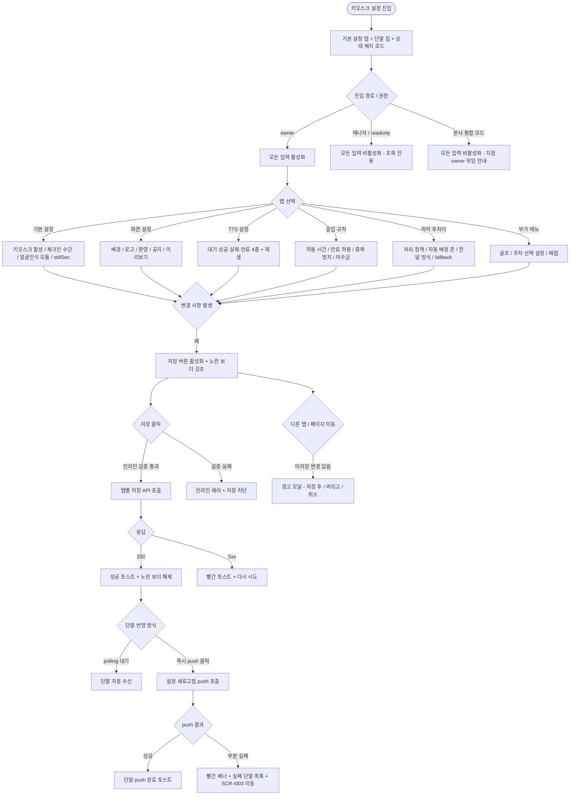

# SCR-I002 키오스크 설정 페이지

## 1. 화면 메타 정보

이 문서는 키오스크 설정 페이지에 대한 자기완결형 요구사항 정의서입니다. 다른 문서를 함께 보지 않아도 이 문서 한 장만으로 키오스크 설정 페이지의 모든 탭, 모든 버튼, 모든 입력 항목, 모든 권한, 모든 예외 처리, 키오스크 단말과의 연동 흐름, 그리고 이 화면을 지탱하는 운영 정책까지 전부 이해하고 구현할 수 있도록 작성합니다.

| 항목 | 값 |
|---|---|
| 작성일 | 2026-05-22 |
| 버전 | v1.1 |
| 상태 | **D11 구현 제외 — D09-설정관리 소관** |
| 도메인 | D09 설정관리 (재배치 확정) |
| 화면 ID | SCR-I002 |
| 이전 ID | SCR-082 키오스크 설정, SCR-083 키오스크 IoT 설정 (운영 허브로 통합) |
| 화면명 | 키오스크 설정 |
| 화면 유형 | 정책·설정 화면 (Policy / Settings Screen) |
| 라우트 (URL) | `/settings/kiosk` |
| 플랫폼 | 데스크톱(기본), 태블릿 |
| 우선순위 | P0 (출시 필수) |
| 기능코드 | IoT-08 (키오스크 설정 통합 운영) |
| 계약코드 | KSET-01 ~ KSET-05 전 영역 |
| 부모 기능 prefix | IoT |
| Lv1 코드 | IoT-08 |
| Lv2 / Lv3 세분화 | IoT-08-01 ~ IoT-08-08 (기본 설정, 화면 설정, TTS 설정, 출입 규칙, 락커 후처리, 부가 메뉴, 저장·연결 테스트, 외부 연동) |
| 연계 화면 | SCR-I001 통합 출석 관리, SCR-I003 IoT 연동 관리, SCR-I004 옷 락커 운영 관리, SCR-I008 키오스크 운영 현황, SCR-052 카드매핑, SCR-097 감사 로그 |
| 연계 키오스크 화면 | KIO-001 대기, KIO-101 ~ KIO-105 인증 채널, KIO-201 출석 결과, KIO-202·203·204 락커 전달, KIO-301 보조 메뉴, KIO-305 공지, KIO-402 관리자 패널, KIO-501 ~ KIO-504 골프, KIO-601 주차, KIO-702 매점 |
| 호출 다이얼로그 | 없음 (인라인 확인 모달과 미리보기 모달만 사용) |

## ⚠️ D11 범위 제외 공지

> **이 화면(SCR-I002)은 D11 통합운영 구현 대상이 아닙니다.**
>
> docs2(D11-통합운영/통합운영.md) 기준: 키오스크 설정 화면은 **D09-설정관리의 SCR-082 키오스크 설정**과 `/settings/iot` 페이지의 **SCR-082A 키오스크 IoT 설정 탭**, **SCR-083 IoT 출입 관리 탭**에서만 관리합니다. D11에 키오스크 설정 탭, TTS 설정, 화면 설정, 출입 규칙 설정, 자동 전원, 연결 테스트, 설정 push, 단말 원격 제어를 만들지 않습니다.
>
> D11은 D09 설정값과 키오스크/출입 게이트 이벤트를 읽어 출석 결과, 실패 사유, 상태 배지로 표시할 뿐 설정 변경 UI를 제공하지 않습니다.
>
> **이 문서의 기능 명세는 D09 SCR-082/082A/083 문서로 이관하여 작성해야 합니다.**

---

## 2. 화면 개요와 목적

키오스크 설정 페이지는 지점에 설치된 모든 키오스크 단말의 운영 정책을 한 화면에서 통합 관리하는 D11 통합운영 도메인의 정책·설정 화면입니다. 키오스크는 부팅 시 또는 KIO-402 관리자 패널의 "설정 새로고침" 액션 시 본 화면 값을 가져와 적용하며, 본 화면이 변경된 값을 push 또는 polling으로 받아 단말 로컬 캐시를 갱신한 뒤 모든 KIO 화면에 즉시 반영합니다. 본 화면은 키오스크 단말 운영 설정의 단일 진입점으로 동작합니다.

이 화면이 다루는 운영 흐름은 매우 다양합니다. 신규 지점 오픈 시 owner가 단말 등록(SCR-I003) 직후 본 화면에서 인증 수단·환영 문구·TTS·운영 시간을 일괄 세팅하고, 평일 06:00 ~ 09:00 러시아워에 중복 출석 방지 시간을 5분에서 3분으로 일시 단축해 회전율을 높이며, 명절·휴무일에 출입 허용 시간을 일시 변경해 push로 즉시 반영합니다. 가을 오픈 캠페인에 성공 TTS 문구를 "환영합니다"에서 "단풍 시즌, 운동 시작!"으로 변경하고, 얼굴인식 도입 단계에서 모듈 활성과 `ka.face.stillSec` 1초 → 2초 조정으로 인식률을 점진 개선하며, 자동 락커 배정을 도입할 때 "수동 배정 대기"에서 "자동 배정 시도"로 전환하고 A존·B존을 자동 배정 존으로 지정합니다. 본사 다지점 표준화 점검 시 본사 슈퍼관리자가 전 지점 설정을 조회하며 표준화 권고를 보내고, 실제 변경은 지점 owner가 수행합니다.

따라서 이 화면은 단순한 설정 폼이 아니라, 키오스크 단말 정책(KIO-001 ~ KIO-702 모든 화면의 노출과 동작) · 출석 처리 규칙(SCR-I001) · 락커 후처리(SCR-I004) · 단말 등록(SCR-I003) · 본사 표준화 정책까지 모두 반영된 운영 정책 허브로 동작해야 합니다. SCR-082A IoT 키오스크 설정과 SCR-082 키오스크 설정이 본 화면으로 통합되었기 때문에, 단일 진입점을 통해 단말 단위와 지점 단위 정책을 모두 관리합니다.

## 3. 진입 경로와 인접 화면

키오스크 설정 페이지에 진입하는 경로는 여러 가지이며, 각 경로마다 진입 직후의 초기 탭이 달라집니다.

첫 번째 경로는 사이드바입니다. 좌측 사이드바의 "통합운영" 메뉴 아래 "키오스크 설정" 항목을 클릭하면 진입하며, 기본 탭은 "기본 설정"입니다.

두 번째 경로는 SCR-I003 IoT 연동 관리에서 단말 등록을 완료한 직후 "키오스크 설정으로 이동" 링크를 누른 경우로, 등록된 단말이 자동 선택된 상태로 기본 설정 탭에 진입합니다.

세 번째 경로는 SCR-I001 통합 출석 관리에서 출석 정책 위반(중복 출석 방지 시간 조정 필요·미수금 정책 변경 필요)을 발견했을 때 키오스크 모니터 패널의 "키오스크 설정으로 이동" 링크를 누른 경우로, 출입 규칙 탭이 자동 활성화된 상태로 진입합니다.

네 번째 경로는 SCR-I004 옷 락커 운영 관리에서 자동 배정 정책 변경이 필요할 때 헤더의 "자동 배정 정책 변경" 링크를 누른 경우로, 락커 후처리 탭이 자동 활성화됩니다.

다섯 번째 경로는 SCR-I008 키오스크 운영 현황에서 단말 운영 시간 조정이 필요할 때 "운영 시간 조정" 링크를 누른 경우로, 출입 규칙 탭이 자동 활성화됩니다.

이 화면에서 빠져나가는 인접 화면으로는, "연결 테스트" 실패 시 이동하는 SCR-I003 IoT 연동 관리, 락커 전달 방식 "신발장 밴드" 선택 시 카드매핑이 필요하면 이동하는 SCR-052 카드매핑, 정책 변경 결과를 추적할 때 이동하는 SCR-097 감사 로그가 있습니다.

## 4. 레이아웃과 UI 구성

키오스크 설정 페이지는 좌측 사이드 탭 + 우측 메인 폼 구조의 레이아웃을 기본으로 합니다. 좌측에 5개의 메인 탭이 세로로 배치되고, 우측에 선택된 탭의 입력 폼이 표시됩니다. 화면 상단에는 페이지 헤더와 단말 선택·연결 상태 표시 영역이 가로로 배치됩니다.

페이지 헤더 좌측에는 "키오스크 설정"이라는 타이틀과 함께 지점 컨텍스트 배지가 표시됩니다. 본사 통합 모드일 때는 지점 선택 드롭다운이 활성화되어 다른 지점의 설정을 조회할 수 있지만, 본사 권한자도 통합 모드에서는 변경 액션이 차단되어 조회 전용으로 동작합니다.

페이지 헤더 우측에는 헤더 버튼이 일렬로 배치됩니다. 좌측부터 "저장", "연결 테스트", "미리보기", "배너 업로드", "설정 새로고침 push" 순서로 놓이며, 권한과 탭에 따라 일부 버튼이 숨겨지거나 비활성화됩니다. "저장" 버튼은 현재 선택된 탭의 설정만 저장하는 탭별 독립 저장 동작을 하며, 변경 사항이 없으면 비활성화됩니다.

헤더 아래에는 단말 선택 및 연결 상태 영역이 있습니다. 이 영역에는 지점에 등록된 키오스크 단말 목록이 칩 형태로 나열되어 있고, 각 칩 옆에 온라인·오프라인·오류·점검 중을 표현하는 작은 상태 배지가 붙어 있습니다. 단말 단위 설정 항목(인증 수단·메뉴 노출·얼굴인식 모듈)을 변경할 때는 먼저 칩에서 단말을 선택해야 하고, 지점 단위 설정 항목(출입 규칙·골프 정책·공지·매점 토글)은 단말 선택과 무관하게 적용됩니다. 각 입력 항목 옆에는 "단말별" 또는 "지점공통" 배지가 명시되어 운영자가 혼동하지 않도록 합니다.

좌측 사이드 탭은 5개입니다. 첫 번째는 "기본 설정"으로 키오스크 활성, 체크인 수단, 직원 출석 허용, 얼굴인식 모듈, 얼굴인식 정지 판정 시간을 다룹니다. 두 번째는 "화면 설정"으로 배경 이미지, 센터 로고, 환영 문구, 공지 메시지, 미리보기를 다룹니다. 세 번째는 "TTS 설정"으로 대기·성공·실패·만료 임박 4종 이벤트의 음성 안내 문구를 다룹니다. 네 번째는 "출입 규칙"으로 출입 허용 시간, 만료 회원 허용, 중복 출석 방지 시간, 출입문 개방 시간, 성공·실패 화면 자동 복귀 시간, 미수금 처리 정책을 다룹니다. 다섯 번째는 "락커 후처리"로 출석 후 처리 정책, 자동 배정 존, 락커 번호 전달 방식, 전달 실패 fallback, 미배정 안내 문구를 다룹니다. 다섯 개 탭 아래에는 "부가 메뉴" 섹션이 추가로 펼쳐져 있으며, 골프 키오스크 활성, 주차 등록 모드(선택 설정), 매점 메뉴 토글을 다룹니다.

각 탭은 독립 저장 단위로 운영됩니다. 한 탭에서 변경 사항을 만든 뒤 다른 탭으로 이동하려고 하면 "변경 사항이 저장되지 않았습니다. 그래도 이동하시겠습니까?" 경고 모달이 뜨고, 운영자는 "저장 후 이동" / "버리고 이동" / "취소" 중에서 선택합니다. 변경된 항목은 좌측 보더가 노란색으로 강조되어 어느 항목이 미저장 상태인지 시각적으로 드러납니다.

기본 설정 탭은 키오스크 활성 ON/OFF 토글, 체크인 수단 다중 선택(QR · RFID · 얼굴인식 · 바코드 · 전화번호), 직원 출석 허용 ON/OFF 토글, 얼굴인식 모듈 활성·비활성 토글, 얼굴인식 정지 판정 시간 1 ~ 3초 슬라이더로 구성됩니다. 체크인 수단은 최소 1개 이상 선택해야 저장이 가능하며, 얼굴인식을 체크인 수단에 선택하려면 모듈이 활성화되어 있어야 합니다.

화면 설정 탭은 배경 이미지 업로드(1920x1080 권장, JPG/PNG, 최대 5MB), 센터 로고 업로드(PNG 권장 투명배경, 최대 2MB), 환영 문구 입력(50자 제한), 공지 메시지 입력(200자 제한, 줄바꿈 허용), 미리보기 버튼으로 구성됩니다. 미리보기 버튼을 누르면 모달이 열리면서 키오스크 화면 비율의 미니 캔버스에 배경·로고·문구가 합성되어 표시됩니다.

TTS 설정 탭은 4종 이벤트(대기 100자, 성공 80자, 실패 80자, 만료 임박 80자)의 안내 문구 입력란과 각 입력 옆의 "재생" 버튼으로 구성됩니다. 재생 버튼은 브라우저 audio로 TTS 엔진의 미리보기를 들려주며, 글자 수 초과 시 카운터가 빨강으로 표시되고 저장이 차단됩니다.

출입 규칙 탭은 출입 허용 시간(시작 HH:mm · 종료 HH:mm), 만료 회원 허용 ON/OFF 토글, 중복 출석 방지 시간(1 ~ 60분, 기본 10분), 출입문 개방 시간(1 ~ 30초, 기본 5초), 성공 모달 자동 복귀 시간(1 ~ 30초, 기본 4초), 실패 화면 자동 복귀 시간(1 ~ 30초, 기본 7초), 미수금 처리 정책(경고·차단) 라디오로 구성됩니다. 자정을 넘는 운영 시간(예: 06:00 ~ 01:00)도 허용되며, 종료가 시작보다 작은 경우 인라인 검증이 됩니다.

락커 후처리 탭은 출석 후 처리 정책(출석만 완료·수동 배정 대기·자동 배정 시도) 라디오, 자동 배정 존 다중 선택, 락커 번호 전달 방식 단일 선택(영수증·앱·신발장 밴드, `ka.locker.deliveryMode`), 전달 실패 fallback 단일 선택(영수증·앱·신발장 밴드·프런트 호출, `ka.locker.fallbackMode`), 미배정 안내 문구(50자 제한, 자동 배정 실패 시 키오스크에 표시)로 구성됩니다. "자동 배정 시도" 선택 시에만 자동 배정 존이 활성화되며, 미선택 시 저장이 차단됩니다. "신발장 밴드" 선택 시 SCR-052 카드매핑 미설정이면 인라인으로 매핑 안내가 뜨고 이동 링크가 제공됩니다.

부가 메뉴 섹션은 골프 키오스크 활성 ON/OFF(`ka.golf.kiosk`), 주차 등록 모드 선택 설정(`ka.parking.mode` - 안내·외부링크·프런트호출), 주차 안내 문구(`ka.parking.text` - 라벨·안내·외부 URL), 매점 메뉴 토글(`ka.menu.shop`)로 구성됩니다. 골프 활성 OFF 시 KIO-501 ~ KIO-504 진입이 차단되고, 주차 모드 "외부링크" 선택 시 URL 입력이 필수가 됩니다.

## 5. 탭 구성과 탭별 동작

이 화면의 탭 구성은 5개 메인 탭과 1개 부가 메뉴 섹션입니다. 어느 탭을 누르든 현재 입력 중인 미저장 변경 사항이 있으면 경고 모달이 뜨고, 운영자가 "저장 후 이동" / "버리고 이동" / "취소"를 선택합니다. "저장 후 이동"을 누르면 현재 탭이 저장된 후 다음 탭으로 이동하고, "버리고 이동"을 누르면 변경 사항이 폐기되며, "취소"를 누르면 같은 탭에 머무릅니다.

기본 설정 탭은 키오스크 활성 여부와 인증 수단을 결정하는 가장 1차 정책입니다. 활성을 OFF로 두면 모든 KIO 화면이 단말에서 동작하지 않으며, 이 변경은 push 즉시 반영됩니다. 체크인 수단을 최소 1개 이상 선택하지 않으면 저장이 불가하며, 얼굴인식을 선택하려면 얼굴인식 모듈이 활성화되어 있어야 합니다. `ka.face.stillSec` 값은 KIO-103 얼굴인식 화면의 정지 판정 시간을 결정하며, 1 ~ 3초 범위에서만 설정 가능합니다.

화면 설정 탭은 키오스크 대기 화면(KIO-001)과 공지 화면(KIO-305)의 시각 디자인을 결정합니다. 배경 이미지와 센터 로고는 CDN에 업로드되고 단말 캐시가 invalidate된 뒤 새 이미지가 적용됩니다. 환영 문구와 공지 메시지는 텍스트로 직접 입력하며, 미리보기 버튼으로 키오스크 1920x1080 비율의 미니 캔버스 미리보기를 볼 수 있습니다.

TTS 설정 탭은 4종 이벤트(대기·성공·실패·만료 임박)의 음성 안내 문구를 결정합니다. 대기 문구는 KIO-001에서 반복 재생되고, 성공·실패 문구는 KIO-201에서 결과 분기에 따라 재생되며, 만료 임박 문구는 만료 임박 회원이 출석할 때 추가 재생됩니다. 재생 버튼은 브라우저 audio로 TTS 엔진 미리보기를 들려주지만, 브라우저 autoplay 정책상 사용자 클릭 후에만 재생됩니다. 글자 수 초과 시 인라인 카운터가 빨강이 되고 저장이 차단됩니다.

출입 규칙 탭은 SCR-I001 통합 출석 관리의 결과 분류와 비고 자동 부여에 직접 사용되는 정책입니다. 출입 허용 시간 외 출석 시도는 SCR-I001에 결과 = 실패, 비고 = "허용 시간 외"로 적재되고, 만료 회원 허용 OFF 상태에서 만료 회원 시도는 결과 = 실패, 비고 = "이용권 만료"로 적재되며, 중복 출석 방지 시간 내 재시도는 결과 = 중복으로 적재됩니다. 미수금 처리가 "차단"이면 결과 = 실패, "경고"면 결과 = 성공 + 비고에 미수금 금액으로 처리됩니다.

락커 후처리 탭은 SCR-I001 통합 출석 관리의 옷 락커 컬럼 분기와 SCR-I004 옷 락커 운영 관리의 그리드 상태에 직접 사용됩니다. "출석만 완료"는 옷 락커 컬럼이 "대상 아님"으로 표시되고, "수동 배정 대기"는 "미배정"으로 표시되어 운영자가 DLG-I002로 배정하며, "자동 배정 시도"는 출석 직후 시스템이 자동 배정 존에서 빈 락커를 골라 "자동배정(번호)"로 표시합니다. 자동 배정 실패 시 미배정 상태로 떨어지면서 키오스크에 미배정 안내 문구가 노출됩니다.

부가 메뉴 섹션은 키오스크의 보조 메뉴 활성을 결정합니다. 골프 키오스크는 KIO-501 ~ KIO-504의 진입 토글이며, 슬롯·타석·대기 정책은 SCR-054 골프 타석 관리에서 단일 원천으로 사용됩니다. 주차 등록은 admin 연동 필수가 아닌 선택 설정이며, "외부링크" 모드를 선택하면 URL 입력이 필수가 됩니다. 매점 메뉴 토글은 KIO-001과 KIO-301의 매점 진입 카드 노출 여부를 결정합니다.

## 6. 버튼·아이콘·링크 액션 전체 정의

이 화면의 모든 클릭 가능한 요소를 빠짐없이 정의합니다.

페이지 헤더의 "저장" 버튼은 현재 선택된 탭의 설정만 저장하는 탭별 독립 저장입니다. 변경 사항이 없으면 비활성화 상태이고, 변경이 발생하면 활성화되어 노란 점이 표시되며 저장 가능 상태임을 알려줍니다. 누르면 인라인 검증이 먼저 동작하고, 검증 실패 시 해당 입력 옆에 빨간 메시지가 표시되며 저장이 차단됩니다. 검증 성공 시 백엔드 호출 후 토스트 "설정이 저장되었습니다"가 표시되고, 단말은 다음 polling 시점에 자동 수신하거나 운영자가 "설정 새로고침 push"를 눌러 강제 갱신할 수 있습니다.

페이지 헤더의 "연결 테스트" 버튼은 등록된 모든 키오스크 단말에 ping을 일괄 발송해 응답 시각·펌웨어 버전·온라인 상태 배지를 갱신합니다. 응답 timeout은 10초이며, 미연결 단말이 발견되면 "X대 단말 미연결" 노란 배너가 표시되고 SCR-I003 IoT 연동 관리 이동 링크가 함께 제공됩니다.

페이지 헤더의 "미리보기" 버튼은 화면 설정 탭에서만 활성화됩니다. 누르면 모달이 열리면서 키오스크 1920x1080 비율의 미니 캔버스에 배경·로고·환영 문구·공지 메시지가 합성되어 표시됩니다.

페이지 헤더의 "배너 업로드" 버튼은 화면 설정 탭에서만 활성화되며, 배경 이미지와 센터 로고 업로드 파일 선택창을 엽니다. 파일 형식과 용량을 검증한 뒤 CDN에 업로드하고 미리보기 영역에 즉시 반영됩니다.

페이지 헤더의 "설정 새로고침 push" 버튼은 모든 등록 단말에 강제 갱신 명령을 송신합니다. 진행 중에는 진행률(X/N)이 표시되고, 응답 timeout 60초 내 응답이 없는 단말은 "X대 단말 push 실패" 빨간 배너에 누적되며 SCR-I003 이동 링크가 제공됩니다. 권한은 owner 이상에 한정되고, 본사 통합 모드와 매니저 이하 권한에서는 버튼이 숨겨집니다.

기본 설정 탭의 키오스크 활성 토글은 단말 단위입니다. OFF 시 그 단말의 모든 KIO 화면이 동작하지 않으며, push 즉시 반영됩니다. 체크인 수단 다중 선택은 단말 단위이며, 단말마다 다른 인증 수단 조합을 가질 수 있습니다. 직원 출석 허용 토글은 지점 단위이며, OFF 시 KIO-104 직원 분기가 차단됩니다.

화면 설정 탭의 배경/로고 업로드 영역은 드래그 앤 드롭과 파일 선택 두 방식을 모두 지원하며, 업로드 직후 인라인 미리보기가 표시됩니다.

TTS 설정 탭의 각 이벤트별 "재생" 버튼은 입력된 문구를 브라우저 TTS 엔진으로 미리듣기 합니다. 브라우저 autoplay 정책에 의해 사용자 클릭이 있어야 재생되며, 차단 시 "재생 버튼을 다시 눌러주세요" 안내가 표시됩니다.

출입 규칙 탭의 모든 시간 입력은 인라인 검증을 거칩니다. 종료 시각이 시작 시각보다 작으면 인라인 에러가 표시되고 저장이 차단됩니다. 자정을 넘는 운영 시간은 예외적으로 허용됩니다.

락커 후처리 탭의 출석 후 처리 정책 라디오는 선택에 따라 하위 입력이 동적으로 활성/비활성화됩니다. "자동 배정 시도"를 선택하면 자동 배정 존 다중 선택 영역이 활성화되고, 다른 옵션 선택 시 비활성화됩니다. 락커 번호 전달 방식과 fallback은 항상 활성화되어 있습니다. "신발장 밴드" 선택 시 SCR-052 카드매핑 미설정 여부가 검증되어 미설정 시 인라인 안내와 이동 링크가 함께 표시됩니다.

부가 메뉴 섹션의 골프 활성 토글은 지점 단위이며, OFF 시 KIO-501 ~ KIO-504의 진입이 차단됩니다. 주차 등록 모드는 선택 설정으로, 운영자가 사용을 결정한 경우에만 입력하며 "외부링크" 선택 시 URL 입력 필수입니다. 매점 메뉴 토글은 KIO-001 / KIO-301의 매점 카드 노출 여부를 결정합니다.

모든 입력 항목 옆에는 작은 ⓘ 아이콘이 있고, 호버 시 항목의 운영 의미와 키오스크 영향 범위가 툴팁으로 표시됩니다. 운영자가 키오스크 단말 단위 정책과 지점 단위 정책을 혼동하지 않도록 항목 옆에 "단말별" / "지점공통" 배지가 항상 함께 표시됩니다.

## 7. 호출되는 모달 동작

이 화면에서 호출되는 모달은 두 가지이며, 별도 DLG-* 다이얼로그가 아닌 인라인 모달로 처리됩니다.

### 7-1. 미저장 변경 사항 경고 모달

미저장 변경 사항 경고 모달은 운영자가 한 탭에서 변경 사항을 입력한 뒤 다른 탭으로 이동하거나, 페이지를 떠나거나, 브라우저를 닫으려고 할 때 자동으로 표시됩니다. 모달 상단에는 "변경 사항이 저장되지 않았습니다"라는 제목과 함께 "저장하지 않고 이동하면 입력한 내용이 사라집니다"라는 경고 문구가 표시됩니다. 그 아래에 변경된 항목 목록(예: "환영 문구 변경", "TTS 성공 문구 변경", "중복 출석 방지 시간 5분 -> 3분")이 요약으로 표시되어, 운영자가 무엇을 잃게 되는지 명확히 알 수 있습니다.

하단에는 세 버튼이 있습니다. "저장 후 이동"은 현재 탭을 저장한 뒤 원래 가려고 했던 탭으로 이동합니다. 저장 검증 실패 시 같은 탭에 머무르며 에러 메시지가 표시됩니다. "버리고 이동"은 변경 사항을 폐기하고 다음 탭으로 이동합니다. "취소"는 모달을 닫고 같은 탭에 머무릅니다. ESC 키 또는 배경 클릭은 "취소"와 동일하게 동작합니다.

### 7-2. 미리보기 모달

미리보기 모달은 화면 설정 탭의 "미리보기" 버튼으로 호출됩니다. 모달 상단에는 "키오스크 화면 미리보기"라는 제목과 함께 단말 선택 드롭다운이 표시되어, 단말마다 다른 배경·로고를 미리 볼 수 있습니다. 모달 본문은 키오스크 1920x1080 비율의 미니 캔버스(보통 768x432 정도)이며, 배경 이미지 위에 센터 로고와 환영 문구와 공지 메시지가 합성되어 표시됩니다. 인증 수단 아이콘과 메뉴 카드도 현재 설정에 맞게 함께 렌더링되어, 실제 키오스크 대기 화면과 거의 동일한 모습을 미리 볼 수 있습니다.

미리보기는 저장 전 상태(미저장 입력 포함)를 그대로 보여주므로, 운영자는 "저장 후 어떻게 보일지"를 사전에 확인한 뒤 저장 여부를 결정할 수 있습니다. 모달 하단에는 "닫기" 버튼만 있으며, 미리보기 상태에서는 어떤 액션도 트리거되지 않습니다.

## 8. 토스트와 확인 팝업과 알럿

키오스크 설정 페이지에서 발생하는 모든 알림성 UI는 다음 패턴으로 동작합니다.

성공 토스트는 우측 상단에 녹색 계열로 5초간 표시되며, "설정이 저장되었습니다", "X대 단말 push 완료", "이미지가 업로드되었습니다" 같은 짧은 문구로 결과를 알려줍니다. 저장 토스트는 어떤 탭이 저장됐는지 함께 표시되어("기본 설정 탭이 저장되었습니다") 운영자가 헷갈리지 않도록 합니다.

실패 토스트는 빨강 계열로 표시되며, "체크인 수단을 최소 1개 이상 선택해야 합니다", "얼굴인식 모듈을 먼저 활성화하세요", "자동 배정 존을 선택해주세요", "출입 허용 시간 종료가 시작보다 작습니다", "중복 방지 시간은 1 ~ 60분 범위입니다", "TTS 문구가 글자 수를 초과했습니다", "배경 이미지가 5MB를 초과합니다", "X대 단말 push 실패", "권한이 없어요", "다른 사용자가 동시에 변경했습니다" 같은 문구가 표시됩니다.

경고 토스트는 노랑 계열로, "단말 N대가 미연결 상태입니다. 저장은 가능하나 다음 연결 시 자동 적용됩니다", "신발장 밴드 매핑이 필요합니다. SCR-052 카드매핑에서 설정해주세요" 같은 안내를 전달합니다.

확인 팝업은 미저장 변경 사항 경고 모달 외에는 거의 사용하지 않습니다. 대부분의 저장 액션은 인라인 검증과 토스트로 처리되며, 차단형 알럿이 거의 발생하지 않도록 설계되었습니다.

알럿은 권한 없는 계정이 URL로 접근했을 때 페이지 본문이 가려지고 "이 화면에 접근할 권한이 없습니다. 3초 후 대시보드로 이동합니다"라는 차단형 메시지로 표시됩니다.

## 9. 데이터 흐름과 외부 연동

이 화면은 키오스크 단말과 admin 사이의 정책 동기화 허브이며, 여러 외부 화면과 시스템에 의존합니다.

화면 진입 시 `GET /api/kiosk/settings/:branchId`로 현재 지점의 모든 탭 설정을 한 번에 받아옵니다. 응답에는 5개 탭과 부가 메뉴 섹션의 모든 입력 값과 함께 단말별 등록 정보, 마지막 저장 시각, 마지막 저장자가 포함됩니다.

저장은 `PUT /api/kiosk/settings/:branchId/:tab`으로 탭별로 분리 호출됩니다. 변경된 필드만 전송하여 부분 업데이트가 가능하며, 응답에는 다음 단말 polling 예상 시각과 push 가능 여부가 함께 내려옵니다.

설정 새로고침 push는 `POST /api/kiosk/settings/refresh-push`로 호출되며, 응답은 단말별 push 결과(성공·실패·timeout)를 배열로 반환합니다. timeout은 60초이며, 실패 단말은 명령 큐에 적재되어 단말이 온라인 상태로 복귀하면 자동 재시도됩니다.

연결 테스트는 `POST /api/kiosk/test-connection`으로 단말별 ping을 일괄 발송하고, 각 단말의 응답 시각·펌웨어 버전·온라인 상태를 반환합니다. timeout은 10초입니다.

배너(배경·로고) 업로드는 `POST /api/kiosk/banner-upload`로 multipart/form-data 형식으로 호출되며, 응답에는 CDN URL이 내려옵니다. 업로드 후 단말 캐시 invalidate 명령이 자동 발송됩니다.

TTS 미리보기는 `POST /api/kiosk/tts/preview`로 호출되며, 응답으로 임시 audio URL이 내려와 브라우저 audio에서 재생됩니다.

단말 상태 조회는 `GET /api/kiosk/devices/:branchId/status`로 호출되며, 응답에는 단말별 온라인·오프라인·오류·점검 중 상태와 펌웨어 버전·마지막 heartbeat 시각이 포함됩니다. 본 화면은 단말 칩 영역의 상태 배지에 이 데이터를 사용합니다.

키오스크 단말과 admin 사이의 설정 동기화 흐름은 다음과 같습니다. admin/SCR-I002 변경 -> 저장 시 push 또는 키오스크 polling으로 단말 수신 -> 단말 로컬 캐시 갱신 + 화면 반영. 관리자 액션 ADM-03-01 "설정 새로고침"으로도 강제 갱신이 가능합니다. 설정 수신 실패 시 단말은 마지막 캐시 값을 사용하고, 캐시도 없으면 안전 기본값(보조 메뉴 모두 숨김, 인증 수단 QR만 활성)으로 동작합니다.

SCR-I001 통합 출석 관리는 본 화면의 출입 규칙 탭과 락커 후처리 탭의 정책을 직접 사용합니다. 만료 회원 허용 OFF · 중복 출석 방지 시간 · 미수금 처리 · 직원 출석 허용 · 영업시간 · 락커 후처리 정책이 SCR-I001의 결과 분류와 비고 자동 부여에 그대로 반영됩니다.

SCR-I003 IoT 연동 관리는 본 화면의 단말 칩 상태 배지와 양방향 연동됩니다. SCR-I003에서 단말이 신규 등록되면 본 화면 단말 칩에 자동 노출되고, 본 화면의 연결 테스트와 push 실패 결과가 SCR-I003에 반영됩니다.

SCR-I004 옷 락커 운영 관리는 본 화면의 락커 후처리 탭에서 정한 자동 배정 존을 사용합니다. "자동 배정 시도" 정책 활성 시 SCR-I004의 락커 그리드에서 자동 배정 존에 속한 빈 락커가 자동으로 선택되어 회원에게 배정됩니다.

SCR-I008 키오스크 운영 현황은 본 화면의 자동 전원 스케줄(SCR-I003 자동 전원 탭)과 페어링되어 운영 시간 ON/OFF 시각을 동기화합니다.

SCR-052 카드매핑은 락커 번호 전달 방식 "신발장 밴드" 선택 시 의존성을 가집니다. 신발장 밴드 매핑이 안 되어 있으면 본 화면에 안내가 뜨고 이동 링크가 제공됩니다.

SCR-097 감사 로그는 모든 설정 변경을 비동기로 INSERT 받습니다. 기록 필드는 `actor_id`, `target_branch`, `tab`, `changed_fields` (배열), `old_value`, `new_value`, `timestamp`입니다.

본사 표준화 알림은 본사 슈퍼관리자가 지점별 정책 차이를 일정 임계 이상으로 발견했을 때 NFR-19 알림으로 자동 발송됩니다. 본사는 알림을 받고 본 화면에서 지점 선택으로 차이를 조회하며 표준화 권고를 보냅니다.

화면에서 호출하는 주요 API 엔드포인트는 다음과 같습니다. 설정 조회 `GET /api/kiosk/settings/:branchId`, 탭별 저장 `PUT /api/kiosk/settings/:branchId/:tab`, push `POST /api/kiosk/settings/refresh-push`, 연결 테스트 `POST /api/kiosk/test-connection`, 배너 업로드 `POST /api/kiosk/banner-upload`, TTS 미리보기 `POST /api/kiosk/tts/preview`, 단말 상태 `GET /api/kiosk/devices/:branchId/status`.

## 10. 화면 상태와 예외 처리

키오스크 설정 페이지는 다음 상태들을 가집니다.

기본 상태는 현재 저장된 설정값이 표시되는 정상 조회 상태입니다. 모든 입력 항목이 활성화되어 있고, 변경 사항이 없으면 "저장" 버튼은 비활성화 상태입니다.

수정 중 상태는 운영자가 한 항목 이상 입력을 변경한 상태입니다. 변경된 항목의 좌측 보더가 노란색으로 강조되고, "저장" 버튼이 활성화되며, 헤더에 "저장하지 않은 변경 사항이 있습니다"라는 가벼운 안내 배지가 표시됩니다.

저장 성공 상태는 저장 호출 응답이 200으로 돌아온 직후의 상태입니다. 토스트 "설정이 저장되었습니다"가 5초간 표시되고, 노란 보더가 사라지며, "저장" 버튼이 다시 비활성화됩니다.

저장 실패 상태는 검증 실패 또는 백엔드 5xx 응답 시 표시됩니다. 검증 실패는 인라인 에러로 처리되고 토스트는 표시되지 않으며, 백엔드 5xx는 빨간 토스트와 "다시 시도" 액션이 함께 표시됩니다.

키오스크 미연결 상태는 등록 단말 중 일부 또는 전체가 오프라인일 때 헤더 아래에 노란 배너로 "키오스크 N대가 미연결 상태입니다. 저장은 가능하며 다음 연결 시 자동 적용됩니다"가 표시됩니다.

새로고침 push 진행 중 상태에서는 push 버튼이 비활성화되고 진행률(X/N)이 헤더에 표시되며, 완료 후 결과 토스트가 노출됩니다.

push 실패 상태에서는 빨간 배너에 실패 단말 목록과 SCR-I003 이동 링크가 표시됩니다. 실패 단말은 명령 큐에 적재되어 단말이 온라인 복귀 시 자동 재시도됩니다.

권한 부족 상태(매니저 이하)에서는 모든 입력이 비활성화되고 "조회 전용" 배지가 헤더에 표시됩니다. "저장"·"push"·"배너 업로드" 같은 변경 액션 버튼도 숨겨집니다.

본사 통합 모드 상태에서는 모든 입력이 비활성화되고 "조회 전용 - 변경은 지점 owner에서 수행"이라는 안내 배지가 표시됩니다. 본사 슈퍼관리자가 변경 액션을 시도하면 차단됩니다.

미저장 경고 상태는 미저장 변경 사항이 있는 채로 다른 탭으로 이동하거나 페이지를 떠나려고 할 때 모달이 자동으로 뜨는 상태입니다.

예외 케이스별 처리는 다음과 같이 정의됩니다.

체크인 수단을 0개 선택하면 인라인 "최소 1개 이상 선택해야 합니다"가 표시되고 저장이 차단됩니다.

얼굴인식 모듈이 비활성인 상태에서 체크인 수단에 얼굴인식을 선택하려고 하면 인라인 "얼굴인식 모듈을 먼저 활성화하세요" 안내와 함께 선택이 차단됩니다.

자동 배정 시도를 선택했으나 자동 배정 존이 0개이면 인라인 "자동 배정 존을 선택해주세요"가 표시되고 저장이 차단됩니다.

출입 허용 시간의 종료가 시작보다 작으면 인라인 "종료 시각은 시작 시각 이후로 설정해주세요"가 표시되고 저장이 차단됩니다. 자정을 넘는 시간(06:00 ~ 01:00)은 예외적으로 허용됩니다.

중복 출석 방지 시간이 0 이거나 60분을 초과하면 인라인 "1 ~ 60분 범위로 입력해주세요"가 표시됩니다.

출입문 개방 시간이 1 ~ 30초 범위 밖이면 인라인 "1 ~ 30초 범위로 입력해주세요"가 표시됩니다.

TTS 문구가 글자 수를 초과하면 카운터가 빨강이 되고 저장이 차단됩니다.

배경 이미지가 5MB를 초과하면 업로드가 거부되고 "최대 5MB까지 업로드 가능합니다"가 표시됩니다.

로고가 비PNG이면 노란 안내 "PNG 권장(투명배경)"이 표시되지만 JPG도 업로드는 허용됩니다.

단말이 미연결 상태에서 저장을 시도하면 저장은 정상적으로 수행되고 노란 배너에 "다음 연결 시 자동 적용됩니다"가 표시됩니다.

push 실패 단말이 발생하면 빨간 배너에 실패 단말 목록과 SCR-I003 이동 링크가 표시되며, 명령 큐에 적재되어 자동 재시도됩니다.

본사 통합 모드에서 변경을 시도하면 모든 입력이 비활성화 상태이므로 변경 자체가 불가능합니다.

매니저 이하 권한이 변경을 시도해도 입력 자체가 비활성화되어 있어 차단됩니다.

연결 테스트 timeout(10초)이 발생하면 "연결 테스트 시간 초과" 안내와 함께 단말이 오프라인으로 표시됩니다.

TTS 재생이 브라우저 autoplay 정책으로 차단되면 "재생 버튼을 다시 눌러주세요" 안내가 표시되며 사용자 클릭으로 재생됩니다.

신발장 밴드 매핑이 미설정인 상태에서 락커 전달 방식을 "신발장 밴드"로 선택하면 인라인 "SCR-052 카드매핑이 필요합니다"와 함께 이동 링크가 제공됩니다.

주차 모드를 "외부링크"로 선택했으나 URL이 미입력이면 인라인 "외부 URL을 입력해주세요"가 표시되고 저장이 차단됩니다.

동시 저장 충돌(다른 운영자가 같은 탭을 동시에 저장)이 발생하면 "다른 사용자가 동시에 변경했습니다. 새로고침 후 다시 시도해주세요" 모달이 표시되고 후행 요청이 거부됩니다.

권한 강등(저장 도중 운영자의 권한이 변경된 경우)이 발생하면 "권한이 변경되었습니다. 새로고침해주세요" 안내가 표시됩니다.

## 11. 권한별 처리

이 화면은 권한에 따라 진입 가능 여부와 가능한 액션이 명확히 분리됩니다.

superAdmin와 primary는 모든 지점의 키오스크 설정을 조회할 수 있지만 변경은 차단됩니다. 헤더의 지점 선택 드롭다운으로 지점을 바꿔가며 정책 차이를 비교할 수 있고, 본사 표준화 권고를 보낼 때 근거 화면으로 사용합니다. 변경 액션 시도 시 모든 입력이 비활성화되어 있어 차단되며, "조회 전용 - 변경은 지점 owner에서 수행"이라는 안내가 표시됩니다.

Owner(지점장)은 자기 지점의 키오스크 설정을 전부 변경할 수 있습니다. 5개 메인 탭과 부가 메뉴 섹션의 모든 입력과 함께 "저장"·"연결 테스트"·"미리보기"·"배너 업로드"·"설정 새로고침 push" 버튼을 모두 사용할 수 있습니다.

매니저(manager·프런트)는 자기 지점의 설정을 조회만 할 수 있고 변경은 차단됩니다. 모든 입력이 비활성화되며 "조회 전용" 배지가 표시됩니다. 운영 중 정책을 확인하는 용도로만 사용합니다.

강사(trainer)와 읽기 전용(readonly)은 이 화면 자체에 접근할 수 없습니다. 사이드바에 메뉴가 보이지 않고 직접 URL 접근 시 접근 제한 화면이 표시됩니다.

본사 통합 모드에서는 본사 권한자도 모든 입력이 비활성화됩니다. 본사가 정책 표준을 정해도 실제 변경은 각 지점 owner가 수행하는 거버넌스 모델입니다.

권한이 부족한 경우의 사용자 경험은 단계적으로 일관됩니다. 사이드바에서 메뉴 자체가 숨겨지거나 비활성화되고, 화면 내부 입력 항목은 권한이 부족하면 모두 비활성 상태이며, 권한 강등이 운영 중 발생하면 다음 저장 시점에 백엔드가 403을 반환하고 "권한이 변경되었습니다" 안내가 표시됩니다. 모든 권한 차단 이벤트는 감사 로그에 기록됩니다.

## 12. 메인 흐름

키오스크 설정 페이지의 핵심 동작 흐름을 다이어그램으로 표현합니다.



## 13. 에러와 예외 흐름

에러와 예외 상황에서의 분기를 별도 흐름으로 표현합니다.

```mermaid
flowchart TD
    A([저장 / push / 업로드 액션]) --> B{검증 / 응답}
    B -->|체크인 수단 0개| C[인라인 "최소 1개 선택"]
    B -->|얼굴인식 모듈 비활성 + 선택| D[인라인 "모듈 활성 후 선택"]
    B -->|자동 배정 시도 + 존 미입력| E[인라인 "자동 배정 존 선택"]
    B -->|출입 시간 종료 < 시작| F[인라인 "종료 > 시작"]
    B -->|중복 방지 0 / 60+ 분| G[인라인 "1 ~ 60분 범위"]
    B -->|개방 시간 / 복귀 시간 범위 외| H[인라인 "1 ~ 30초 범위"]
    B -->|TTS 글자 수 초과| I[카운터 빨강 + 저장 차단]
    B -->|배경 5MB 초과| J[업로드 거부 "최대 5MB"]
    B -->|로고 비PNG| K[노랑 안내 + 업로드 허용]
    B -->|신발장 밴드 + SCR-052 미설정| L[인라인 안내 + 이동 링크]
    B -->|주차 외부링크 + URL 미입력| M[인라인 "URL 필수"]
    B -->|단말 미연결 + 저장| N[저장 성공 + 노란 배너 "연결 시 자동"]
    B -->|push timeout 60초| O[명령 큐 적재 + 자동 재시도]
    B -->|push 부분 실패| P[빨간 배너 + 실패 단말 목록]
    B -->|연결 테스트 timeout 10초| Q["연결 시간 초과" + 오프라인 표시]
    B -->|TTS 재생 autoplay 차단| R["재생 버튼 다시 눌러주세요"]
    B -->|동시 저장 충돌| S["다른 사용자가 변경" 모달 + 후행 거부]
    B -->|권한 강등| T["권한이 변경되었습니다" 새로고침]
    B -->|본사 통합 모드 변경 시도| U[모든 입력 비활성 - 시도 불가]
    B -->|매니저 변경 시도| U
    B -->|미저장 + 다른 탭| V[경고 모달 - 저장 / 버리고 / 취소]
```

## 14. 핵심 디자인 요청사항

이 화면이 운영자에게 잘 작동하려면 다음 디자인 원칙이 시각적으로 명확히 드러나야 합니다.

좌측 사이드 탭은 세로 5개로 정렬되어 한눈에 모든 정책 영역이 보이도록 합니다. 현재 선택된 탭은 강한 색상으로 강조되고, 미저장 변경 사항이 있는 탭에는 작은 노란 점 배지가 탭 라벨 옆에 붙어 운영자가 어느 탭에 변경이 남아있는지 즉시 파악할 수 있게 합니다.

각 입력 항목 옆의 "단말별" / "지점공통" 배지는 운영자가 정책의 영향 범위를 혼동하지 않도록 색상 분기(단말별 = 파랑, 지점공통 = 보라)로 명확히 구분되어야 합니다. 작은 ⓘ 아이콘 호버 시 항목의 운영 의미와 키오스크 영향 범위가 툴팁으로 표시되어 도움말이 입력 옆에 항상 가까이 있어야 합니다.

변경된 항목의 좌측 보더는 노란색(부드러운 톤)으로 강조되어 시각적 부담 없이 미저장 상태를 알립니다. 저장 직후에는 노란 보더가 부드럽게 페이드아웃되며, 성공 토스트가 동시에 떠 운영자에게 명확한 피드백을 줍니다.

단말 칩 영역은 헤더 바로 아래에 가로 스크롤로 배치되며, 각 칩의 상태 배지는 온라인(녹색)·오프라인(회색)·오류(빨강)·점검 중(주황)으로 색상 분기됩니다. 호버 시 단말 정보(이름·IP·펌웨어·마지막 통신)가 툴팁으로 표시됩니다.

화면 설정 탭의 미리보기 모달은 실제 키오스크와 거의 동일한 비율(1920:1080)의 미니 캔버스로, 변경 사항을 저장하기 전에 미리 볼 수 있게 합니다. 배경 이미지가 변경되면 캔버스에 부드러운 페이드 트랜지션으로 적용되어 운영자가 변화를 분명히 인지합니다.

TTS 설정 탭의 재생 버튼은 직관적인 스피커 아이콘과 함께 표시되며, 재생 중에는 짧은 펄스 애니메이션으로 동작 중임을 알립니다. 글자 수 카운터는 입력 칸 아래에 작게 표시되며, 초과 시 빨강으로 변하면서 저장 버튼도 자동 비활성화됩니다.

출입 규칙 탭과 락커 후처리 탭은 정책별로 카드형 그룹으로 묶여 시각적 계층이 분명해야 합니다. 정책 그룹마다 제목과 함께 짧은 운영 설명이 함께 표시되어 운영자가 정책의 의도를 이해하면서 입력할 수 있도록 합니다.

부가 메뉴 섹션은 메인 탭과 시각적으로 구분되어 별도 카드 영역으로 표시되며, 선택 설정인 주차는 "이 지점에서 사용" 토글이 OFF인 동안 하위 입력이 회색으로 비활성화되어 노이즈를 줄입니다.

본사 통합 모드와 매니저 이하 권한에서는 모든 입력이 회색으로 비활성화된 상태로 명확히 표시되며, 헤더에 "조회 전용" 배지가 큰 라벨로 떠 있어 운영자가 자신의 권한 범위를 즉시 인지합니다.

진행 스피너와 로딩 스켈레톤은 다른 D11 화면과 동일한 톤으로 통일되어 일관된 사용자 경험을 제공합니다.

## 15. 운영 정책 (이 화면에 연결된 부분)

이 화면은 단순한 설정 화면이 아니라 키오스크·IoT 운영의 정책 결정이 모이는 단일 진입점입니다. 이 화면을 구현·운영하는 사람이 알아야 할 정책을 모두 풀어 씁니다.

키오스크 단일 진입점 원칙은 본 화면이 모든 키오스크 단말 운영 설정의 단일 진입점이라는 것입니다. SCR-082A 키오스크 IoT 설정과 SCR-082 키오스크 설정이 본 화면 SCR-I002로 통합되었기 때문에, 운영자는 더 이상 두 화면을 돌아다닐 필요가 없습니다. 키오스크 단말은 부팅 시 또는 KIO-402 관리자 패널의 "설정 새로고침"으로 본 화면 값을 가져와 적용합니다.

단말 단위 vs 지점 단위 정책은 명확히 분리됩니다. 얼굴인식·인증 수단·메뉴 노출 같은 항목은 단말마다 다른 값을 가질 수 있어 단말 단위로 저장되고, 출석 정책·직원 출퇴근 허용·골프 정책·공지 같은 항목은 지점 모든 키오스크에 공통 적용되어 지점 단위로 저장됩니다. 주차는 필요한 지점에서만 안내·외부 링크를 선택 설정으로 관리하며, admin 연동 필수 범위에서 제외됩니다.

설정 적용 흐름은 admin 변경 -> 저장 시 push 또는 단말 polling -> 단말 로컬 캐시 갱신 + 화면 반영의 순서로 일어납니다. 단말 polling 주기는 60초이며, 즉시 적용이 필요한 경우 운영자가 "설정 새로고침 push" 버튼을 눌러 강제 갱신할 수 있습니다. 설정 수신 실패 시 단말은 마지막 캐시 값을 사용하고, 캐시도 없으면 안전 기본값(보조 메뉴 모두 숨김, 인증 수단 QR만 활성)으로 동작합니다.

권한 분리는 owner 중심입니다. 본사 슈퍼관리자도 조회 전용이며, 실제 변경은 지점 owner가 수행합니다. 이는 본사가 정책 표준을 제시하고 지점이 자기 책임 하에 적용하는 거버넌스 모델이며, 단말 운영의 즉시성과 본사 표준화 사이의 균형을 맞춥니다. 매니저 이하 권한은 조회만 가능하고, 강사·readonly는 화면 진입 자체가 불가합니다.

체크인 수단 최소 1개 원칙은 단말이 어떤 인증 수단도 없이 동작하는 상황을 막기 위한 정책입니다. QR · RFID · 얼굴인식 · 바코드 · 전화번호 중 최소 1개는 반드시 활성화되어야 하며, 얼굴인식을 선택하려면 얼굴인식 모듈이 활성화되어야 합니다. 이 의존성은 인라인 검증으로 즉시 차단됩니다.

자동 락커 배정 의존성은 락커 후처리 정책이 "자동 배정 시도"인 경우 자동 배정 존을 1개 이상 지정해야 한다는 것입니다. 자동 배정 실패 시에는 미배정 안내 문구가 키오스크에 노출되며, 이 문구도 본 화면에서 직접 입력합니다. 자동 배정의 안전 fallback은 항상 "수동 배정 대기"로 떨어지도록 설계되어 있어, 운영자가 SCR-I001 또는 SCR-I004의 DLG-I002로 수동 배정할 수 있습니다.

미수금 정책은 출석 가능성과 수금 효율 사이의 균형을 맞춥니다. "경고" 정책은 미수금 회원의 출석을 허용하되 비고에 미수금 금액을 표시해 프런트가 결제 유도를 진행하고, "차단" 정책은 미수금 회원의 출석을 막아 결제를 우선합니다. 지점이 자율적으로 선택할 수 있습니다.

직원 출석 허용 정책은 키오스크 단말을 직원 출퇴근 관리에도 사용할지 결정합니다. ON 시 KIO-104 전화번호 인증에서 직원이 자동으로 분기되어 출퇴근으로 처리되고, OFF 시 직원의 키오스크 출석 시도는 SCR-I001에 결과 = 실패, 비고 = "직원 출석 불가"로 적재됩니다.

중복 출석 방지 시간은 동일 회원이 짧은 시간 내 재시도하는 것을 방지하는 정책입니다. 기본 10분이며 1 ~ 60분 범위에서 설정 가능합니다. 러시아워에는 5분에서 3분으로 일시 단축해 회전율을 높이는 운영도 가능합니다. 중복 출석은 실패와 분리되어 결과 = 중복으로 별도 카운트됩니다.

출입 허용 시간은 자정을 넘는 시간(예: 06:00 ~ 01:00)도 예외 허용되어 24시간 가까이 운영하는 지점도 정책 한 줄로 표현됩니다. 허용 시간 외 출석 시도는 SCR-I001에 결과 = 실패, 비고 = "허용 시간 외"로 적재됩니다.

이미지 규격은 배경 1920x1080 권장 JPG/PNG 최대 5MB, 로고 PNG 권장 투명배경 최대 2MB(JPG도 허용하되 노란 안내)로 통일됩니다. 키오스크 단말 화면 해상도와 일치하는 규격을 사용해야 단말에서 늘어남이나 잘림 없이 표시됩니다.

TTS 문구는 대기 100자, 성공·실패·만료 임박 각 80자로 제한됩니다. 너무 긴 문구는 TTS 엔진의 합성 시간이 길어져 운영자 의도와 어긋날 수 있어 글자 수 제한을 둡니다. 브라우저 autoplay 정책상 미리듣기는 사용자 클릭으로만 재생됩니다.

락커 번호 전달 방식은 영수증·앱·신발장 밴드 중 1택입니다. 영수증은 KIO-202, 앱은 KIO-203, 신발장 밴드는 KIO-204에서 처리되며, 신발장 밴드 선택 시 SCR-052 카드매핑이 필수 의존성으로 추가됩니다. 전달 실패 시 fallback도 1택으로 지정하며 프런트 호출이 마지막 안전망입니다.

저장 단위 분리는 5개 탭과 부가 메뉴 섹션이 각각 독립 저장 단위라는 것입니다. 한 탭만 부분 저장이 가능하고 다른 탭에 영향을 주지 않습니다. 미저장 상태에서 다른 탭으로 이동하면 경고 모달이 떠 운영자가 의도하지 않은 손실을 막아줍니다.

새로고침 push 정책은 즉시 적용이 필요할 때 사용합니다. 정상 흐름은 단말 polling(60초 주기)으로도 충분하지만, 러시아워에 정책을 즉시 바꾸거나 휴무일에 출입 시간을 막아야 할 때는 push로 강제 갱신합니다. push 실패 단말은 명령 큐에 적재되어 단말이 온라인 상태로 복귀하면 자동 재시도됩니다.

본사 표준화 알림은 지점별 정책 차이가 임계를 넘으면 본사 슈퍼관리자에게 NFR-19 알림으로 전달됩니다. 본사는 알림을 받고 본 화면에서 지점 선택으로 차이를 비교한 뒤 표준화 권고를 보냅니다. 강제 조정은 거버넌스 모델에 어긋나므로 권고만 가능합니다.

감사 로그 정책은 모든 설정 변경을 SCR-097에 비동기로 INSERT합니다. `actor_id`, `target_branch`, `tab`, `changed_fields`, `old_value`, `new_value`, `timestamp`가 모두 기록되어 정책 변경의 추적성을 보장합니다.

fallback 안전 기본값은 단말이 설정을 받지 못한 채 동작해야 하는 비상 상황을 대비한 정책입니다. 단말은 우선 마지막 캐시를 사용하고, 캐시도 없으면 안전 기본값(보조 메뉴 모두 숨김, 인증 수단 QR만 활성, 만료 회원 차단, 출입 허용 시간은 06:00 ~ 23:00)으로 동작해 적어도 기본 출석은 가능하도록 보장합니다.

이상의 모든 정책은 이 화면을 구현하고 운영하는 사람이 별도 문서 없이 이 한 장만 보면 이해할 수 있도록 풀어 적었습니다. 정책이 바뀌면 이 문서가 함께 갱신되어야 하며, 코드 변경과 정책 변경은 항상 짝지어 진행됩니다.
