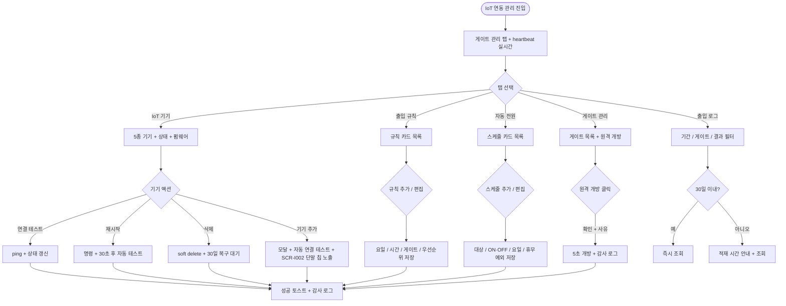

# SCR-I003 IoT 연동 관리 페이지

## 1. 화면 메타 정보

이 문서는 IoT 연동 관리 페이지에 대한 자기완결형 요구사항 정의서입니다. 다른 문서를 함께 보지 않아도 이 문서 한 장만으로 IoT 연동 관리 페이지의 모든 탭, 모든 버튼, 모든 모달, 모든 권한, 모든 예외 처리, 그리고 이 화면을 지탱하는 운영 정책까지 전부 이해하고 구현할 수 있도록 작성합니다.

| 항목 | 값 |
|---|---|
| 작성일 | 2026-05-22 |
| 버전 | v1.0 |
| 상태 | 최신 통합본 반영 (D11 재번호화 SCR-083 -> SCR-I003 완료) |
| 도메인 | D11 통합운영 |
| 화면 ID | SCR-I003 |
| 이전 ID | SCR-083 IoT 연동 관리 |
| 화면명 | IoT 연동 관리 |
| 화면 유형 | 정책·설정 화면 (Policy / Settings Screen) |
| 라우트 (URL) | `/settings/iot` |
| 플랫폼 | 데스크톱(기본), 태블릿 |
| 우선순위 | P0 (출시 필수) |
| 기능코드 | IoT-03 (IoT 연동 관리) |
| 부모 기능 prefix | IoT |
| Lv1 코드 | IoT-03 |
| Lv2 / Lv3 세분화 | IoT-03-01 ~ IoT-03-08 (게이트 관리, IoT 기기, 출입 로그, 출입 규칙, 자동 전원, 기기 등록·삭제, 원격 제어, 외부 연동) |
| 연계 화면 | SCR-I001 통합 출석 관리, SCR-I002 키오스크 설정, SCR-I006 체성분 통합 관리, SCR-I008 키오스크 운영 현황, SCR-052 카드매핑, SCR-097 감사 로그 |
| 연계 키오스크 화면 | KIO-402 관리자 패널 (양방향 데이터) |
| 호출 다이얼로그 | 없음 (인라인 확인 모달과 기기 추가 모달만 사용) |

## 2. 화면 개요와 목적

IoT 연동 관리 페이지는 지점에 설치된 IoT 장비 5종(출입 게이트, 키오스크, 락커 컨트롤러, InBody 측정기, 카드 리더)의 연결 상태를 한 화면에서 통합 모니터링·관리하는 D11 통합운영 도메인의 정책·설정 화면입니다. 본 화면은 5개 탭(게이트 관리 / IoT 기기 / 출입 로그 / 출입 규칙 / 자동 전원)으로 구성되어 기기 등록·삭제, 연결 테스트, 원격 게이트 제어, 출입 로그 조회, 출입 허용 규칙 설정, 자동 전원 스케줄까지 IoT 운영의 전 라이프사이클을 처리합니다. MQTT/WebSocket heartbeat 기반의 실시간 상태 감지, 펌웨어 버전 추적, 원격 명령(게이트 강제 개방·기기 재시작)의 실행 결과가 감사 로그로 일관 관리되어 본사·지점 운영자가 IoT 장애를 즉시 인지하고 대응할 수 있게 합니다.

이 화면이 다루는 운영 흐름은 매우 다양합니다. 신규 키오스크 단말 도입 시 owner가 "기기 추가"로 유형·이름·IP·포트·펌웨어 버전을 입력하면 자동 연결 테스트가 5초 내 실행되고 SCR-I002 단말 칩에도 자동 노출됩니다. 응급 환자 발생·소방 점검·VIP 안내 시 owner가 게이트 관리 탭에서 원격 게이트 개방을 5초간 실행하고 히스토리 로그가 자동 생성됩니다. InBody 장비 오프라인 감지 시 heartbeat 미수신 임계 5분 초과로 자동 오프라인 전환되고 SCR-I006 체성분 통합 관리의 검수 대기 안내로 이어지며, 본사 슈퍼관리자가 전 지점 펌웨어 분포를 점검하면서 노후 단말 업데이트 권고를 발송합니다. 새벽 자동 전원 스케줄로 키오스크 OFF 23:00 / ON 05:30을 등록해 전기료를 절감하고, 명절·휴무일에 출입 규칙을 일시 변경해 무단 진입을 차단합니다. 출입 로그 탭에서 결과 = 예외 필터로 비정상 출입을 식별하고, MQTT/WebSocket 통신 끊김 시 자동 재시도 3회 후 NFR-19 알림으로 owner 대응을 유도합니다.

따라서 이 화면은 단순한 기기 목록이 아니라, 키오스크 단말 등록(SCR-I002 단말 칩 연동) · 게이트 출입 이벤트(SCR-I001 통합 출석 관리) · InBody 채널 상태(SCR-I006 체성분 통합 관리) · 키오스크 heartbeat 공유(SCR-I008 키오스크 운영 현황) · 카드 리더 매핑(SCR-052) · 펌웨어 OTA 업데이트 · 본사 통합 모드 BI까지 모두 반영된 IoT 운영 허브로 동작해야 합니다.

## 3. 진입 경로와 인접 화면

IoT 연동 관리 페이지에 진입하는 경로는 여러 가지이며, 각 경로마다 진입 직후의 초기 탭이 달라집니다.

첫 번째 경로는 사이드바입니다. 좌측 사이드바의 "통합운영" 메뉴 아래 "IoT 연동 관리" 항목을 클릭하면 진입하며, 기본 탭은 "게이트 관리"입니다.

두 번째 경로는 SCR-I002 키오스크 설정의 헤더 "연결 테스트" 결과에서 미연결 단말이 발견됐을 때 "SCR-I003 IoT 연동 관리로 이동" 링크를 누른 경우로, IoT 기기 탭이 자동 활성화되고 미연결 단말이 상단에 정렬됩니다.

세 번째 경로는 SCR-I008 키오스크 운영 현황의 장애 카드에서 "IoT 연동 관리로 이동" 링크를 누른 경우로, IoT 기기 탭이 활성화되며 해당 단말이 자동 선택된 상태로 진입합니다.

네 번째 경로는 SCR-I006 체성분 통합 관리에서 InBody 장비 오프라인 카드를 클릭한 경우로, IoT 기기 탭에서 InBody 유형만 필터링된 상태로 진입합니다.

다섯 번째 경로는 알림 센터(SCR-104)의 IoT 장애 알림(heartbeat 임계 초과·펌웨어 6개월 미업데이트·InBody API 토큰 만료·MQTT 통신 끊김)을 클릭한 경우로, 해당 알림과 관련된 탭과 단말이 자동 강조 상태로 진입합니다.

여섯 번째 경로는 SCR-I001 통합 출석 관리의 키오스크 모니터 패널에서 단말 점검이 필요할 때 단말 카드를 우클릭해 "IoT 관리로 이동" 메뉴를 선택한 경우입니다.

이 화면에서 빠져나가는 인접 화면으로는, 카드 리더 등록 시 매핑이 필요한 SCR-052 카드매핑, InBody 채널 상태 점검 후 검수 대기 처리로 이동하는 SCR-I006 체성분 통합 관리, 단말 등록 후 정책 설정을 위해 이동하는 SCR-I002 키오스크 설정, 원격 제어 이력을 추적할 때 이동하는 SCR-097 감사 로그가 있습니다.

## 4. 레이아웃과 UI 구성

IoT 연동 관리 페이지는 상단 헤더 + 5개 메인 탭 + 탭별 메인 영역의 레이아웃을 기본으로 합니다.

페이지 헤더 좌측에는 "IoT 연동 관리"라는 타이틀과 함께 지점 컨텍스트 배지가 표시됩니다. 본사 통합 모드에서는 지점 선택 드롭다운이 활성화되어 전 지점의 IoT 기기를 조회할 수 있지만, 원격 제어와 기기 변경 액션은 차단되어 조회 전용으로 동작합니다.

페이지 헤더 우측에는 "기기 추가", "전체 동기화" 두 버튼이 일렬로 배치됩니다. "기기 추가" 버튼은 owner 이상에서만 노출되며, 누르면 기기 추가 모달이 열립니다. "전체 동기화" 버튼은 모든 등록 기기에 ping을 일괄 발송하는 동작이며, 30초 쿨다운이 적용되어 연속 클릭이 차단됩니다.

5개 메인 탭은 가로로 나열되며, 좌측부터 "게이트 관리", "IoT 기기", "출입 로그", "출입 규칙", "자동 전원" 순서입니다. 어느 탭이 선택되었는지는 URL 쿼리 파라미터 `tab`으로 반영되어 북마크와 새로고침 후에도 같은 탭이 유지됩니다.

게이트 관리 탭은 출입문 목록을 테이블 형태로 표시합니다. 컬럼은 게이트명, 위치(1층 정문·지하 비상문 등), 연결 상태 배지(온라인·오프라인), 마지막 이벤트 시각과 결과, 원격 개방 버튼, 행 액션 순서입니다. 연결 상태 배지는 heartbeat 결과에 따라 실시간으로 갱신되며, 오프라인 게이트는 행이 빨강 톤으로 강조됩니다.

IoT 기기 탭은 지점 전체 기기 목록을 테이블 형태로 표시합니다. 컬럼은 기기명, 유형(게이트·키오스크·락커 컨트롤러·InBody·카드 리더), IP/포트, 상태(온라인·오프라인·오류·점검 중), 마지막 통신 시각, 펌웨어 버전, 액션(연결 테스트·상세·삭제) 순서입니다. 유형 필터 드롭다운이 테이블 상단에 있어 특정 유형 기기만 좁힐 수 있고, 상태 필터(전체·온라인·오프라인·오류·점검 중)도 함께 제공됩니다. InBody 행에는 추가로 채널 배지 영역이 있어 수기·파일 업로드·실시간 API의 3종 채널 상태가 각각 색상 배지로 표시됩니다.

출입 로그 탭은 필터 영역과 로그 테이블로 구성됩니다. 필터는 기간(직접 선택), 게이트(단일·다중), 결과(성공·실패·예외), 회원/직원/외부인 구분, 검색(회원명·게이트명·사유)입니다. 테이블 컬럼은 시각, 게이트, 회원(이름 + 회원번호), 결과 배지(성공·실패·예외), 사유 순서입니다. 30일 초과 조회 시 노란 안내 "데이터 적재 시간이 길어집니다"가 표시됩니다.

출입 규칙 탭은 출입 허용 규칙 목록과 규칙 추가/편집 영역으로 구성됩니다. 규칙 목록은 카드형 리스트로 표시되며, 각 카드에는 규칙명, 요일(월~일 칩), 시간 범위, 게이트, 우선순위(낮음·보통·높음) 배지, 활성·비활성 토글, 편집·삭제 버튼이 표시됩니다. 우선순위 높은 규칙이 충돌 시 우선 적용되며, 동일 우선순위면 최신 규칙이 적용됩니다.

자동 전원 탭은 스케줄 목록과 스케줄 추가/편집 영역으로 구성됩니다. 스케줄 목록은 카드형 리스트이며, 각 카드에는 대상 기기 칩(키오스크·게이트·락커 컨트롤러 다중 선택 가능), ON 시각, OFF 시각, 적용 요일(월~일), 휴무일 예외 토글, 활성·비활성 토글, 편집·삭제 버튼이 표시됩니다. ON과 OFF 시각이 동일하면 인라인 차단됩니다.

## 5. 탭 구성과 탭별 동작

이 화면의 탭 구성은 5개 메인 탭입니다. 어느 탭을 누르든 검색·필터·정렬 같은 다른 상태는 그대로 유지되고, 탭이 바뀌면서 데이터 fetch만 새로 일어납니다. 다만 탭마다 다루는 데이터의 의미가 다르기 때문에 탭 간 검색·필터는 공유되지 않습니다.

게이트 관리 탭은 출입문 단위의 실시간 모니터링과 원격 개방을 다룹니다. 응급 상황, VIP 안내, 소방 점검 같은 예외 흐름에서 운영자가 즉시 게이트를 5초간 개방할 수 있고, 모든 개방 명령은 actor·gate·timestamp·reason이 자동 기록됩니다.

IoT 기기 탭은 5종 기기를 동일한 데이터 모델로 통합 관리합니다. 유형 컬럼으로만 구분되어 같은 테이블에서 게이트와 키오스크와 InBody가 함께 보이며, 유형 필터로 좁힐 수 있습니다. heartbeat 60초 주기 송신을 기준으로 서버가 5분 초과 미수신을 확인하면 자동 오프라인 전환합니다.

출입 로그 탭은 출입 이벤트의 사후 추적과 보안 점검을 다룹니다. 결과 = 예외 필터로 비정상 출입(연속 실패·심야 시도)을 식별하고, 30일 이내 데이터는 즉시 조회 가능하며 30일 초과는 적재 시간 길어짐 안내가 동반됩니다. 출입 로그는 1년 영구 보관됩니다.

출입 규칙 탭은 시간대·요일·게이트별 출입 허용 규칙을 정의합니다. 키오스크 설정 SCR-I002의 출입 허용 시간과 합산되어 실제 허용 시간이 결정됩니다(SCR-I002 ∩ SCR-I003). 동일 시간·게이트 다중 규칙 충돌 시 우선순위 높은 규칙이 적용됩니다.

자동 전원 탭은 키오스크와 기기 전원 ON/OFF 스케줄을 정의합니다. 시스템 cron으로 자동 처리되며, 실행 결과는 출입 로그에 기록됩니다. 휴무일 예외 ON 시 회사 휴무일 캘린더가 적용되며, 캘린더 미설정 시 차단됩니다.

## 6. 버튼·아이콘·링크 액션 전체 정의

이 화면의 모든 클릭 가능한 요소를 빠짐없이 정의합니다.

페이지 헤더의 "기기 추가" 버튼은 owner 이상에서만 노출되며, 누르면 기기 추가 모달이 열립니다. 본사 통합 모드와 매니저 이하 권한에서는 숨겨집니다.

페이지 헤더의 "전체 동기화" 버튼은 모든 등록 기기에 ping을 일괄 발송합니다. 진행 중에는 로딩 스피너가 표시되고, 응답이 돌아오면 모든 기기의 상태 배지가 갱신됩니다. 30초 쿨다운이 적용되며 연속 클릭이 차단됩니다.

게이트 관리 탭의 게이트 행 "원격 개방" 버튼은 owner 이상에서만 활성화됩니다. 누르면 "정문을 5초간 개방합니다. 계속하시겠습니까?" 확인 모달이 뜨고, 확인 시 명령이 전송되어 결과 토스트가 표시됩니다. 게이트가 오프라인이면 "단말 오프라인 - 명령 전송 실패" 안내와 현장 수동 개방 안내가 표시됩니다. 모든 개방은 actor·gate_id·timestamp·reason이 감사 로그에 자동 기록됩니다.

IoT 기기 탭의 행 액션은 세 가지입니다. "연결 테스트" 버튼은 단일 기기에 ping을 보내 응답 시각·온라인 상태를 갱신합니다. "상세" 버튼은 기기 상세 모달을 열어 IP·포트·펌웨어·heartbeat 이력·원격 명령 이력을 보여줍니다. "삭제" 버튼은 owner 이상에서만 활성화되며, 누르면 "이 기기를 삭제하시겠습니까? 30일 내 복구 가능합니다" 확인 모달이 뜹니다. 활성 사용 중인 기기는 "비활성 후 삭제" 안내와 함께 차단됩니다.

IoT 기기 탭 상단의 "원격 재시작" 버튼은 한 명 이상 행 체크박스 선택 시 활성화됩니다. 누르면 "선택한 N대 기기를 재기동합니다. 약 30초간 오프라인 상태가 됩니다" 확인 모달이 뜨고, 확인 시 명령이 일괄 전송됩니다. 30초 후 자동 연결 테스트가 재실행되어 복구 확인이 됩니다.

출입 로그 탭의 행 클릭은 해당 회원의 SCR-M004 회원 상세로 이동합니다. 외부인 행은 회원 ID가 없으므로 클릭이 비활성화됩니다.

출입 규칙 탭의 "규칙 추가" 버튼은 빈 규칙 입력 모달을 엽니다. 규칙 카드의 편집 버튼은 기존 값으로 채워진 모달을 열고, 삭제 버튼은 확인 모달 후 제거합니다. 활성·비활성 토글은 즉시 반영되어 출입 정책에 영향을 줍니다.

자동 전원 탭의 "스케줄 추가" 버튼과 카드별 편집·삭제 버튼은 출입 규칙 탭과 동일한 패턴으로 동작합니다. ON과 OFF 시각이 동일하면 인라인 차단됩니다.

모든 버튼은 클릭 후 응답이 돌아오기 전까지 자동으로 비활성화되어 더블클릭 중복 요청이 차단됩니다. 원격 명령은 단말 오프라인이면 명령 큐에 적재되어 온라인 복귀 시 자동 재시도되며, 큐 적재 시 "단말 오프라인 - 큐 적재 후 자동 재시도" 안내 토스트가 표시됩니다.

## 7. 호출되는 모달 동작

이 화면에서 호출되는 모달은 인라인 모달이며 별도 DLG-* 다이얼로그가 아닙니다.

### 7-1. 기기 추가 모달

기기 추가 모달은 페이지 헤더의 "기기 추가" 버튼으로 열리며, 신규 IoT 장비를 등록합니다. 모달 상단에 "기기 추가" 제목과 함께 입력 항목이 배치됩니다. 유형 드롭다운(게이트·키오스크·락커 컨트롤러·InBody·카드 리더)을 먼저 선택하면 그에 맞는 추가 입력 항목이 동적으로 노출됩니다. 기기명, IP 주소, 포트(1 ~ 65535 범위), 펌웨어 버전(x.y.z 형식)이 공통 입력이고, 카드 리더 유형은 추가로 SCR-052 카드매핑 의존성이 확인됩니다.

저장 시 자동 연결 테스트가 5초 timeout으로 실행되어 상태 배지가 표시됩니다. 등록된 키오스크 단말은 SCR-I002의 단말 칩에도 자동 노출됩니다. IP+포트 중복은 인라인 차단되고, 펌웨어 형식 오류도 인라인 안내됩니다.

### 7-2. 기기 상세 모달

기기 상세 모달은 IoT 기기 탭의 "상세" 버튼으로 열리며, 단일 기기의 상세 정보와 이력을 보여줍니다. 상단에는 기기명, 유형, IP/포트, 상태 배지가 표시되고, 그 아래에 펌웨어 버전·마지막 통신 시각·등록일·등록자가 한 줄로 배치됩니다.

본문에는 세 섹션이 있습니다. 첫 번째는 heartbeat 이력으로 최근 24시간 동안의 송신 기록이 시간순으로 표시됩니다. 두 번째는 원격 명령 이력으로 재시작·연결 테스트·원격 개방 같은 명령의 발송 시각, 발송자, 결과(성공·실패·timeout)가 표시됩니다. 세 번째는 펌웨어 업데이트 이력으로 버전 변경 기록과 OTA 진행률이 표시됩니다.

하단에는 "닫기" 버튼만 있으며, 상세 모달은 조회 전용입니다.

### 7-3. 원격 개방 / 재시작 / 삭제 확인 모달

원격 개방 확인 모달은 게이트 행의 "원격 개방" 버튼으로 열리며, "정문을 5초간 개방합니다. 계속하시겠습니까?" 안내와 함께 사유 입력란(선택)을 제공합니다. 확인 시 명령이 즉시 전송되고 actor·gate·timestamp·reason이 감사 로그에 기록됩니다.

원격 재시작 확인 모달은 행 또는 일괄 재시작 액션 시 열리며, "선택한 N대 기기를 재기동합니다. 약 30초간 오프라인 상태가 됩니다" 안내와 재시작 사유 입력란(선택)을 제공합니다. 확인 시 명령이 전송되고 30초 후 자동 연결 테스트가 재실행됩니다.

기기 삭제 확인 모달은 "삭제" 버튼으로 열리며, "이 기기를 삭제하시겠습니까? 30일 내 복구 가능하며 30일 경과 후 영구 삭제됩니다" 안내와 함께 사유 입력란(선택)을 제공합니다. 활성 사용 중인 기기는 모달이 열리지 않고 "비활성 후 삭제" 안내가 토스트로 표시됩니다.

### 7-4. 규칙 / 스케줄 추가·편집 모달

출입 규칙 추가·편집 모달은 규칙명(텍스트), 요일 다중 선택(월~일 칩), 시간 범위(시작·종료 HH:mm), 게이트 다중 선택, 우선순위(낮음·보통·높음) 선택으로 구성됩니다. 저장 시 인라인 검증이 동작합니다.

자동 전원 스케줄 추가·편집 모달은 대상 기기 다중 선택(키오스크·게이트·락커 컨트롤러), ON 시각, OFF 시각, 적용 요일, 휴무일 예외 토글로 구성됩니다. ON = OFF 동일 시각은 인라인 차단됩니다.

## 8. 토스트와 확인 팝업과 알럿

IoT 연동 관리 페이지에서 발생하는 모든 알림성 UI는 다음 패턴으로 동작합니다.

성공 토스트는 우측 상단에 녹색 계열로 5초간 표시되며, "기기가 등록되었습니다", "원격 개방 명령이 전송되었습니다", "기기가 재시작되었습니다", "출입 규칙이 저장되었습니다", "스케줄이 저장되었습니다", "기기가 삭제되었습니다 (30일 내 복구 가능)" 같은 짧은 문구로 결과를 알려줍니다.

실패 토스트는 빨강 계열로 표시되며, "이미 등록된 IP입니다", "유효 포트는 1 ~ 65535 범위입니다", "펌웨어 버전은 x.y.z 형식이어야 합니다", "단말 오프라인 - 명령 전송 실패", "활성 사용 중 - 비활성 후 삭제하세요", "휴무일 캘린더를 먼저 설정하세요", "ON과 OFF 시각이 같습니다", "MQTT 통신 끊김 - 재연결 시도 중" 같은 문구가 표시됩니다.

경고 토스트는 노랑 계열로, "단말 오프라인 - 큐 적재 후 자동 재시도", "30일 초과 조회 - 데이터 적재 시간이 길어집니다", "펌웨어가 6개월 이상 미업데이트되었습니다 (본사 권고)", "InBody API 토큰이 만료되었습니다" 같은 안내를 전달합니다.

확인 팝업은 원격 개방·재시작·삭제 같은 변경 액션에서 필수로 표시되며, 사유 입력란을 선택적으로 포함합니다.

알럿은 권한 없는 계정이 URL로 접근했을 때 페이지 본문이 가려지고 "이 화면에 접근할 권한이 없습니다. 3초 후 대시보드로 이동합니다"라는 차단형 메시지로 표시됩니다. MQTT/WebSocket 연결 끊김 시 화면 상단에 빨간 배너로 "실시간 통신 끊김 - 30초 폴링으로 동작 중"이 떠 있고 재연결되면 자동으로 사라집니다.

## 9. 데이터 흐름과 외부 연동

이 화면은 IoT 단말과 admin 사이의 실시간 통신 허브이며, 여러 외부 화면과 시스템에 의존합니다.

화면 진입 시 `GET /api/iot/devices`로 지점의 모든 IoT 기기 목록을 조회합니다. 응답에는 기기별 유형·이름·IP/포트·상태·마지막 heartbeat·펌웨어 버전이 포함됩니다.

기기 등록은 `POST /api/iot/devices`로 호출되며, 응답에는 자동 연결 테스트 결과가 함께 내려옵니다. 등록된 키오스크 단말은 SCR-I002의 단말 칩에 자동 노출되도록 양방향 동기화됩니다.

기기 삭제는 `DELETE /api/iot/devices/:id`로 호출되며, 즉시 영구 삭제가 아니라 soft delete 처리됩니다. 30일 내 복구 가능하며, 30일 경과 후 매일 04:00 배치로 영구 삭제됩니다.

원격 명령은 다음 엔드포인트로 호출됩니다. 연결 테스트는 `POST /api/iot/devices/:id/test`, 재시작은 `POST /api/iot/devices/:id/restart`, 게이트 개방은 `POST /api/iot/gates/:id/open`. 모든 명령은 actor·target·timestamp·reason이 감사 로그에 자동 기록됩니다.

전체 동기화는 `POST /api/iot/devices/sync-all`로 호출되어 모든 기기에 ping을 일괄 발송합니다.

출입 로그 조회는 `GET /api/iot/access-logs`로 호출되며, 기간·게이트·결과·구분·검색 필터가 쿼리 파라미터로 들어갑니다.

출입 규칙은 `PUT /api/iot/access-rules`로 일괄 저장됩니다. 자동 전원 스케줄은 `PUT /api/iot/power-schedule`로 저장되며, 시스템 cron에 등록되어 자동 실행됩니다.

heartbeat 수신은 `WS /api/iot/heartbeat` 또는 MQTT topic `iot/{branch}/{device}/heartbeat`로 처리됩니다. 단말은 60초 주기로 송신하며, 서버는 5분 초과 미수신 시 자동 오프라인 전환합니다.

자동 오프라인 전환 시 NFR-19 알림 센터로 owner에게 인앱 알림이 발송됩니다. 발송 실패 시 3회까지 재시도되며, 3회 모두 실패하면 슈퍼관리자의 디버그 콘솔에 누적됩니다.

펌웨어 OTA 업데이트는 본사가 펌웨어를 배포하면 단말이 자동으로 업데이트를 시작합니다. 진행 중에는 상태가 "점검 중"으로 표시되고, 진행률이 본 화면 기기 행에 표시됩니다. 실패 시 자동 롤백되어 이전 펌웨어로 복귀됩니다.

원격 명령 큐는 단말 오프라인 시 명령이 자동 적재되는 시스템입니다. 단말이 온라인 복귀하면 큐의 명령이 순서대로 자동 재시도됩니다.

휴무일 캘린더는 회사 휴무일 등록 시 자동 전원과 출입 규칙에 자동 반영됩니다. 캘린더 미설정 시 휴무일 예외 ON은 인라인 차단됩니다.

InBody API 토큰 만료는 채널 배지 빨강으로 표시되고 NFR-19 알림이 발송됩니다. 운영자가 본 화면에서 "토큰 재발급" 버튼으로 갱신할 수 있습니다.

펌웨어 노후 알림은 6개월 이상 업데이트되지 않은 펌웨어에 대해 본사 슈퍼관리자에게 NFR-19 알림으로 자동 발송됩니다.

30일 삭제 영구화 배치는 매일 04:00에 실행되어 30일 경과한 soft delete 데이터를 영구 제거합니다.

감사 로그 SCR-097은 등록·삭제·원격 제어·규칙 변경·스케줄 변경 모든 액션을 비동기로 INSERT 받습니다. 기록 필드는 `actor_id`, `target_device_id`, `action`, `before`, `after`, `reason`, `timestamp`입니다.

화면에서 호출하는 주요 API 엔드포인트는 다음과 같습니다. 기기 목록 `GET /api/iot/devices`, 기기 등록 `POST /api/iot/devices`, 기기 삭제 `DELETE /api/iot/devices/:id`, 연결 테스트 `POST /api/iot/devices/:id/test`, 재시작 `POST /api/iot/devices/:id/restart`, 게이트 개방 `POST /api/iot/gates/:id/open`, 출입 로그 `GET /api/iot/access-logs`, 출입 규칙 `PUT /api/iot/access-rules`, 자동 전원 `PUT /api/iot/power-schedule`, 전체 동기화 `POST /api/iot/devices/sync-all`, heartbeat `WS /api/iot/heartbeat`, MQTT topic `iot/{branch}/{device}/heartbeat`.

## 10. 화면 상태와 예외 처리

IoT 연동 관리 페이지는 다음 상태들을 가집니다.

기본 상태는 등록된 기기가 있고 정상 조회된 상태이며, 각 탭별로 데이터가 채워져 있고 상태 배지가 실시간 갱신됩니다.

기기 없음 상태는 신규 지점 또는 초기 설정 단계에서 등록된 기기가 0건일 때 표시됩니다. "등록된 기기가 없습니다" 안내와 "기기 추가" CTA 버튼이 강조됩니다.

오프라인 기기 있음 상태는 일부 기기가 오프라인일 때 해당 행이 빨강 톤으로 강조되고, IoT 기기 탭 상단에 "오프라인 기기 N대 있음" 노란 배너가 표시됩니다.

오류 기기 있음 상태는 오류 코드가 수신된 기기에 노랑 또는 빨강 톤으로 강조되고, 오류 내용 툴팁이 표시됩니다.

동기화 중 상태는 "전체 동기화" 버튼 클릭 후 응답 대기 동안 표시되며, 버튼이 로딩 스피너로 바뀌고 다른 액션은 비활성화됩니다. 30초 쿨다운 동안에는 버튼이 비활성화되고 카운트다운이 표시됩니다.

원격 명령 진행 중 상태는 원격 개방·재시작·연결 테스트 진행 중 표시되며, 행의 상태 컬럼이 로딩 스피너로 바뀌고 timeout 응답을 기다립니다.

MQTT 끊김 상태는 화면 상단에 빨간 배너로 "실시간 통신 끊김 - 30초 폴링으로 동작 중"이 표시되고, 재연결 시도가 백그라운드에서 3회 진행됩니다. 재연결 성공 시 배너가 자동으로 사라집니다.

권한 부족 상태는 매니저 이하 권한에서 출입 로그만 조회 가능하고, 기기 추가·삭제·원격 제어·규칙·자동 전원 변경은 모두 차단됩니다. 차단된 버튼은 화면에서 숨겨지거나 비활성화됩니다.

펌웨어 업데이트 중 상태는 OTA 진행 중인 기기에 "점검 중" 배지와 진행률(%)이 함께 표시됩니다. 진행 중 기기는 원격 재시작이 차단됩니다.

본사 통합 모드 상태는 본사 권한자가 전 지점 기기를 조회할 때이며, 모든 변경·원격 제어 액션이 차단되고 "조회 전용 - 변경은 지점 owner" 안내가 표시됩니다.

예외 케이스별 처리는 다음과 같이 정의됩니다.

기기 추가 시 IP 중복(동일 지점 내 IP+포트 조합 중복)은 인라인 "이미 등록된 IP입니다"로 차단됩니다.

포트가 1 ~ 65535 범위 밖이면 인라인 "유효 포트는 1 ~ 65535 범위입니다"로 차단됩니다.

연결 테스트 timeout(10초)이 발생하면 상태가 오프라인으로 등록되고 노란 배너 "연결 테스트 시간 초과 - 현장 점검이 필요합니다"가 표시됩니다.

heartbeat 임계 초과(5분)가 발생하면 자동 오프라인 전환이 되고 NFR-19 알림이 owner에게 발송됩니다.

원격 게이트 개방 실패(단말 오프라인)는 "단말 오프라인 - 명령 전송 실패"와 함께 현장 수동 개방 안내가 표시됩니다.

출입 규칙 충돌(동일 시간·게이트 다중 규칙)은 우선순위 높은 규칙이 적용되며, 노란 안내 "규칙 충돌 - 우선순위 N 규칙 적용 중"이 표시됩니다.

자동 전원 ON/OFF 시각 동일은 인라인 차단됩니다.

휴무일 예외 ON인데 휴무일 캘린더 미설정이면 "휴무일 캘린더를 먼저 설정하세요" 안내가 표시되고 캘린더 화면 이동 링크가 제공됩니다.

활성 사용 중 기기 삭제 시도는 "비활성 후 삭제" 안내로 차단됩니다.

펌웨어 형식 오류(x.y.z 형식 위반)는 인라인 차단됩니다.

카드 리더 등록 시 SCR-052 카드매핑 미설정이면 "카드매핑이 필요합니다" 안내와 이동 링크가 제공됩니다.

출입 로그 30일 초과 조회는 진행하되 노란 안내 "데이터 적재 시간이 길어집니다"가 표시됩니다.

본사 통합 모드에서 원격 제어 시도는 차단되며 "지점 owner에 위임 - 변경 불가" 안내가 표시됩니다.

매니저 권한이 기기 추가·삭제·원격 제어를 시도하면 버튼 자체가 숨겨져 있어 차단됩니다.

MQTT/WebSocket 끊김 시 자동 재시도 3회 후 30초 폴링으로 fallback되며, 끊김 지속 시 빨간 배너가 유지됩니다.

InBody 실시간 API 인증 실패는 채널 배지 빨강과 NFR-19 알림으로 표시되며, 본 화면에서 토큰 재발급이 가능합니다.

펌웨어 업데이트 중 기기는 점검 중 배지와 진행률 표시로 표현되며, 실패 시 자동 롤백됩니다.

삭제 후 30일 경과한 기기는 영구 삭제되어 복구 불가능합니다.

원격 명령이 단말 오프라인으로 실패하면 명령 큐에 자동 적재되고 단말 온라인 복귀 시 자동 재시도됩니다.

펌웨어 6개월 이상 미업데이트는 노란 알림이 본사 슈퍼관리자에게 자동 발송됩니다.

## 11. 권한별 처리

이 화면은 권한에 따라 진입 가능 여부와 가능한 액션이 달라집니다.

슈퍼관리자(superAdmin)와 본사 최고관리자(primary)는 전 지점 IoT 기기 현황을 조회만 가능합니다. 원격 제어·기기 추가·삭제·규칙·자동 전원 변경은 모두 차단되며, "조회 전용 - 변경은 지점 owner" 안내가 표시됩니다. 펌웨어 분포 점검, 노후 단말 식별, 본사 표준화 권고에 사용됩니다.

센터장(owner)은 자기 지점의 IoT 기기를 모두 관리할 수 있습니다. 기기 등록·삭제·원격 제어(연결 테스트·재시작·게이트 개방)·출입 규칙·자동 전원 스케줄·전체 동기화까지 모든 액션이 가능합니다. InBody API 토큰 재발급도 가능합니다.

매니저(manager·프런트)는 출입 로그 조회만 가능합니다. 기기 추가·삭제·원격 제어 버튼은 화면에서 숨겨지고, IoT 기기 탭은 조회만 가능하며 출입 규칙과 자동 전원 탭은 조회 전용입니다.

강사(trainer)와 읽기 전용(readonly)은 화면 진입 자체가 불가합니다. 사이드바 메뉴가 보이지 않고 URL 접근 시 접근 제한 화면이 표시됩니다.

본사 통합 모드에서는 본사 권한자도 변경 액션이 차단됩니다. 본 화면의 IoT 운영은 단말과 직결되는 즉시성이 중요하므로 지점 owner가 직접 수행하는 거버넌스 모델입니다.

권한이 부족한 경우의 사용자 경험은 단계적으로 일관됩니다. 사이드바에서 메뉴가 숨겨지거나 비활성화되고, 화면 내부 버튼은 권한이 부족하면 숨겨지거나 비활성화되며, 권한 강등이 운영 중 발생하면 다음 액션 시점에 백엔드가 403을 반환하고 새로고침 안내가 표시됩니다. 모든 권한 차단 이벤트는 감사 로그에 기록됩니다.

## 12. 메인 흐름

IoT 연동 관리 페이지의 핵심 동작 흐름을 다이어그램으로 표현합니다.



## 13. 에러와 예외 흐름

에러와 예외 상황에서의 분기를 별도 흐름으로 표현합니다.

```mermaid
flowchart TD
    A([IoT 액션 / 단말 이벤트]) --> B{결과}
    B -->|IP 중복| C[인라인 "이미 등록된 IP"]
    B -->|포트 범위 외| D[인라인 "1 ~ 65535 범위"]
    B -->|연결 테스트 timeout 10초| E[오프라인 등록 + 노란 배너]
    B -->|heartbeat 5분 초과| F[자동 오프라인 + NFR-19 알림]
    B -->|원격 개방 실패 단말 오프라인| G["단말 오프라인 - 명령 전송 실패"]
    G --> H[현장 수동 개방 안내]
    B -->|출입 규칙 충돌| I[우선순위 높은 규칙 적용 + 노란 안내]
    B -->|ON/OFF 시각 동일| J[인라인 차단]
    B -->|휴무일 캘린더 미설정| K["캘린더 먼저 설정" + 이동 링크]
    B -->|활성 사용 중 삭제| L["비활성 후 삭제" 차단]
    B -->|펌웨어 형식 오류| M[인라인 "x.y.z 형식"]
    B -->|카드 리더 + SCR-052 미설정| N[안내 + 이동 링크]
    B -->|출입 로그 30일 초과| O[노란 안내 + 조회 진행]
    B -->|본사 모드 제어 시도| P["지점 owner에 위임" 차단]
    B -->|매니저 추가·삭제 시도| Q[버튼 숨김 차단]
    B -->|MQTT 끊김| R[자동 재시도 3회 + 30초 폴링 fallback]
    B -->|InBody API 인증 실패| S[채널 빨강 + 토큰 재발급]
    B -->|펌웨어 OTA 진행 중| T[점검 중 배지 + 진행률]
    B -->|삭제 30일 경과| U[영구 삭제 - 복구 불가]
    B -->|단말 오프라인 명령 시도| V[명령 큐 적재 + 자동 재시도]
    B -->|펌웨어 6개월 미업데이트| W[본사 슈퍼관리자 NFR-19]
```

## 14. 핵심 디자인 요청사항

게이트 관리 탭은 게이트 단위의 단순한 표 형태로, 각 게이트 행이 한 줄로 명확히 구분되어야 합니다. 연결 상태 배지는 온라인(녹색)·오프라인(빨강)으로 색상 분기되며, 오프라인 행은 행 전체가 빨강 톤으로 약하게 강조되어 운영자의 시선을 즉시 끌도록 합니다.

IoT 기기 탭은 5종 기기가 같은 테이블에서 보이지만 유형 컬럼의 배지로 색상 구분되어야 합니다(게이트 보라, 키오스크 파랑, 락커 컨트롤러 초록, InBody 주황, 카드 리더 회색). 상태 배지는 온라인·오프라인·오류·점검 중의 4종으로 각각 다른 색상을 사용합니다.

InBody 행의 채널 배지 영역은 수기·파일 업로드·실시간 API의 3종 채널이 각각 작은 원형 배지로 한 줄에 표시되며, 정상은 녹색, 오류는 빨강, 미사용은 회색으로 한눈에 채널별 상태가 보이도록 합니다.

펌웨어 버전 컬럼은 펌웨어가 6개월 이상 미업데이트된 경우 작은 노란 점이 함께 표시되어 노후 단말임을 알려줍니다. 펌웨어 업데이트 진행 중 기기는 진행률 바와 함께 점검 중 배지가 표시됩니다.

출입 로그 탭은 행 수가 많아질 수 있으므로 가상 스크롤(virtual scroll)로 성능을 보장하며, 결과 컬럼의 배지는 성공(녹색)·실패(주황)·예외(빨강)로 색상 분기됩니다. 예외 결과는 행 전체가 약하게 빨강 톤으로 강조되어 비정상 출입을 빠르게 식별하게 합니다.

출입 규칙 카드와 자동 전원 스케줄 카드는 카드형 리스트로 표시되어 한눈에 운영 정책이 보이도록 합니다. 우선순위는 색상으로 분기되고(낮음 회색, 보통 파랑, 높음 주황), 활성·비활성 토글은 카드 우측 상단에 명확히 노출됩니다.

원격 명령 진행 중에는 행의 상태 컬럼이 작은 로딩 스피너로 바뀌고, 다른 행은 영향을 받지 않습니다. 명령 결과 토스트는 우측 상단에 도착하며, 빨강 토스트는 실패 단말 목록과 후속 안내 링크가 함께 표시됩니다.

MQTT/WebSocket 연결 끊김 시 화면 상단의 빨간 배너는 부드러운 페이드인으로 등장하고, 재연결 성공 시 페이드아웃으로 사라집니다. 30초 폴링 fallback이 동작 중일 때는 배너 우측에 작은 로딩 인디케이터가 표시됩니다.

권한 부족 상태에서는 변경 액션 버튼이 회색으로 비활성화되거나 아예 숨겨져 있어, 운영자가 자신의 권한 범위를 즉시 인지할 수 있습니다.

진행 스피너와 로딩 스켈레톤은 다른 D11 화면과 동일한 톤으로 통일됩니다.

## 15. 운영 정책 (이 화면에 연결된 부분)

이 화면은 단순한 기기 목록이 아니라 IoT 운영의 정책 결정이 모이는 곳입니다. 이 화면을 구현·운영하는 사람이 알아야 할 정책을 모두 풀어 씁니다.

기기 5종 통합 모델 정책은 게이트·키오스크·락커 컨트롤러·InBody·카드 리더를 동일한 데이터 모델로 등록한다는 것입니다. 유형 컬럼으로만 구분되어 동일한 등록·삭제·원격 제어·heartbeat 흐름을 따르며, 운영자가 다른 기기 유형마다 다른 화면을 학습할 필요가 없습니다. 이 단일 모델 원칙은 향후에도 변경하지 않습니다.

권한 분리는 owner 중심입니다. 기기 등록·삭제·원격 제어·규칙·자동 전원은 owner 이상이며, 매니저는 출입 로그 조회만 가능합니다. 본사 슈퍼관리자는 전 지점을 조회할 수 있지만 변경은 지점 owner에게 위임됩니다. 강사·readonly는 화면 진입 자체가 불가합니다.

원격 게이트 개방 정책은 응급 상황(환자·소방·VIP)을 위한 안전 우회로입니다. 항상 확인 모달과 사유 입력을 거치고, actor·gate_id·timestamp·reason이 감사 로그에 기록되어 사후 추적이 가능합니다. 5초 자동 폐쇄로 설계되어 무한 개방이 발생하지 않도록 합니다.

heartbeat 임계 정책은 단말 60초 주기 송신을 기준으로 서버가 5분 초과 미수신 시 자동 오프라인 전환합니다. 임계를 너무 짧게 두면 일시적 네트워크 흔들림이 오프라인으로 잘못 분류되고, 너무 길게 두면 실제 장애 인지가 늦어지므로 5분이 안전한 균형점으로 설정되었습니다. 임계 초과 시 NFR-19 알림이 owner에게 즉시 발송됩니다.

InBody 채널 3종 정책은 수기·파일 업로드·실시간 API가 모두 지원되며 채널별로 상태 배지가 분리 표시됩니다. 운영자는 어느 채널이 동작하지 않는지 즉시 식별할 수 있고, 실시간 API 토큰 만료 시 본 화면에서 토큰 재발급이 가능합니다.

출입 규칙 우선순위 정책은 동일 시간·게이트 다중 규칙 충돌 시 우선순위 높은 규칙이 먼저 적용된다는 것입니다. 명절·휴무일 같은 예외 규칙을 우선순위 "높음"으로 설정하면 일반 영업 시간 규칙을 덮어 쓸 수 있어 운영의 유연성을 보장합니다.

출입 규칙 + 키오스크 설정 합산 정책은 SCR-I002의 출입 허용 시간과 SCR-I003의 출입 규칙이 교집합으로 합산되어 실제 허용 시간을 결정한다는 것입니다(SCR-I002 ∩ SCR-I003). 두 화면 모두에서 허용된 시간만 출입 가능하므로 안전한 이중 보안 모델입니다.

자동 전원 정책은 시스템 cron으로 자동 처리되며 실행 결과가 출입 로그에 기록됩니다. 키오스크 OFF 23:00 / ON 05:30 같은 표준 스케줄로 전기료를 절감하고, 24시간 운영 지점은 ON 유지로 설정합니다.

휴무일 예외 정책은 회사 휴무일 캘린더에 등록된 날짜에 자동 전원과 출입 규칙이 자동 변경된다는 것입니다. 캘린더 미설정 시 휴무일 예외 ON이 차단되어 데이터 무결성을 보장합니다.

기기 삭제는 soft delete 후 30일 복구 가능 정책입니다. 운영자의 실수로 인한 기기 삭제 후 즉시 영구 삭제가 발생하면 복구가 불가능하므로 30일 유예 기간을 둡니다. 30일 경과 후 매일 04:00 배치로 영구 삭제됩니다.

IP/포트 중복 차단 정책은 동일 지점 내 IP+포트 조합이 중복되면 등록이 차단된다는 것입니다. 단말 통신 충돌을 방지하기 위한 정책이며, 인라인 검증으로 즉시 차단됩니다.

펌웨어 버전 형식은 x.y.z(예: 1.2.3) Semantic Versioning으로 강제됩니다. 형식 오류는 인라인 차단되어 데이터 무결성을 보장합니다.

카드 리더 의존 정책은 카드 리더 등록 시 SCR-052 카드매핑이 필수라는 것입니다. 매핑이 안 되어 있으면 카드 리더가 회원을 식별할 수 없으므로 등록 시점에 검증되어 이동 링크가 제공됩니다.

MQTT/WebSocket 통신 정책은 끊김 시 자동 재시도 3회 후 30초 폴링 fallback이라는 것입니다. 짧은 시간의 끊김은 자동 복구되고, 지속 끊김은 빨간 배너로 운영자에게 알립니다.

출입 로그 보관 정책은 1년 영구 보관이며 30일 초과 조회 시 데이터 적재 시간 길어짐 안내가 동반됩니다. 보안·법적 입증·BI 목적으로 삭제하지 않습니다.

펌웨어 OTA 업데이트 정책은 본사가 펌웨어를 배포하면 단말이 자동으로 업데이트를 시작한다는 것입니다. 진행 중에는 점검 중 배지가 표시되고 진행률이 본 화면에 노출되며, 실패 시 자동 롤백되어 이전 펌웨어로 복귀합니다.

원격 재시작 정책은 30초 오프라인 + 자동 연결 테스트 재실행으로 복구 확인을 보장한다는 것입니다. 운영자가 별도 확인 없이도 재시작 후 정상 복구 여부를 알 수 있습니다.

InBody 실시간 API 토큰 정책은 토큰 기반 인증을 사용하며 만료 시 채널 배지 빨강과 NFR-19 알림으로 즉시 인지된다는 것입니다. 본 화면에서 토큰 재발급이 가능합니다.

원격 명령 큐 정책은 단말 오프라인 시 명령이 큐에 자동 적재되고 단말이 온라인 복귀하면 자동 재시도된다는 것입니다. 운영자가 명령을 여러 번 시도하지 않아도 되도록 안전망 역할을 합니다.

펌웨어 노후 알림은 6개월 이상 펌웨어가 업데이트되지 않은 단말에 대해 본사 슈퍼관리자에게 NFR-19 알림으로 자동 발송됩니다. 보안 패치 누락을 방지하기 위한 정책입니다.

감사 로그 정책은 모든 등록·삭제·원격 제어·규칙 변경·스케줄 변경이 SCR-097에 비동기로 INSERT된다는 것입니다. `actor_id`, `target_device_id`, `action`, `before`, `after`, `reason`, `timestamp`가 모두 기록되어 운영 행위의 추적성을 보장합니다.

이상의 모든 정책은 이 화면을 구현하고 운영하는 사람이 별도 문서 없이 이 한 장만 보면 이해할 수 있도록 풀어 적었습니다. 정책이 바뀌면 이 문서가 함께 갱신되어야 하며, 코드 변경과 정책 변경은 항상 짝지어 진행됩니다.
