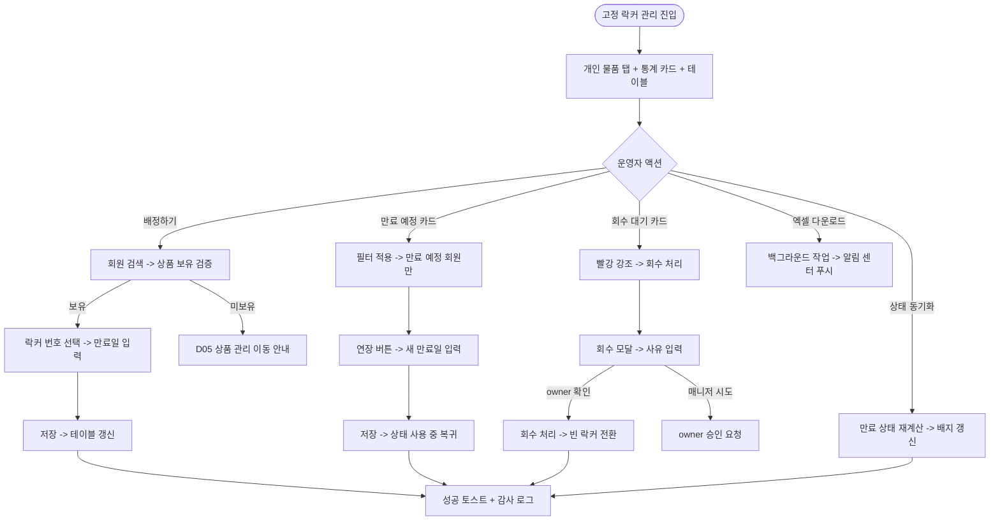
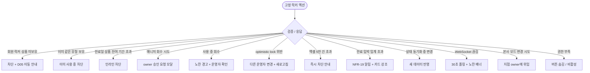

# SCR-I005 고정 물품 락커 관리 페이지

## 1. 화면 메타 정보

이 문서는 고정 물품 락커 관리 페이지에 대한 자기완결형 요구사항 정의서입니다. 다른 문서를 함께 보지 않아도 이 문서 한 장만으로 고정 물품 락커 관리 페이지에 들어가는 모든 영역, 모든 버튼, 모든 모달, 모든 권한, 모든 예외 처리, 그리고 이 화면을 지탱하는 운영 정책까지 전부 이해하고 구현할 수 있도록 작성합니다.

| 항목 | 값 |
|---|---|
| 작성일 | 2026-05-22 |
| 버전 | v1.0 |
| 상태 | 최신 통합본 반영 (D11 재번호화 SCR-I005 확정) |
| 도메인 | D11 통합운영 |
| 화면 ID | SCR-I005 |
| 화면명 | 고정 물품 락커 관리 |
| 화면 유형 | 운영 관리 화면 (Operational Screen) |
| 라우트 (URL) | `/locker/management` |
| 플랫폼 | 데스크톱(기본), 태블릿 |
| 우선순위 | P1 |
| 기능코드 | IoT-04 (옷 락커 운영 관리 + 고정 물품 락커) |
| 계약코드 | FAC-EXT-01 (옷 락커·고정 물품 락커) |
| 부모 기능 prefix | IoT |
| Lv1 코드 | IoT-04 |
| Lv2 / Lv3 세분화 | IoT-04-06 ~ IoT-04-10 (고정 락커 현황 카드, 유형 탭, 배정, 연장·회수, 검색·필터·내보내기) |
| 연계 화면 | SCR-I004 옷 락커 운영 관리, SCR-M004 회원 상세, D05 상품관리, SCR-097 감사 로그 |
| 호출 다이얼로그 | 없음 (배정·연장·회수 인라인 모달만 사용) |

## 2. 화면 개요와 목적

고정 물품 락커 관리 페이지는 상품 계약 기반으로 회원에게 장기 배정하는 개인 소지품 보관 락커를 관리하는 D11 통합운영 도메인의 운영 관리 화면입니다. 본 화면은 출석 기반 당일용 옷 락커(SCR-I004)와 명확히 분리되며, 회원이 락커 상품을 구매한 경우에만 배정이 가능하고 배정일 - 만료일의 장기 사용 모델을 따릅니다. 락커 유형은 개인 물품·골프·프리미엄의 3종 탭으로 분리되어 운영됩니다.

이 화면이 다루는 운영 흐름은 매우 다양합니다. 신규 회원이 락커 상품을 구매한 직후 운영자가 "배정하기"로 회원·락커·만료일을 묶고, 락커 상품을 보유하지 않은 회원에게 배정 시도하면 차단되어 상품 결제 흐름으로 안내합니다. 만료 예정 7일 이내 회원은 자동으로 "만료 예정" 배지가 부여되고, 운영자가 "만료 예정" 통계 카드를 누르면 필터가 적용되어 한 번에 연장 처리할 수 있습니다. 골프 회원의 골프백 보관 락커는 골프 탭에서 별도 관리되고, 프리미엄 락커는 계약 기반으로 별도 가격대의 락커입니다. 계약 만료 후 미회수 락커는 "회수 대기" 상태로 표시되며 운영자가 명시적으로 회수해야 다음 회원에게 배정 가능합니다. 본사 슈퍼관리자는 전 지점 고정 락커 배정 현황을 조회해 락커 활용도와 회수 대기 누적을 모니터링하고, 엑셀 다운로드로 외부 분석 도구에 데이터를 가져갑니다.

따라서 이 화면은 단순한 락커 배정 테이블이 아니라, 회원 상품 보유 검증(D05 상품 관리) · 만료 예정 자동 갱신 · 락커 유형별 운영 정책 · 회수 대기 라이프사이클 · 엑셀 내보내기 · 본사 통합 모드 BI까지 모두 반영된 장기 락커 운영 허브로 동작해야 합니다.

## 3. 진입 경로와 인접 화면

고정 물품 락커 관리 페이지에 진입하는 경로는 여러 가지입니다.

첫 번째 경로는 사이드바입니다. 좌측 사이드바의 "통합운영" 메뉴 아래 "고정 물품 락커 관리" 항목을 클릭하면 진입하며, 기본 탭은 "개인 물품"이고 기본 상태(상태 = 전체)로 시작합니다.

두 번째 경로는 SCR-I004 옷 락커 운영 관리의 헤더 "고정 락커 관리로 이동" 링크를 누른 경우로, 같은 도메인 내에서 자연스럽게 전환됩니다.

세 번째 경로는 SCR-M004 회원 상세의 락커 정보 카드에서 "고정 락커 배정" 또는 "고정 락커 연장" 버튼을 누른 경우로, 해당 회원이 이미 선택된 상태로 배정·연장 모달이 자동 호출됩니다.

네 번째 경로는 알림 센터의 "고정 락커 만료 임박 N건" 알림 클릭으로, 상태 필터 = 만료 예정이 자동 적용된 상태로 진입합니다.

다섯 번째 경로는 D05 상품 관리에서 락커 상품을 가진 회원 목록을 분석할 때 "고정 락커 배정 현황 보기" 링크를 누른 경우입니다.

이 화면에서 빠져나가는 인접 화면으로는, 행의 회원명 클릭으로 진입하는 SCR-M004 회원 상세, 락커 상품 미보유 회원의 상품 구매 안내 시 이동하는 D05 상품 관리, 옷 락커 운영으로 전환할 때 이동하는 SCR-I004 옷 락커 운영 관리, 운영 이력 추적 시 이동하는 SCR-097 감사 로그가 있습니다.

## 4. 레이아웃과 UI 구성

고정 물품 락커 관리 페이지는 상단 통계 카드 + 유형 탭 + 메인 테이블의 3단 레이아웃을 기본으로 합니다.

페이지 헤더 좌측에는 "고정 물품 락커 관리"라는 타이틀과 지점 컨텍스트 배지가 표시됩니다. 본사 통합 모드에서는 지점 선택 드롭다운이 활성화되어 전 지점 락커 현황을 조회할 수 있습니다.

페이지 헤더 우측에는 "배정하기", "상태 동기화", "엑셀 다운로드" 세 버튼이 일렬로 배치됩니다. "배정하기"는 신규 배정 모달을 호출하고, "상태 동기화"는 만료 상태를 재계산해 배지를 갱신하며, "엑셀 다운로드"는 현재 필터·탭의 데이터를 엑셀 파일로 내려받습니다.

페이지 헤더 바로 아래에는 상단 통계 카드 4개가 가로로 배치됩니다. 첫 번째 카드는 "전체 고정 락커"로 지점에 등록된 고정 물품 락커 총 수량을 보여줍니다. 두 번째 카드는 "배정 중"으로 현재 회원에게 배정된 수량을 보여주며 클릭 시 상태 = 사용 중 필터가 적용됩니다. 세 번째 카드는 "만료 예정"으로 7일 이내 만료 예정 수량을 보여주며 클릭 시 상태 = 만료 예정 필터가 적용됩니다. 네 번째 카드는 "회수 대기"로 계약 만료 후 미회수 수량을 보여주며 클릭 시 상태 = 회수 대기 필터가 적용되고 카드 자체가 빨강 톤으로 약하게 강조됩니다.

통계 카드 아래에는 락커 유형 탭이 가로로 배치됩니다. "개인 물품", "골프", "프리미엄"의 3개 탭이며, 각 탭에는 해당 유형의 락커 수가 배지로 표시됩니다. 어느 탭이 선택되었는지는 URL 쿼리 파라미터 `type`으로 반영됩니다.

유형 탭 아래에는 검색·필터 바가 있습니다. 가장 왼쪽에는 통합 검색창(회원명·락커 번호·상품명)이 있고, 그 오른쪽에 상태 필터(전체·사용 중·만료 예정·만료·회수 대기), 만료 기간 필터(이번 주·이번 달·직접 선택)가 배치됩니다.

검색·필터 바 아래에 배정 현황 테이블이 있습니다. 테이블 컬럼은 좌측부터 락커 번호, 회원명, 상품명, 배정일, 만료일, 상태 배지, 관리(연장·회수 버튼) 순서입니다. 락커 번호는 텍스트로 표시되며 클릭 시 회원 상세 모달이 작게 열립니다. 회원명을 클릭하면 SCR-M004 회원 상세로 이동합니다. 상품명은 D05 상품 관리에 등록된 락커 상품명을 그대로 표시합니다. 배정일과 만료일은 YYYY-MM-DD 형식이며, 만료일이 D-7 이내면 컬럼이 주황 톤으로 강조되고 D-Day 도래 후에는 빨강 톤으로 강조됩니다.

상태 배지는 사용 중(녹색)·만료 예정(주황)·만료(회색)·회수 대기(빨강)의 4종으로 색상 분기됩니다. 관리 컬럼의 "연장" 버튼은 사용 중·만료 예정·만료 상태에서 활성화되고, "회수" 버튼은 사용 중·만료·회수 대기 상태에서 활성화됩니다.

페이지 하단에는 페이지네이션이 있습니다. 좌측 페이지당 건수 드롭다운(20·50·100), 가운데 페이지 번호 컨트롤, 우측 "총 N건" 합계가 표시됩니다.

## 5. 탭 구성과 탭별 동작

이 화면의 탭 구성은 락커 유형 3개(개인 물품·골프·프리미엄)입니다. 어느 탭을 누르든 그 유형에 속한 락커만 테이블에 표시되고, 통계 카드 카운트도 해당 유형으로 재계산됩니다.

개인 물품 탭은 일반 소형 개인 소지품 보관용 락커입니다. 가장 일반적인 락커 유형이며, 락커 상품도 기본 구성에 포함됩니다.

골프 탭은 골프백 보관용 대형 락커입니다. 골프 키오스크가 활성화된 지점에서 주로 운영되며, 락커 크기와 가격이 개인 물품보다 큽니다. 골프 회원 전용으로 운영되는 경우가 많습니다.

프리미엄 탭은 계약 기반의 고급 락커입니다. 계약 가격이 높고 별도의 락커 상품으로 분리됩니다. 프리미엄 회원에게만 배정이 가능합니다.

탭을 전환하면 검색·필터·정렬·페이지는 초기화됩니다. 락커 유형이 바뀌면 운영 맥락이 완전히 달라지기 때문에 의도적으로 초기화하는 설계입니다. 다만 통계 카드 클릭으로 필터를 적용한 상태에서 탭을 바꾸면 같은 필터가 다른 유형에도 적용됩니다.

## 6. 버튼·아이콘·링크 액션 전체 정의

이 화면의 모든 클릭 가능한 요소를 빠짐없이 정의합니다.

상단 통계 카드 4개는 모두 클릭 가능합니다. "배정 중"은 상태 = 사용 중 필터, "만료 예정"은 상태 = 만료 예정 필터, "회수 대기"는 상태 = 회수 대기 필터를 적용합니다. "전체 고정 락커"는 모든 필터를 초기화합니다.

페이지 헤더의 "배정하기" 버튼은 owner·manager 이상에서만 활성화되며, 누르면 배정 모달이 열립니다. 본 모달에서 회원 검색, 락커 번호 선택, 만료일 입력을 거쳐 저장합니다.

페이지 헤더의 "상태 동기화" 버튼은 현재 탭의 모든 락커에 대해 만료 상태를 재계산하고 배지를 갱신합니다. 30초 쿨다운이 적용되며, 동기화 중에는 로딩 스피너가 표시됩니다. 새벽 배치(매일 04:00)로도 자동 재계산되지만, 운영자가 즉시 갱신이 필요할 때 사용합니다.

페이지 헤더의 "엑셀 다운로드" 버튼은 현재 필터·탭·정렬을 그대로 적용한 전체 데이터(페이지네이션 무시)를 엑셀 파일로 내려받습니다. 데이터가 5만 건을 초과하면 "데이터가 너무 많아요. 필터를 좁혀주세요" 안내가 표시됩니다. 다운로드는 백그라운드로 처리되며 완료 시 알림 센터에 푸시됩니다.

테이블 행의 "연장" 버튼은 연장 모달을 호출합니다. 모달에는 새 만료일 입력 캘린더와 연장 사유 입력란이 표시됩니다. 만료된 락커는 연장 시 만료일이 미래로 설정되어 사용 중 상태로 복귀합니다.

테이블 행의 "회수" 버튼은 회수 확인 모달을 호출합니다. 모달에는 회수 사유 선택(계약 만료·회원 요청·이전·기타) 또는 직접 입력란이 표시됩니다. 회수 시 회원-락커 매핑은 끊기지만 이력은 보존됩니다.

테이블 행 클릭(락커 번호 또는 회원명 클릭)은 다른 인접 화면으로 이동합니다. 락커 번호 클릭은 작은 상세 모달을 열어 배정 이력, 연장 이력, 회수 이력을 표시합니다. 회원명 클릭은 SCR-M004 회원 상세로 이동합니다.

모든 변경 액션(배정·연장·회수)은 클릭 후 응답이 돌아오기 전까지 자동으로 비활성화되어 더블클릭 중복 요청이 차단됩니다.

## 7. 호출되는 모달 동작

이 화면에서 호출되는 모달은 인라인 모달이며 별도 DLG-* 다이얼로그가 아닙니다.

### 7-1. 신규 배정 모달

신규 배정 모달은 페이지 헤더의 "배정하기" 버튼으로 호출됩니다. 모달 상단에 "고정 락커 배정" 제목이 표시되고, 본문에는 입력 항목이 순서대로 배치됩니다.

회원 검색은 자동완성 검색창이며, 이름·회원번호로 검색합니다. 검색 결과에서 회원을 선택하면 그 아래에 회원의 락커 상품 보유 여부가 자동 검증됩니다. 락커 상품 미보유 시 빨강 안내 "이 회원은 현재 탭의 락커 상품을 보유하고 있지 않습니다"와 함께 "락커 상품 안내로 이동" 링크가 D05 상품 관리 화면으로 제공되며 저장이 차단됩니다. 락커 상품 보유 시 보유 상품명과 잔여 기간이 함께 표시됩니다.

락커 번호 선택은 빈 락커 목록 그리드에서 선택하며, 사용 중·만료 예정·회수 대기 락커는 선택 불가입니다. 락커 번호는 현재 탭의 유형(개인 물품·골프·프리미엄)에 속한 락커만 표시됩니다.

만료일 입력은 캘린더 위젯이며, 회원의 락커 상품 잔여 기간을 초과하지 않도록 자동 제한됩니다.

확인을 누르면 모달이 로딩 상태가 되고 백엔드에 배정 요청이 전송됩니다. 성공하면 모달이 닫히고 테이블이 즉시 갱신되어 새 배정이 상단에 표시됩니다. 회원이 이미 같은 유형의 락커를 보유 중이면 "이 회원은 이미 개인 물품 락커를 사용 중입니다" 안내가 표시됩니다.

### 7-2. 만료일 연장 모달

만료일 연장 모달은 테이블 행의 "연장" 버튼으로 호출됩니다. 모달 상단에 "락커 만료일 연장" 제목과 함께 대상 락커 번호, 회원명, 현재 만료일이 표시됩니다.

본문에는 새 만료일 입력 캘린더와 연장 사유 입력란(선택)이 있습니다. 새 만료일은 현재 만료일 이후로 자동 제한되며, 회원의 락커 상품 잔여 기간을 초과하지 못합니다. 연장 사유는 선택 입력이며 자유 텍스트입니다.

확인 시 만료일이 갱신되고 만료 상태도 재계산됩니다. 만료된 락커를 연장하면 사용 중 상태로 복귀합니다. 모든 연장 이력은 감사 로그에 기록됩니다.

### 7-3. 회수 확인 모달

회수 확인 모달은 테이블 행의 "회수" 버튼으로 호출됩니다. 모달 상단에 "락커 회수" 제목과 함께 대상 락커 번호, 회원명, 배정일·만료일, 현재 상태가 표시됩니다.

본문에는 회수 사유 선택 드롭다운(계약 만료·회원 요청·이전·기타)과 사유 메모 입력란(선택)이 있습니다. 사용 중 상태인 락커를 회수하려고 하면 노란 경고 "회원이 아직 락커를 사용 중입니다. 회수하면 락커 연결이 끊깁니다"가 표시되며, 운영자가 명시적으로 확인해야 진행됩니다.

매니저가 회수를 시도하면 "owner 승인 요청이 필요합니다" 안내와 함께 승인 요청 모달이 표시됩니다.

확인 시 회원-락커 매핑이 제거되고 락커가 "빈 락커" 상태로 전환됩니다. 이력은 보존되어 추후 조회 가능합니다.

### 7-4. 락커 상세 모달

락커 상세 모달은 테이블 행의 락커 번호를 클릭했을 때 호출됩니다. 모달 상단에 락커 번호, 유형, 위치(존)가 표시되고, 본문에는 배정 이력(시간순), 연장 이력(시간순), 회수 이력(시간순)이 탭으로 분리되어 표시됩니다.

각 이력 항목에는 일자, 액션, 운영자, 사유가 표시됩니다. 상세 모달은 조회 전용이며 변경 액션이 없습니다.

## 8. 토스트와 확인 팝업과 알럿

성공 토스트는 "락커가 배정되었습니다", "만료일이 연장되었습니다", "락커가 회수되었습니다", "상태가 동기화되었습니다", "엑셀 다운로드가 시작되었습니다" 같은 문구로 결과를 알려줍니다.

실패 토스트는 "이 회원은 락커 상품을 보유하고 있지 않습니다", "이미 같은 유형의 락커를 사용 중입니다", "만료일이 락커 상품 잔여 기간을 초과합니다", "데이터가 너무 많아요. 필터를 좁혀주세요", "권한이 없어요" 같은 문구가 표시됩니다.

경고 토스트는 노랑 계열로 "회원이 아직 락커를 사용 중입니다", "락커 상품이 만료되었습니다. 회원이 재구매해야 합니다" 같은 안내를 표시합니다.

확인 팝업은 배정·연장·회수의 각 액션에서 표시됩니다.

알럿은 권한 없는 계정의 URL 접근 시 차단형 메시지로 표시됩니다.

## 9. 데이터 흐름과 외부 연동

화면 진입 시 `GET /api/lockers/fixed`로 지점의 모든 고정 락커 목록을 조회합니다. 응답에는 락커별 번호·유형·상태·배정 회원·배정일·만료일·상품명이 포함되며, 통계 카드 카운트가 같은 응답에서 derive됩니다.

신규 배정은 `POST /api/lockers/fixed/assign`으로 호출되며, 본문에 회원 ID·락커 ID·만료일이 포함됩니다. 응답에는 회원의 락커 상품 보유 여부 검증 결과가 함께 내려옵니다.

만료일 연장은 `PUT /api/lockers/fixed/:id/extend`로 호출되며, 본문에 새 만료일과 사유가 포함됩니다.

회수는 `POST /api/lockers/fixed/:id/recover`로 호출되며, 본문에 회수 사유가 포함됩니다.

상태 동기화는 `POST /api/lockers/fixed/sync-status`로 호출되어 모든 락커의 만료 상태를 재계산합니다.

엑셀 다운로드는 `GET /api/lockers/fixed/export`로 작업 등록되어 백그라운드 처리되며, 완료 시 알림 센터에 푸시됩니다.

회원의 락커 상품 보유 검증은 D05 상품 관리의 회원 상품 데이터를 조회합니다. 락커 상품이 없거나 만료된 경우 배정이 차단됩니다.

자동 만료 상태 갱신은 매일 04:00 배치로 실행되어 D-7 이내 회원에게 "만료 예정" 배지를 자동 부여하고, D-Day 도래 시 "만료" 상태로 자동 전환하며, 일정 기간(기본 30일) 미회수 시 "회수 대기" 상태로 자동 전환합니다.

NFR-19 알림 센터는 만료 예정 임계 초과(예: 10건 이상), 회수 대기 누적, 락커 상품 만료 시 owner와 매니저에게 푸시 알림을 발송합니다.

모든 배정·연장·회수는 SCR-097 감사 로그에 비동기로 INSERT됩니다. `actor_id`, `target_locker_id`, `action`, `member_id`, `before`, `after`, `reason`, `timestamp`가 기록됩니다.

화면에서 호출하는 주요 API 엔드포인트는 다음과 같습니다. 목록 `GET /api/lockers/fixed`, 신규 배정 `POST /api/lockers/fixed/assign`, 연장 `PUT /api/lockers/fixed/:id/extend`, 회수 `POST /api/lockers/fixed/:id/recover`, 상태 동기화 `POST /api/lockers/fixed/sync-status`, 엑셀 내보내기 `GET /api/lockers/fixed/export`, 락커 상세 이력 `GET /api/lockers/fixed/:id/history`.

## 10. 화면 상태와 예외 처리

기본 상태에서는 통계 카드와 테이블이 정상 표시되고 모든 액션이 권한에 맞게 동작합니다.

만료 예정 있음 상태에서는 "만료 예정" 통계 카드가 주황 톤으로 강조되고, 테이블에서 D-7 이내 회원이 우선 표시됩니다. 임계 초과(10건 이상) 시 owner와 매니저에게 알림이 발송됩니다.

회수 대기 있음 상태에서는 "회수 대기" 통계 카드가 빨강 톤으로 강조되고, 테이블에서 회수 대기 상태의 락커가 시각적으로 부각됩니다.

빈 상태(배정 없음)는 현재 탭에 배정된 락커가 0개일 때 표시되며, "배정된 락커가 없습니다" 안내와 "배정하기" CTA가 강조됩니다.

락커 미등록 상태는 지점에 해당 유형의 락커가 0개 등록된 경우이며, "등록된 고정 락커가 없습니다" 안내와 시설 관리 화면 이동 링크가 표시됩니다.

본사 통합 모드 조회 전용 상태에서는 모든 변경 액션이 비활성화됩니다.

권한 부족 상태에서는 변경 액션이 차단되고 조회만 가능합니다.

예외 케이스별 처리는 다음과 같이 정의됩니다.

회원 락커 상품 미보유 상태에서 배정 시도는 차단되며 D05 상품 관리 안내 링크가 제공됩니다.

회원이 이미 같은 유형의 락커를 보유 중인 상태에서 배정 시도는 차단됩니다.

만료일이 락커 상품 잔여 기간을 초과하면 인라인 차단됩니다.

매니저가 회수를 시도하면 owner 승인 요청이 자동 표시됩니다.

사용 중 상태에서 회수 시 노란 경고가 표시되고 운영자 확인을 받습니다.

상태 동기화 중에 다른 운영자가 변경하면 동기화 결과가 새 데이터로 갱신됩니다.

엑셀 다운로드 5만 건 초과 시 즉시 차단됩니다.

WebSocket 끊김 시 30초 폴링으로 fallback되며 노란 배너가 표시됩니다.

본사 통합 모드에서의 변경 시도는 모두 차단됩니다.

## 11. 권한별 처리

슈퍼관리자·primary는 전 지점 고정 락커를 조회만 가능하며, 본사 통합 모드에서는 변경이 차단됩니다.

owner는 자기 지점의 배정·연장·회수·상태 동기화·엑셀 다운로드까지 모든 액션이 가능합니다.

manager는 배정과 연장이 가능하며 회수는 owner 승인이 필요합니다.

staff는 조회만 가능합니다.

강사·readonly는 조회만 가능합니다.

권한 차단 이벤트는 감사 로그에 기록됩니다.

## 12. 메인 흐름

## 13. 에러와 예외 흐름

## 14. 핵심 디자인 요청사항

통계 카드 4개는 동일 크기·동일 그리드로 배치되며, "만료 예정"은 주황 톤, "회수 대기"는 빨강 톤으로 약한 강조를 줘 운영자의 시선을 끕니다.

락커 유형 탭 3개는 가로로 명확히 분리되어 한눈에 들어오며, 각 탭에 배지로 해당 유형의 락커 수가 표시됩니다.

테이블의 상태 컬럼은 배지 색상으로 분기되며(사용 중 녹색, 만료 예정 주황, 만료 회색, 회수 대기 빨강), 만료일이 D-7 이내인 행은 만료일 컬럼이 주황 톤으로 강조되고 D-Day 후에는 빨강 톤으로 더 강조됩니다.

배정 모달의 회원 검색 결과에서 락커 상품 보유 여부는 녹색(보유) / 빨강(미보유) 배지로 명확히 표시되어, 운영자가 검증 결과를 즉시 인지합니다.

회수 모달에서 사용 중 상태일 때 노란 경고가 부드럽지만 명확하게 표시되어, 운영자가 회원에게 영향을 주는 액션임을 인식합니다.

상태 동기화 중에는 헤더 버튼이 로딩 스피너로 바뀌고, 완료 시 부드러운 페이드 트랜지션으로 상태 배지가 갱신됩니다.

엑셀 다운로드 진행률은 헤더에 작게 표시되거나 알림 센터로 푸시되어 운영자가 다른 작업을 계속할 수 있게 합니다.

진행 스피너와 로딩 스켈레톤은 다른 D11 화면과 동일한 톤으로 통일됩니다.

## 15. 운영 정책 (이 화면에 연결된 부분)

고정 락커는 출석 기반 옷 락커(SCR-I004)와 명확히 분리되는 "상품 계약 기반 장기 배정" 모델입니다. 회원이 락커 상품을 구매한 경우에만 배정이 가능하고 배정일 - 만료일의 장기 사용 모델을 따르며, 마감 시간 자동 회수가 적용되지 않습니다.

배정 사전 검증 정책은 회원이 락커 상품을 보유하고 있고 그 상품이 만료되지 않은 상태에서만 배정이 가능하다는 것입니다. 락커 상품 미보유 회원은 D05 상품 관리에서 락커 상품을 결제한 후 배정 가능하며, 결제 흐름이 안내 링크로 제공됩니다.

만료 자동 갱신 정책은 매일 04:00 배치로 모든 고정 락커의 만료 상태를 자동 재계산한다는 것입니다. D-7 이내 회원에게 "만료 예정" 배지를 자동 부여하고, D-Day 도래 시 "만료" 상태로 자동 전환하며, 일정 기간(기본 30일) 미회수 시 "회수 대기" 상태로 자동 전환합니다. 운영자가 즉시 갱신이 필요하면 "상태 동기화" 버튼으로 수동 실행할 수 있습니다.

회수 권한 정책은 매니저 이하는 owner 승인이 필요하다는 것입니다. 회수는 회원의 짐을 정리해야 하는 행위이기 때문에 운영 실수의 위험이 크고, 권한이 단계적으로 제한됩니다.

이력 보존 정책은 회수 후에도 회원-락커 매핑 이력이 보존된다는 것입니다. 락커 상세 모달에서 배정 이력·연장 이력·회수 이력을 추후 조회할 수 있으며, 분쟁 시 근거 자료로 사용됩니다.

유형별 운영 정책은 개인 물품·골프·프리미엄이 명확히 분리된다는 것입니다. 운영자는 한 회원에게 같은 유형의 락커를 중복 배정할 수 없고, 다른 유형(개인 물품 + 골프)은 동시 보유가 가능합니다.

만료일 상품 잔여 기간 제한 정책은 만료일이 회원의 락커 상품 잔여 기간을 초과할 수 없다는 것입니다. 회원이 락커 상품을 6개월 결제한 경우 만료일은 결제 후 6개월 이내로만 설정할 수 있고, 캘린더 위젯에서 자동 제한됩니다.

엑셀 다운로드 권한은 owner 이상으로 한정되며, 5만 건 초과 다운로드는 차단됩니다. 본사 통합 모드 다운로드는 본사 권한자만 가능하고, 첫 컬럼에 소속 지점이 추가됩니다.

본사 통합 모드 정책은 본사 권한자가 전 지점 락커 현황을 조회·엑셀 다운로드만 할 수 있다는 것입니다. 락커 운영은 지점 현장 상황에 직결되므로 변경은 지점 owner가 직접 수행합니다.

KPI 측정 기준은 본 화면의 통계 카드와 연결됩니다. 락커 활용도는 배정 중 락커 수 ÷ 전체 락커 수 × 100을 일 단위로 측정하고, 회수 대기율은 회수 대기 락커 수 ÷ 전체 락커 수 × 100으로 측정합니다.

감사 로그 정책은 모든 배정·연장·회수가 SCR-097에 비동기로 INSERT된다는 것입니다. `actor_id`, `target_locker_id`, `action`, `member_id`, `before`, `after`, `reason`, `timestamp`가 기록됩니다.

이상의 모든 정책은 이 화면을 구현하고 운영하는 사람이 별도 문서 없이 이 한 장만 보면 이해할 수 있도록 풀어 적었습니다.
