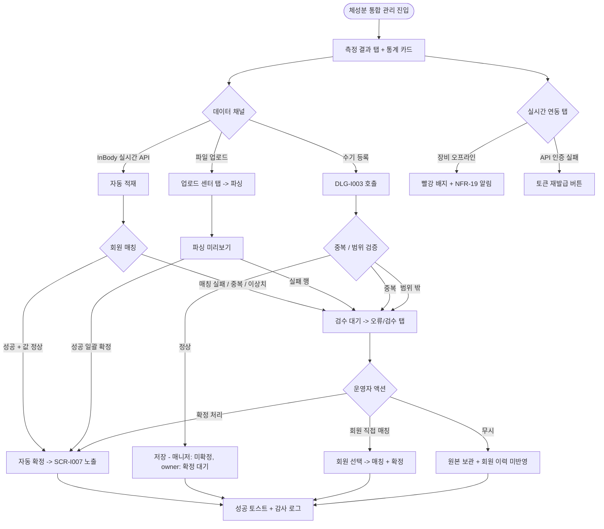

# SCR-I006 체성분 통합 관리 페이지

## 1. 화면 메타 정보

이 문서는 체성분 통합 관리 페이지에 대한 자기완결형 요구사항 정의서입니다. 다른 문서를 함께 보지 않아도 이 문서 한 장만으로 체성분 통합 관리 페이지에 들어가는 모든 영역, 모든 탭, 모든 버튼, 모든 모달, 모든 권한, 모든 예외 처리, 그리고 이 화면을 지탱하는 운영 정책까지 전부 이해하고 구현할 수 있도록 작성합니다.

| 항목 | 값 |
|---|---|
| 작성일 | 2026-05-22 |
| 버전 | v1.0 |
| 상태 | 최신 통합본 반영 (D11 재번호화 SCR-I006 확정) |
| 도메인 | D11 통합운영 |
| 화면 ID | SCR-I006 |
| 화면명 | 체성분 통합 관리 |
| 화면 유형 | 허브 화면 (Hub Screen) |
| 라우트 (URL) | `/body-composition` |
| 플랫폼 | 데스크톱(기본), 태블릿 |
| 우선순위 | P1 |
| 기능코드 | IoT-05 (회원 건강 연동 요약 + 체성분 통합 관리) |
| 부모 기능 prefix | IoT |
| Lv1 코드 | IoT-05 |
| Lv2 / Lv3 세분화 | IoT-05-06 ~ IoT-05-08 (체성분 통합 관리, 검수 처리, 수기 등록) |
| 연계 화면 | SCR-I003 IoT 연동 관리, SCR-I007 회원 건강 연동 요약, SCR-M004 회원 상세, SCR-097 감사 로그 |
| 호출 다이얼로그 | DLG-I003 체성분수기등록 |
| 연계 외부 시스템 | EXT-INBODY (InBody 측정기 실시간 API), 파일 업로드 채널 (CSV/XLSX) |

## 2. 화면 개요와 목적

체성분 통합 관리 페이지는 전체 회원의 체성분 측정 현황을 통합 관리하는 D11 통합운영 도메인의 허브 화면입니다. InBody 등 측정 장비 연동(실시간 API), 파일 업로드(장비에서 추출한 CSV/XLSX), 수기 입력(관리자가 직접 입력)의 3가지 채널로 수집된 데이터를 검수하고 확정 처리합니다. 본 화면은 측정 자체의 검수·확정 처리에 집중하며, 회원별 체성분 요약 조회는 별도 화면 SCR-I007 회원 건강 연동 요약에서 다룹니다.

이 화면이 다루는 운영 흐름은 매우 다양합니다. 회원이 InBody 측정기에서 체성분을 측정하면 실시간 API로 본 화면에 자동 적재되고, 이름·회원번호 매칭이 성공하면 측정 결과 탭에 즉시 노출되며 매칭 실패 시 검수 대기 상태로 들어갑니다. 정전이나 네트워크 단절로 실시간 API가 동작하지 않은 측정은 파일 업로드 탭에서 CSV/XLSX 파일을 업로드해 일괄 적재하고 파싱 결과를 미리 확인한 뒤 확정합니다. 장비 없이 운영하는 지점이나 임시 측정은 수기 등록(DLG-I003)으로 처리하며, 동일 회원·동일 측정 시각의 중복 데이터는 자동으로 "검수 대기" 상태로 저장됩니다. 매니저는 측정 결과 조회와 수기 등록은 가능하지만 검수 처리는 owner가 담당하며, 강사는 본인 담당 회원에 한해 수기 등록 가능합니다. 본사 슈퍼관리자는 전 지점의 체성분 측정 현황을 조회해 측정 활용도와 검수 대기 누적을 모니터링합니다.

따라서 이 화면은 단순한 측정 결과 목록이 아니라, 외부 InBody 장비 연동(EXT-INBODY 채널 상태) · 파일 업로드 파싱 · 수기 입력 검증 · 회원 매칭 실패 검수 · 중복 감지 · 값 이상치 판정 · 회원 건강 요약(SCR-I007) 노출 정책까지 모두 반영된 체성분 운영 허브로 동작해야 합니다.

## 3. 진입 경로와 인접 화면

체성분 통합 관리 페이지에 진입하는 경로는 여러 가지입니다.

첫 번째 경로는 사이드바입니다. 좌측 사이드바의 "통합운영" 메뉴 아래 "체성분 통합 관리" 항목을 클릭하면 진입하며, 기본 탭은 "측정 결과"이고 기본 상태(필터 없음, 최신순 정렬)로 시작합니다.

두 번째 경로는 알림 센터(SCR-104)의 운영 알림 클릭입니다. "검수 대기 N건 누적", "InBody 장비 오프라인", "InBody API 토큰 만료" 같은 알림을 클릭하면 해당 탭과 필터가 자동 적용된 상태로 진입합니다.

세 번째 경로는 SCR-I003 IoT 연동 관리의 InBody 채널 배지에서 "체성분 관리로 이동" 링크를 누른 경우로, 실시간 연동 탭이 자동 활성화됩니다.

네 번째 경로는 SCR-I007 회원 건강 연동 요약에서 "측정 데이터 보기" 링크를 누른 경우로, 해당 회원의 측정 결과만 필터링된 상태로 진입합니다.

다섯 번째 경로는 SCR-M004 회원 상세의 체성분 이력 카드에서 "측정 결과 관리로 이동" 링크를 누른 경우입니다.

이 화면에서 빠져나가는 인접 화면으로는, 측정 결과 행 클릭으로 진입하는 SCR-M004 회원 상세, InBody 장비 상태 점검 시 이동하는 SCR-I003 IoT 연동 관리, 회원 건강 요약 종합 조회 시 이동하는 SCR-I007 회원 건강 연동 요약, 검수·확정 이력 추적 시 이동하는 SCR-097 감사 로그가 있습니다.

## 4. 레이아웃과 UI 구성

체성분 통합 관리 페이지는 상단 통계 카드 + 4개 탭 + 탭별 메인 영역의 레이아웃을 기본으로 합니다.

페이지 헤더 좌측에는 "체성분 통합 관리"라는 타이틀과 지점 컨텍스트 배지가 표시됩니다. 본사 통합 모드에서는 지점 선택 드롭다운이 활성화되어 전 지점의 측정 결과를 조회할 수 있습니다.

페이지 헤더 우측에는 "수기 등록", "파일 업로드", "연동 로그" 세 버튼이 일렬로 배치됩니다. "수기 등록"은 DLG-I003 체성분수기등록 다이얼로그를 호출하고, "파일 업로드"는 업로드 센터 탭으로 자동 이동하면서 파일 선택창을 띄우며, "연동 로그"는 실시간 연동 탭으로 자동 이동합니다.

페이지 헤더 바로 아래에는 상단 통계 카드 4개가 가로로 배치됩니다. 첫 번째 카드는 "오늘 측정 건수"로 금일 체성분 측정 완료 건수를 보여줍니다. 두 번째 카드는 "검수 대기"로 매칭 실패·중복·이상치로 검수 필요한 건수를 보여주며, 클릭 시 오류/검수 탭으로 자동 이동합니다. 검수 대기가 0이 아닐 때는 카드가 주황 톤으로 강조됩니다. 세 번째 카드는 "미확정"으로 수집됐지만 아직 확정 처리되지 않은 건수를 보여주며, 클릭 시 확정 여부 = 미확정 필터가 측정 결과 탭에 적용됩니다. 네 번째 카드는 "연동 장비"로 현재 온라인 상태인 InBody 장비 수를 보여주며, 클릭 시 실시간 연동 탭으로 이동합니다. 장비가 오프라인이면 카드가 빨강 톤으로 강조됩니다.

통계 카드 아래에는 4개 메인 탭이 가로로 배치됩니다. "측정 결과", "업로드 센터", "실시간 연동", "오류/검수"의 4개이며, 어느 탭이 선택되었는지는 URL 쿼리 파라미터 `tab`으로 반영됩니다.

측정 결과 탭은 확정된 체성분 결과를 테이블로 표시합니다. 컬럼은 측정일시, 회원명, 체중(kg), 골격근량(kg), 체지방률(%), BMI, 입력 채널 배지(수기·파일·실시간 API), 확정 여부 배지(확정·미확정), 행 액션(회원 상세 이동)입니다. 측정일시 컬럼은 기본 내림차순 정렬이며 사용자가 변경 가능합니다. 입력 채널 배지는 수기(회색)·파일(파랑)·실시간 API(녹색)로 분기됩니다. 확정 여부 배지는 확정(녹색) / 미확정(주황)으로 분기됩니다.

테이블 상단에는 필터·검색 영역이 있습니다. 검색창(회원명·회원번호), 기간 필터(오늘·이번 주·이번 달·직접 선택), 입력 채널 필터(전체·수기·파일·실시간 API), 확정 여부 필터(전체·확정·미확정)가 배치됩니다.

업로드 센터 탭은 파일 업로드·파싱·확정 흐름을 다룹니다. 상단에 파일 선택 영역(드래그 앤 드롭 + 파일 선택 버튼)이 있고, 지원 형식(CSV·XLSX)과 최대 용량(10MB)이 안내됩니다. 파일을 업로드하면 파싱 결과 미리보기 테이블이 표시되며, 파싱 성공·실패 행이 색상으로 분기됩니다. 파싱 실패 행은 사유(컬럼 누락·값 형식 오류·회원 매칭 실패)와 함께 표시되고, 운영자는 수정 후 재업로드하거나 그대로 확정해 검수 대기로 보낼 수 있습니다.

실시간 연동 탭은 InBody 장비 API 수신 로그를 시간순으로 표시합니다. 각 로그 행에는 수신 시각, 장비 ID, 회원 매칭 결과, 측정 값 요약, 처리 상태(자동 확정·검수 대기)가 표시됩니다. 장비별 채널 상태 카드도 상단에 가로로 배치되어, InBody 장비가 온라인·오프라인·오류·인증 실패 중 어느 상태인지 즉시 확인할 수 있습니다. 인증 실패 시 "토큰 재발급" 버튼이 노출됩니다.

오류/검수 탭은 검수가 필요한 데이터를 카드형 리스트로 표시합니다. 각 카드에는 오류 유형 배지(회원 매칭 실패·중복·값 이상치), 수집 시각, 입력 채널, 원본 값(체중·골격근량·체지방률 등), 추정 회원 후보, 처리 액션 버튼(회원 직접 매칭·무시·확정 처리)이 표시됩니다.

## 5. 탭 구성과 탭별 동작

이 화면의 탭 구성은 4개입니다.

측정 결과 탭은 확정된 체성분 데이터를 조회하는 가장 기본 탭이며, 회원 건강 요약(SCR-I007)에 노출되는 데이터의 소스입니다. 확정 여부 필터로 미확정 데이터도 함께 볼 수 있지만, 미확정 데이터는 SCR-I007에 노출되지 않습니다.

업로드 센터 탭은 InBody 장비에서 추출한 CSV/XLSX 파일을 일괄 적재하는 흐름입니다. 실시간 API가 동작하지 않거나 과거 데이터를 일괄 입력해야 할 때 사용합니다. 파일 형식이 표준 InBody 출력 형식과 다른 경우 헤더 매핑 안내가 필요할 수 있습니다.

실시간 연동 탭은 InBody 장비의 API 수신 상태와 로그를 보는 탭이며, EXT-INBODY 외부 시스템 연동의 운영 모니터링 화면 역할을 합니다. 장비 오프라인 또는 API 인증 실패 시 즉시 인지할 수 있게 합니다.

오류/검수 탭은 자동 확정이 불가능한 데이터를 운영자가 수동으로 처리하는 탭입니다. 회원 매칭 실패, 중복 의심, 값 이상치의 3종 오류가 모두 모여 있고, 운영자는 각 카드에서 회원 직접 매칭·무시·확정 처리를 선택합니다.

어느 탭을 누르든 검색·필터는 탭별로 독립적으로 동작하며, 탭을 바꾸면 새 데이터 fetch가 일어납니다.

## 6. 버튼·아이콘·링크 액션 전체 정의

이 화면의 모든 클릭 가능한 요소를 빠짐없이 정의합니다.

상단 통계 카드 4개는 모두 클릭 가능합니다. "검수 대기"는 오류/검수 탭으로 자동 이동, "미확정"은 측정 결과 탭에서 확정 여부 = 미확정 필터, "연동 장비"는 실시간 연동 탭으로 자동 이동합니다.

페이지 헤더의 "수기 등록" 버튼은 DLG-I003 체성분수기등록 다이얼로그를 호출합니다. 매니저 이상에서 활성화되며, 강사는 본인 담당 회원 한정으로 사용 가능합니다.

페이지 헤더의 "파일 업로드" 버튼은 업로드 센터 탭으로 자동 이동하면서 파일 선택창을 띄웁니다.

페이지 헤더의 "연동 로그" 버튼은 실시간 연동 탭으로 자동 이동합니다.

측정 결과 탭 테이블의 행 클릭은 SCR-M004 회원 상세로 이동합니다. 매니저 이상 권한에서만 동작하며, 강사는 담당 회원만 클릭 가능합니다.

측정 결과 탭의 미확정 행에는 "확정 처리" 버튼이 노출됩니다. owner 이상에서만 활성화되며, 누르면 확인 모달 후 확정 상태로 전환됩니다.

업로드 센터 탭의 "파일 선택" 또는 드래그 앤 드롭으로 파일이 등록되면 자동 파싱이 시작되고, 결과 미리보기가 표시됩니다. 미리보기 하단의 "확정" 버튼은 파싱 성공 행을 일괄 확정하며, "검수 대기로 보내기" 버튼은 파싱 실패 행을 검수 대기로 보냅니다.

실시간 연동 탭의 장비 상태 카드에서 "토큰 재발급" 버튼은 InBody API 인증이 실패한 경우 활성화되며, 누르면 새 토큰이 발급되고 채널 배지가 녹색으로 복귀합니다.

오류/검수 탭의 각 카드에는 세 액션 버튼이 있습니다. "회원 직접 매칭"은 회원 검색 모달을 호출해 운영자가 회원을 직접 선택하면 그 회원의 측정 데이터로 연결됩니다. "무시"는 원본 데이터를 보관하되 회원 이력에 반영하지 않습니다. "확정 처리"는 값 이상치 카드에서 운영자가 검토 후 정상으로 판단하면 그대로 확정합니다.

모든 변경 액션은 클릭 후 응답이 돌아오기 전까지 자동으로 비활성화됩니다.

## 7. 호출되는 모달 동작

이 화면에서 호출되는 모달은 DLG-I003 체성분수기등록 다이얼로그와 내부 확인 모달들입니다.

### 7-1. DLG-I003 체성분 수기 등록 다이얼로그

체성분 수기 등록 다이얼로그는 페이지 헤더의 "수기 등록" 버튼으로 호출됩니다. 모달 상단에 "체성분 수기 등록" 제목이 표시되고, 본문에는 입력 항목이 순서대로 배치됩니다.

회원 검색은 자동완성 검색창이며, 이름·회원번호로 검색합니다. 강사 권한에서는 본인 담당 회원만 검색됩니다.

측정일시는 기본값이 현재 시각이며, 수정 가능합니다. 미래 시각은 인라인 차단됩니다.

측정 항목은 필수 1개와 선택 7개입니다. 체중(kg, 소수점 1자리)이 필수이고, 골격근량(kg)·체지방량(kg)·체지방률(%)·BMI·기초대사량(kcal)·체수분(L)·비고가 선택입니다. 각 수치는 인라인 범위 검증(체중 20 ~ 300kg, 골격근량 5 ~ 80kg, 체지방률 3 ~ 60%)을 거치며 범위 밖은 인라인 안내가 표시됩니다.

확인 시 데이터가 저장되고 모달이 닫힙니다. 동일 회원·동일 측정 시각의 중복은 자동으로 "검수 대기" 상태로 저장되며 "동일 시각 데이터가 있어 검수 대기로 저장됩니다" 안내가 표시됩니다. 매니저가 수기 등록한 데이터는 확정 대기 상태이며 owner가 검수 후 확정합니다.

### 7-2. 확정 처리 확인 모달

확정 처리 확인 모달은 측정 결과 탭 미확정 행의 "확정 처리" 버튼이나 오류/검수 탭의 "확정 처리" 액션으로 호출됩니다. 모달 상단에 "확정 처리하시겠습니까?" 안내와 함께 대상 측정 데이터 요약(회원명·측정일시·체중·골격근량·체지방률)이 표시됩니다. 확정 후에는 회원 건강 요약(SCR-I007)과 회원 상세에 즉시 노출됨이 안내됩니다.

owner 이상 권한이 필요하며, 확인 시 상태가 "확정"으로 전환되고 감사 로그에 기록됩니다.

### 7-3. 회원 직접 매칭 모달

회원 직접 매칭 모달은 오류/검수 탭의 "회원 직접 매칭" 버튼으로 호출됩니다. 모달 상단에 매칭이 필요한 원본 데이터(이름·연락처 또는 회원번호·측정 값)가 표시되고, 본문에는 회원 검색 자동완성과 추정 회원 후보(이름이 비슷한 회원 상위 5명)가 표시됩니다.

운영자가 회원을 선택하면 그 회원의 측정 데이터로 연결되고 즉시 "확정 대기" 또는 "확정" 상태로 전환됩니다.

### 7-4. 무시 확인 모달

무시 확인 모달은 오류/검수 탭의 "무시" 버튼으로 호출됩니다. 모달에 "이 데이터를 무시하시겠습니까? 원본은 보관되지만 회원 이력에 반영되지 않습니다" 안내와 무시 사유 입력란이 표시됩니다.

확인 시 데이터가 "무시" 상태로 전환되어 회원 이력에 반영되지 않습니다.

## 8. 토스트와 확인 팝업과 알럿

성공 토스트는 "체성분이 등록되었습니다", "확정 처리되었습니다", "N건의 데이터가 확정되었습니다", "회원 매칭이 완료되었습니다", "토큰이 재발급되었습니다", "파일 업로드가 완료되었습니다" 같은 문구로 결과를 알려줍니다.

실패 토스트는 "체중을 입력해주세요", "범위 밖 값입니다", "미래 시각은 입력할 수 없습니다", "동일 시각 데이터가 있어 검수 대기로 저장되었습니다", "파일 형식이 올바르지 않습니다", "파일 용량이 10MB를 초과합니다", "InBody API 토큰이 만료되었습니다", "권한이 없어요" 같은 문구가 표시됩니다.

경고 토스트는 노랑 계열로 "장비 N대가 오프라인입니다", "검수 대기가 N건 누적되었습니다" 같은 안내를 표시합니다.

확인 팝업은 확정 처리·회원 직접 매칭·무시 처리의 각 액션에서 표시됩니다.

알럿은 권한 없는 계정의 URL 접근 시 차단형 메시지로 표시됩니다.

## 9. 데이터 흐름과 외부 연동

화면 진입 시 `GET /api/body-composition`으로 측정 결과 목록을 조회합니다. 응답에는 측정 데이터 배열, 통계 카드 카운트, 장비별 채널 상태가 포함됩니다.

수기 등록은 `POST /api/body-composition/manual`로 호출되며, 동일 회원·동일 측정 시각 중복은 자동으로 검수 대기 상태로 저장됩니다.

파일 업로드는 `POST /api/body-composition/upload`로 multipart/form-data 형식으로 호출되며, 응답에는 파싱 성공·실패 행이 함께 내려옵니다.

확정 처리는 `POST /api/body-composition/:id/confirm`으로 호출되며, owner 이상 권한이 필요합니다.

회원 직접 매칭은 `POST /api/body-composition/:id/match-member`로 호출되며, 본문에 회원 ID가 포함됩니다.

InBody 실시간 API 수신은 EXT-INBODY 채널을 통해 자동 적재됩니다. 회원 매칭이 성공하면 자동 확정되고, 매칭 실패·중복·이상치는 검수 대기 상태로 들어갑니다.

장비별 채널 상태는 SCR-I003 IoT 연동 관리의 heartbeat 결과와 양방향 동기화됩니다. 장비 오프라인 시 채널 배지가 회색으로, 인증 실패 시 빨강으로 표시됩니다.

자동 검수 분류 정책은 다음과 같습니다. 회원 매칭 실패는 장비/파일 데이터의 이름·회원번호·연락처가 기존 회원과 일치하지 않는 경우입니다. 중복 의심은 동일 회원·동일 측정일시 또는 5분 이내 동일 수치 반복 수신입니다. 값 이상치는 체중 20 ~ 300kg, 골격근량 5 ~ 80kg, 체지방률 3 ~ 60% 범위 밖입니다. 미확정 수기 입력은 매니저 입력 후 owner 확인 대기 상태입니다.

확정된 데이터는 SCR-I007 회원 건강 연동 요약과 회원 상세에 즉시 노출됩니다.

NFR-19 알림 센터는 검수 대기 임계 초과(예: 10건 이상), 장비 오프라인 N분 초과, API 인증 실패 시 owner와 매니저에게 푸시합니다.

모든 검수·확정·수기 등록·무시·매칭은 SCR-097 감사 로그에 비동기로 INSERT됩니다. `actor_id`, `target_data_id`, `action`, `member_id`(매칭 시), `before_state`, `after_state`, `reason`, `timestamp`가 기록됩니다.

화면에서 호출하는 주요 API 엔드포인트는 다음과 같습니다. 측정 결과 조회 `GET /api/body-composition`, 수기 등록 `POST /api/body-composition/manual`, 파일 업로드 `POST /api/body-composition/upload`, 확정 처리 `POST /api/body-composition/:id/confirm`, 회원 매칭 `POST /api/body-composition/:id/match-member`, 무시 처리 `POST /api/body-composition/:id/ignore`, 장비 채널 상태 `GET /api/body-composition/devices/status`, InBody 토큰 재발급 `POST /api/body-composition/inbody/token`.

## 10. 화면 상태와 예외 처리

기본 상태에서는 측정 결과 탭이 표시되고 통계 카드가 정상 데이터로 채워집니다.

검수 대기 있음 상태에서는 "검수 대기" 통계 카드가 주황 톤으로 강조되며, 임계 초과(10건 이상) 시 owner와 매니저에게 알림이 발송됩니다.

장비 오프라인 상태에서는 "연동 장비" 카드가 빨강 톤으로 강조되고, 실시간 연동 탭의 장비 상태 카드에서 오프라인 장비가 명확히 표시됩니다.

업로드 파싱 중 상태에서는 파일 미리보기 영역이 로딩 스피너로 표시되고, 파싱 완료 후 결과가 표시됩니다.

빈 상태(측정 데이터 없음)는 "측정 데이터가 없습니다" 안내와 "수기 등록" CTA가 강조됩니다.

검수 항목 없음 상태는 오류/검수 탭에서 검수 대기 데이터가 0건일 때 "검수할 데이터가 없습니다" 안내가 표시됩니다.

권한 부족 상태(매니저 이하)에서는 확정 처리·회원 매칭·무시 액션이 비활성화되어 조회만 가능합니다.

본사 통합 모드 조회 전용 상태에서는 모든 변경 액션이 차단됩니다.

예외 케이스별 처리는 다음과 같이 정의됩니다.

수기 등록 시 체중을 입력하지 않으면 인라인 차단되며 "체중은 필수입니다" 안내가 표시됩니다.

값이 범위(체중 20 ~ 300kg, 골격근량 5 ~ 80kg, 체지방률 3 ~ 60%) 밖이면 인라인 안내가 표시되고 저장은 가능하지만 검수 대기 상태로 저장됩니다.

미래 시각 입력은 인라인 차단됩니다.

동일 회원·동일 측정 시각 중복은 검수 대기로 저장되며 안내가 표시됩니다.

파일 형식이 CSV/XLSX 외이면 업로드가 거부됩니다.

파일 용량이 10MB를 초과하면 업로드가 거부됩니다.

파일 파싱 실패(컬럼 누락·값 형식 오류·회원 매칭 실패)는 미리보기에서 행별로 표시되며 운영자가 확정 또는 검수 대기로 보낼 수 있습니다.

InBody API 인증 실패 시 채널 배지 빨강과 "토큰 재발급" 버튼이 표시됩니다.

장비 오프라인 시 채널 배지 회색으로 표시되며 NFR-19 알림이 발송됩니다.

매니저가 확정 처리를 시도하면 버튼 자체가 비활성화되어 있어 차단됩니다.

회원 매칭 모달에서 추정 후보가 0명이면 운영자가 자동완성으로 직접 검색해야 합니다.

본사 통합 모드에서 변경 시도는 차단됩니다.

## 11. 권한별 처리

슈퍼관리자·primary는 전 지점의 체성분 측정 결과를 조회만 가능하며, 본사 통합 모드에서는 변경이 차단됩니다.

owner는 자기 지점의 측정 결과 조회·검수·확정·수기 등록·파일 업로드·무시 처리·매칭까지 모든 액션이 가능합니다.

매니저(manager·프런트)는 측정 결과 조회와 수기 등록은 가능하지만 검수·확정·매칭·무시 처리는 차단됩니다.

강사(trainer)는 본인 담당 회원의 측정 결과 조회와 담당 회원에 한해 수기 등록이 가능합니다. 검수·확정 등의 액션은 차단됩니다.

readonly는 측정 결과 조회만 가능하며 모든 변경 액션이 차단됩니다.

본사 통합 모드의 본사 권한자는 변경 액션이 차단되고 조회만 가능합니다.

권한 차단 이벤트는 감사 로그에 기록됩니다.

## 12. 메인 흐름



## 13. 에러와 예외 흐름

```mermaid
flowchart TD
    A([체성분 액션 / 데이터 수신]) --> B{검증}
    B -->|체중 미입력| C[인라인 "필수 입력"]
    B -->|값 범위 밖| D[안내 + 검수 대기 저장]
    B -->|미래 시각| E[인라인 차단]
    B -->|동일 시각 중복| F[검수 대기 + 안내]
    B -->|파일 형식 오류| G[업로드 거부]
    B -->|파일 10MB 초과| H[업로드 거부]
    B -->|파일 파싱 실패| I[미리보기 행별 표시]
    B -->|InBody API 인증 실패| J[채널 빨강 + 토큰 재발급]
    B -->|장비 오프라인| K[채널 회색 + NFR-19 알림]
    B -->|매니저 확정 시도| L[버튼 비활성]
    B -->|회원 매칭 후보 0명| M[자동완성 직접 검색]
    B -->|본사 모드 변경 시도| N["지점 owner에 위임"]
    B -->|강사 담당 외 회원| O[검색 결과 차단]
    B -->|검수 대기 임계 초과| P[NFR-19 알림 + 카드 강조]
    B -->|optimistic lock 위반| Q["다른 운영자 변경" 새로고침]
```

## 14. 핵심 디자인 요청사항

통계 카드 4개는 동일 크기·동일 그리드로 배치되며, "검수 대기"는 주황, "연동 장비" 오프라인 시 빨강으로 강조됩니다.

4개 메인 탭은 가로로 명확히 분리되어 한눈에 들어오며, 각 탭에 해당 데이터 건수가 배지로 표시됩니다.

측정 결과 테이블의 입력 채널 배지는 색상 분기(수기 회색·파일 파랑·실시간 API 녹색)되어 어느 채널로 입력된 데이터인지 한눈에 보입니다. 확정 여부 배지(확정 녹색·미확정 주황)도 명확히 색상 분기됩니다.

업로드 센터 탭의 드래그 앤 드롭 영역은 충분히 큰 영역으로 명확히 표시되며, 파일이 끌어다 놓아질 때 시각적 피드백이 부드럽게 일어납니다. 파싱 결과 미리보기는 성공·실패 행이 색상으로 구분되어 운영자가 어느 행을 확정할지 즉시 판단할 수 있습니다.

실시간 연동 탭의 장비 상태 카드는 InBody 장비별로 분리되어 가로 배치되며, 각 카드에는 장비명·온라인/오프라인 배지·마지막 수신 시각·인증 상태가 표시됩니다. 인증 실패 시 "토큰 재발급" 버튼이 카드 우측 하단에 명확히 노출됩니다.

오류/검수 탭의 카드는 오류 유형별로 색상 분기(매칭 실패 주황·중복 노랑·이상치 빨강)되어 운영자가 우선순위를 즉시 판단할 수 있습니다. 각 카드에 세 액션 버튼(매칭·무시·확정)이 명확히 노출되어 한 번에 처리 가능합니다.

DLG-I003 수기 등록 모달은 체중 필수 + 선택 7개의 입력 항목이 명확히 구분되며, 범위 밖 값은 인라인 빨강 안내로 즉시 피드백됩니다.

진행 스피너와 로딩 스켈레톤은 다른 D11 화면과 동일한 톤으로 통일됩니다.

## 15. 운영 정책 (이 화면에 연결된 부분)

체성분 측정 채널 3종 정책은 수기·파일 업로드·실시간 API가 모두 지원되며 채널별 배지로 구분된다는 것입니다. 채널이 다르더라도 동일한 데이터 모델로 저장되어 측정 결과 탭에서 통합 조회됩니다.

자동 검수 분류 정책은 운영자의 부담을 줄이기 위해 자동 확정과 검수 대기를 명확히 분리하는 것입니다. 회원 매칭 성공 + 값 정상은 자동 확정되고, 매칭 실패·중복·값 이상치는 검수 대기로 분류되어 운영자가 명시적으로 처리해야 확정됩니다.

회원 매칭 실패 판정 정책은 장비/파일 데이터의 이름·회원번호·연락처가 기존 회원과 일치하지 않는 경우입니다. 매칭 실패는 회원이 미등록 상태이거나 신규 회원일 가능성이 있으므로 자동 매칭하지 않습니다.

중복 의심 판정 정책은 동일 회원·동일 측정일시 또는 5분 이내 동일 수치 반복 수신입니다. 운영자의 실수로 같은 측정을 두 번 입력하거나, 장비가 동일 데이터를 중복 전송하는 경우를 잡아냅니다.

값 이상치 판정 정책은 체중 20 ~ 300kg, 골격근량 5 ~ 80kg, 체지방률 3 ~ 60% 범위 밖입니다. 인간의 정상 체성분 범위를 넘는 값은 측정 오류 가능성이 높으므로 운영자 확인을 거칩니다.

확정 데이터 노출 정책은 확정된 데이터만 SCR-I007 회원 건강 연동 요약과 회원 상세에 노출된다는 것입니다. 검수 대기·미확정 데이터는 노출되지 않아 회원에게 잘못된 정보가 전달되지 않도록 합니다.

수기 등록 권한 정책은 owner는 모든 회원, 매니저는 모든 회원(미확정 상태로 저장 → owner 확정 필요), 강사는 본인 담당 회원만 수기 등록 가능하다는 것입니다. 강사의 수기 등록도 미확정 상태이며 owner 확정이 필요합니다.

검수 처리 권한 정책은 owner만 확정·매칭·무시 처리가 가능하다는 것입니다. 검수 처리는 회원에게 노출되는 데이터의 최종 결정이므로 권한이 단계적으로 제한됩니다.

처리 이력 보존 정책은 처리 액션 3종(매칭·무시·확정)이 모두 이력으로 남는다는 것입니다. 처리자, 처리 시각, 처리 전 상태, 처리 후 상태, 사유가 기록되며 SCR-097 감사 로그에서 조회 가능합니다.

InBody 실시간 API 토큰 정책은 토큰 기반 인증을 사용하며 만료 시 채널 배지 빨강과 NFR-19 알림으로 즉시 인지된다는 것입니다. 본 화면에서 토큰 재발급이 가능하며, 재발급은 owner 이상 권한입니다.

장비 오프라인 감지 정책은 SCR-I003 IoT 연동 관리의 heartbeat 결과를 사용해 동기화된다는 것입니다. 5분 이상 미수신 시 자동 오프라인 전환되며 NFR-19 알림이 발송됩니다.

파일 업로드 보안 정책은 CSV/XLSX 형식만 허용되고 최대 10MB로 제한된다는 것입니다. 다른 형식은 차단되며 파싱 결과 미리보기에서 운영자가 확정 여부를 명시적으로 결정해야 합니다.

본사 통합 모드 정책은 본사 권한자가 전 지점 측정 결과를 조회만 할 수 있다는 것입니다. 검수·확정은 지점 owner가 직접 수행합니다.

KPI 측정 기준은 본 화면의 통계 카드와 연결됩니다. 측정 활용도는 일별 측정 건수, 검수 대기율은 검수 대기 건수 ÷ 전체 측정 건수 × 100, 자동 확정율은 자동 확정 건수 ÷ 전체 측정 건수 × 100으로 측정합니다.

감사 로그 정책은 모든 검수·확정·수기 등록·무시·매칭이 SCR-097에 비동기로 INSERT된다는 것입니다.

이상의 모든 정책은 이 화면을 구현하고 운영하는 사람이 별도 문서 없이 이 한 장만 보면 이해할 수 있도록 풀어 적었습니다.
