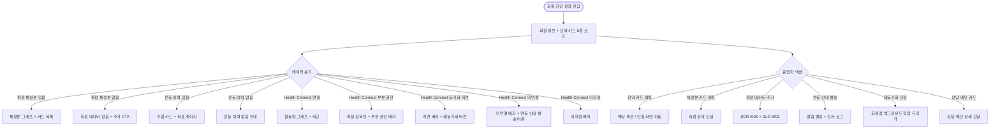
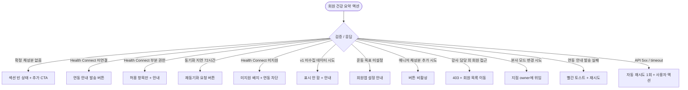

# SCR-I007 회원 건강 연동 요약 페이지

## 1. 화면 메타 정보

이 문서는 회원 건강 연동 요약 페이지에 대한 자기완결형 요구사항 정의서입니다. 다른 문서를 함께 보지 않아도 이 문서 한 장만으로 회원 건강 연동 요약 페이지에 들어가는 모든 영역, 모든 카드, 모든 버튼, 모든 권한, 모든 예외 처리, 그리고 이 화면을 지탱하는 운영 정책까지 전부 이해하고 구현할 수 있도록 작성합니다.

| 항목 | 값 |
|---|---|
| 작성일 | 2026-05-22 |
| 버전 | v1.0 |
| 상태 | 최신 통합본 반영 (D11 재번호화 SCR-I007 확정) |
| 도메인 | D11 통합운영 |
| 화면 ID | SCR-I007 |
| 화면명 | 회원 건강 연동 요약 |
| 화면 유형 | 회원 상세 종속 화면 (Member-Detail Subordinate Screen) |
| 라우트 (URL) | `/members/health` (회원 ID 쿼리 또는 회원 상세 진입) |
| 플랫폼 | 데스크톱(기본), 태블릿, 모바일(제한 모드) |
| 우선순위 | P2 |
| 기능코드 | IoT-05 (회원 건강 연동 요약) |
| 부모 기능 prefix | IoT |
| Lv1 코드 | IoT-05 |
| Lv2 / Lv3 세분화 | IoT-05-01 ~ IoT-05-05 (요약 카드, 체성분 이력, 운동 이력, Health Connect 연동, 상담 메모) |
| 연계 화면 | SCR-I001 통합 출석 관리, SCR-I004 옷 락커 운영 관리, SCR-I006 체성분 통합 관리, SCR-M004 회원 상세, SCR-MA-159 회원앱 건강 데이터 연동 |
| 호출 다이얼로그 | 없음 (조회 전용 화면) |
| 외부 시스템 | Samsung Health, Google Fit (Health Connect 경유), Android 하이브리드 앱 |

## 2. 화면 개요와 목적

회원 건강 연동 요약 페이지는 한 회원의 체성분·운동 이력·건강 목표·외부 건강 앱(Health Connect) 연동 상태를 하나의 화면에서 통합 요약하는 D11 통합운영 도메인의 회원 종속 조회 화면입니다. 관리자가 회원의 건강 상태를 빠르게 파악하고 상담 근거로 활용할 수 있도록 설계되었으며, 측정 자체의 검수·확정 처리는 SCR-I006에서, 수기 등록은 DLG-I003에서 별도 수행됩니다. 본 화면은 확정된 데이터만 노출하며, 검수 대기·미확정 데이터는 표시되지 않습니다.

이 화면이 다루는 운영 흐름은 다양합니다. FC가 회원 상담 직전에 "건강 요약"으로 진입해 회원의 최근 InBody 결과, 최근 7일 활동량, 운동 목표 달성률을 한 화면에서 확인하고 상담 방향을 결정합니다. 회원의 Health Connect가 미연동 상태라면 회원앱 SCR-MA-159 연동 안내를 보내고, 부분 권한 상태라면 회원에게 권한 추가 허용을 요청합니다. 동기화가 72시간 이상 지연된 경우 누락 가능성을 회원에게 설명하고 앱 재실행을 권유합니다. 트레이너는 본인 담당 회원의 운동 이력과 목표 달성률을 보며 다음 수업 계획을 세우고, 매니저는 출석·락커 요약 카드 정도만 보고 회원의 현장 사용 패턴을 파악합니다.

따라서 이 화면은 단순한 회원 정보 카드가 아니라, 출석 이력(SCR-I001) · 락커 정보(SCR-I004) · 확정된 체성분 데이터(SCR-I006) · Health Connect 외부 연동(SCR-MA-159) · 운동 이력 · 상담 메모까지 모두 모이는 회원 건강 종합 조회 허브로 동작해야 합니다. v1 Health Connect 수집 범위는 걸음수 / 이동 거리 / 활동 kcal / 운동 세션의 4종으로 제한되며, 심박수 / 수면 / 의료 데이터는 수집·표시하지 않습니다.

## 3. 진입 경로와 인접 화면

회원 건강 연동 요약 페이지에 진입하는 경로는 여러 가지입니다.

첫 번째 경로는 SCR-M004 회원 상세의 "건강 요약" 탭 또는 "건강 데이터" 카드입니다. 회원 상세에 들어와 있는 상태에서 클릭하면 본 화면이 같은 회원 ID로 진입합니다.

두 번째 경로는 SCR-M001 회원 목록의 행 클릭 후 우측 상세 패널에서 "건강 요약 보기" 링크를 누른 경우로, 회원 상세를 거치지 않고 본 화면으로 바로 이동합니다.

세 번째 경로는 SCR-I001 통합 출석 관리의 실시간 출석 확인 카드에서 회원 카드를 클릭한 경우로, 기본 동작은 SCR-M004 회원 상세 이동이지만 사용자 설정에 따라 본 화면으로 직접 이동할 수도 있습니다.

네 번째 경로는 SCR-I006 체성분 통합 관리의 측정 결과 행에서 "회원 건강 요약 보기" 액션을 선택한 경우입니다.

다섯 번째 경로는 알림 센터의 회원 관련 알림 클릭으로, 회원 ID가 포함된 알림이면 본 화면으로 진입합니다.

이 화면에서 빠져나가는 인접 화면으로는, 상단 회원 정보 영역의 "회원 상세 이동" 링크로 진입하는 SCR-M004 회원 상세, 측정 데이터 추가가 필요할 때 이동하는 SCR-I006 체성분 통합 관리, Health Connect 연동 안내 발송 시 참조하는 SCR-MA-159 회원앱 건강 데이터 연동, 출석 이력 확인 시 이동하는 SCR-I001 통합 출석 관리가 있습니다.

## 4. 레이아웃과 UI 구성

회원 건강 연동 요약 페이지는 상단 회원 정보 + 요약 카드 영역 + 체성분 이력 + 운동 이력 + Health Connect 위젯 + 상담 메모의 6단 세로 레이아웃을 기본으로 합니다.

페이지 헤더 좌측에는 회원의 프로필 사진(또는 기본 아바타), 이름, 회원번호, 성별·나이, 보유 이용권 요약이 한 줄로 표시됩니다. 헤더 우측에는 "회원 상세 이동", "상담 등록", "메시지 보내기" 같은 빠른 액션 버튼이 노출됩니다.

페이지 헤더 바로 아래에는 요약 카드 5개가 가로로 배치됩니다. 첫 번째 카드는 "최근 출석"으로 회원의 마지막 체크인 시각이 표시되고, 클릭 시 SCR-I001 통합 출석 관리로 이동하면서 해당 회원만 필터링됩니다. 두 번째 카드는 "오늘 옷 락커"로 당일 배정된 락커 번호 또는 "미배정"이 표시되며, 클릭 시 SCR-I004 옷 락커 운영 관리로 이동합니다. 세 번째 카드는 "고정 락커"로 보유 중인 고정 물품 락커 번호 또는 "없음"이 표시되며, 보유 시 클릭하면 SCR-I005 고정 물품 락커 관리로 이동합니다. 네 번째 카드는 "최근 InBody"로 가장 최근의 확정된 체중·골격근량·체지방률이 한 줄로 표시되며, 클릭 시 본 화면 하단의 체성분 이력 섹션으로 스크롤 이동합니다. 다섯 번째 카드는 "최근 7일 활동량"으로 Health Connect 연동 시 걸음수 합계·활동 kcal·운동 일수가 표시되고, 미연동 시 "Health Connect 미연동"이 표시됩니다.

요약 카드 아래에는 체성분 이력 섹션이 있습니다. 좌측에는 측정일 시간순 그래프(체중·골격근량·체지방률 추이)가 표시되고, 우측에는 측정 이력 목록(최근 10건)이 카드형 리스트로 표시됩니다. 각 측정 카드에는 측정일, 체중·골격근량·체지방률·BMI 수치, 이전 측정 대비 증감, 입력 채널 배지(수기·파일·실시간 API)가 표시됩니다. 그래프는 기간 필터(최근 1개월·3개월·6개월·1년) 드롭다운으로 조회 범위를 변경할 수 있고, 측정 이력 카드를 클릭하면 측정 상세 모달이 열립니다.

체성분 이력 섹션 아래에는 운동 이력 섹션이 있습니다. 이 섹션에는 최근 수업 이력(수업명·날짜·강사)이 카드형 리스트로 표시되고, 진행 중인 운동 프로그램, 월간 운동 목표 대비 달성률 게이지가 함께 노출됩니다. 운동 목표는 회원 본인이 회원앱에서 설정한 값이며, admin은 조회만 가능합니다.

운동 이력 섹션 아래에는 Health Connect 연동 위젯이 있습니다. 위젯 상단에는 연동 상태 배지(연결됨·부분 권한·동기화 지연·미연결·미지원)와 최근 동기화 시각이 표시되고, 그 아래에 수집 범위(걸음수·거리·활동 kcal·운동 세션), 최근 소스 앱(Samsung Health·Google Fit 등), 활동량 비교(센터 출석 운동 vs 외부 활동량), 안내 문구(Android 하이브리드 앱 경유 연동임을 명시)가 차례로 표시됩니다.

위젯 본문 하단에는 활동 데이터 상세 섹션이 있습니다. 최근 30일 일별 걸음수/활동 kcal 추이 그래프, 운동 세션 요약(최근 운동 종류·총 운동일수), 권한 상태(모두 허용·일부 허용·거부), 데이터 한계 안내(심박수·수면·의료 데이터는 v1 미수집)가 표시됩니다.

마지막으로 페이지 하단에는 상담 메모 바로가기 섹션이 있습니다. 인라인으로 최근 건강·운동 관련 상담 메모 3건이 표시되고, "전체 상담 보기" 링크로 SCR-M004 회원 상세의 상담 탭으로 이동할 수 있습니다.

## 5. 탭 구성과 탭별 동작

이 화면은 별도 탭이 없는 단일 스크롤 뷰입니다. 요약 카드와 섹션이 세로로 차곡차곡 쌓여 있어 운영자가 위에서 아래로 스크롤하면서 회원의 건강 정보를 종합 파악합니다.

다만 체성분 이력 섹션의 그래프 기간 필터(최근 1개월·3개월·6개월·1년)와 운동 이력 섹션의 기간 필터, Health Connect 활동 데이터 상세의 기간 필터는 각 섹션별로 독립적으로 동작합니다. 필터 변경 시 해당 섹션만 데이터 fetch가 새로 일어나고 다른 섹션은 영향을 받지 않습니다.

요약 카드 5개는 각각 클릭하면 본 화면의 다른 섹션으로 스크롤 이동하거나 인접 화면으로 이동합니다. "최근 출석" / "오늘 옷 락커" / "고정 락커"는 인접 화면 이동, "최근 InBody"는 본 화면 내 체성분 이력 섹션으로 스크롤, "최근 7일 활동량"은 본 화면 내 Health Connect 위젯으로 스크롤합니다.

## 6. 버튼·아이콘·링크 액션 전체 정의

이 화면의 모든 클릭 가능한 요소를 빠짐없이 정의합니다.

페이지 헤더의 "회원 상세 이동" 버튼은 SCR-M004 회원 상세로 이동합니다. 권한에 관계없이 모든 사용자에게 노출됩니다.

페이지 헤더의 "상담 등록" 버튼은 회원 상세의 상담 등록 다이얼로그를 호출합니다. owner·manager·강사(담당 회원 한정)에서 활성화됩니다.

페이지 헤더의 "메시지 보내기" 버튼은 회원에게 메시지 발송 화면(SCR-071 또는 회원 상세 메시지 카드)으로 이동합니다.

요약 카드 5개는 모두 클릭 가능합니다. "최근 출석"은 SCR-I001로 이동하면서 해당 회원 필터, "오늘 옷 락커"는 SCR-I004로 이동, "고정 락커"는 보유 시 SCR-I005로 이동(미보유 시 클릭 비활성), "최근 InBody"는 본 화면 체성분 이력 섹션으로 스크롤, "최근 7일 활동량"은 본 화면 Health Connect 위젯으로 스크롤합니다.

체성분 이력 섹션의 측정 카드를 클릭하면 측정 상세 모달이 열려 모든 측정 항목(체중·골격근량·체지방량·체지방률·BMI·기초대사량·체수분·비고)이 표시됩니다.

체성분 이력 섹션의 그래프 기간 필터 드롭다운(최근 1개월·3개월·6개월·1년)은 그래프 데이터 범위만 변경합니다. 측정 카드 목록은 영향을 받지 않습니다.

체성분 이력 섹션의 "측정 데이터 추가" 버튼은 owner·manager에서 활성화되며, 누르면 SCR-I006 체성분 통합 관리의 DLG-I003으로 이동합니다.

운동 이력 섹션의 수업 카드 클릭은 SCR-C001 수업 상세로 이동합니다.

Health Connect 연동 위젯의 "연동 안내 발송" 버튼은 회원이 미연동 또는 부분 권한 상태일 때 활성화됩니다. 누르면 회원에게 알림톡 또는 푸시로 SCR-MA-159 연동 안내가 발송됩니다. 발송 권한은 owner·manager 한정입니다.

Health Connect 연동 위젯의 "재동기화 요청" 버튼은 동기화 지연 상태일 때 활성화되며, 누르면 회원앱에 재동기화 요청이 발송됩니다.

활동 데이터 상세 섹션의 기간 필터 드롭다운(최근 7일·30일·90일)은 그래프 데이터 범위만 변경합니다.

상담 메모 바로가기의 "전체 상담 보기" 링크는 SCR-M004 회원 상세의 상담 탭으로 이동합니다. 인라인 메모 카드 클릭은 그 메모의 상세 모달을 엽니다.

본 화면은 조회 전용이므로 변경 액션이 거의 없습니다. 대부분의 변경은 다른 화면(SCR-I006·DLG-I003·SCR-MA-159·회원 상세 상담)에서 이루어지며, 본 화면은 결과를 표시하는 역할만 합니다.

## 7. 호출되는 모달 동작

이 화면에서 호출되는 모달은 인라인 조회 모달 두 가지뿐이며, 별도 DLG-* 다이얼로그는 호출하지 않습니다.

### 7-1. 측정 상세 모달

측정 상세 모달은 체성분 이력 섹션의 측정 카드를 클릭했을 때 호출됩니다. 모달 상단에 측정일·측정 시각·입력 채널 배지가 표시되고, 본문에는 모든 측정 항목(체중·골격근량·체지방량·체지방률·BMI·기초대사량·체수분·비고)이 라벨과 값으로 한 줄씩 표시됩니다.

이전 측정 대비 증감이 각 항목 옆에 작게 표시되어, 운영자가 변화를 즉시 파악할 수 있습니다. 측정 메모(비고)가 있으면 본문 하단에 별도 카드로 표시됩니다.

하단에는 "닫기" 버튼만 있으며 측정 상세 모달은 조회 전용입니다. 측정 데이터 수정이 필요하면 SCR-I006으로 이동해야 합니다.

### 7-2. 상담 메모 상세 모달

상담 메모 상세 모달은 상담 메모 바로가기 섹션의 메모 카드를 클릭했을 때 호출됩니다. 모달 상단에 상담일·상담자가 표시되고, 본문에는 상담 메모 전문이 표시됩니다.

하단에는 "닫기" 버튼만 있으며 조회 전용입니다. 메모 편집이 필요하면 "회원 상세 상담 탭으로 이동" 링크를 클릭합니다.

## 8. 토스트와 확인 팝업과 알럿

성공 토스트는 "Health Connect 연동 안내가 발송되었습니다", "재동기화 요청이 발송되었습니다", "상담 메모가 저장되었습니다" 같은 문구로 결과를 알려줍니다. 본 화면에서는 변경 액션이 거의 없으므로 성공 토스트가 자주 발생하지 않습니다.

실패 토스트는 "Health Connect 연동 안내 발송에 실패했어요", "데이터를 불러오지 못했어요", "권한이 없어요" 같은 문구가 표시됩니다.

경고 토스트는 노랑 계열로 "Health Connect 동기화가 72시간 이상 지연되었습니다", "회원이 부분 권한만 허용했습니다" 같은 안내를 표시합니다.

알럿은 권한 없는 계정의 URL 접근 시 차단형 메시지로 표시됩니다. 본 화면에 표시되는 회원 데이터가 강사의 담당 회원이 아닌 경우 강사 권한에서는 "이 회원은 담당 회원이 아닙니다"라는 차단 안내가 표시되고 회원 목록으로 자동 이동됩니다.

## 9. 데이터 흐름과 외부 연동

화면 진입 시 `GET /api/health/summary/:memberId`로 회원의 건강 요약 데이터를 일괄 조회합니다. 응답에는 요약 카드 5종 데이터(최근 출석·옷 락커·고정 락커·최근 InBody·최근 7일 활동량), 체성분 이력 목록, 운동 이력 목록, Health Connect 연동 상태가 포함됩니다.

체성분 이력 그래프와 카드는 같은 응답에서 derive되며, 기간 필터 변경 시 `GET /api/body-composition?memberId=:id&period=3m`을 추가 호출합니다.

운동 이력은 SCR-C001 수업 도메인의 데이터를 참조합니다. `GET /api/classes/attendance?memberId=:id&period=3m`로 회원의 수업 출석 이력을 조회합니다.

Health Connect 연동 상태는 `GET /api/health-connect/status?memberId=:id`로 조회합니다. 응답에는 연결 상태, 최근 동기화 시각, 권한 상태, 소스 앱이 포함됩니다.

활동 데이터 상세는 `POST /api/health-connect/sync-summary`로 호출되며, 회원의 회원앱 데이터를 서버가 집계한 결과를 받아옵니다. 회원앱이 최근 24시간 내 실행되지 않았으면 데이터가 갱신되지 않을 수 있습니다.

Health Connect 연동 안내 발송은 알림 발송 시스템을 통해 SMS·알림톡·푸시로 발송됩니다. 발송 권한은 owner·manager 한정입니다.

재동기화 요청은 회원앱의 백그라운드 작업을 트리거합니다. 회원앱이 다음 실행될 때 자동으로 동기화가 일어납니다.

확정된 체성분 데이터만 본 화면에 노출되며, 검수 대기·미확정 데이터는 표시되지 않습니다. 이는 SCR-I006의 검수 처리 정책과 직접 연동된 결과입니다.

Health Connect 외부 시스템은 Android 하이브리드 앱을 통해 Samsung Health · Google Fit · 기타 호환 앱에서 데이터를 수집합니다. iOS와 Android 일부 단말은 미지원이며 위젯에 "미지원" 배지가 표시됩니다.

NFR-19 알림 센터는 본 화면에서 직접 사용하지 않지만, 회원의 체성분 측정 누락·운동 목표 미달성 같은 운영 이벤트가 발생하면 owner와 매니저에게 푸시됩니다.

본 화면은 조회 전용이므로 감사 로그 INSERT는 거의 없습니다. 다만 Health Connect 연동 안내 발송과 재동기화 요청은 SCR-097에 비동기로 INSERT됩니다.

화면에서 호출하는 주요 API 엔드포인트는 다음과 같습니다. 건강 요약 `GET /api/health/summary/:memberId`, 체성분 이력 `GET /api/body-composition?memberId=:id`, 운동 이력 `GET /api/classes/attendance?memberId=:id`, Health Connect 상태 `GET /api/health-connect/status?memberId=:id`, 활동 데이터 `POST /api/health-connect/sync-summary`, 연동 안내 발송 `POST /api/health-connect/send-invite`, 재동기화 요청 `POST /api/health-connect/request-sync`.

## 10. 화면 상태와 예외 처리

기본 상태에서는 모든 섹션이 데이터로 채워져 있고, 요약 카드와 그래프가 정상 표시됩니다.

Health Connect 미연동 상태에서는 위젯에 "미연결" 배지가 표시되고, "최근 7일 활동량" 요약 카드에는 "Health Connect 미연동"이 표시됩니다. 회원앱(MA-159) 연동 안내 발송 버튼이 활성화됩니다.

Health Connect 부분 권한 상태에서는 위젯에 "부분 권한" 배지가 노란색으로 표시되고, 허용된 항목만 노출되며 미허용 항목은 "권한 미허용"으로 표시됩니다.

Health Connect 동기화 지연 상태(72시간 이상 미수신)에서는 위젯에 "동기화 지연" 배지가 표시되고 "재동기화 요청" 버튼이 활성화됩니다.

Health Connect 미지원 상태(iOS·미지원 Android)에서는 위젯에 "미지원" 배지가 표시되고 연동 안내 발송이 차단됩니다.

InBody 데이터 없음 상태에서는 체성분 이력 섹션에 "측정 데이터가 없습니다" 안내가 표시되고, "측정 데이터 추가" 버튼이 강조됩니다.

운동 이력 없음 상태에서는 운동 이력 섹션에 "운동 이력이 없습니다" 안내가 표시됩니다.

로딩 상태에서는 각 섹션에 스켈레톤이 표시되고 모든 클릭 액션이 비활성화됩니다.

오류 상태에서는 해당 섹션에 "데이터를 불러오지 못했어요" 안내와 "다시 시도" 버튼이 표시됩니다. 자동 재시도가 1회 백그라운드에서 진행됩니다.

권한 부족 상태에서는 강사 권한이 담당 외 회원의 화면을 본 경우 "이 회원은 담당 회원이 아닙니다" 차단 안내가 표시되고 회원 목록으로 자동 이동됩니다. 매니저는 출석·락커 요약 카드만 보이고 체성분·운동·Health Connect 섹션이 회색으로 비활성화되어 표시됩니다.

본사 통합 모드 조회 전용 상태에서는 모든 변경 액션(연동 안내·재동기화 요청·상담 등록)이 차단되고 조회만 가능합니다.

예외 케이스별 처리는 다음과 같이 정의됩니다.

체성분 데이터가 검수 대기·미확정 상태이면 본 화면에 노출되지 않습니다. 운영자는 "측정 데이터 추가" 버튼으로 SCR-I006으로 이동해 확정 처리해야 노출됩니다.

Health Connect가 미연동 상태에서는 "최근 7일 활동량" 카드와 위젯 본문에 "회원앱 연동이 필요합니다" 안내가 표시되며 연동 안내 발송 버튼이 강조됩니다.

회원이 v1 미수집 데이터(심박수·수면·의료)를 회원앱에서 허용했더라도 본 화면에는 표시되지 않으며, 위젯에 "v1 미수집 데이터" 안내가 표시됩니다.

회원이 운동 목표를 설정하지 않은 경우 "운동 목표 미설정 - 회원앱에서 설정 안내"가 표시됩니다.

상담 메모가 0건이면 "상담 메모가 없습니다" 안내가 표시됩니다.

강사가 담당 외 회원의 URL로 직접 접근하면 403 화면으로 차단됩니다.

매니저가 체성분 카드를 클릭하면 측정 상세 모달이 열리지만 "측정 데이터 추가" 버튼은 비활성화되어 있어 추가가 불가능합니다.

본사 통합 모드의 본사 권한자가 연동 안내 발송을 시도하면 차단되고 "지점 owner에 위임" 안내가 표시됩니다.

## 11. 권한별 처리

슈퍼관리자·primary는 전 지점 회원의 건강 요약을 조회할 수 있습니다. 본사 통합 모드에서는 변경 액션(연동 안내·재동기화)이 차단됩니다.

owner는 자기 지점 회원의 건강 요약을 모두 조회·관리할 수 있습니다. 연동 안내 발송, 재동기화 요청, 상담 등록까지 모든 액션이 가능합니다.

매니저(manager·프런트)는 자기 지점 회원의 출석·락커 요약 카드만 조회 가능합니다. 체성분 이력·운동 이력·Health Connect 위젯은 회색으로 비활성화되어 표시되며, 클릭은 불가능합니다.

강사(trainer)는 본인 담당 회원의 체성분 이력·운동 이력 조회와 상담 등록이 가능합니다. 담당 외 회원의 URL 접근은 403 차단됩니다. 운동 이력의 강사 이름은 본인 이름이 강조 표시됩니다.

회원 본인은 회원앱(SCR-MA 도메인)에서 자신의 건강 요약을 조회하며, admin 화면에는 접근하지 않습니다.

readonly는 회원의 건강 요약 모든 섹션을 조회 가능하며 변경 액션은 차단됩니다.

본사 통합 모드에서는 변경 액션이 모두 차단되고 조회만 가능합니다.

권한 차단 이벤트는 감사 로그에 기록됩니다.

## 12. 메인 흐름

## 13. 에러와 예외 흐름

## 14. 핵심 디자인 요청사항

회원 정보 헤더는 회원의 사진과 핵심 정보가 한눈에 들어오도록 가로로 명확히 배치되며, 사진이 없으면 기본 아바타가 표시됩니다.

요약 카드 5개는 동일 크기·동일 그리드로 한눈에 비교 가능하게 배치되며, "Health Connect 미연동"인 "최근 7일 활동량" 카드는 약한 회색 톤으로 처리되어 데이터가 없음을 시각적으로 알립니다.

체성분 이력 섹션의 그래프는 측정일을 가로축, 수치를 세로축으로 하는 라인 차트로, 체중·골격근량·체지방률을 다른 색상으로 함께 표시합니다. 호버 시 측정일과 모든 수치가 툴팁으로 표시됩니다. 측정 카드는 우측에 세로로 정렬되어 그래프와 함께 한눈에 비교할 수 있습니다.

운동 이력 섹션의 목표 달성률 게이지는 0 ~ 100% 도넛 차트로 표시되며, 달성률에 따라 색상이 분기됩니다(0 ~ 30% 빨강, 30 ~ 70% 주황, 70 ~ 100% 녹색).

Health Connect 연동 위젯은 카드형 컴포넌트로 명확히 분리되어 표시되며, 연동 상태 배지는 5종(연결됨 녹색·부분 권한 노랑·동기화 지연 주황·미연결 회색·미지원 어두운 회색)으로 색상 분기됩니다. 위젯 본문의 활동량 비교 영역은 막대 그래프 또는 도넛 차트로 시각화되어 센터 운동과 외부 활동량의 비율이 한눈에 보입니다.

활동 데이터 상세 섹션의 일별 추이 그래프는 부드러운 라인 차트로 표시되며, 운영자가 호버하면 일별 수치가 툴팁으로 표시됩니다. 데이터 한계 안내(심박수·수면·의료 데이터는 v1 미수집)는 위젯 하단에 작은 회색 문구로 배치되어 시야를 가리지 않으면서도 명확히 인지됩니다.

상담 메모 카드는 최근 3건이 카드형 리스트로 표시되며, 각 카드에는 상담일·상담자·메모 요약(2 ~ 3줄)이 표시됩니다.

권한 부족 상태(매니저)에서는 비활성화된 섹션이 회색 톤으로 약하게 처리되어 운영자가 자신의 권한 범위를 즉시 인지합니다.

모바일에서는 요약 카드가 가로 스크롤 리스트로 전환되고, 그래프는 세로로 압축되어 표시됩니다.

진행 스피너와 로딩 스켈레톤은 다른 D11 화면과 동일한 톤으로 통일됩니다.

## 15. 운영 정책 (이 화면에 연결된 부분)

확정 데이터 노출 정책은 SCR-I006에서 확정 처리된 체성분 데이터만 본 화면에 노출된다는 것입니다. 검수 대기·미확정 데이터는 표시되지 않으므로, 회원에게 잘못된 정보가 전달되지 않도록 합니다. 운영자가 측정 데이터를 보고 싶지만 보이지 않으면 SCR-I006에서 검수·확정해야 합니다.

Health Connect v1 수집 범위 정책은 걸음수 / 이동 거리 / 활동 kcal / 운동 세션의 4종으로 제한된다는 것입니다. 심박수·수면·체온·혈당·의료 데이터는 v1에서 수집·표시하지 않습니다. 이는 개인 의료 정보 보호와 데이터 처리 책임 범위를 명확히 하기 위한 정책입니다.

Health Connect 연동 모델 정책은 회원앱(SCR-MA-159)에서만 연결·해제·권한 변경이 가능하다는 것입니다. admin은 조회만 수행하며, 운영자가 회원을 대신해 연동을 켤 수 없습니다. 회원 동의 기반의 데이터 수집 원칙을 따릅니다.

미연동 회원 운영 영향 정책은 Health Connect가 미연동 상태여도 센터 출석/체성분/리워드 운영에는 영향이 없다는 것입니다. Health Connect는 회원의 외부 활동량 참고 지표이며, 결제·출석·리워드의 강제 판정 근거로 사용하지 않습니다.

최초 연결 백필 정책은 회원이 처음 Health Connect를 연결하면 최근 30일 활동 요약을 백필한다는 것입니다. 회원이 이전 데이터를 한 번에 볼 수 있도록 하기 위한 정책입니다.

동기화 지연 판정 정책은 72시간 이상 신규 수집이 없으면 "동기화 지연" 상태로 표시한다는 것입니다. 회원앱이 백그라운드에서 실행되지 못하거나 권한이 거부된 경우를 잡아냅니다. 운영자는 재동기화 요청 버튼으로 회원앱에 작업 트리거를 보낼 수 있습니다.

부분 권한 표시 정책은 회원이 일부 권한만 허용한 경우 허용된 항목만 표시하고 "부분 권한" 배지를 우선 노출한다는 것입니다. 미허용 항목은 "권한 미허용"으로 명확히 표시되어 운영자가 회원에게 권한 추가 허용을 요청할 근거를 제공합니다.

미지원 단말 표시 정책은 iOS와 미지원 Android 단말의 회원에게 "미지원" 배지를 표시한다는 것입니다. 이 회원은 Health Connect 데이터를 볼 수 없으며, 운영자는 InBody 측정 데이터만으로 상담을 진행합니다.

활동량 비교 운영 정책은 센터 출석 운동과 외부 활동량 비교가 운영 상담용 참고 지표라는 것입니다. 이 비교는 회원의 라이프스타일을 이해하고 맞춤 상담을 제공하기 위한 도구이며, 결제·출석·리워드의 판정 근거로 사용하지 않습니다.

권한 분리 정책은 매니저가 체성분·운동·Health Connect 섹션을 볼 수 없다는 것입니다. 회원의 민감한 건강 정보 접근을 제한하기 위한 정책이며, owner와 담당 강사만 전체 정보를 볼 수 있습니다. 강사는 본인 담당 회원만 접근 가능하며, 담당 외 회원의 URL 접근은 403 차단됩니다.

회원 본인 화면 분리 정책은 회원 본인이 자신의 건강 요약을 회원앱(SCR-MA 도메인)에서 조회하며, admin 화면 접근은 허용하지 않는다는 것입니다. admin은 운영자용이고 회원앱은 회원용이라는 명확한 분리를 유지합니다.

상담 메모 통합 정책은 회원 상세의 상담 탭과 본 화면의 상담 메모 바로가기가 같은 데이터 원천을 사용한다는 것입니다. 어느 화면에서 작성하든 같은 메모가 양쪽에 노출되어 운영자가 헷갈리지 않게 합니다.

본사 통합 모드 정책은 본사 권한자가 전 지점 회원의 건강 요약을 조회만 할 수 있다는 것입니다. 연동 안내 발송과 재동기화 요청 같은 변경 액션은 지점 owner가 직접 수행합니다.

데이터 갱신 주기 정책은 다음과 같습니다. 체성분 데이터는 SCR-I006에서 확정되는 즉시 본 화면에 반영됩니다. 출석·락커 데이터는 SCR-I001·SCR-I004와 실시간 동기화됩니다. Health Connect 데이터는 회원앱 실행 시 자동 수집되며 백엔드에 24시간 주기 + on-demand 동기화로 갱신됩니다.

이상의 모든 정책은 이 화면을 구현하고 운영하는 사람이 별도 문서 없이 이 한 장만 보면 이해할 수 있도록 풀어 적었습니다.
