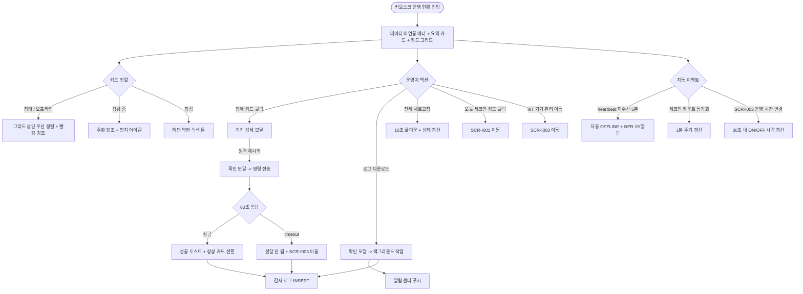

# SCR-I008 키오스크 운영 현황 페이지

## 1. 화면 메타 정보

이 문서는 키오스크 운영 현황 페이지에 대한 자기완결형 요구사항 정의서입니다. 다른 문서를 함께 보지 않아도 이 문서 한 장만으로 키오스크 운영 현황 페이지에 들어가는 모든 영역, 모든 카드, 모든 버튼, 모든 권한, 모든 예외 처리, 그리고 이 화면을 지탱하는 운영 정책까지 전부 이해하고 구현할 수 있도록 작성합니다.

| 항목 | 값 |
|---|---|
| 작성일 | 2026-05-22 |
| 버전 | v1.0 |
| 상태 | 최신 통합본 반영 (D11 재번호화 SCR-H1102 -> SCR-I008 완료) |
| 도메인 | D11 통합운영 |
| 화면 ID | SCR-I008 |
| 이전 ID | SCR-H1102 키오스크 운영 현황 |
| 화면명 | 키오스크 운영 현황 |
| 화면 유형 | 허브 화면 (Hub Screen) |
| 라우트 (URL) | `/kiosk-ops` |
| 플랫폼 | 데스크톱(기본), 태블릿, 모바일(허브 보기) |
| 우선순위 | P2 (퍼블리싱 완료 / 데이터 미연동 단계) |
| 기능코드 | IoT-06 (키오스크 운영 현황) |
| 부모 기능 prefix | IoT |
| Lv1 코드 | IoT-06 |
| Lv2 / Lv3 세분화 | IoT-06-01 ~ IoT-06-06 (요약 카드, 키오스크 카드 그리드, 장애 알림, 운영 안내, 운영 시간, 외부 연동) |
| 연계 화면 | SCR-I001 통합 출석 관리, SCR-I002 키오스크 설정, SCR-I003 IoT 연동 관리, SCR-097 감사 로그, SCR-101 대시보드 |
| 연계 키오스크 화면 | KIO-402 관리자 패널 (양방향 데이터) |
| 호출 다이얼로그 | 없음 (인라인 확인 모달과 기기 상세 모달만 사용) |

## 2. 화면 개요와 목적

키오스크 운영 현황 페이지는 현장 키오스크 운영 상태(체크인 카운트·오류·운영 시간)를 실시간으로 모니터링하는 D11 통합운영 도메인의 허브 화면입니다. 본 화면은 정상보다 장애 상태가 먼저 강조되도록 설계되어, 오프라인·오류가 발생한 키오스크를 즉시 식별하고 대응할 수 있게 합니다. SCR-I003 IoT 연동 관리가 기기 등록·제어 중심이라면, 본 SCR-I008은 운영 모니터링 중심으로 보완 관계를 이룹니다.

이 화면이 다루는 운영 흐름은 매우 다양합니다. 센터장이 아침 오픈 전 모바일로 화면에 접근해 키오스크 정상 여부를 확인하고, 오프라인 단말이 있으면 원격 재시작을 선제 실행해 현장 방문 없이 정상화합니다. 오전·저녁 피크 타임에 오늘 체크인 카운트가 급감하면 키오스크 장애 신호로 인식해 즉각 대응하고, 프런트 스태프가 없는 시간대에 장애 키오스크를 관리자 원격 재시작으로 복구합니다. heartbeat 미수신 임계 5분 초과 시 자동 알림이 센터장에게 발송되어 즉시 인지 가능하며, 원격 재시작 후에도 반복 장애가 발생하면 키오스크 로그를 다운로드해 AS 요청 근거로 활용합니다. 본사 슈퍼관리자는 전 지점 키오스크 현황을 한 화면에서 조감해 특정 기기 모델의 반복 오류 패턴을 파악하고 펌웨어 일괄 업데이트나 기기 교체 의사결정의 근거를 확보합니다. 점검 중 상태 키오스크에 대해서는 회원앱 공지 연계로 회원 혼란을 최소화합니다.

따라서 이 화면은 단순한 모니터링 화면이 아니라, IoT 연동 관리(SCR-I003 heartbeat 공유) · 키오스크 정책 운영 시간(SCR-I002·SCR-I003 자동 전원 스케줄 동기화) · 통합 출석 관리(SCR-I001 체크인 카운트 동기화) · 대시보드(SCR-101 실시간 출석 확인 카드 이벤트 전달) · 본사 통합 모드 BI까지 모두 반영된 키오스크 운영 모니터링 허브로 동작해야 합니다. 본 화면은 현재 퍼블리싱 완료 / 데이터 미연동 단계이며, 실제 heartbeat 연동은 후속 단계에서 이루어집니다.

## 3. 진입 경로와 인접 화면

키오스크 운영 현황 페이지에 진입하는 경로는 여러 가지입니다.

첫 번째 경로는 사이드바입니다. 좌측 사이드바의 "통합운영" 메뉴 아래 "키오스크 운영 현황" 항목을 클릭하면 진입하며, 기본 상태(요약 카드 + 키오스크 카드 그리드, 장애 우선 정렬)로 시작합니다.

두 번째 경로는 대시보드 SCR-101의 키오스크 상태 카드 클릭으로, 본 화면이 즉시 열리면서 장애 카드만 강조 표시됩니다.

세 번째 경로는 알림 센터(SCR-104)의 키오스크 오프라인 알림 클릭으로, 해당 키오스크 카드가 자동 강조된 상태로 진입합니다.

네 번째 경로는 SCR-I001 통합 출석 관리의 키오스크 모니터 패널 헤더에서 "운영 현황으로 이동" 링크를 누른 경우입니다.

다섯 번째 경로는 SCR-I003 IoT 연동 관리의 키오스크 유형 행에서 "운영 현황 보기" 액션을 선택한 경우입니다.

여섯 번째 경로는 SCR-I002 키오스크 설정의 헤더 "운영 현황 보기" 링크입니다.

이 화면에서 빠져나가는 인접 화면으로는, 장애 알림 영역의 "IoT 연동 관리로 이동" 링크로 진입하는 SCR-I003, 키오스크 설정 변경 시 이동하는 SCR-I002, 체크인 이벤트 상세 확인 시 이동하는 SCR-I001, 원격 재시작 이력 추적 시 이동하는 SCR-097 감사 로그가 있습니다.

## 4. 레이아웃과 UI 구성

키오스크 운영 현황 페이지는 상단 요약 카드 + 키오스크 카드 그리드 + 장애 알림 영역 + 운영 안내 패널의 4단 레이아웃을 기본으로 합니다.

페이지 헤더 좌측에는 "키오스크 운영 현황"이라는 타이틀과 지점 컨텍스트 배지가 표시됩니다. 본사 통합 모드에서는 지점 선택 드롭다운이 활성화되어 전 지점 키오스크 운영 현황을 조회할 수 있지만, 원격 제어 액션은 차단됩니다. 데이터 미연동 상태에서는 헤더 아래에 "목업 데이터 안내 - 실제 heartbeat 미수신" 배너가 상시 표시됩니다.

페이지 헤더 우측에는 "전체 새로고침", "IoT 기기 관리 이동", "원격 재시작" 세 버튼이 일렬로 배치됩니다. "전체 새로고침" 버튼은 모든 키오스크 상태를 갱신하며, 10초 쿨다운이 적용됩니다. "IoT 기기 관리 이동" 링크는 SCR-I003으로 직접 이동합니다. "원격 재시작" 버튼은 선택된 키오스크가 있을 때만 활성화됩니다.

페이지 헤더 바로 아래에는 상단 요약 카드 4개가 가로로 배치됩니다. 첫 번째 카드는 "전체 키오스크"로 등록된 키오스크 총 수를 보여줍니다. 두 번째 카드는 "정상 운영 중"으로 온라인 + 정상 동작 중인 키오스크 수를 보여주며, 클릭 시 정상 키오스크만 필터링됩니다. 세 번째 카드는 "장애 / 오류"로 오프라인 또는 오류 발생 중인 키오스크 수를 보여주며, 카드가 빨강 톤으로 약하게 강조되고 클릭 시 장애 키오스크만 필터링됩니다. 네 번째 카드는 "오늘 체크인"으로 키오스크 경유 금일 체크인 합계를 보여주며, 클릭 시 SCR-I001 통합 출석 관리로 이동합니다.

요약 카드 아래에는 키오스크 카드 그리드가 배치됩니다. 키오스크 1대당 1개의 카드가 표시되며, 장애 카드가 그리드 상단으로 우선 정렬됩니다. 각 카드에는 키오스크명 + 위치, 상태 배지(정상·오프라인·오류·점검 중), 마지막 통신 시각, 오늘 체크인 카운트, 최근 이벤트 1 ~ 3건, 운영 시간(ON/OFF 시각)이 표시됩니다.

장애 카드는 빨강 톤의 강한 테두리로 강조되고, 카드 상단에 "장애" 또는 "오프라인" 라벨이 큰 글씨로 표시됩니다. 점검 중 카드는 주황 톤의 테두리와 망치 아이콘으로 표시됩니다. 정상 카드는 약한 녹색 톤으로 처리되어 시야에서 분리됩니다.

각 카드 하단에는 액션 버튼이 있습니다. 정상 카드에는 "상세" 버튼만, 장애·오프라인 카드에는 "원격 재시작", "로그 다운로드", "상세" 버튼이, 점검 중 카드에는 "상세" 버튼만 표시됩니다. 카드를 클릭하면 기기 상세 모달이 열립니다.

키오스크 카드 그리드 아래에는 장애 알림 영역이 있습니다. 현재 장애 발생 중인 키오스크 목록이 카드형 리스트로 표시되며, 각 항목에는 키오스크명, 발생 시각, 오류 코드/사유, 권장 대응 가이드, "IoT 연동 관리로 이동" / "원격 재시작" 버튼이 있습니다. 장애가 없으면 "현재 장애가 발생한 키오스크가 없습니다" 안내가 표시됩니다.

페이지 하단에는 운영 안내 패널이 있습니다. 좌측에는 예정된 점검 일정(점검 일시·대상 키오스크·작업 내용)이 카드로 표시되고, 우측에는 본사 발송 운영 공지가 카드로 표시됩니다.

## 5. 탭 구성과 탭별 동작

이 화면은 별도 탭이 없는 단일 그리드 뷰입니다. 대신 요약 카드 클릭과 필터 칩 조합으로 데이터를 좁혀 들어가는 방식을 사용합니다.

요약 카드 4개 중 "정상 운영 중"·"장애 / 오류" 카드는 클릭 시 상태 필터가 자동 적용되며, 그리드에서 해당 상태에 속하지 않는 키오스크는 회색 톤으로 약하게 처리됩니다. "전체 키오스크" 카드는 모든 필터를 초기화합니다. "오늘 체크인" 카드는 SCR-I001로 이동하는 인접 화면 이동 액션입니다.

본사 통합 모드에서는 헤더 좌측의 지점 선택 드롭다운이 가상의 1차 분기 탭처럼 동작합니다. 지점을 바꾸면 데이터 fetch가 새로 일어나고 요약 카드와 키오스크 카드 그리드가 모두 재계산됩니다. 다만 본사 통합 모드 사용자가 원격 제어 액션을 시도하면 "지점 owner에 위임 - 변경 불가" 안내가 표시되고 차단됩니다.

## 6. 버튼·아이콘·링크 액션 전체 정의

이 화면의 모든 클릭 가능한 요소를 빠짐없이 정의합니다.

상단 요약 카드 4개는 모두 클릭 가능합니다. "전체 키오스크"는 모든 필터 초기화, "정상 운영 중"은 상태 = 정상 필터, "장애 / 오류"는 상태 = 오프라인·오류 필터, "오늘 체크인"은 SCR-I001로 이동입니다.

페이지 헤더의 "전체 새로고침" 버튼은 모든 키오스크 상태를 최근 heartbeat 기준으로 갱신합니다. 10초 쿨다운이 적용되어 연속 클릭 시 비활성화되고 카운트다운이 표시됩니다.

페이지 헤더의 "IoT 기기 관리 이동" 링크는 SCR-I003 IoT 연동 관리로 직접 이동합니다.

페이지 헤더의 "원격 재시작" 버튼은 카드 체크박스로 선택된 키오스크가 있을 때만 활성화됩니다. owner 이상에서만 활성화되며, 누르면 "선택한 N대 키오스크를 재기동합니다. 약 30초간 오프라인 상태가 됩니다" 확인 모달이 뜹니다. 60초 timeout 내 응답이 없으면 실패 처리되며 "재시작 명령이 전달되지 않았습니다. 현장 확인이 필요합니다" 안내와 SCR-I003 이동 링크가 제공됩니다.

키오스크 카드 그리드 각 카드의 체크박스는 다중 선택을 지원하며, 한 명 이상 선택 시 헤더의 "원격 재시작" 버튼이 활성화됩니다.

각 카드 하단의 "원격 재시작" 버튼은 owner 이상에서만 활성화됩니다. 점검 중 키오스크에 대한 원격 재시작 시도는 "점검 중인 키오스크입니다. 점검 완료 후 재시작해주세요" 경고와 함께 차단됩니다.

각 카드 하단의 "로그 다운로드" 버튼은 owner 이상에서만 활성화되며, 누르면 해당 키오스크의 최근 7일 운영 로그가 다운로드됩니다. 다운로드는 백그라운드로 처리되며 완료 시 알림 센터에 푸시됩니다. 다운로드 이력은 감사 로그에 기록됩니다.

각 카드 하단의 "상세" 버튼은 모든 권한에서 활성화되며, 누르면 기기 상세 모달이 열립니다.

카드 본문 클릭(상태 배지·키오스크명 등)은 기기 상세 모달을 호출합니다.

장애 알림 영역의 각 항목에는 "IoT 연동 관리로 이동" / "원격 재시작" 버튼이 있으며, 카드 그리드의 액션과 동일하게 동작합니다.

운영 안내 패널의 점검 일정 카드는 클릭 시 점검 상세 모달을 열어 점검 사유·작업 담당자·예상 완료 시각을 보여줍니다.

운영 안내 패널의 본사 공지 카드는 클릭 시 공지 상세 모달 또는 공지 전문 화면으로 이동합니다.

모든 변경 액션은 클릭 후 응답이 돌아오기 전까지 자동으로 비활성화되어 더블클릭 중복 요청이 차단됩니다.

## 7. 호출되는 모달 동작

이 화면에서 호출되는 모달은 인라인 모달이며 별도 DLG-* 다이얼로그가 아닙니다.

### 7-1. 기기 상세 모달

기기 상세 모달은 키오스크 카드 클릭 또는 "상세" 버튼으로 호출됩니다. 모달 상단에는 키오스크명·위치·상태 배지가 표시되고, 그 아래에 단말 정보(kioskId·branchId·펌웨어 버전·등록일)가 한 줄로 배치됩니다.

본문에는 다음 섹션이 있습니다. 첫 번째는 heartbeat 이력으로 최근 24시간 동안의 송신 기록이 시간순으로 표시됩니다. 두 번째는 최근 체크인 이벤트로 오늘 발생한 체크인 성공·실패 이벤트가 시간순으로 표시되며, 결과별 색상 분기(성공 녹색·실패 빨강·중복 노랑·퇴실 회색)가 적용됩니다. 세 번째는 원격 명령 이력으로 재시작·설정 새로고침·문열기 같은 명령의 발송 시각, 발송자, 결과(성공·실패·timeout)가 표시됩니다. 네 번째는 오류 코드 이력으로 최근 발생한 오류 코드와 권장 대응 가이드가 표시됩니다.

하단에는 "원격 재시작" / "로그 다운로드" / "IoT 연동 관리로 이동" / "닫기" 버튼이 있습니다. owner 이상 권한에서만 변경 버튼이 활성화됩니다.

### 7-2. 원격 재시작 확인 모달

원격 재시작 확인 모달은 헤더 또는 카드의 "원격 재시작" 버튼으로 호출됩니다. 모달에는 "선택한 N대 키오스크를 재기동합니다. 약 30초간 오프라인 상태가 됩니다" 안내와 함께 대상 키오스크 목록이 표시되고, 재시작 사유 입력란(선택)이 있습니다. 확인 시 명령이 전송되고 60초 응답 대기 후 결과가 표시됩니다.

점검 중 키오스크가 선택되어 있으면 모달이 열리지 않고 토스트로 "점검 중인 키오스크입니다. 점검 완료 후 재시작해주세요"가 표시되며 차단됩니다.

### 7-3. 로그 다운로드 확인 모달

로그 다운로드 확인 모달은 카드의 "로그 다운로드" 버튼으로 호출됩니다. 모달에 "최근 7일 운영 로그를 다운로드합니다" 안내와 다운로드 사유 입력란(선택)이 있습니다. 확인 시 백그라운드 작업이 시작되고 완료 시 알림 센터에 푸시됩니다. 다운로드는 감사 로그에 기록됩니다.

### 7-4. 점검 일정 / 공지 상세 모달

점검 일정 모달은 운영 안내 패널의 점검 카드 클릭으로 호출되며, 점검 일시·대상·작업 내용·담당자·예상 완료가 표시됩니다.

공지 상세 모달은 운영 안내 패널의 공지 카드 클릭으로 호출되며, 본사 발송 공지 전문이 표시됩니다.

두 모달 모두 조회 전용이며 변경 액션이 없습니다.

## 8. 토스트와 확인 팝업과 알럿

성공 토스트는 우측 상단에 녹색 계열로 5초간 표시되며, "전체 새로고침이 완료되었습니다", "N대 키오스크 재시작 명령이 전송되었습니다", "로그 다운로드가 시작되었습니다" 같은 문구로 결과를 알려줍니다.

실패 토스트는 "재시작 명령이 전달되지 않았습니다. 현장 확인이 필요합니다", "점검 중인 키오스크입니다", "로그 다운로드에 실패했습니다. 다시 시도해주세요", "권한이 없어요", "알 수 없는 오류 코드입니다" 같은 문구가 표시됩니다.

경고 토스트는 노랑 계열로 "키오스크 N대가 오프라인 상태입니다", "체크인 카운트 동기화가 지연되고 있습니다 (마지막 동기화 N분 전)", "새로고침 쿨다운 중입니다" 같은 안내를 표시합니다.

자동 OFFLINE 전환 알림은 heartbeat 미수신 5분 초과 시 시스템이 자동으로 센터장에게 인앱 알림을 발송합니다. 본 화면에서는 그 결과로 키오스크 카드가 빨강 톤으로 강조되며 장애 카드 영역에 새 항목이 추가됩니다.

확인 팝업은 원격 재시작·로그 다운로드의 각 액션에서 표시됩니다.

알럿은 권한 없는 계정(강사)이 직접 URL로 접근했을 때 403 화면이 표시됩니다.

## 9. 데이터 흐름과 외부 연동

화면 진입 시 `GET /api/kiosk/ops-status`로 지점의 모든 키오스크 운영 상태를 조회합니다. 응답에는 키오스크 목록(이름·위치·상태·마지막 통신·펌웨어), 오늘 체크인 카운트, 운영 시간, 최근 이벤트가 포함됩니다.

전체 새로고침은 `POST /api/kiosk/refresh-all`로 호출되어 모든 키오스크 상태를 최근 heartbeat 기준으로 갱신합니다. 10초 쿨다운이 적용됩니다.

원격 재시작은 `POST /api/kiosk/:id/restart`로 호출되며, 60초 timeout으로 응답을 대기합니다. 실패 시 명령 큐에 적재되어 단말 온라인 복귀 시 자동 재시도됩니다.

최근 이벤트 조회는 `GET /api/kiosk/:id/recent-events`로 호출되며, 기기 상세 모달의 체크인 이벤트 섹션에 사용됩니다.

heartbeat 폴링 배치는 30초 주기로 서버가 각 키오스크 heartbeat 수신 여부를 확인합니다. 단말 송신 주기는 SCR-I003과 동일하게 60초이며, 5분 초과 미수신 시 자동 "오프라인" 전환과 동시에 NFR-19 알림이 센터장에게 발송됩니다.

체크인 카운트 동기화는 SCR-I001 통합 출석 관리와 1분 주기로 동기화됩니다. 마지막 동기화 시각이 카드 하단에 작게 표시되어 운영자가 데이터 신선도를 확인할 수 있습니다. 동기화 실패 시 노란 경고가 표시됩니다.

운영 시간 동기화는 SCR-I003 자동 전원 스케줄 변경 시 30초 내 본 화면의 ON/OFF 시각이 자동 갱신됩니다. 초과 시 수동 새로고침 안내가 표시됩니다.

대시보드 SCR-101으로의 이벤트 전달은 키오스크에서 발생한 QR/RFID/얼굴인식 체크인 성공·실패 이벤트를 통합 출석 이벤트 스트림에 적재해, SCR-101과 SCR-I001의 실시간 출석 확인 카드에 반영하는 흐름입니다.

NFR-19 알림 센터는 다음 이벤트에 대해 owner에게 푸시합니다. heartbeat 미수신 5분 초과 (자동 OFFLINE), 오류 코드 수신, 새로고침 push 실패. 발송 실패 시 3회 재시도되며, 3회 모두 실패하면 슈퍼관리자에게 디버그 알림이 누적됩니다.

전사 가동률 집계는 매주 월요일 04:00 배치로 실행되어 정상/전체 키오스크 수 × 100을 산출하고 본사 운영 보고 데이터를 갱신합니다.

SCR-082A IoT 키오스크 설정 페어링은 본 화면이 SCR-I002·SCR-I003의 운영 정책 변경 결과를 즉시 반영하는 흐름입니다. 자동 전원·네트워크 설정 변경 시 본 화면의 ON/OFF 시각과 운영 시간 정보가 동기화됩니다.

오류 코드 매핑 조회는 키오스크에서 오류 코드를 수신할 때 코드 매핑 테이블을 조회해 권장 대응 가이드 텍스트를 자동으로 장애 알림 영역에 표시합니다. 매핑되지 않은 코드는 "알 수 없는 오류 코드: XXXX"로 표시되고 SCR-I003 이동 링크가 함께 제공됩니다.

원격 재시작 명령은 SCR-097 감사 로그에 비동기로 INSERT됩니다. `actor_id`, `kiosk_id`, `action`, `result`(성공·실패·timeout), `executed_at`, `reason`이 기록됩니다. 로그 다운로드도 동일하게 감사 로그에 기록됩니다.

데이터 미연동 환경 정책은 현재 본 화면이 퍼블리싱 완료 / 데이터 미연동 단계라는 것입니다. UI는 목업 데이터 기반이며 실제 heartbeat 미수신 상태이므로, 헤더 아래에 "목업 데이터 안내 - 실제 heartbeat 미수신" 배너가 상시 노출됩니다. 실제 데이터 연동은 후속 단계에서 진행됩니다.

화면에서 호출하는 주요 API 엔드포인트는 다음과 같습니다. 운영 상태 조회 `GET /api/kiosk/ops-status`, 재시작 `POST /api/kiosk/:id/restart`, 전체 새로고침 `POST /api/kiosk/refresh-all`, 최근 이벤트 `GET /api/kiosk/:id/recent-events`, 로그 다운로드 `POST /api/kiosk/:id/log-download`.

## 10. 화면 상태와 예외 처리

기본 상태(정상)에서는 모든 키오스크가 정상 운영 중이며, 카드 그리드에 녹색 톤의 정상 카드만 표시됩니다.

장애 발생 상태에서는 장애 카드가 그리드 상단으로 우선 정렬되고 빨강 톤으로 강한 강조가 적용됩니다. 요약 카드 "장애 / 오류" 카운트가 증가하고 장애 알림 영역에 새 항목이 추가됩니다.

오프라인 키오스크 있음 상태에서는 마지막 통신 시각이 카드에 강조 표시되고, 카드 전체가 회색 톤 + 빨강 테두리로 표시됩니다.

점검 중 상태에서는 카드가 주황 톤 + 망치 아이콘으로 표시되며, "원격 재시작" 버튼이 비활성화됩니다.

빈 상태(키오스크 미등록)는 지점에 등록된 키오스크가 0대일 때 표시됩니다. "등록된 키오스크가 없습니다" 안내와 "IoT 연동 관리로 이동" CTA 버튼이 강조됩니다.

데이터 미연동 상태는 현재 본 화면의 기본 운영 상태입니다. 헤더 아래에 "목업 데이터 안내 - 실제 heartbeat 미수신" 노란 배너가 상시 표시됩니다.

권한 부족 상태(매니저 이하)에서는 "원격 재시작"·"로그 다운로드" 버튼이 비활성화되어 조회만 가능합니다. "센터 owner 이상 권한이 필요합니다" 툴팁이 비활성 버튼 호버 시 표시됩니다.

새로고침 쿨다운 중 상태에서는 "전체 새로고침" 버튼이 10초 동안 비활성화되고 카운트다운(예: "9초 후 재시도")이 표시됩니다.

원격 재시작 진행 중 상태에서는 대상 카드의 상태가 "점검 중" 또는 "재시작 중"으로 표시되고 진행 인디케이터가 함께 노출되며, 60초 응답 대기 후 결과가 표시됩니다.

본사 통합 모드 조회 전용 상태에서는 모든 원격 제어 액션이 차단됩니다.

예외 케이스별 처리는 다음과 같이 정의됩니다.

heartbeat 미수신 5분 초과 시 자동 "오프라인" 배지로 전환되고 장애 카드 영역으로 이동되며 NFR-19 알림이 센터장에게 발송됩니다.

원격 재시작 명령 60초 timeout이 발생하면 "재시작 명령이 전달되지 않았습니다. 현장 확인이 필요합니다" 안내와 SCR-I003 이동 버튼이 제공됩니다.

원격 재시작 권한 미달(프런트 매니저 이하)이면 버튼이 비활성화되고 "센터장 이상 권한이 필요합니다" 툴팁이 표시됩니다.

점검 중 키오스크에 원격 재시작 시도 시 "점검 중인 키오스크입니다. 점검 완료 후 재시작해주세요" 경고와 함께 차단됩니다.

로그 다운로드 실패는 토스트 "로그 다운로드에 실패했습니다. 다시 시도해주세요"로 표시됩니다.

SCR-I003 운영 시간 변경 후 30초 내 자동 동기화되지 않으면 수동 새로고침 안내 배너가 표시됩니다.

알 수 없는 오류 코드 수신 시 "알 수 없는 오류 코드: XXXX" 표시와 SCR-I003 이동 링크가 제공됩니다.

체크인 카운트 동기화 실패 시 마지막 동기화 시각 표시와 함께 "데이터가 최신이 아닐 수 있습니다" 경고가 표시됩니다.

새로고침 쿨다운 중 재클릭은 버튼이 10초간 비활성화되어 있어 차단됩니다.

OFFLINE 알림 발송 실패는 3회 재시도 후 실패하면 슈퍼관리자의 디버그 콘솔에 누적됩니다.

복수 키오스크 동시 장애 발생 시 요약 카드 장애 카운트가 즉시 합산 갱신되고 모든 장애 카드가 그리드 상단에 정렬됩니다.

강사 계정 접근 시 403 차단 화면이 표시됩니다.

본사 통합 모드의 변경 시도는 차단되며 "지점 owner에 위임" 안내가 표시됩니다.

## 11. 권한별 처리

이 화면은 권한에 따라 진입 가능 여부와 가능한 액션이 달라집니다.

슈퍼관리자·primary는 전 지점 키오스크 운영 현황을 조회할 수 있지만 원격 제어는 차단됩니다. 본사 통합 모드에서는 모든 변경 액션이 비활성화되어 조회만 가능합니다. 펌웨어 분포 점검, 장애 패턴 분석, 본사 운영 보고에 사용됩니다.

센터장(owner)은 자기 지점 키오스크 운영 현황을 모두 관리할 수 있습니다. 전체 새로고침, 원격 재시작, 로그 다운로드까지 모든 액션이 가능합니다.

매니저(manager·프런트)는 자기 지점 키오스크 운영 현황을 조회할 수 있고 새로고침도 가능하지만, 원격 재시작과 로그 다운로드는 차단됩니다. 비활성 버튼 호버 시 "센터장 이상 권한이 필요합니다" 툴팁이 표시됩니다.

강사(trainer)는 본 화면 접근이 불가합니다. URL 직접 접근 시 403 화면이 표시되며 대시보드로 자동 이동됩니다.

readonly는 조회만 가능하며 모든 변경 액션이 차단됩니다.

본사 통합 모드에서는 본사 권한자도 원격 제어 액션이 차단됩니다. 키오스크 운영은 단말 상태와 현장 직결성이 중요하므로 지점 owner가 직접 수행하는 거버넌스 모델입니다.

권한 차단 이벤트는 감사 로그에 기록됩니다.

## 12. 메인 흐름



## 13. 에러와 예외 흐름

```mermaid
flowchart TD
    A([키오스크 액션 / 자동 이벤트]) --> B{결과}
    B -->|heartbeat 5분 초과| C[자동 OFFLINE + 장애 그리드 + NFR-19]
    B -->|재시작 60초 timeout| D["전달 안 됨" + SCR-I003 이동]
    B -->|재시작 권한 미달| E[버튼 비활성 + "owner 이상" 툴팁]
    B -->|점검 중 재시작 시도| F["점검 중" 경고 + 차단]
    B -->|로그 다운로드 실패| G[빨간 토스트 + 재시도]
    B -->|SCR-I003 동기화 30초 초과| H[수동 새로고침 안내 배너]
    B -->|알 수 없는 오류 코드| I[코드 표시 + SCR-I003 이동]
    B -->|체크인 동기화 실패| J[마지막 동기화 시각 + 경고]
    B -->|새로고침 쿨다운| K[10초 비활성 + 카운트다운]
    B -->|알림 발송 실패| L[3회 재시도 후 슈퍼관리자 알림]
    B -->|복수 장애 동시| M[장애 카운트 합산 + 모든 카드 상단 정렬]
    B -->|강사 접근| N[403 + 대시보드 이동]
    B -->|본사 모드 제어 시도| O["지점 owner에 위임" 차단]
    B -->|키오스크 0대| P["등록된 키오스크 없음" + IoT 이동 CTA]
    B -->|데이터 미연동| Q[목업 안내 배너 상시]
```

## 14. 핵심 디자인 요청사항

이 화면이 운영자에게 잘 작동하려면 다음 디자인 원칙이 시각적으로 명확히 드러나야 합니다.

장애 우선 강조는 본 화면의 핵심 디자인 원칙입니다. 장애·오프라인 카드는 빨강 톤의 강한 테두리와 큰 라벨로 시선을 즉시 끌고 그리드 상단으로 자동 정렬되어, 운영자가 화면을 켜자마자 어떤 키오스크가 문제인지 즉시 알 수 있어야 합니다. 정상 카드는 약한 녹색 톤으로 부드럽게 처리되어 장애 카드와의 시각 대비를 분명히 합니다.

요약 카드 4개는 한눈에 비교 가능하도록 동일 크기·동일 그리드로 배치됩니다. "장애 / 오류" 카드는 빨강 톤으로 약하게 강조되어 운영 우선순위를 시각적으로 알립니다. 카드 안의 숫자는 가장 큰 폰트로 표시되고 라벨은 그 아래 작은 글씨로 배치됩니다.

키오스크 카드는 카드 1장이 키오스크 1대를 명함처럼 대표하며, 키오스크명·위치·상태 배지·마지막 통신 시각·오늘 체크인 카운트·운영 시간이 한눈에 들어오도록 구성됩니다. 최근 이벤트 1 ~ 3건은 카드 하단에 작은 카드 묶음으로 표시되어 카드를 펼치지 않고도 최근 상황을 파악할 수 있게 합니다.

상태 배지는 5종(정상 녹색·오프라인 빨강·오류 빨강·점검 중 주황·재시작 중 노랑)으로 색상 분기되며, 색맹 운영자를 고려해 아이콘이 색상과 함께 표시됩니다. 점검 중은 망치 아이콘, 재시작 중은 회전 아이콘이 작게 함께 노출됩니다.

장애 알림 영역은 카드 그리드와 시각적으로 분리되어 별도 섹션으로 표시됩니다. 각 알림에는 오류 코드와 권장 대응 가이드가 명확히 표시되어 운영자가 별도 매뉴얼 없이도 대응할 수 있어야 합니다.

운영 안내 패널의 점검 일정과 본사 공지는 카드형으로 분리되어 표시되며, 호버 시 약한 그림자와 색상 변화로 클릭 가능함을 알립니다.

데이터 미연동 배너는 헤더 아래에 노란 톤으로 상시 노출되며, 운영자가 현재 화면이 목업 데이터임을 즉시 인지할 수 있게 명확하지만 운영을 방해하지 않는 톤으로 디자인됩니다.

전체 새로고침 쿨다운 시 버튼이 비활성화되면서 작은 카운트다운(9초 -> 1초)이 버튼 안에 표시되어 운영자가 언제 다시 누를 수 있는지 즉시 알 수 있습니다.

원격 재시작 진행 중에는 대상 카드의 상태가 "재시작 중"으로 부드럽게 전환되며 회전 인디케이터가 카드 안에 작게 표시됩니다. 60초 응답 대기 동안 운영자가 다른 액션을 계속할 수 있도록 버튼은 자동 비활성화되지만 카드 자체는 계속 인터랙티브 상태입니다.

모바일에서는 요약 카드가 가로 스크롤 리스트로 전환되고 키오스크 카드는 세로 스택으로 자동 전환됩니다. 장애 카드는 모바일에서도 우선 정렬을 유지합니다.

진행 스피너와 로딩 스켈레톤은 다른 D11 화면과 동일한 톤으로 통일되어 일관된 사용자 경험을 제공합니다.

## 15. 운영 정책 (이 화면에 연결된 부분)

이 화면은 단순한 모니터링 화면이 아니라 키오스크 운영의 정책 결정이 반영되는 곳입니다.

장애 우선 정렬 정책은 오프라인·오류·점검 중 카드가 그리드 상단으로 우선 정렬된다는 것입니다. 정상보다 장애를 먼저 보여주는 이유는 운영자가 화면을 켜는 가장 중요한 순간이 "지금 문제가 있는가?"를 판단하는 시점이기 때문입니다. 정상 카드는 하단에 약한 톤으로 표시되어 시야에서 분리됩니다.

OFFLINE 임계값 정책은 heartbeat 미수신 5분 초과 시 자동 "오프라인" 배지가 부여된다는 것입니다. 너무 짧으면 일시적 네트워크 흔들림이 오프라인으로 잘못 분류되고, 너무 길면 실제 장애 인지가 늦어지므로 5분이 안전한 균형점입니다. 임계 초과와 동시에 NFR-19 알림이 센터장에게 발송됩니다.

heartbeat 폴링 주기 정책은 서버가 30초 간격으로 단말 heartbeat 수신 여부를 확인한다는 것입니다. 단말 송신 주기는 SCR-I003과 동일하게 60초이며, 두 주기의 차이로 약 1.5 ~ 2.5분의 검출 지연이 있을 수 있습니다.

원격 재시작 권한 정책은 owner 이상으로 한정된다는 것입니다. 키오스크 재시작은 운영 중단을 수반하기 때문에 권한이 단계적으로 제한됩니다. 본사 슈퍼관리자도 전 지점 모니터링은 가능하지만 재시작은 지점 owner가 수행합니다.

원격 재시작 timeout 정책은 명령 전송 후 60초 내 응답이 없으면 실패 처리된다는 것입니다. 30초 미만은 네트워크 일시 지연일 수 있어 너무 빠르고, 60초 이상은 운영자 대기 시간이 길어지므로 60초가 균형점입니다. 실패 시 명령 큐에 적재되어 단말 온라인 복귀 시 자동 재시도됩니다.

원격 재시작 감사 로그 정책은 명령 전송·성공·실패가 모두 SCR-097에 기록된다는 것입니다. `actor_id`, `kiosk_id`, `action`, `result`, `executed_at`, `reason`이 저장되어 사후 추적이 가능합니다.

운영 시간 동기화 정책은 SCR-I003 자동 전원 스케줄 변경 시 30초 내 본 화면의 ON/OFF 시각이 자동 갱신된다는 것입니다. 두 화면이 분리되어 있어도 운영자에게는 일관된 정보가 보이도록 보장합니다.

체크인 카운트 동기화 정책은 SCR-I001 통합 출석 관리와 1분 주기로 동기화된다는 것입니다. 실시간(즉시)이 아닌 1분 주기인 이유는 본 화면이 운영 모니터링용이므로 약간의 지연이 허용되며, 1분 정도면 운영 의사결정에 영향이 없기 때문입니다.

로그 다운로드 정책은 키오스크별 최근 7일 운영 로그를 다운로드 가능하다는 것입니다. owner 이상 권한이며 다운로드는 감사 로그에 기록됩니다. 반복 장애 키오스크의 AS 요청 근거 자료로 사용됩니다.

점검 중 상태 정책은 SCR-I003에서 점검 일정 등록 시 자동으로 "점검 중" 배지가 부여된다는 것입니다. 점검 중 원격 재시작은 차단되어 점검 작업과 충돌하지 않도록 합니다.

데이터 미연동 환경 정책은 현재 본 화면이 퍼블리싱 완료 / 데이터 미연동 단계라는 것입니다. UI는 목업 데이터 기반이며 실제 heartbeat 미수신 상태이므로, 운영자가 현재 상태를 인지할 수 있도록 상시 안내 배너가 노출됩니다. 실제 데이터 연동은 후속 단계에서 진행됩니다.

자동 알림 정책은 OFFLINE 5분 임계 초과와 오류 코드 수신 즉시 NFR-19 알림이 발송된다는 것입니다. 알림 채널은 인앱 + (테넌트 설정에 따라) SMS·알림톡으로 다중 채널을 사용해 인지 누락을 방지합니다.

전사 가동률 집계 정책은 매주 월요일 04:00 배치로 정상 키오스크 수 ÷ 전체 키오스크 수 × 100을 산출해 본사 운영 보고에 활용된다는 것입니다. 본사가 지점별 키오스크 안정성을 비교하고 펌웨어 업데이트나 기기 교체 의사결정에 사용합니다.

SCR-082A IoT 설정 페어링 정책은 SCR-I002·SCR-I003의 운영 정책 변경이 본 화면에 즉시 반영된다는 것입니다. 자동 전원·네트워크 설정 변경 시 본 화면의 ON/OFF 시각과 운영 시간 정보가 동기화됩니다.

강사 접근 차단 정책은 강사 계정의 본 화면 접근을 차단한다는 것입니다. 키오스크 운영 모니터링은 운영 관리 영역이므로 강사가 알 필요가 없고, 권한 우회 시도를 막기 위해 사이드바 메뉴 자체가 보이지 않으며 URL 직접 접근도 403 차단됩니다.

오류 코드 매핑 정책은 키오스크 오류 코드별 권장 대응 가이드 텍스트가 매핑 테이블에 등록되어 자동 표시된다는 것입니다. 매핑되지 않은 코드는 "알 수 없는 오류 코드: XXXX"로 표시되고 SCR-I003 이동 링크가 함께 제공되어 운영자가 더 자세히 진단할 수 있게 합니다.

새로고침 쿨다운 정책은 전체 새로고침이 10초 쿨다운으로 제한된다는 것입니다. 연속 클릭으로 서버 부하가 발생하는 것을 막기 위한 정책이며, 운영자가 정말 필요한 순간에만 새로고침을 사용하도록 유도합니다.

이상의 모든 정책은 이 화면을 구현하고 운영하는 사람이 별도 문서 없이 이 한 장만 보면 이해할 수 있도록 풀어 적었습니다.
