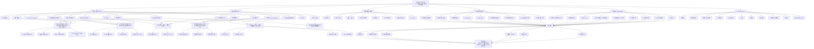

# Dashboard KPI 엑셀기준 원페이지 Mermaid

```mermaid
flowchart TB
    V["SPOGYM DX & AX
    AI 기반으로 스스로 굴러가는 헬스클럽"]

    V --> M1["통합 관제 대시보드"]
    V --> M2["지능형 회원관리 CRM"]
    V --> M3["영업/마케팅 자동화"]
    V --> M4["시스템/운영 자동화"]
    V --> M5["자동알림 Trigger Engine"]
    V --> M6["PT KPI Full Funnel"]

    M1 --> HQ["본사 HQ"]
    M1 --> BR["지점장 / Branch Manager"]
    M1 --> FC["FC / Fitness Consultant"]
    M1 --> PT["PT Trainer"]
    M1 --> GX["GX / 필라테스 강사"]
    M1 --> OPS["운영 / 시스템"]

    M2 --> D1["상담 데이터"]
    M2 --> D2["리드 데이터"]
    M2 --> D3["회원 등록/계약 데이터"]
    M2 --> D4["예약 데이터"]
    M2 --> D5["출석 데이터"]
    M2 --> D6["세션 완료 데이터"]
    M2 --> D7["결제 데이터"]
    M2 --> D8["만료예정/재등록 데이터"]
    M2 --> D9["만족도/NPS 데이터"]
    M2 --> D10["Tasks/업무 데이터"]

    M3 --> F1["신규 유치"]
    M3 --> F2["상담 -> 방문"]
    M3 --> F3["방문 -> 등록"]
    M3 --> F4["초기 7일 활성화"]
    M3 --> F5["정기 방문"]
    M3 --> F6["프로그램 참여"]
    M3 --> F7["재등록 / 재구매"]
    M3 --> F8["LTV / NPS"]

    M4 --> S1["PT 세션 자동 차감"]
    M4 --> S2["노쇼 15분 자동 감지"]
    M4 --> S3["재구매 상담 리스트"]
    M4 --> S4["GX 예약/출석 자동화"]
    M4 --> S5["Today Tasks"]
    M4 --> S6["One-Line DM"]
    M4 --> S7["스케줄 최적화"]
    M4 --> S8["시설 점검/QR 출입"]
    M4 --> S9["오프라인 비용 통합"]

    M5 --> T1["가입 즉시"]
    M5 --> T2["24시간 방문없음"]
    M5 --> T3["7일/30일 체크"]
    M5 --> T4["PT 체험 유도"]
    M5 --> T5["10일 미방문 + PT 잔여"]
    M5 --> T6["GX/PT 미참여 + 10일 미방문"]
    M5 --> T7["만료 D-7 / D-1"]
    M5 --> T8["이탈위험 14일"]
    M5 --> T9["우선순위 / 중복방지 / 로그"]

    M6 --> P1["PT 체험"]
    M6 --> P2["체험 참여율"]
    M6 --> P3["체험 -> 구매 전환"]
    M6 --> P4["PT 출석률"]
    M6 --> P5["주간 소화율"]
    M6 --> P6["노쇼율"]
    M6 --> P7["완강률"]
    M6 --> P8["재구매율"]
    M6 --> P9["트레이너 기여매출"]
    M6 --> P10["객단가"]
    M6 --> P11["만족도 / 리뷰 / NPS"]

    HQ --> K1["전사 신규 / 유지율 / 이탈률 / 지점비교 / CAC / ROI"]
    BR --> K2["월매출 목표달성률 / 활성회원 / 영업이익률 / 직원평균 KPI"]
    FC --> K3["신규 상담 전환율 / TM 완료율 / 재등록 전환율 / 리드 누락률 / 응대시간"]
    PT --> K4["PT 완료율 / 재구매율 / 노쇼율 / 완강률 / 기여매출 / 만족도"]
    GX --> K5["수업 출석률 / 만족도 / 재참여율"]
    OPS --> K6["자동알림 진행률 / 메커니즘 Health / 운영효율"]

    D1 --> K3
    D2 --> K3
    D3 --> K1
    D3 --> K2
    D4 --> K4
    D4 --> K5
    D5 --> K2
    D5 --> K5
    D6 --> K4
    D7 --> K1
    D7 --> K2
    D8 --> K2
    D8 --> K3
    D8 --> K4
    D9 --> K4
    D9 --> K5
    D10 --> K3
    D10 --> K6

    K3 --> R1["신규 상담 전환율 35%+"]
    K3 --> R2["재등록 전환율 50%+"]
    K3 --> R3["리드 누락률 3% 이하"]
    K3 --> R4["TM/Today Tasks 완료율 90%+"]

    K4 --> R5["PT 완료율 85%+"]
    K4 --> R6["PT 재구매율 30%+"]
    K4 --> R7["노쇼율 5% 이하"]
    K4 --> R8["회원 만족도 4.0+/5.0"]

    K5 --> R9["수업 출석률 80%+"]
    K5 --> R10["수업 만족도 4.0+/5.0"]

    K2 --> R11["활성회원 비율 상승"]
    K2 --> R12["월매출 목표 달성"]
    K2 --> R13["영업이익률 개선"]

    K1 --> R14["전사 신규 증가"]
    K1 --> R15["유지율 85~90%+"]
    K1 --> R16["이탈률 15% 이하"]
    K1 --> R17["CAC / ROI 최적화"]

    T1 --> A["자동 액션"]
    T2 --> A
    T3 --> A
    T4 --> A
    T5 --> A
    T6 --> A
    T7 --> A
    T8 --> A
    T9 --> A
    S1 --> A
    S2 --> A
    S3 --> A
    S4 --> A
    S5 --> A
    S6 --> A
    S7 --> A
    S8 --> A
    S9 --> A

    A --> O1["재방문 유도"]
    A --> O2["재등록 상담"]
    A --> O3["재예약 / 노쇼 복구"]
    A --> O4["현장 운영 효율화"]
    A --> O5["직원 업무 표준화"]
    A --> O6["비용 절감"]

    O1 --> Z["최종 결과
    신규 증가 / 재등록 증가 / 이탈 감소 / PT 매출 증가 / 운영비 절감"]
    O2 --> Z
    O3 --> Z
    O4 --> Z
    O5 --> Z
    O6 --> Z
```

