# Dashboard KPI 엑셀기준 전체 다이어그램

## 1. DX/AX 전체 구조

```mermaid
flowchart TB
    VISION["SPOGYM DX & AX
    AI 기반으로 스스로 굴러가는 헬스클럽"]

    VISION --> M1["모듈 1
    통합 관제 대시보드"]
    VISION --> M2["모듈 2
    지능형 회원 관리 CRM"]
    VISION --> M3["모듈 3
    영업/마케팅 자동화"]
    VISION --> M4["모듈 4
    시스템/운영 자동화"]
    VISION --> M5["모듈 5
    자동알림 엔진"]
    VISION --> M6["모듈 6
    PT KPI 풀퍼널"]

    M1 --> M1A["실시간 매출"]
    M1 --> M1B["신규/재등록 추이"]
    M1 --> M1C["예약률/출석률"]
    M1 --> M1D["지점 KPI 비교"]
    M1 --> M1E["공지/시스템 이상 알림"]

    M2 --> M2A["회원 통합관리"]
    M2 --> M2B["상담 기록"]
    M2 --> M2C["활동 로그"]
    M2 --> M2D["회원 생애주기 관리"]
    M2 --> M2E["PT/GX 이력"]

    M3 --> M3A["리드 자동 수집"]
    M3 --> M3B["리드 스코어링"]
    M3 --> M3C["재등록 캠페인"]
    M3 --> M3D["개인화 마케팅"]
    M3 --> M3E["멀티채널 발송"]

    M4 --> M4A["Today Tasks"]
    M4 --> M4B["업무일지/미션"]
    M4 --> M4C["스케줄 최적화"]
    M4 --> M4D["시설 운영 자동화"]
    M4 --> M4E["오프라인 비용 통합"]

    M5 --> M5A["신규 알림"]
    M5 --> M5B["이탈위험 알림"]
    M5 --> M5C["재등록 알림"]
    M5 --> M5D["PT/GX 알림"]
    M5 --> M5E["우선순위/중복방지"]

    M6 --> M6A["PT 체험"]
    M6 --> M6B["PT 전환"]
    M6 --> M6C["수업 소화율"]
    M6 --> M6D["완강률"]
    M6 --> M6E["재구매율"]
    M6 --> M6F["PT 기여 매출"]
    M6 --> M6G["PT 만족도"]
```

## 2. KPI 체계 전체 맵

```mermaid
flowchart TB
    KPI["전체 KPI 체계"]

    KPI --> G1["회사 성장 & Team Health"]
    KPI --> G2["매출관리 & CRM Health"]
    KPI --> G3["시스템 & 운영/비용관리"]
    KPI --> G4["자동알림 트리거 Health"]
    KPI --> G5["PT KPI"]

    G1 --> G1A["신규 상담 전환율"]
    G1 --> G1B["TM 완료율"]
    G1 --> G1C["재등록 전환율"]
    G1 --> G1D["리드 누락률"]
    G1 --> G1E["이탈률"]
    G1 --> G1F["PT 완료율"]
    G1 --> G1G["PT 재구매율"]
    G1 --> G1H["노쇼율"]
    G1 --> G1I["회원 만족도"]
    G1 --> G1J["수업 출석률"]

    G2 --> G2A["신규 유치"]
    G2 --> G2B["초기 활성화"]
    G2 --> G2C["참여/방문"]
    G2 --> G2D["재구매/LTV"]
    G2 --> G2E["유지율/이탈률"]
    G2 --> G2F["NPS"]
    G2 --> G2G["CAC/ROI"]

    G3 --> G3A["자동 차감"]
    G3 --> G3B["노쇼 자동 감지"]
    G3 --> G3C["재구매 상담 리스트"]
    G3 --> G3D["GX 예약/출석 자동화"]
    G3 --> G3E["Today Tasks"]
    G3 --> G3F["One-Line DM"]
    G3 --> G3G["스케줄 자동 최적화"]
    G3 --> G3H["시설 점검 자동화"]
    G3 --> G3I["QR 출입"]
    G3 --> G3J["오프라인 비용 데이터"]

    G4 --> G4A["가입 즉시"]
    G4 --> G4B["24시간 방문없음"]
    G4 --> G4C["7일/30일 체크"]
    G4 --> G4D["PT 체험 유도"]
    G4 --> G4E["10일 미방문 + PT 잔여"]
    G4 --> G4F["GX/PT 모두 미참여 + 10일 미방문"]
    G4 --> G4G["만료 D-7"]
    G4 --> G4H["만료 D-1"]
    G4 --> G4I["이탈위험 14일"]

    G5 --> G5A["체험"]
    G5 --> G5B["체험 참여율"]
    G5 --> G5C["체험→구매 전환"]
    G5 --> G5D["상담 전환율"]
    G5 --> G5E["PT 출석률"]
    G5 --> G5F["주간 소화율"]
    G5 --> G5G["노쇼율"]
    G5 --> G5H["완강률"]
    G5 --> G5I["재구매율"]
    G5 --> G5J["트레이너 기여매출"]
    G5 --> G5K["평균 객단가"]
    G5 --> G5L["만족도/리뷰/NPS"]
```

## 3. 역할별 KPI 구조

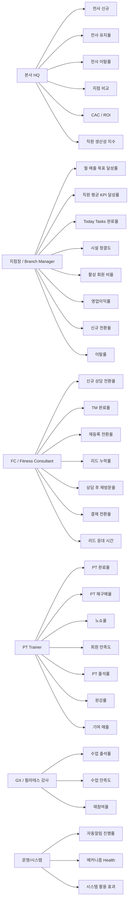

## 4. 성장 퍼널 구조

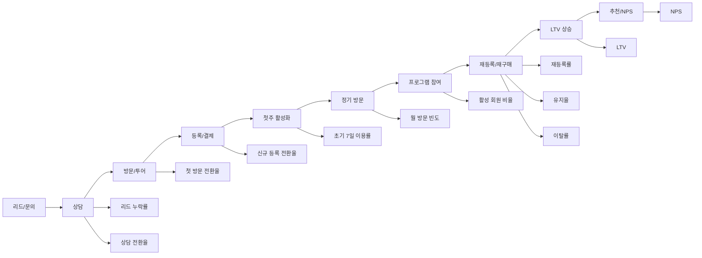

## 5. 회사 성장 & Team Health 흐름

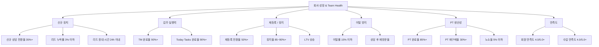

## 6. 매출관리 & CRM Health 구조

```mermaid
flowchart TB
    C["매출관리 & CRM Health"]

    C --> C1["신규 유치 Acquisition"]
    C --> C2["신규 안정 Activation"]
    C --> C3["참여 Engagement"]
    C --> C4["재구매 & LTV Renewal"]
    C --> C5["유지 / Churn"]
    C --> C6["브랜드 / 추천"]
    C --> C7["마케팅 효율"]

    C1 --> C1A["월 신규회원 수"]
    C1 --> C1B["신규 등록 전환율"]
    C1 --> C1C["온라인 유입 비중"]
    C1 --> C1D["첫 방문 전환율"]
    C1 --> C1E["리드 누락률"]

    C2 --> C2A["초기 7일 이용률"]
    C2 --> C2B["첫주 PT 체험 참여율"]
    C2 --> C2C["DB 생존율 30일"]

    C3 --> C3A["활성 회원 비율"]
    C3 --> C3B["월 방문 빈도"]
    C3 --> C3C["프로그램 참여율"]
    C3 --> C3D["회복존/사우나 이용률"]

    C4 --> C4A["재등록률"]
    C4 --> C4B["PT 재구매율"]
    C4 --> C4C["평균 객단가"]
    C4 --> C4D["LTV"]

    C5 --> C5A["유지율"]
    C5 --> C5B["이탈률"]
    C5 --> C5C["AT-RISK 관리"]

    C6 --> C6A["NPS"]
    C6 --> C6B["지인 추천율"]

    C7 --> C7A["CAC"]
    C7 --> C7B["채널 ROI"]
```

## 7. 시스템 & 운영/비용관리 메커니즘 맵

```mermaid
flowchart TB
    S["시스템 & 운영 / 비용관리"]

    S --> S1["프로그램 운영 자동화"]
    S --> S2["직원 스케줄 / 업무일지 / 미션"]
    S --> S3["시설 / 리커버리 / 오프라인 운영"]
    S --> S4["AI 상담 / 세일즈북 / 자동 레코딩"]

    S1 --> S1A["PT 세션 자동 차감"]
    S1 --> S1B["노쇼 15분 자동 감지"]
    S1 --> S1C["PT 종료 자동 감지 + 재구매 상담 리스트"]
    S1 --> S1D["GX 예약/출석 자동화"]
    S1 --> S1E["GX 종료 후 만족도 조사"]
    S1 --> S1F["GX 재참여율 추적"]
    S1 --> S1G["프로그램별 이용률 대시보드"]

    S2 --> S2A["AI Today Tasks 생성"]
    S2 --> S2B["One-Line Daily Mission"]
    S2 --> S2C["스케줄 자동 최적화"]
    S2 --> S2D["업무일지 자동 생성/분석"]
    S2 --> S2E["성과 측정 / 생산성 지수"]
    S2 --> S2F["업무 부하 모니터링"]

    S3 --> S3A["시설 점검 체크리스트 자동화"]
    S3 --> S3B["QR 출입 관리"]
    S3 --> S3C["리커버리 존 이용 추적"]
    S3 --> S3D["장비 고장 자동 감지"]
    S3 --> S3E["운영 비용 데이터 통합"]

    S4 --> S4A["AI 상담 스크립트 추천"]
    S4 --> S4B["상담 자동 녹음/요약"]
    S4 --> S4C["AI 재등록 타이밍 최적화"]
    S4 --> S4D["세일즈북 자동 업데이트"]
    S4 --> S4E["AI 이탈 예측 / 방지 스크립트"]
    S4 --> S4F["CAC 최적화 AI 분석"]
```

## 8. 자동알림 트리거 엔진 구조

```mermaid
flowchart TB
    TR["자동알림 Trigger Engine"]

    TR --> P["기본 원칙"]
    TR --> N["신규 Trigger"]
    TR --> A["At-risk Trigger"]
    TR --> R["Renewal Trigger"]
    TR --> PT["PT Trigger"]
    TR --> GX["GX Trigger"]
    TR --> LOG["발송 로그 / KPI 카드"]

    P --> P1["조건 기반 자동 발송"]
    P --> P2["09:00~21:00 발송"]
    P --> P3["동일 유형 7일 1회 제한"]
    P --> P4["세그먼트 연동
    New / Active / Loyal / At-risk"]
    P --> P5["대시보드 자동 기록"]

    N --> N1["T0 가입 즉시 환영"]
    N --> N2["T+1 가입 24h + 방문없음"]
    N --> N3["T+5 PT 체험 유도"]
    N --> N4["7일 루틴 체크"]
    N --> N5["30일 안정화 체크"]

    A --> A1["10일 미방문 + PT 잔여"]
    A --> A2["GX/PT 모두 미참여 + 10일 미방문"]
    A --> A3["14일 이탈위험"]

    R --> R1["만료 D-7"]
    R --> R2["만료 D-1"]

    PT --> PT1["PT 잔여 1회 이하"]
    PT --> PT2["PT 구매 후 14일 미방문"]
    PT --> PT3["PT 체험 예약 유도"]

    GX --> GX1["GX 재참여 유도"]
    GX --> GX2["수업 미참여 케어"]

    LOG --> K1["Top KPI Cards"]
    LOG --> K2["10일 미방문 + PT 잔여"]
    LOG --> K3["D-7 만료"]
    LOG --> K4["D-1 만료"]
    LOG --> K5["실행/미실행 로그"]
```

## 9. 자동알림 우선순위 로직

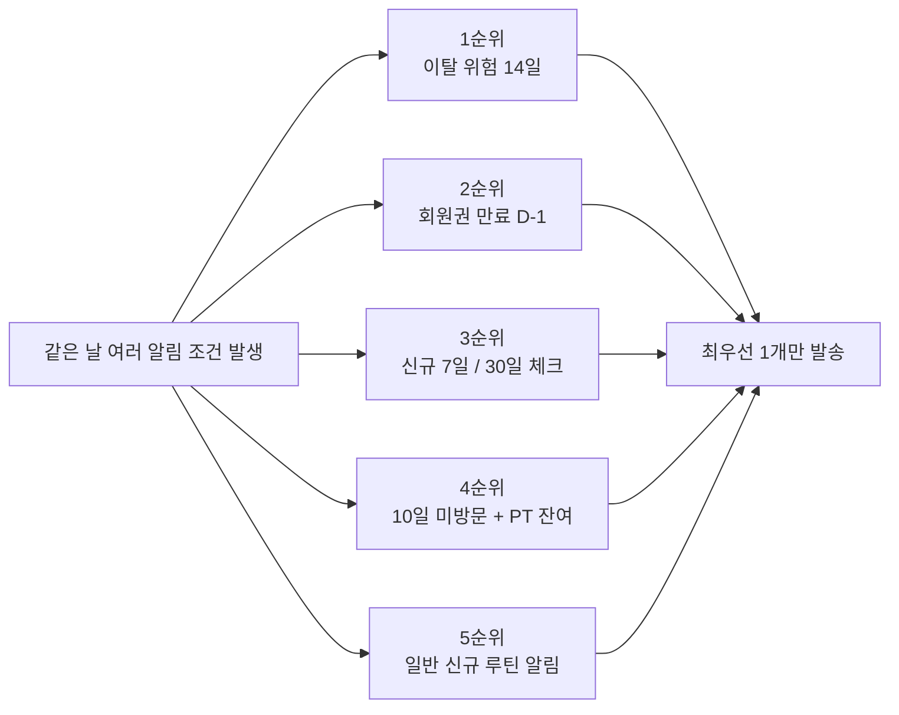

## 10. PT KPI 풀퍼널

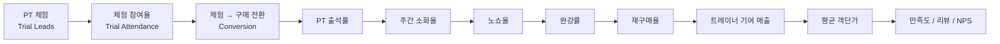

## 11. PT KPI 상세 구조

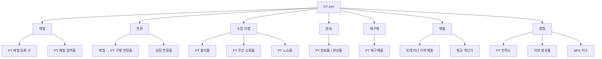

## 12. 데이터 입력원천 구조

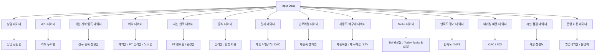

## 13. KPI → 액션 → 결과 구조

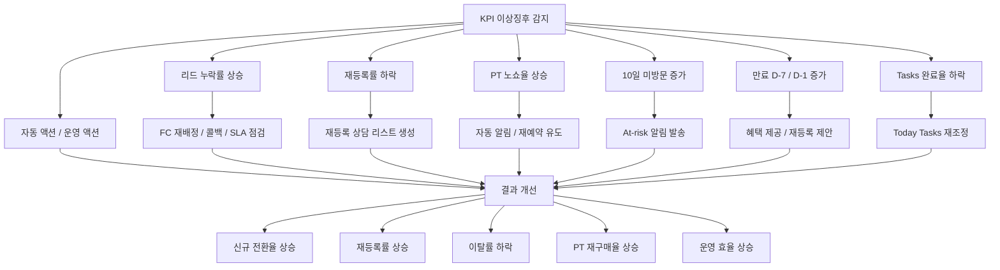

## 14. 현재 적용상태 구조

```mermaid
flowchart TB
    NOW["현재 적용상태"]

    NOW --> DONE["상대적으로 구현된 축"]
    NOW --> PARTIAL["부분 적용 축"]
    NOW --> TODO["미구현 / 선행조건 축"]

    DONE --> D1["대시보드 기본 KPI"]
    DONE --> D2["회원 CRUD / 활동로그"]
    DONE --> D3["매출 / POS"]
    DONE --> D4["수업 상태관리"]
    DONE --> D5["강사 현황 기초"]
    DONE --> D6["자동알림 규칙 UI"]

    PARTIAL --> P1["지점 KPI 비교"]
    PARTIAL --> P2["만료 알림"]
    PARTIAL --> P3["PT 세션 차감"]
    PARTIAL --> P4["마일리지"]
    PARTIAL --> P5["상담 기록"]
    PARTIAL --> P6["예약/출석 통계"]

    TODO --> T1["리드 관리"]
    TODO --> T2["Today Tasks"]
    TODO --> T3["발송 엔진"]
    TODO --> T4["트리거 우선순위/중복방지"]
    TODO --> T5["PT 체험 테이블"]
    TODO --> T6["완강 / 재구매 매칭"]
    TODO --> T7["만족도 / 리뷰 / NPS"]
    TODO --> T8["CAC / ROI"]
    TODO --> T9["시설/비용 데이터"]
    TODO --> T10["AI 스크립트 / CTI / 세일즈북"]
```

## 15. 최종 운영 구조

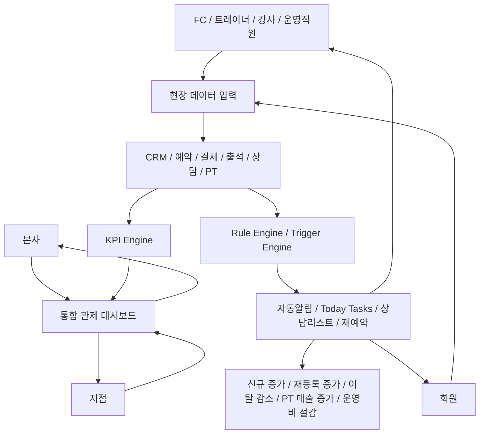

