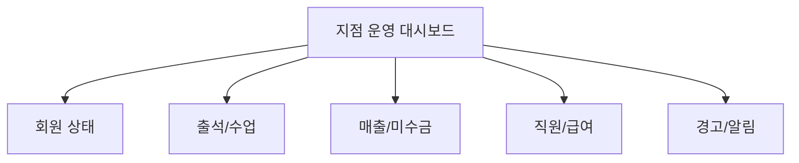
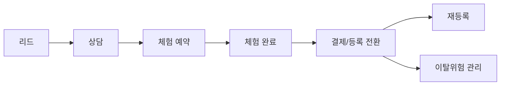

# KPI 역할별 정의서 초안

작성일: 2026-04-09  
연결 문서: `docs/KPI_조직_운영_다이어그램_초안.md`

## 문서 목적

이 문서는 본사, 지점, FC, 트레이너 기준으로 KPI를 분리해서 정의하는 초안이다.  
각 KPI는 아래 5개 기준으로 본다.

- 정의
- 산식
- 입력원천
- 조회주체
- 액션

## 공통 규칙

### 1. KPI 분류

| 분류 | 설명 | 예시 |
|---|---|---|
| 결과 KPI | 이미 일어난 결과를 보는 지표 | 매출, 재등록율, 완강률 |
| 선행 KPI | 결과를 만들기 위한 활동 지표 | 상담수, 체험수, 알림 실행률 |
| 경고 KPI | 문제가 생기기 전에 감지하는 지표 | 이탈위험, 미수금, 출석감소 |
| 운영 KPI | 현장 처리가 정상인지 보는 지표 | 출석 처리율, POS 처리건수 |

### 2. 공통 기준 기간

| 기준 | 기본값 | 비고 |
|---|---|---|
| 일간 | 오늘 | 현장 운영 체크 |
| 주간 | 이번 주 월~일 | 실행 관리 |
| 월간 | 당월 | 평가/정산 |
| 누적 | 최근 3개월, 6개월 | 추세 확인 |

### 3. 공통 상태 정의

| 항목 | 제안 기준 |
|---|---|
| 신규회원 | 당월 등록 회원 |
| 활성회원 | 유효 이용권 1개 이상 보유 회원 |
| 만료임박 | 이용권 종료일 D-30 이내 |
| 홀딩회원 | 홀딩 상태의 회원 |
| 이탈위험회원 | 최근 방문 감소, 만료 임박, 미수금, PT 중단 위험 중 1개 이상 해당 |

## 1. 본사 KPI

### 목적

- 전체 지점의 성장 상태를 본다.
- 지점별 편차와 위험 지점을 빠르게 찾는다.
- 목표 대비 달성률과 운영 안정성을 함께 본다.

### KPI 표

| KPI | 분류 | 정의 | 산식 | 입력원천 | 조회주체 | 액션 |
|---|---|---|---|---|---|---|
| 전사 총회원수 | 결과 | 전지점 전체 회원 수 | 각 지점 회원 수 합계 | `members`, `branches` | 본사 | 지점 확장/축소 판단 |
| 전사 활성회원수 | 결과 | 현재 이용 가능한 회원 수 | 활성회원 합계 | `members.status`, 이용권 만료일 | 본사 | 활성회원 저하 지점 점검 |
| 전사 월매출 | 결과 | 당월 전지점 총매출 | 완료 매출 합계 | `sales` | 본사 | 매출 목표 달성률 확인 |
| 지점별 평균 매출 | 결과 | 지점 평균 매출 | 전사 월매출 / 운영 지점 수 | `sales`, `branches` | 본사 | 하위 지점 개선 계획 |
| 전사 출석수 | 선행 | 오늘 또는 기간 내 출석 건수 | 출석 건수 합계 | `attendance` | 본사 | 회원 활성도 확인 |
| 지점별 성장률 | 결과 | 전월 대비 매출 또는 활성회원 성장률 | `(당월-전월)/전월*100` | `sales`, `members` | 본사 | 고성장/저성장 지점 분류 |
| 지점 건강도 | 경고 | 회원, 매출, 출석, 미수금, 이탈위험을 묶은 점수 | 가중치 합산 | `members`, `sales`, `attendance`, `unpaid`, 알림 결과 | 본사 | 위험 지점 코칭 |
| 인건비율 | 결과 | 매출 대비 급여 비율 | 총급여 / 총매출 * 100 | `payroll`, `sales` | 본사 | 인력 구조 조정 검토 |
| 지점 퇴사율 | 경고 | 기간 내 퇴사 직원 비율 | 퇴사 직원 수 / 총 직원 수 * 100 | `staff`, `users` | 본사 | 조직 안정성 확인 |
| 운영 리스크 건수 | 경고 | 권한, 감사, 미정산, 장애 등 리스크 건수 | 리스크 이벤트 합계 | `audit_logs`, 운영 이벤트 | 본사 | 즉시 시정조치 |

### 현재 구현 연결

| 항목 | 현재 화면/코드 | 상태 |
|---|---|---|
| 전사 총회원수/매출/출석/직원수 | `src/pages/SuperDashboard.tsx` | 일부 구현 |
| 지점별 비교 | `src/pages/BranchReport.tsx` | 일부 구현 |
| 지점 생성/관리 | `src/pages/BranchManagement.tsx` | 구현 |
| 감사/권한 이슈 추적 | `src/pages/AuditLog.tsx` | 일부 구현 |
| 건강도/인건비율/목표달성률 | 없음 | 미구현 |

### 본사 화면 권장 카드

1. 전사 회원
2. 전사 매출
3. 전사 출석
4. 전사 직원
5. 위험 지점 Top 5
6. 성장 지점 Top 5
7. 퇴사율/인건비율 경고
8. 감사 로그 이상 이벤트

## 2. 지점 KPI

### 목적

- 지점장이 운영 결과를 본다.
- 매니저가 일간 실행 항목을 점검한다.
- 지점 단위에서 회원, 매출, 수업, 직원 상태를 동시에 본다.

### KPI 표

| KPI | 분류 | 정의 | 산식 | 입력원천 | 조회주체 | 액션 |
|---|---|---|---|---|---|---|
| 총회원수 | 결과 | 지점 전체 회원 수 | 회원 수 집계 | `members` | 지점장, 매니저 | 회원 규모 추이 확인 |
| 활성회원수 | 결과 | 현재 이용 가능한 회원 수 | 활성 상태 회원 수 | `members.status` | 지점장, 매니저 | 유지율 관리 |
| 신규회원수 | 선행 | 기간 내 신규 등록 회원 수 | 등록일 기준 집계 | `members.regDate` | 지점장, 매니저 | 유입 관리 |
| 만료임박회원수 | 경고 | D-30 이내 만료 회원 수 | 조건 충족 회원 수 | `membershipExpiry` | 지점장, 매니저, FC | 재등록 액션 |
| 홀딩회원수 | 경고 | 홀딩 상태 회원 수 | 홀딩 회원 집계 | `members.status` | 지점장, 매니저 | 휴면 전환 예방 |
| 오늘 출석수 | 선행 | 오늘 방문 회원 수 | 일간 출석 건수 | `attendance` | 지점장, 매니저, 스태프 | 현장 활성도 확인 |
| 출석률 | 결과 | 활성회원 대비 실제 출석 비율 | 출석회원 / 활성회원 * 100 | `attendance`, `members` | 지점장, 매니저 | 저활성군 케어 |
| 당월 매출 | 결과 | 당월 완료 매출 | 완료 매출 합계 | `sales` | 지점장, 매니저 | 목표 달성 관리 |
| 결제수단별 매출 | 결과 | 현금/카드/마일리지 매출 | 수단별 집계 | `sales.paymentMethod` | 지점장, 매니저 | 수익 구조 분석 |
| 미수금 | 경고 | 미결제 상태 금액/건수 | 미수금 합계, 건수 | `sales.status=UNPAID` | 지점장, 매니저 | 수금 일정 관리 |
| 환불건수 | 경고 | 기간 내 환불 건수 | 환불 건수 집계 | `refunds`, `sales` | 지점장 | 운영 품질 점검 |
| 수업 운영률 | 선행 | 계획 수업 대비 실제 진행 수업 비율 | 실제 진행 / 예정 수업 * 100 | `classes`, `lesson_bookings` | 지점장, 매니저 | 강사 스케줄 조정 |
| 직원 재직률 | 결과 | 현 지점 인력 안정성 | 재직 직원 / 총 직원 * 100 | `staff`, `users` | 지점장 | 채용/배치 판단 |
| 급여 집행률 | 운영 | 예정 급여 대비 지급 완료율 | 지급완료 / 전체 급여 * 100 | `payroll` | 지점장 | 정산 누락 방지 |

### 현재 구현 연결

| 항목 | 현재 화면/코드 | 상태 |
|---|---|---|
| 회원/출석/생일자/미수금/만료예정 | `src/pages/Dashboard.tsx` | 일부 구현 |
| 회원 상세/회원 목록 | `src/pages/MemberDetail.tsx`, `src/pages/MemberList.tsx` | 구현 |
| 매출/미수금/환불 | `src/pages/Sales.tsx`, `src/pages/UnpaidManagement.tsx`, `src/pages/RefundManagement.tsx` | 일부 구현 |
| 상품/수업/강사현황 | `src/pages/ProductList.tsx`, `src/pages/ClassSchedule.tsx`, `src/pages/InstructorStatus.tsx` | 일부 구현 |
| 직원/급여 | `src/pages/StaffList.tsx`, `src/pages/Payroll.tsx` | 일부 구현 |

### 지점 운영 대시보드 권장 영역

## 3. FC KPI

### 목적

- FC는 상담부터 체험, 전환, 재등록, 이탈방지까지 본다.
- 현재 프로젝트에서 가장 먼저 보강이 필요한 KPI 영역이다.

### FC 퍼널

### KPI 표

| KPI | 분류 | 정의 | 산식 | 입력원천 | 조회주체 | 액션 |
|---|---|---|---|---|---|---|
| 리드 수 | 선행 | 기간 내 신규 문의/잠재고객 수 | 리드 건수 집계 | 신규 `leads` 필요 | FC, 매니저 | 유입 관리 |
| 상담 수 | 선행 | 실제 상담 완료 건수 | 상담 완료 건수 | 신규 `consultations` 필요 | FC, 매니저 | 상담량 관리 |
| 체험 예약 수 | 선행 | 체험 일정 확정 건수 | 예약 건수 집계 | `scheduleRequests` 또는 신규 체험 테이블 | FC | 체험 유도 |
| 체험 완료 수 | 선행 | 실제 체험 참석 건수 | 참석 건수 집계 | 신규 `trial_sessions` 필요 | FC | 전환 준비 |
| 체험 전환율 | 결과 | 체험 후 결제로 이어진 비율 | 전환건수 / 체험완료건수 * 100 | 체험 + 계약 데이터 | FC, 매니저, 지점장 | 상담 스크립트 개선 |
| 담당 회원 신규등록수 | 결과 | FC가 담당한 신규 등록 회원 수 | 담당 FC 기준 집계 | `members.managerId` 등 | FC, 매니저 | 담당자 성과 비교 |
| 재등록율 | 결과 | 만료 예정 회원 중 재등록 비율 | 재등록회원 / 만료대상회원 * 100 | 계약/결제 데이터 | FC, 매니저 | 재등록 액션 강화 |
| 이탈방지 성공률 | 결과 | 위험군 중 유지 전환된 비율 | 유지회원 / 위험회원 * 100 | 알림 + 재방문 + 재결제 | FC, 매니저 | 케어 우선순위 조정 |
| 상담 후 미전환 건수 | 경고 | 상담은 했지만 전환 안 된 리드 수 | 상담완료 - 전환완료 | 리드/상담/계약 데이터 | FC, 매니저 | 후속 연락 |
| 장기 미방문 담당회원수 | 경고 | 담당 회원 중 일정 기간 미방문 수 | 조건 충족 회원 수 | `attendance`, 담당자 | FC | 리텐션 케어 |

### 현재 구현 연결

| 항목 | 현재 화면/코드 | 상태 |
|---|---|---|
| 회원 등록/담당자 배정 | `docs/05_기능명세서/FN-003~007_회원관리.md` | 문서 기준 존재 |
| 회원 상세 상담 성격 탭 | `src/components/member/TabConsultation.tsx` | 일부 구현 |
| 계약/메시지/자동알림 | `src/pages/ContractWizard.tsx`, `src/pages/MessageSend.tsx`, `src/pages/AutoAlarm.tsx` | 일부 구현 |
| 리드/체험/전환 퍼널 전용 화면 | 없음 | 미구현 |

### FC KPI를 위해 새로 필요한 엔티티

| 엔티티 | 필요한 이유 | 최소 컬럼 |
|---|---|---|
| `leads` | 문의 유입을 회원과 분리하기 위해 | 이름, 연락처, 유입채널, 담당FC, 상태, 생성일 |
| `consultations` | 상담 이력을 구조화하기 위해 | 리드ID/회원ID, 상담일, 상담유형, 결과, 다음액션 |
| `trial_sessions` | 체험 예약/참석/노쇼를 분리하기 위해 | 리드ID/회원ID, 트레이너ID, 일정, 상태 |
| `conversion_logs` | 체험 후 결제 전환을 기록하기 위해 | trial_id, 계약ID, 전환일, 상품유형 |
| `retention_tasks` | 이탈위험 케어 액션을 남기기 위해 | 회원ID, 담당자ID, 위험사유, 액션, 결과 |

## 4. 트레이너 KPI

### 목적

- 트레이너는 수업 소화, 완강, 재구매, 회원 변화에 책임을 갖는다.
- 엑셀 `5. PT KPI` 시트와 가장 직접적으로 연결된다.

### PT KPI 퍼널

### KPI 표

| KPI | 분류 | 정의 | 산식 | 입력원천 | 조회주체 | 액션 |
|---|---|---|---|---|---|---|
| 담당 수업 수 | 선행 | 기간 내 담당 수업 총회수 | 수업 수 집계 | `classes` | 트레이너, 지점장 | 스케줄 배분 |
| 담당 회원 수 | 선행 | 기간 내 담당 회원 수 | 고유 회원 수 집계 | `lesson_bookings`, 담당자 | 트레이너, 지점장 | 회원 분배 조정 |
| 수업 소화율 | 결과 | 예약된 수업 중 실제 진행된 비율 | 진행 수업 / 예약 수업 * 100 | `classes`, 예약 상태 | 트레이너, 지점장 | 노쇼/취소 관리 |
| 출석 준수율 | 선행 | 회원이 예정 수업에 출석한 비율 | 출석회원 / 예약회원 * 100 | `lesson_bookings`, `attendance` | 트레이너 | 리마인드 강화 |
| 완강률 | 결과 | 시작한 PT 패키지를 완강한 비율 | 완강회원 / 시작회원 * 100 | 신규 패키지 이력 필요 | 트레이너, 지점장 | 중도이탈 방지 |
| 재구매율 | 결과 | 완료 후 재결제한 비율 | 재구매회원 / 완료회원 * 100 | 결제/계약 데이터 | 트레이너, 지점장 | 후속 제안 강화 |
| 회원 변화율 | 결과 | 체성분 또는 운동 지표 개선 비율 | 개선회원 / 측정회원 * 100 | `bodyInfo`, 평가 기록 | 트레이너 | 프로그램 개선 |
| 만족도 | 결과 | 후기/평가 평균 점수 | 평가 점수 평균 | `evaluations` | 트레이너, 지점장 | 코칭 품질 개선 |
| 중도 이탈 위험군 | 경고 | 예정 수업 대비 소화가 낮은 회원 수 | 기준 미달 회원 수 | 수업/출석/결제 | 트레이너, FC | 즉시 케어 |
| 노쇼율 | 경고 | 예약 후 미참석 비율 | 노쇼 건수 / 예약 건수 * 100 | `lesson_bookings.status` | 트레이너, 지점장 | 정책 조정 |

### 현재 구현 연결

| 항목 | 현재 화면/코드 | 상태 |
|---|---|---|
| 강사별 수업 수/근무시간/담당 회원 | `src/pages/InstructorStatus.tsx` | 일부 구현 |
| 수업 일정/템플릿 | `src/pages/ClassSchedule.tsx`, `src/pages/ClassTemplates.tsx` | 일부 구현 |
| 체성분/평가/운동기록 | `src/components/member/TabBodyInfo.tsx`, `src/components/member/TabEvaluation.tsx`, `src/components/member/TabExerciseLog.tsx` | 일부 구현 |
| 완강률/재구매율/PT 퍼널 대시보드 | 없음 | 미구현 |

### 트레이너 KPI에서 먼저 정해야 할 산식

| KPI | 제안 산식 | 결정 필요 사항 |
|---|---|---|
| 수업 소화율 | 실제 진행 세션 수 / 예약 확정 세션 수 | 취소 기준 포함 여부 |
| 완강률 | 전체 횟수 소진 회원 / PT 시작 회원 | 기간제 PT와 횟수제 PT를 같이 볼지 |
| 재구매율 | 완강 후 30일 내 재결제 회원 / 완강 회원 | 측정 기간 |
| 회원 변화율 | 주요 지표 개선 회원 / 측정 회원 | 체중, 체지방, 근육량 중 무엇을 대표값으로 볼지 |
| 만족도 | 후기 평균 또는 NPS | 입력 방식과 시점 |

## 5. 스태프/프론트 KPI

### 목적

- 스태프는 현장 처리 정확도와 속도를 본다.
- 결과 KPI보다 운영 KPI 비중이 높다.

### KPI 표

| KPI | 분류 | 정의 | 산식 | 입력원천 | 조회주체 | 액션 |
|---|---|---|---|---|---|---|
| 출석 처리 건수 | 운영 | 기간 내 출석 처리 건수 | 처리 건수 집계 | `attendance` | 스태프, 매니저 | 인력 배치 |
| POS 결제 건수 | 운영 | 현장 결제 처리 건수 | 결제 건수 집계 | `sales`, `pos` | 스태프, 매니저 | 피크타임 대응 |
| 출석 오류 건수 | 경고 | 출석 실패/재처리 건수 | 오류 건수 집계 | 출입 로그 필요 | 스태프, 매니저 | 장비/프로세스 점검 |
| 락커/RFID 처리 건수 | 운영 | 락커, RFID 등록/해제 처리 수 | 처리 건수 집계 | `lockers`, `rfid` | 스태프, 매니저 | 현장 업무량 확인 |
| 대기 처리시간 | 운영 | 문의/대기 응대 평균 시간 | 총응대시간 / 건수 | 신규 업무 로그 필요 | 매니저 | 프론트 혼잡 관리 |
| 민원/오류 재발률 | 경고 | 동일 이슈 재발 비율 | 재발 건수 / 전체 이슈 건수 * 100 | 운영 이슈 로그 필요 | 매니저 | SOP 보강 |

## 6. KPI 구현 우선순위

### Phase 1

- 본사: 전사 회원, 매출, 출석, 직원, 지점 비교
- 지점: 활성회원, 만료임박, 오늘 출석, 당월 매출, 미수금
- 트레이너: 담당 수업 수, 담당 회원 수, 수업 소화율

### Phase 2

- FC: 상담 수, 체험 수, 체험 전환율, 재등록율
- 지점: 수업 운영률, 환불건수, 직원 재직률
- 트레이너: 완강률, 재구매율

### Phase 3

- 본사: 건강도 점수, 인건비율, 운영 리스크
- FC: 이탈방지 성공률, 장기 미방문 케어 성과
- 트레이너: 회원 변화율, 만족도
- 스태프: 대기시간, 오류 재발률

## 7. 화면별 KPI 배치 권장안

| 화면 | 넣을 KPI | 비고 |
|---|---|---|
| 본사 대시보드 | 전사 회원, 매출, 출석, 직원, 지점 건강도 | `SuperDashboard` 확장 |
| 지점 대시보드 | 회원 상태, 출석, 매출, 미수금, 알림 | `Dashboard` 확장 |
| 강사 현황 | 수업 수, 담당 회원 수, 소화율, 완강률 | `InstructorStatus` 확장 |
| FC 대시보드 | 리드, 상담, 체험, 전환, 재등록 | 신규 화면 필요 |
| 자동알림 | 위험군 수, 알림 발송, 후속 액션 결과 | `AutoAlarm` 확장 |

## 8. 의사결정이 필요한 항목

1. 역할 체계 고정
2. `FC`와 `트레이너`를 분리할지, 하나의 직군으로 묶을지
3. PT 체험과 일반 상담을 같은 퍼널로 볼지 분리할지
4. 완강률의 기준을 횟수제 기준으로 볼지 기간제 기준으로 볼지
5. 만족도 점수를 별도 입력받을지 후기 텍스트 기반으로 갈지
6. 본사 건강도 점수를 단일 점수로 만들지, 다중 경고 카드로 나눌지

## 9. 추천 다음 작업

1. 이 문서를 바탕으로 역할명과 KPI 명칭을 먼저 고정한다.
2. `FC 대시보드`와 `트레이너 KPI 대시보드` 와이어를 따로 그린다.
3. `leads`, `consultations`, `trial_sessions`, `conversion_logs`, `retention_tasks` 데이터 모델 초안을 만든다.
4. 이후 `SuperDashboard`, `Dashboard`, `InstructorStatus`에 Phase 1 KPI부터 순차 반영한다.

