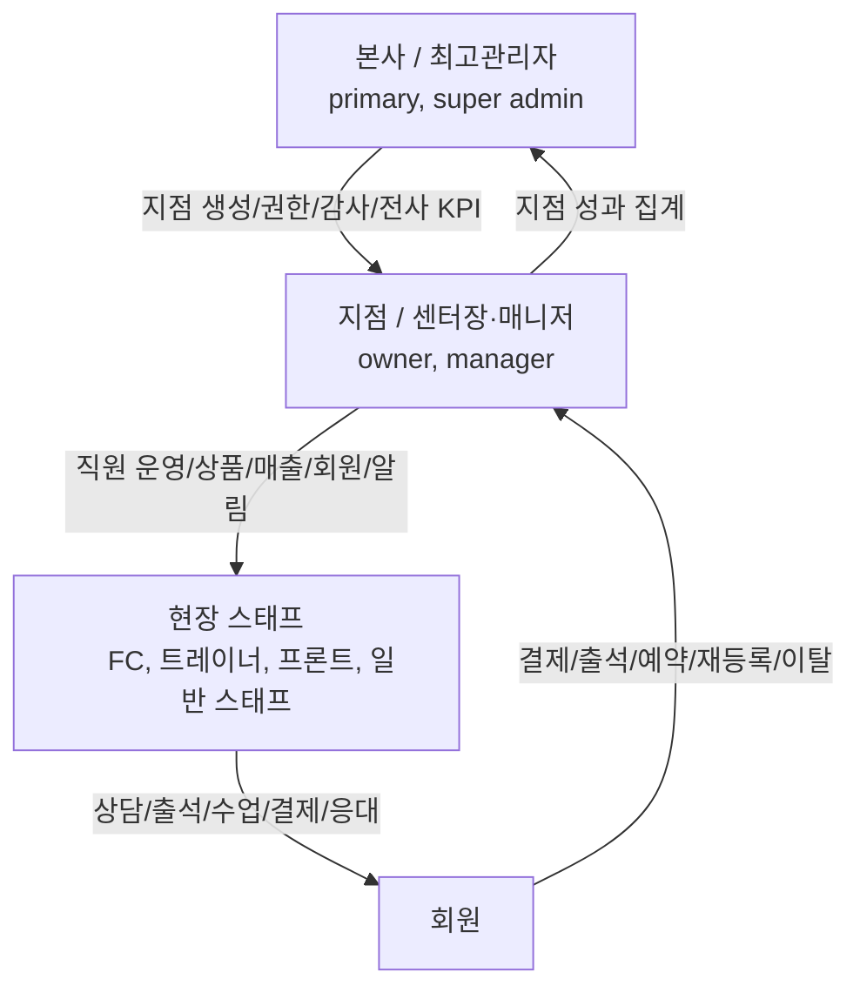
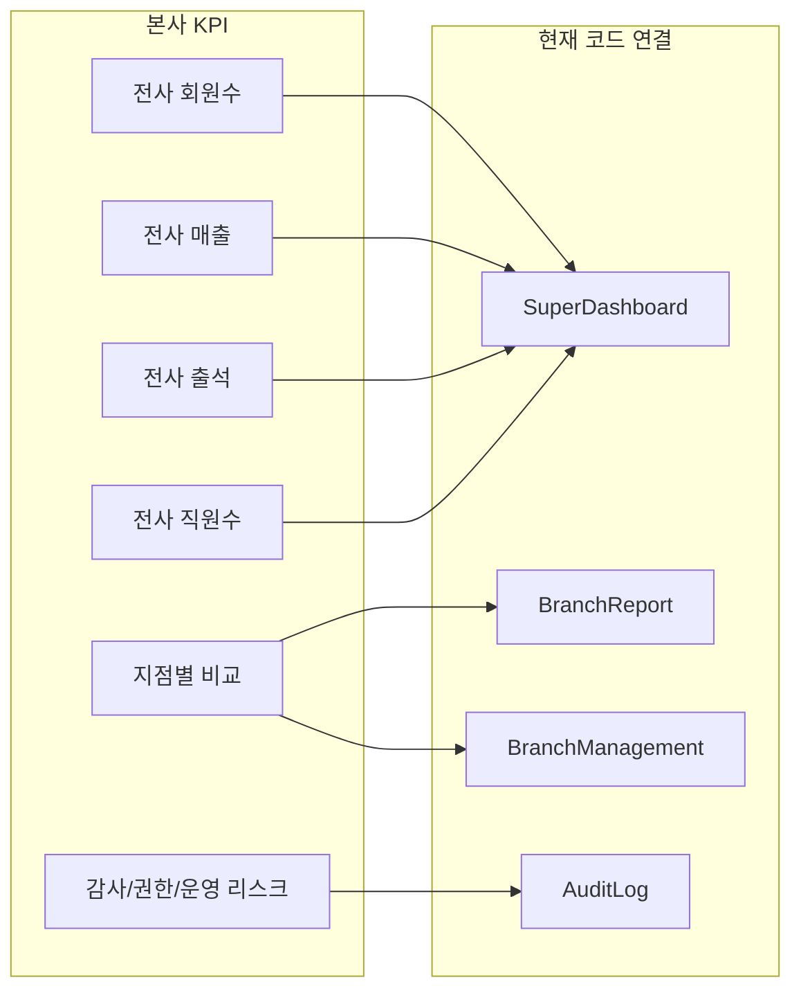
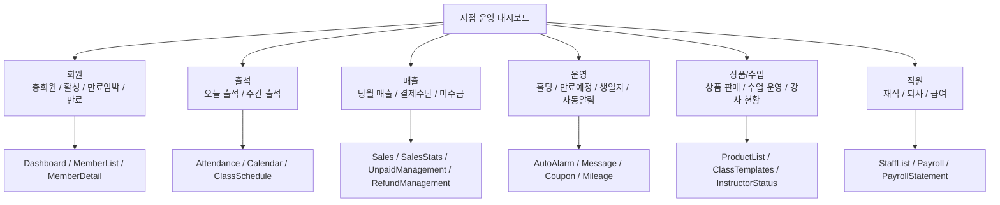
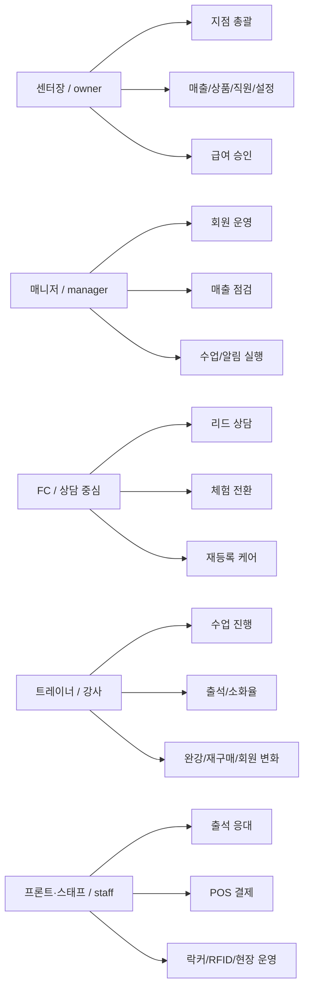
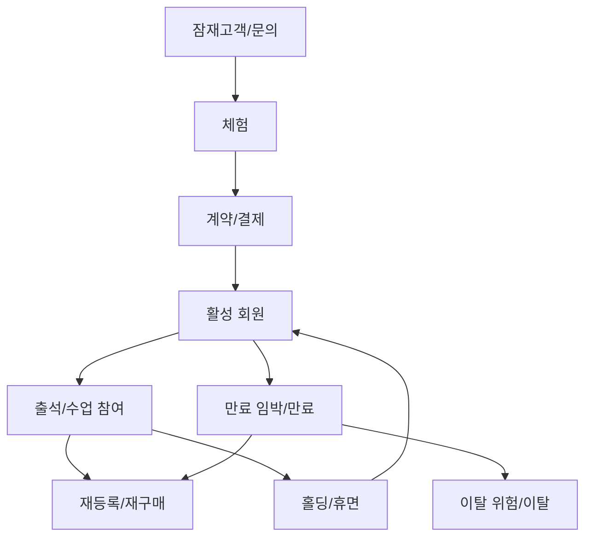
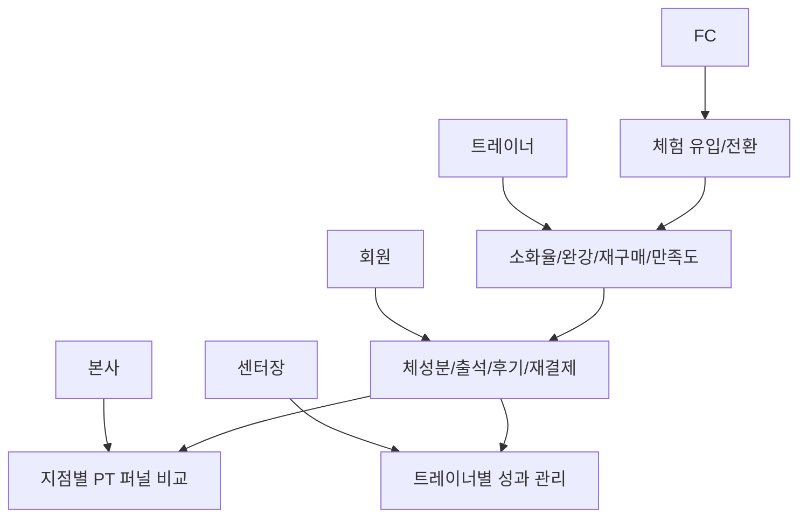
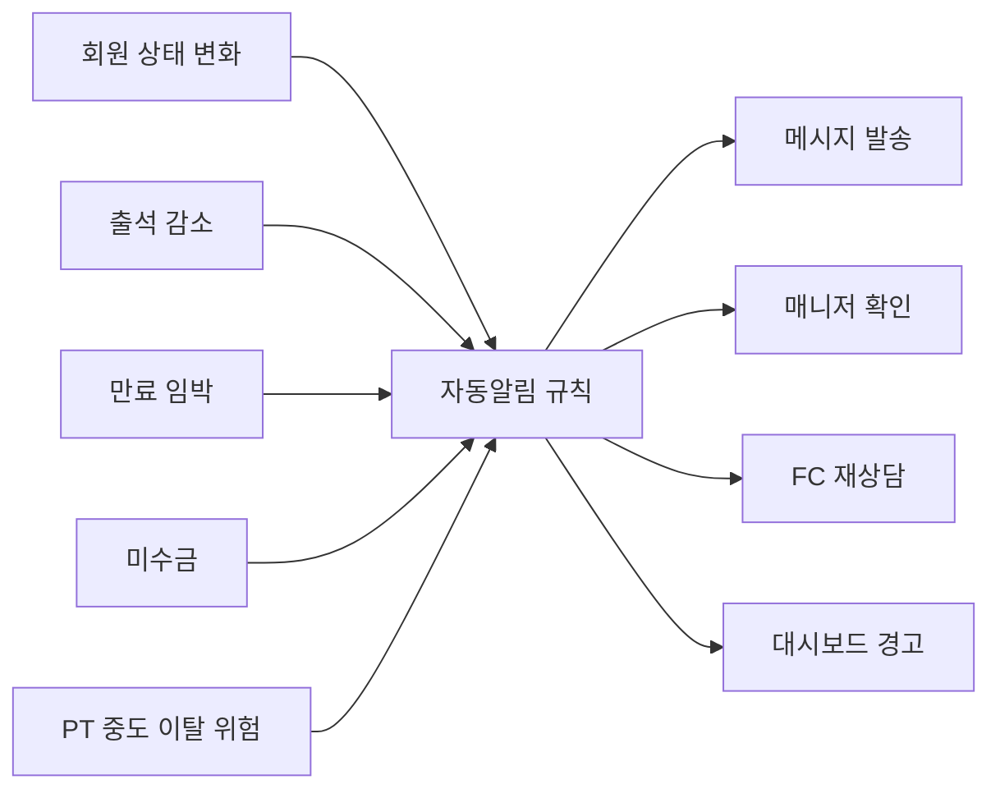

# KPI 조직/운영 다이어그램 초안

작성일: 2026-04-09  
목적: `pandoinfo/DashBoard_KPI_적용현황_분석결과.xlsx`와 현재 `admin-pando` 구현 상태를 함께 보고, 본사/지점/스태프 기준의 운영 다이어그램과 KPI 기준점을 먼저 잡기 위한 초안이다.

상세 KPI 정의서: `docs/KPI_역할별_정의서_초안.md`

## 기준으로 본 소스

- 엑셀 시트명 기준 축
  - `Architecture`
  - `1. 회사 성장 & Team Health`
  - `2. 매출관리 & CRM Health`
  - `3. 시스템 & 운영_비용관리`
  - `4. 자동알림(신규_이탈위험) 트리거`
  - `5. PT KPI`
- 현재 구현 기준
  - 라우트/메뉴: `src/App.tsx`
  - 권한 체계: `src/lib/permissions.ts`
  - 본사용 집계 화면: `src/pages/SuperDashboard.tsx`
  - 지점 리포트: `src/pages/BranchReport.tsx`
  - 지점 대시보드: `src/pages/Dashboard.tsx`
  - 직원 역할/목록: `src/pages/StaffList.tsx`
  - 직원/급여 기능명세: `docs/05_기능명세서/FN-019~022_직원급여.md`
  - 지점 KPI 명세: `docs/05_기능명세서/FN-002_대시보드.md`

## 1. 운영 주체 다이어그램

### 해석

- 본사는 전사 KPI, 지점 비교, 권한, 감사 로그를 본다.
- 지점은 회원/직원/매출/운영 설정을 직접 관리한다.
- 스태프는 회원 접점 데이터의 원천 입력자다.
- 회원 행동 데이터가 지점 KPI가 되고, 지점 KPI가 다시 본사 KPI로 합산된다.

## 2. 본사 관점 KPI 다이어그램

### 현재 구현 기준

- `SuperDashboard`는 전지점 회원수/매출/출석/직원수를 합산한다.
- `BranchReport`는 월 기준 지점별 회원/매출 비교를 제공한다.
- `BranchManagement`, `AuditLog`는 본사 운영 관리 축으로 연결된다.

### 아직 비어 있는 지점

- 엑셀의 `회사 성장 & Team Health` 수준 KPI는 코드에서 별도 모델로 분리돼 있지 않다.
- 지점별 목표 대비 달성률, 인건비율, 지점 건강도 점수는 아직 없다.
- 본사에서 보는 "조직 퍼널"과 "운영 리스크 경보"는 화면/지표 정의가 더 필요하다.

## 3. 지점 관점 KPI 다이어그램

### 해석

- 지점장은 `운영 결과`를 본다.
- 매니저는 `실행 관리`를 본다.
- 화면은 이미 넓게 준비되어 있지만, KPI 간 연결 정의는 아직 느슨하다.

## 4. 스태프 역할 다이어그램

### 역할별 KPI 초안

| 역할 | 핵심 KPI | 현재 연결 화면 | 보강 필요 |
|---|---|---|---|
| 본사 | 전사 회원/매출/출석/직원/지점 비교 | SuperDashboard, BranchReport | 목표/달성률/위험 신호 |
| 센터장 | 지점 매출, 활성회원, 미수금, 퇴사율, 급여 | Dashboard, Sales, Unpaid, Payroll | 손익/인건비율/목표관리 |
| 매니저 | 신규등록, 만료관리, 홀딩, 알림 실행률 | Dashboard, Members, AutoAlarm | 업무 큐/일일 체크리스트 |
| FC | 상담수, 체험수, 전환율, 재등록율, 이탈방지 | MemberDetail, Contracts, Message | 리드/상담/전환 퍼널 데이터 |
| 트레이너 | 수업 소화율, 완강률, 재구매율, 회원 변화 | ClassSchedule, InstructorStatus | PT 퍼널 전용 화면/집계 |
| 스태프 | 출석 처리, 현장결제, 오류 대응, 시설 응대 | Attendance, POS, Locker, RFID | 운영 SLA/실수율/처리속도 |

## 5. 회원 데이터 흐름 다이어그램

### 기획 포인트

- 현재 프로젝트는 `계약 이후 운영`은 비교적 많이 구현돼 있다.
- 반면 `리드 -> 체험 -> 전환` 퍼널은 문서와 KPI 엑셀 관점에 비해 제품 화면 연결이 약하다.
- 따라서 FC KPI를 만들려면 `리드/상담/체험/전환` 엔티티부터 먼저 정리해야 한다.

## 6. PT KPI 다이어그램

엑셀 `5. PT KPI` 시트에서 확인된 핵심 구조:

- 체험
- 체험 -> 전환
- 수업 소화율
- 완강률
- 재구매
- 만족도

이를 현재 프로젝트 기준으로 정리하면 아래 구조가 맞다.

### PT KPI 책임자 매핑

### PT KPI에서 아직 없는 것

- 체험 등록 엔티티
- 체험 -> PT 계약 전환 엔티티
- 트레이너별 수업 소화율 산식
- 완강 판정 기준
- 재구매 판정 기준
- 만족도 입력 채널
- 체형/체성분 변화와 PT 결과 연결

## 7. 자동알림/이탈위험 다이어그램

### 현재 상태

- 자동알림 화면은 존재한다.
- 하지만 `신규/이탈위험` 트리거를 KPI와 연결한 운영 규칙은 더 구체화가 필요하다.
- 즉, "알림이 있다"와 "알림이 성과로 이어진다" 사이의 설계가 아직 비어 있다.

## 8. 지금 바로 기획 기준점으로 쓸 체크 항목

| 구분 | 먼저 확정할 것 | 이유 |
|---|---|---|
| 조직 | 본사/지점/FC/트레이너/프론트의 책임 KPI | 화면은 있어도 책임 기준이 없으면 지표가 흩어진다 |
| 데이터 | 리드, 상담, 체험, 전환, 재등록, 이탈 사유 | FC/PT KPI의 원천 데이터가 된다 |
| 산식 | 전환율, 소화율, 완강률, 재구매율, 출석률 | 같은 지표라도 팀마다 다르게 해석하는 문제를 막는다 |
| 범위 | 현재 구현, 목업만 있는 것, 차후 구현 | 회의 때 "있는 줄 알았던 기능" 혼선을 막는다 |
| 대시보드 | 본사판/지점판/직원판 KPI 분리 | 보는 사람마다 필요한 숫자가 다르다 |
| 경고 체계 | 이탈위험, 미수금, 만료임박, 수업 미소화 | 운영 액션으로 이어지는 KPI가 된다 |

## 9. 현재 프로젝트에서 보이는 핵심 갭

1. 본사/지점 집계 화면은 있지만, 역할별 KPI 체계 문서는 아직 없다.
2. `permissions.ts`의 `fc`와 `StaffList.tsx`의 `trainer`/`FC`/`프론트` 표기가 혼재되어 있어 역할 모델 정리가 필요하다.
3. PT KPI는 엑셀 축은 명확하지만, 제품 안의 데이터 모델과 화면 퍼널은 아직 부족하다.
4. FC용 리드/상담/체험 전환 퍼널이 약해서 "회원 관리"와 "영업 관리"가 완전히 분리돼 있지 않다.
5. 자동알림은 존재하지만 KPI 회복 액션과의 연결 규칙은 더 설계해야 한다.

## 10. 추천 다음 작업

1. 이 문서를 기준으로 역할명을 먼저 고정한다.
2. 본사판, 지점판, FC판, 트레이너판 KPI를 1페이지씩 나눈다.
3. PT KPI와 FC KPI에 필요한 원천 테이블을 정의한다.
4. 각 KPI마다 `정의 / 산식 / 입력원천 / 조회주체 / 액션` 5개 칼럼 표를 만든다.
5. 이후에야 대시보드 UI를 다시 그리는 것이 맞다.
