# SITE 전체 구조 다이어그램

## 1. 전체 사이트맵

```mermaid
flowchart TB
    ROOT["FitGenie CRM"]

    ROOT --> AUTH["인증"]
    ROOT --> HQ["본사 관리"]
    ROOT --> DASH["지점 대시보드"]
    ROOT --> MEMBER["회원"]
    ROOT --> CLASS["수업/캘린더"]
    ROOT --> SALES["매출"]
    ROOT --> PRODUCT["상품"]
    ROOT --> FACILITY["시설"]
    ROOT --> PAYROLL["급여"]
    ROOT --> MSG["메시지/쿠폰"]
    ROOT --> SETTINGS["설정"]
    ROOT --> NOTICE["공지사항"]

    AUTH --> LOGIN["/login"]
    AUTH --> FORBIDDEN["/forbidden"]
    AUTH --> NOTFOUND["/*"]

    HQ --> SUPER_DASH["/super-dashboard"]
    HQ --> BRANCHES["/branches"]
    HQ --> BRANCH_REPORT["/branch-report"]
    HQ --> AUDIT["/audit-log"]
    HQ --> SUBSCRIPTION_HQ["/subscription"]

    DASH --> DASH_MAIN["/"]

    MEMBER --> MEMBERS["/members"]
    MEMBER --> MEMBER_DETAIL["/members/detail"]
    MEMBER --> MEMBER_NEW["/members/new"]
    MEMBER --> MEMBER_EDIT["/members/edit"]
    MEMBER --> MEMBER_TRANSFER["/members/transfer"]
    MEMBER --> BODY["/body-composition"]
    MEMBER --> ATTEND["/attendance"]
    MEMBER --> MILEAGE["/mileage"]
    MEMBER --> CONTRACT["/contracts/new"]

    CLASS --> CALENDAR["/calendar"]
    CLASS --> SCHEDULE_REQ["/schedule-requests"]
    CLASS --> LESSONS["/lessons"]
    CLASS --> LESSON_COUNTS["/lesson-counts"]
    CLASS --> PENALTIES["/penalties"]
    CLASS --> VALID_LESSONS["/valid-lessons"]
    CLASS --> CLASS_TEMPLATE["/class-templates"]
    CLASS --> CLASS_SCHEDULE["/class-schedule"]
    CLASS --> CLASS_STATS["/class-stats"]
    CLASS --> INSTRUCTOR["/instructor-status"]

    SALES --> SALES_MAIN["/sales"]
    SALES --> SALES_STATS["/sales/stats"]
    SALES --> SALES_STAT_MGMT["/sales/statistics-management"]
    SALES --> DEFERRED["/deferred-revenue"]
    SALES --> POS["/pos"]
    SALES --> POS_PAY["/pos/payment"]
    SALES --> REFUNDS["/refunds"]
    SALES --> UNPAID["/unpaid"]

    PRODUCT --> PRODUCTS["/products"]
    PRODUCT --> PRODUCT_NEW["/products/new"]
    PRODUCT --> PRODUCT_EDIT["/products/edit"]

    FACILITY --> LOCKER["/locker"]
    FACILITY --> LOCKER_MGMT["/locker/management"]
    FACILITY --> RFID["/rfid"]
    FACILITY --> ROOMS["/rooms"]
    FACILITY --> GOLF["/golf-bays"]
    FACILITY --> CLOTHING["/clothing"]

    PAYROLL --> STAFF["/staff"]
    PAYROLL --> STAFF_NEW["/staff/new"]
    PAYROLL --> STAFF_EDIT["/staff/edit"]
    PAYROLL --> STAFF_RESIGN["/staff/resignation"]
    PAYROLL --> STAFF_ATT["/staff-attendance"]
    PAYROLL --> PAYROLL_MAIN["/payroll"]
    PAYROLL --> PAYROLL_STATEMENT["/payroll/statements"]

    MSG --> MESSAGE["/message"]
    MSG --> AUTO_ALARM["/message/auto-alarm"]
    MSG --> COUPON["/message/coupon"]

    SETTINGS --> SETTINGS_MAIN["/settings"]
    SETTINGS --> PERMISSION["/settings/permissions"]
    SETTINGS --> KIOSK["/settings/kiosk"]
    SETTINGS --> IOT["/settings/iot"]
    SETTINGS --> DISCOUNT["/discount-settings"]
    SETTINGS --> EXERCISE["/exercise-programs"]
    SETTINGS --> SUBSCRIPTION["/subscription"]

    NOTICE --> NOTICES["/notices"]
```

## 2. 메뉴 그룹 구조

```mermaid
flowchart LR
    APP["AppSidebar"]

    APP --> HQM["본사 관리"]
    APP --> DASHM["대시보드"]
    APP --> MEMBERM["회원"]
    APP --> CLASSM["수업/캘린더"]
    APP --> SALESM["매출"]
    APP --> PRODUCTM["상품"]
    APP --> FACILITYM["시설"]
    APP --> PAYROLLM["급여"]
    APP --> MSGM["메시지/쿠폰"]
    APP --> SETTINGSM["설정"]
    APP --> NOTICEM["공지사항"]

    HQM --> HQM1["통합 대시보드"]
    HQM --> HQM2["지점 관리"]
    HQM --> HQM3["지점 비교 리포트"]
    HQM --> HQM4["전체 직원 관리"]
    HQM --> HQM5["감사 로그"]
    HQM --> HQM6["구독 관리"]

    MEMBERM --> MEMBERM1["회원 목록"]
    MEMBERM --> MEMBERM2["출석 관리"]
    MEMBERM --> MEMBERM3["마일리지 관리"]
    MEMBERM --> MEMBERM4["전자계약"]

    CLASSM --> CLASSM1["캘린더"]
    CLASSM --> CLASSM2["일정 요청"]
    CLASSM --> CLASSM3["수업 관리"]
    CLASSM --> CLASSM4["횟수 관리"]
    CLASSM --> CLASSM5["페널티 관리"]
    CLASSM --> CLASSM6["유효 수업 목록"]
    CLASSM --> CLASSM7["수업 템플릿"]
    CLASSM --> CLASSM8["시간표 등록"]
    CLASSM --> CLASSM9["수업 현황"]
    CLASSM --> CLASSM10["강사 현황"]

    SALESM --> SALESM1["매출 현황"]
    SALESM --> SALESM2["매출 통계"]
    SALESM --> SALESM3["통계 관리"]
    SALESM --> SALESM4["선수익금"]
    SALESM --> SALESM5["POS 결제"]
    SALESM --> SALESM6["현장 판매"]
    SALESM --> SALESM7["환불 관리"]
    SALESM --> SALESM8["미수금 관리"]

    FACILITYM --> FACILITYM1["락커 관리"]
    FACILITYM --> FACILITYM2["사물함 관리"]
    FACILITYM --> FACILITYM3["밴드/카드"]
    FACILITYM --> FACILITYM4["운동룸"]
    FACILITYM --> FACILITYM5["골프 타석"]
    FACILITYM --> FACILITYM6["운동복"]

    PAYROLLM --> PAYROLLM1["직원 관리"]
    PAYROLLM --> PAYROLLM2["직원 근태"]
    PAYROLLM --> PAYROLLM3["급여 관리"]
    PAYROLLM --> PAYROLLM4["급여 명세서"]

    MSGM --> MSGM1["메시지 발송"]
    MSGM --> MSGM2["자동 알림"]
    MSGM --> MSGM3["쿠폰 관리"]

    SETTINGSM --> SETTINGSM1["센터 설정"]
    SETTINGSM --> SETTINGSM2["할인 설정"]
    SETTINGSM --> SETTINGSM3["운동 프로그램"]
    SETTINGSM --> SETTINGSM4["권한 설정"]
    SETTINGSM --> SETTINGSM5["키오스크"]
    SETTINGSM --> SETTINGSM6["출입문/IoT"]
    SETTINGSM --> SETTINGSM7["구독 관리"]
    SETTINGSM --> SETTINGSM8["지점 관리"]
```

## 3. 사용자 역할별 진입 구조

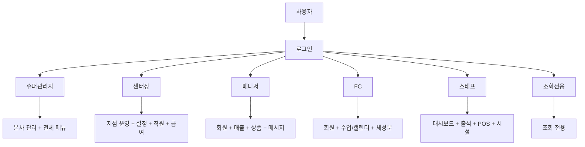

## 4. 권한별 접근 다이어그램

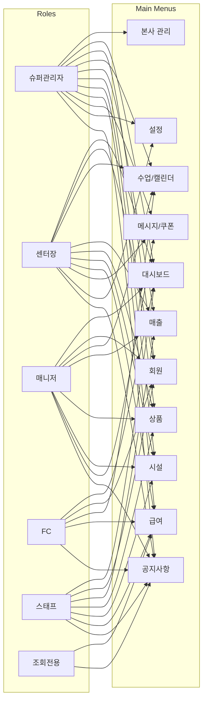

## 5. 메인 업무 흐름

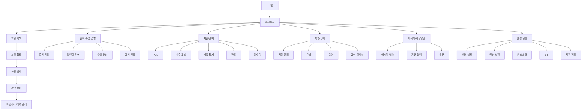

## 6. 회원 중심 플로우

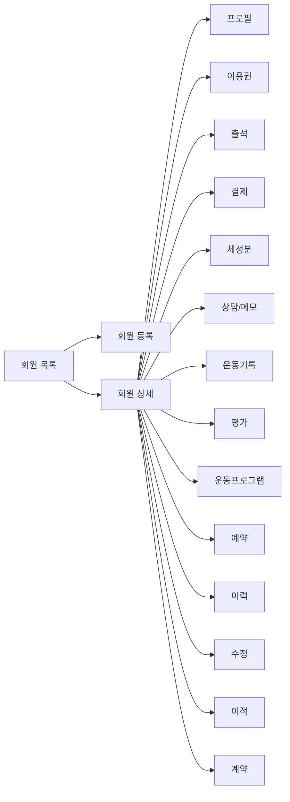

## 7. 수업/강사 운영 플로우

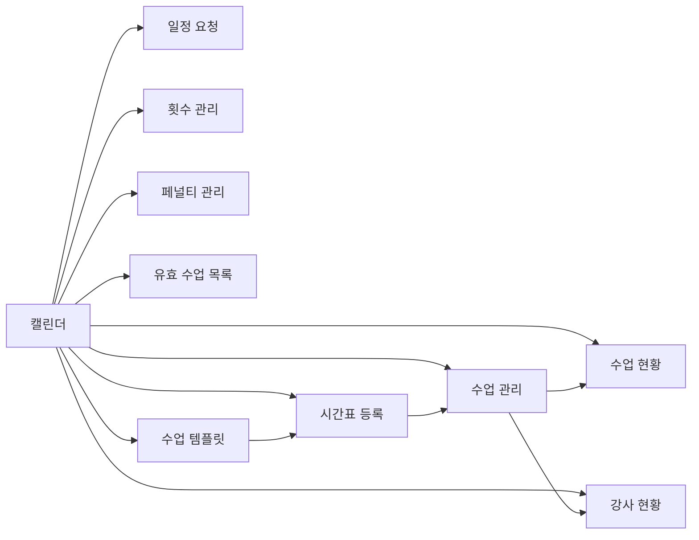

## 8. 매출 운영 플로우

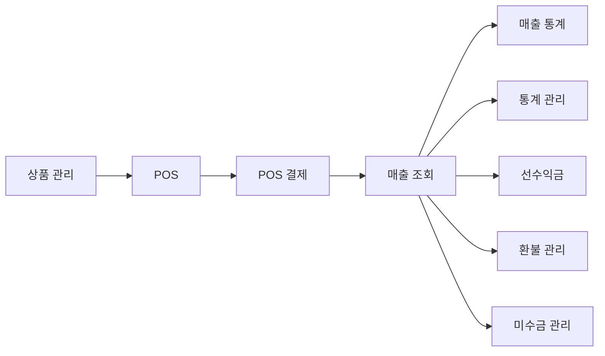

## 9. 시설/운영 플로우

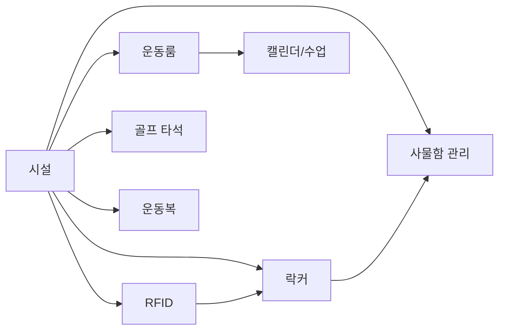

## 10. 본사/지점 운영 분기

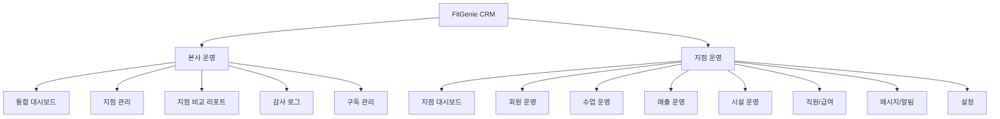

## 11. 기획 관점 모듈 맵

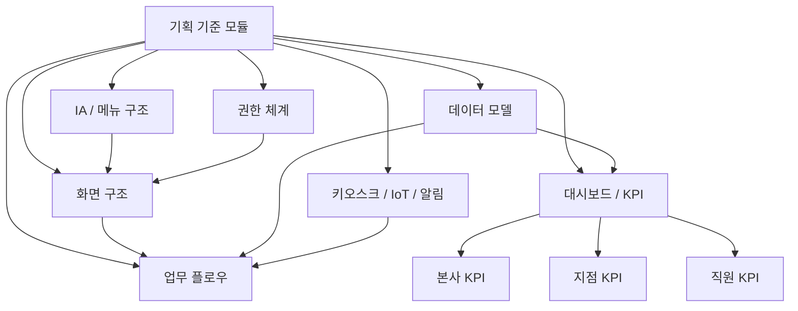

