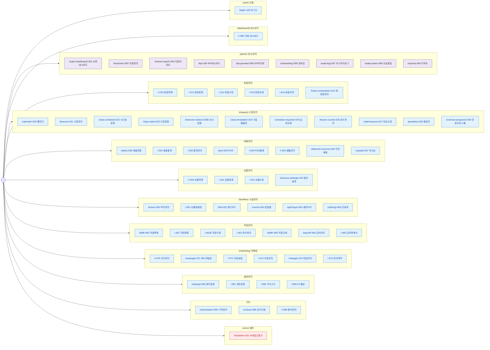

# N1 — 전체 사이트맵개 라우트 전수. 11개 도메인 subgraph. Next App Router 기준.

---

## 라우트 전수 목록 (67개)

| # | 라우트 | SCR | 도메인 |
|---|--------|-----|--------|
| 1 | `/login` | SCR-100 | 인증 |
| 2 | `/` | SCR-090 | 대시보드 |
| 3 | `/super-dashboard` | SCR-091 | 본사관리 |
| 4 | `/branches` | SCR-092 | 본사관리 |
| 5 | `/branch-report` | SCR-093 | 본사관리 |
| 6 | `/kpi` | SCR-094 | 본사관리 |
| 7 | `/kpi-preview` | SCR-095 | 본사관리 |
| 8 | `/onboarding` | SCR-096 | 본사관리 |
| 9 | `/audit-log` | SCR-097 | 본사관리 |
| 10 | `/today-tasks` | SCR-098 | 본사관리 |
| 11 | `/reports` | SCR-099 | 본사관리 |
| 12 | `/` | SCR-010 | 회원관리 |
| 13 | `` | SCR-011 | 회원관리 |
| 14 | `` | SCR-012 | 회원관리 |
| 15 | `` | SCR-013 | 회원관리 |
| 16 | `` | SCR-014 | 회원관리 |
| 17 | `/calendar` | SCR-020 | 수업관리 |
| 18 | `/lessons` | SCR-021 | 수업관리 |
| 19 | `/class-schedule` | SCR-022 | 수업관리 |
| 20 | `/class-stats` | SCR-023 | 수업관리 |
| 21 | `/class-templates` | SCR-024 | 수업관리 |
| 22 | `/schedule-requests` | SCR-025 | 수업관리 |
| 23 | `/lesson-counts` | SCR-026 | 수업관리 |
| 24 | `/valid-lessons` | SCR-027 | 수업관리 |
| 25 | `/penalties` | SCR-028 | 수업관리 |
| 26 | `/sales` | SCR-030 | 매출관리 |
| 27 | `` | SCR-031 | 매출관리 |
| 28 | `` | SCR-032 | 매출관리 |
| 29 | `/pos` | SCR-033 | 매출관리 |
| 30 | `` | SCR-034 | 매출관리 |
| 31 | `/` | SCR-035 | 매출관리 |
| 32 | `/` | SCR-040 | 상품관리 |
| 33 | `` | SCR-041 | 상품관리 |
| 34 | `` | SCR-042 | 상품관리 |
| 35 | `/discount-settings` | SCR-043 | 상품관리 |
| 36 | `/locker` | SCR-050 | 시설관리 |
| 37 | `` | SCR-051 | 시설관리 |
| 38 | `/rfid` | SCR-052 | 시설관리 |
| 39 | `/rooms` | SCR-053 | 시설관리 |
| 40 | `/golf-bays` | SCR-054 | 시설관리 |
| 41 | `/clothing` | SCR-055 | 시설관리 |
| 42 | `/staff` | SCR-060 | 직원관리 |
| 43 | `` | SCR-061 | 직원관리 |
| 44 | `` | SCR-061B | 직원관리 |
| 45 | `` | SCR-062 | 직원관리 |
| 46 | `/staff/` | SCR-063 | 직원관리 |
| 47 | `/payroll` | SCR-064 | 급여관리 |
| 48 | `` | SCR-065 | 급여관리 |
| 49 | `/` | SCR-070 | 마케팅 |
| 50 | `/message` | SCR-071 | 마케팅 |
| 51 | `` | SCR-072 | 마케팅 |
| 52 | `` | SCR-073 | 마케팅 |
| 53 | `/mileage` | SCR-074 | 마케팅 |
| 54 | `` | SCR-075 | 마케팅 |
| 55 | `/settings` | SCR-080 | 설정관리 |
| 56 | `` | SCR-081 | 설정관리 |
| 57 | `` | SCR-082 | 설정관리 |
| 58 | `` | SCR-083 | 설정관리 |
| 59 | `/subscription` | SCR-084 | 기타 |
| 60 | `/notices` | SCR-085 | 기타 |
| 61 | `/` | SCR-086 | 기타 |
| 62 | `/body-composition` | SCR-015 | 회원관리 |
| 63 | `/deferred-revenue` | SCR-036 | 매출관리 |
| 64 | `/unpaid` | SCR-037 | 매출관리 |
| 65 | `/exercise-programs` | SCR-029 | 수업관리 |
| 66 | `/instructor-status` | SCR-023B | 수업관리 |
| 67 | `/forbidden` | ERR-001 | 에러 |
