# N2 — 도메인별 사이트맵개 도메인을 각각 독립 다이어그램으로 표현. 각 섹션은 하나의 도메인.

---

## D01 — 공통/인증/대시보드

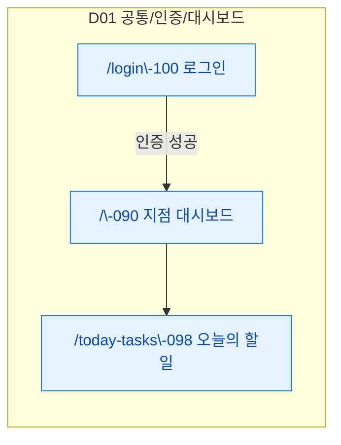

---

## D10 — 본사관리

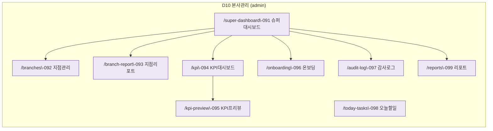

---

## D02 — 회원관리

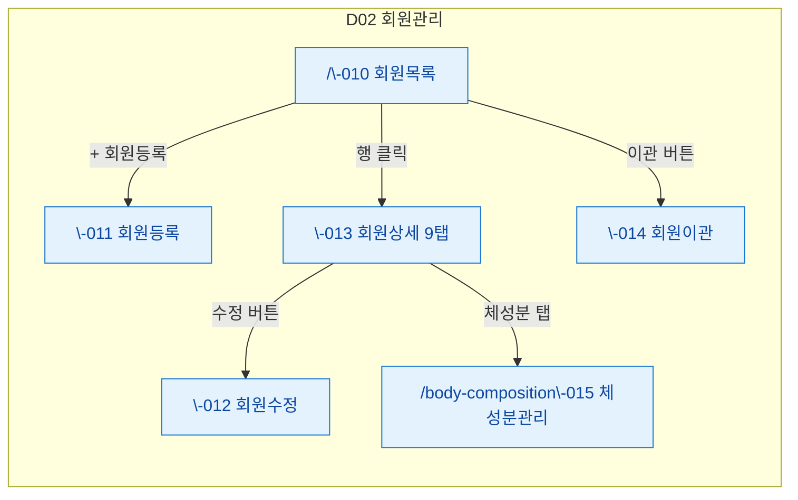

---

## D04 — 수업관리

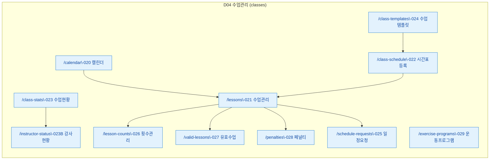

---

## D03 — 매출관리

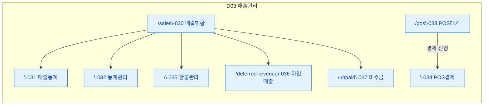

---

## D05 — 상품관리

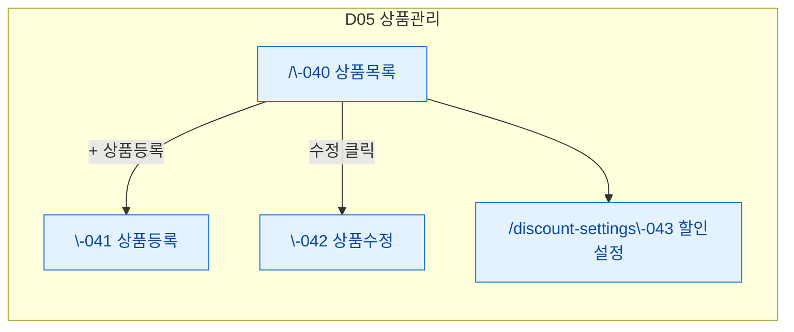

---

## D06 — 시설관리

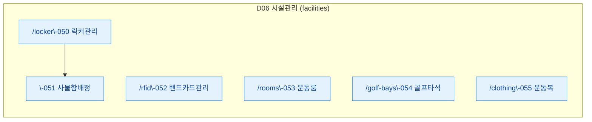

---

## D07 — 직원관리 + 급여관리

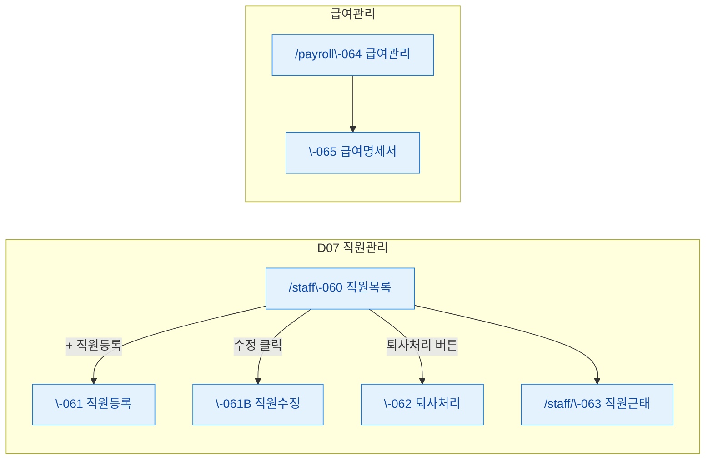

---

## D08 — 마케팅

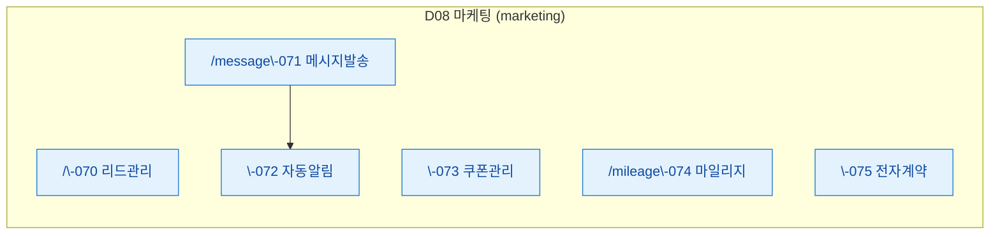

---

## D09 — 설정관리

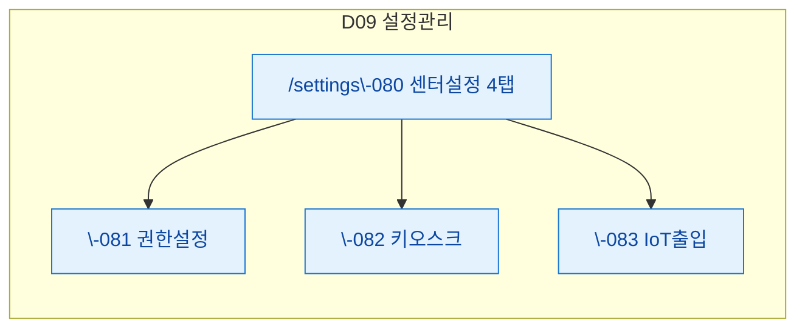

---

## D11 — 기타/에러

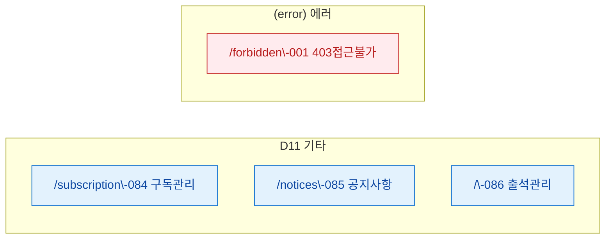
