# N5 — 브레드크럼 계층

> 각 화면의 브레드크럼 경로. 공통 네비게이션 규칙 기준.

```mermaid
flowchart TD
    HOME["홈(/)"]

    HOME --> BC_MEMBER["회원관리"]
    BC_MEMBER --> BC_M010["회원관리 > 회원목록"]
    BC_M010 --> BC_M011["회원관리 > 회원목록 > 회원등록"]
    BC_M010 --> BC_M012["회원관리 > 회원목록 > 회원수정"]
    BC_M010 --> BC_M013["회원관리 > 회원목록 > 회원상세"]
    BC_M010 --> BC_M014["회원관리 > 회원목록 > 회원이관"]
    BC_MEMBER --> BC_M015["회원관리 > 체성분관리"]
    BC_MEMBER --> BC_M086["회원관리 > 출석관리"]

    HOME --> BC_CLASS["수업관리"]
    BC_CLASS --> BC_C020["수업관리 > 캘린더"]
    BC_CLASS --> BC_C021["수업관리 > 수업관리"]
    BC_CLASS --> BC_C022["수업관리 > 시간표등록"]
    BC_CLASS --> BC_C023["수업관리 > 수업현황"]
    BC_C023 --> BC_C023B["수업관리 > 수업현황 > 강사현황"]
    BC_CLASS --> BC_C024["수업관리 > 수업템플릿"]
    BC_CLASS --> BC_C025["수업관리 > 일정요청"]
    BC_CLASS --> BC_C026["수업관리 > 횟수관리"]
    BC_CLASS --> BC_C027["수업관리 > 유효수업"]
    BC_CLASS --> BC_C028["수업관리 > 페널티관리"]
    BC_CLASS --> BC_C029["수업관리 > 운동프로그램"]

    HOME --> BC_SALES["매출관리"]
    BC_SALES --> BC_S030["매출관리 > 매출현황"]
    BC_S030 --> BC_S031["매출관리 > 매출현황 > 매출통계"]
    BC_S030 --> BC_S032["매출관리 > 매출현황 > 통계관리"]
    BC_SALES --> BC_S033["매출관리 > POS"]
    BC_S033 --> BC_S034["매출관리 > POS > 결제처리"]
    BC_SALES --> BC_S035["매출관리 > 환불관리"]
    BC_SALES --> BC_S036["매출관리 > 이연매출"]
    BC_SALES --> BC_S037["매출관리 > 미수금"]

    HOME --> BC_PROD["상품관리"]
    BC_PROD --> BC_P040["상품관리 > 상품목록"]
    BC_P040 --> BC_P041["상품관리 > 상품목록 > 상품등록"]
    BC_P040 --> BC_P042["상품관리 > 상품목록 > 상품수정"]
    BC_PROD --> BC_P043["상품관리 > 할인설정"]

    HOME --> BC_FAC["시설관리"]
    BC_FAC --> BC_F050["시설관리 > 락커관리"]
    BC_F050 --> BC_F051["시설관리 > 락커관리 > 사물함배정"]
    BC_FAC --> BC_F052["시설관리 > 밴드카드관리"]
    BC_FAC --> BC_F053["시설관리 > 운동룸"]
    BC_FAC --> BC_F054["시설관리 > 골프타석"]
    BC_FAC --> BC_F055["시설관리 > 운동복"]

    HOME --> BC_STAFF["직원관리"]
    BC_STAFF --> BC_ST060["직원관리 > 직원목록"]
    BC_ST060 --> BC_ST061["직원관리 > 직원목록 > 직원등록"]
    BC_ST060 --> BC_ST061B["직원관리 > 직원목록 > 직원수정"]
    BC_ST060 --> BC_ST062["직원관리 > 직원목록 > 퇴사처리"]
    BC_STAFF --> BC_ST063["직원관리 > 직원근태"]
    BC_STAFF --> BC_ST064["직원관리 > 급여관리"]
    BC_ST064 --> BC_ST065["직원관리 > 급여관리 > 급여명세서"]

    HOME --> BC_MKT["마케팅"]
    BC_MKT --> BC_MK070["마케팅 > 리드관리"]
    BC_MKT --> BC_MK071["마케팅 > 메시지발송"]
    BC_MK071 --> BC_MK072["마케팅 > 메시지발송 > 자동알림"]
    BC_MKT --> BC_MK073["마케팅 > 쿠폰관리"]
    BC_MKT --> BC_MK074["마케팅 > 마일리지"]
    BC_MKT --> BC_MK075["마케팅 > 전자계약"]

    HOME --> BC_SET["설정"]
    BC_SET --> BC_SE080["설정 > 센터설정"]
    BC_SET --> BC_SE081["설정 > 권한설정"]
    BC_SET --> BC_SE082["설정 > 키오스크설정"]
    BC_SET --> BC_SE083["설정 > IoT출입설정"]

    HOME --> BC_ADMIN["본사관리"]
    BC_ADMIN --> BC_A091["본사관리 > 슈퍼대시보드"]
    BC_ADMIN --> BC_A092["본사관리 > 지점관리"]
    BC_ADMIN --> BC_A093["본사관리 > 지점리포트"]
    BC_ADMIN --> BC_A094["본사관리 > KPI대시보드"]
    BC_A094 --> BC_A095["본사관리 > KPI대시보드 > KPI프리뷰"]
    BC_ADMIN --> BC_A096["본사관리 > 온보딩"]
    BC_ADMIN --> BC_A097["본사관리 > 감사로그"]
    BC_ADMIN --> BC_A099["본사관리 > 리포트"]

    classDef screen fill:#E3F2FD,stroke:#1976D2,color:#0D47A1
    classDef group fill:#F5F5F5,stroke:#9E9E9E,color:#333,font-weight:bold

    class HOME group
    class BC_MEMBER,BC_CLASS,BC_SALES,BC_PROD,BC_FAC,BC_STAFF,BC_MKT,BC_SET,BC_ADMIN group
```

---

## 브레드크럼 깊이별 분류

| 깊이 | 예시 | 해당 화면 |
|------|------|---------|
| 1단계 | `홈` | 지점 대시보드 (`/`) |
| 2단계 | `홈 > 그룹` | 목록 화면 (회원목록, 수업관리 등) |
| 3단계 | `홈 > 그룹 > 화면` | 등록/수정/상세 화면 |
| 4단계 | `홈 > 그룹 > 상위 > 화면` | POS 결제, 강사현황, KPI 프리뷰 등 |

## 브레드크럼 규칙

- 각 항목은 클릭 가능한 링크 (마지막 항목 제외)
- 마지막 항목은 현재 페이지 (비활성 텍스트)
- 모바일: 직전 항목만 표시 (`< 이전 화면명`)
- 최대 깊이: 4단계
