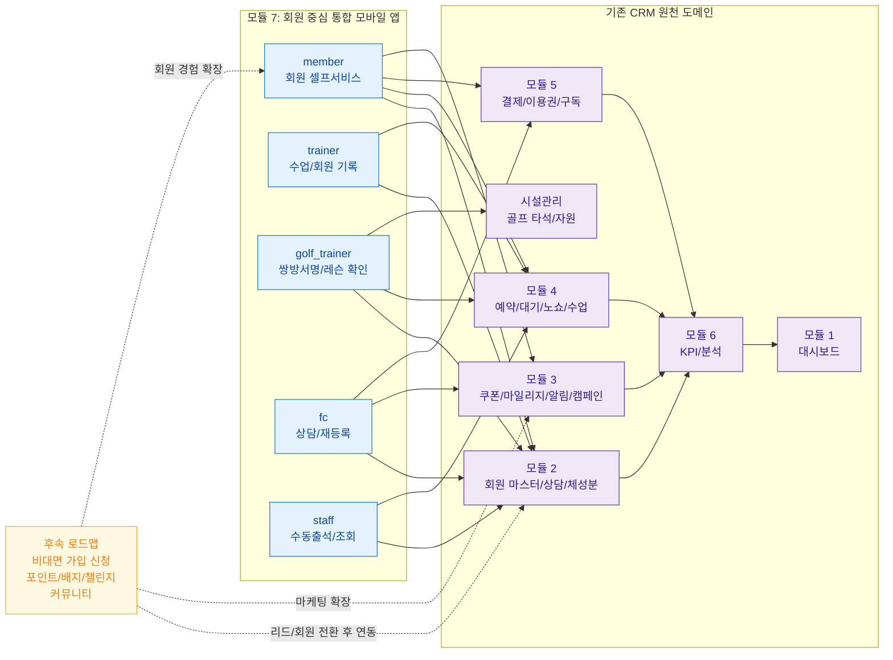

# N7 — 회원앱 기존 프로젝트 연계 맵

## 1. 개요

회원앱은 독립 시스템이 아니라 기존 CRM 모듈을 모바일에서 실행/노출하는 채널이다. 본 다이어그램은 회원앱 역할별 화면이 어떤 루트 도메인과 연결되는지 요약한다.

## 2. 연계 다이어그램

## 3. 핵심 연결 규칙

| 항목 | 연결 기준 |
|------|-----------|
| 제품 포지션 | 회원앱은 회원을 기본으로 하되 현장 역할 확장을 포함한 통합 앱 |
| 데이터 원장 | 회원앱이 새로운 마스터를 소유하지 않고 CRM 각 도메인을 참조/실행 |
| 후속 범위 | 공개 가입, 포인트/배지, 커뮤니티는 로드맵으로 유지하고 현재 범위와 분리 |
