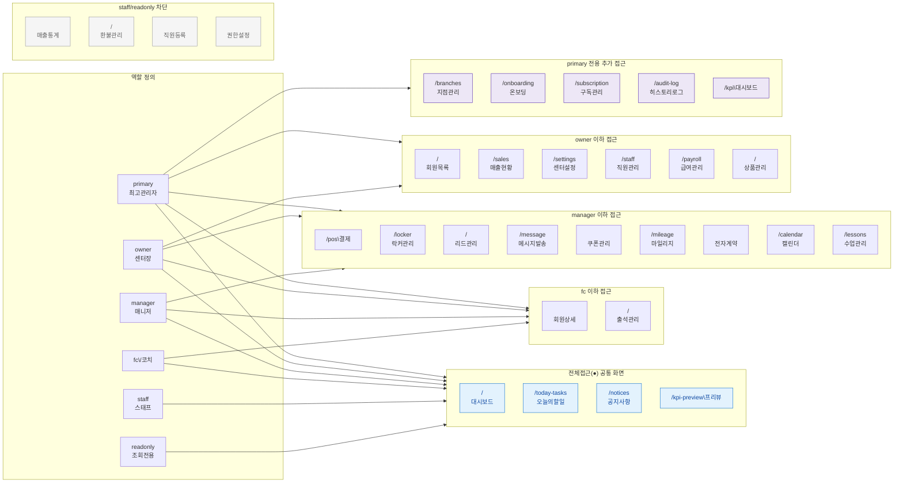

# R1 — 역할 × 화면 접근 매트릭스개 역할 × 67개 라우트 전체 접근 권한. 공통 2.2 메뉴 접근 매트릭스 원본 기준.
> `●` = 전체접근(CRUD), `○` = 조회만, `—` = 접근불가

---

## 전체 권한 매트릭스 테이블

> `●` = 전체접근, `○` = 조회만, `—` = 접근불가

| 화면 | 라우트 | SCR | primary | owner | manager | fc | staff | readonly |
|------|--------|-----|:---:|:---:|:---:|:---:|:---:|:---:|
| 지점 대시보드 | `/` | SCR-090 | ● | ● | ● | ● | ● | ● |
| 오늘의 할일 | `/today-tasks` | SCR-098 | ● | ● | ● | ● | ● | ● |
| 슈퍼 대시보드 | `/super-dashboard` | SCR-091 | ● | — | — | — | — | — |
| 지점 관리 | `/branches` | SCR-092 | ● | ● | — | — | — | — |
| 지점 리포트 | `/branch-report` | SCR-093 | ● | — | — | — | — | — |
| KPI 대시보드 | `/kpi` | SCR-094 | ● | ● | ● | — | — | — |
| KPI 센터 | `/kpi-preview` | SCR-095 | ● | ● | ● | ● | ● | ● |
| 온보딩 | `/onboarding` | SCR-096 | ● | ● | — | — | — | — |
| 히스토리 로그 | `/audit-log` | SCR-097 | ● | ● | ● | — | — | — |
| 리포트 | `/reports` | SCR-099 | ● | ● | ● | — | — | — |
| 회원 목록 | `/` | SCR-010 | ● | ● | ● | ● | ● | ○ |
| 회원 등록 | `` | SCR-011 | ● | ● | ● | ● | ● | — |
| 회원 수정 | `` | SCR-012 | ● | ● | ● | ● | ● | — |
| 회원 상세 | `` | SCR-013 | ● | ● | ● | ● | ● | ○ |
| 회원 이관 | `` | SCR-014 | ● | ● | ● | — | — | — |
| 체성분 관리 | `/body-composition` | SCR-015 | ● | ● | ● | ● | ● | ○ |
| 캘린더 | `/calendar` | SCR-020 | ● | ● | ● | ● | ● | ○ |
| 수업 관리 | `/lessons` | SCR-021 | ● | ● | ● | ● | ● | — |
| 시간표 등록 | `/class-schedule` | SCR-022 | ● | ● | ● | ● | — | — |
| 수업 현황 | `/class-stats` | SCR-023 | ● | ● | ● | ● | ○ | — |
| 강사 현황 | `/instructor-status` | SCR-023B | ● | ● | ● | ● | ○ | — |
| 수업 템플릿 | `/class-templates` | SCR-024 | ● | ● | ● | ● | — | — |
| 일정 요청 | `/schedule-requests` | SCR-025 | ● | ● | ● | ● | — | — |
| 횟수 관리 | `/lesson-counts` | SCR-026 | ● | ● | ● | ● | ● | — |
| 유효 수업 | `/valid-lessons` | SCR-027 | ● | ● | ● | ● | ● | — |
| 페널티 관리 | `/penalties` | SCR-028 | ● | ● | ● | ● | — | — |
| 운동 프로그램 | `/exercise-programs` | SCR-029 | ● | ● | ● | ● | — | — |
| 매출 현황 | `/sales` | SCR-030 | ● | ● | ● | — | — | — |
| 매출 통계 | `` | SCR-031 | ● | ● | ○ | — | — | — |
| 통계 관리 | `` | SCR-032 | ● | ● | ○ | — | — | — |
| POS | `/pos` | SCR-033 | ● | ● | ● | ● | — | — |
| POS 결제 | `` | SCR-034 | ● | ● | ● | ● | — | — |
| 환불 관리 | `/` | SCR-035 | ● | ● | ● | — | — | — |
| 이연매출 | `/deferred-revenue` | SCR-036 | ● | ● | ● | — | — | — |
| 미수금 | `/unpaid` | SCR-037 | ● | ● | ○ | — | — | — |
| 상품 목록 | `/` | SCR-040 | ● | ● | ● | — | — | — |
| 상품 등록 | `` | SCR-041 | ● | ● | ● | — | — | — |
| 상품 수정 | `` | SCR-042 | ● | ● | ● | — | — | — |
| 할인 설정 | `/discount-settings` | SCR-043 | ● | ● | ● | — | — | — |
| 락커 관리 | `/locker` | SCR-050 | ● | ● | ● | ● | — | ● |
| 사물함 배정 | `` | SCR-051 | ● | ● | ● | ● | — | ● |
| 밴드/카드 | `/rfid` | SCR-052 | ● | ● | ● | ● | — | ● |
| 운동룸 | `/rooms` | SCR-053 | ● | ● | ● | ● | — | — |
| 골프 타석 | `/golf-bays` | SCR-054 | ● | ● | ● | ● | — | — |
| 운동복 | `/clothing` | SCR-055 | ● | ● | ● | ● | — | ● |
| 직원 목록 | `/staff` | SCR-060 | ● | ● | ● | — | — | — |
| 직원 등록 | `` | SCR-061 | ● | ● | ● | — | — | — |
| 직원 수정 | `` | SCR-061B | ● | ● | ● | — | — | — |
| 퇴사 처리 | `` | SCR-062 | ● | ● | ● | — | — | — |
| 직원 근태 | `/staff/` | SCR-063 | ● | ● | ● | ○ | — | — |
| 급여 관리 | `/payroll` | SCR-064 | ● | ● | ● | — | — | — |
| 급여 명세서 | `` | SCR-065 | ● | ● | ● | — | — | — |
| 리드 관리 | `/` | SCR-070 | ● | ● | ● | ● | — | — |
| 메시지 발송 | `/message` | SCR-071 | ● | ● | ● | ● | — | — |
| 자동 알림 | `` | SCR-072 | ● | ● | ● | ● | — | — |
| 쿠폰 관리 | `` | SCR-073 | ● | ● | ● | ● | — | — |
| 마일리지 | `/mileage` | SCR-074 | ● | ● | ● | ● | — | — |
| 전자계약 | `` | SCR-075 | ● | ● | ● | ● | ● | — |
| 센터 설정 | `/settings` | SCR-080 | ● | ● | ● | — | — | — |
| 권한 설정 | `` | SCR-081 | ● | ● | ● | — | — | — |
| 키오스크 | `` | SCR-082 | ● | ● | ● | — | — | — |
| IoT/출입 | `` | SCR-083 | ● | ● | ● | — | — | — |
| 구독 관리 | `/subscription` | SCR-084 | ● | ● | — | — | — | — |
| 공지사항 | `/notices` | SCR-085 | ● | ● | ● | ● | ● | ● |
| 출석 관리 | `/` | SCR-086 | ● | ● | ● | ● | ● | ● |
| 403 접근불가 | `/forbidden` | ERR-001 | — | — | — | — | — | — |

---

## 역할별 접근 가능 화면 수 요약

| 역할 | 전체접근(●) | 조회만(○) | 접근불가(—) |
|------|:---:|:---:|:---:|
| primary | 65 | 0 | 2 |
| owner | 56 | 0 | 11 |
| manager | 43 | 5 | 19 |
| fc | 26 | 4 | 37 |
| staff | 11 | 2 | 54 |
| readonly | 10 | 4 | 53 |
