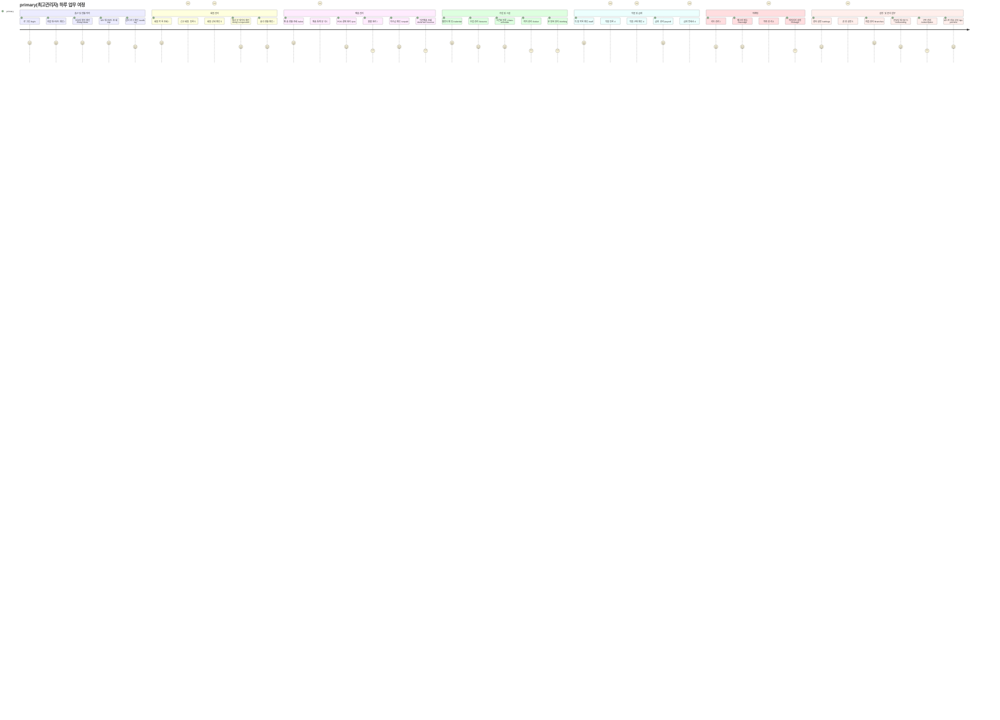

# R2 — primary(최고관리자) Journey

> 지점 내 최상위 권한. 모든 메뉴 접근 가능. (수정 불가).

---

## primary 역할 접근 화면 목록

| 구분 | 화면 | 라우트 | 접근 수준 |
|------|------|--------|---------|
| 대시보드 | 지점 대시보드 | `/` | ● |
| 대시보드 | 오늘의 할일 | `/today-tasks` | ● |
| 본사 | 슈퍼 대시보드 | `/super-dashboard` | ● |
| 본사 | 지점 관리 | `/branches` | ● |
| 본사 | KPI 대시보드 | `/kpi` | ● |
| 본사 | KPI 프리뷰 | `/kpi-preview` | ● |
| 본사 | 온보딩 | `/onboarding` | ● |
| 본사 | 감사 로그 | `/audit-log` | ● |
| 본사 | 리포트 | `/reports` | ● |
| 본사 | 구독 관리 | `/subscription` | ● |
| 회원 | 전체 | `/*` | ● |
| 수업 | 전체 | `/calendar`, `/lessons*` | ● |
| 매출 | 전체 | `/sales*`, `/pos*`, `/*` | ● |
| 상품 | 전체 | `/*`, `/discount-settings` | ● |
| 시설 | 전체 | `/locker*`, `/rfid*`, `/rooms*` | ● |
| 직원 | 전체 | `/staff*` | ● |
| 급여 | 전체 | `/payroll*` | ● |
| 마케팅 | 전체 | `/`, `/message*`, `/mileage` | ● |
| 설정 | 전체 | `/settings*` | ● |
| 기타 | 공지/출석 | `/notices`, `/` | ● |

**접근 가능: 65개 / 차단: 2개 (`/super-dashboard` 일부 본사 전용, `/forbidden`)**
