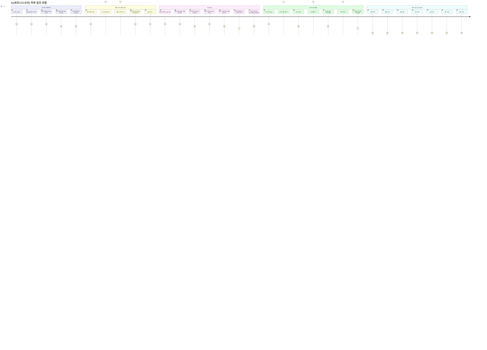

# R5 — fc(피트니스코치) Journey

> 상담/결제/수업 담당. 매출/상품/직원/급여/설정 접근 불가. 담당 회원 중심 업무.

---

## fc 역할 접근 상세

| 화면 | 라우트 | 접근 | 비고 |
|------|--------|:---:|------|
| 대시보드/할일 | `/`, `/today-tasks` | ● | |
| KPI 센터 | `/kpi-preview` | ● | |
| 공지사항 | `/notices` | ● | |
| 회원 목록 | `/` | ● | |
| 회원 등록/수정 | ``, `` | ● | |
| 회원 상세 | `` | ● | |
| 회원 이관 | `` | — | 차단 |
| 체성분 관리 | `/body-composition` | ● | |
| 출석 관리 | `/` | ● | |
| 캘린더 | `/calendar` | ● | |
| 수업 관리 | `/lessons` | ● | 본인 수업만 수정 |
| 시간표 등록 | `/class-schedule` | ● | |
| 수업 현황 | `/class-stats` | ○ | 조회만 |
| 강사 현황 | `/instructor-status` | ○ | 조회만 |
| 횟수/유효수업 | `/lesson-counts`, `/valid-lessons` | ● | |
| 페널티/수업템플릿 | `/penalties`, `/class-templates` | — | 차단 |
| POS 전체 | `/pos`, `` | ● | |
| 매출 현황/통계 | `/sales*` | — | 차단 |
| 환불/미수금 | `/`, `/unpaid` | — | 차단 |
| 상품 관리 | `/*` | — | 차단 |
| 시설 전체 | `/locker*`, `/rfid`, `/rooms*` | — | 차단 |
| 직원/급여 | `/staff*`, `/payroll*` | — | 차단 |
| 리드 관리 | `/` | ● | |
| 메시지 발송 | `/message` | ● | |
| 자동 알림 | `` | ● | |
| 쿠폰/마일리지 | ``, `/mileage` | ● | |
| 전자계약 | `` | ● | |
| 설정 전체 | `/settings*` | — | 차단 |
