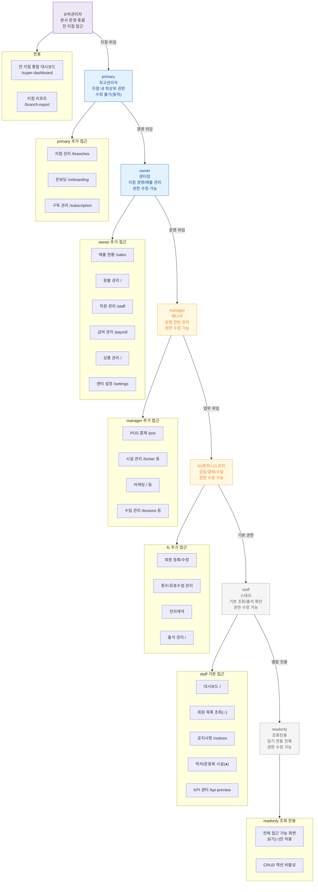

# R8 — 권한 위계

> primary → owner → manager → fc → staff → readonly 위계 구조.
> 설정관리 SCR-081 역할 정의 기준.

---

## 권한 상속 원칙

| 원칙 | 설명 |
|------|------|
| 상위 포함 원칙 | 상위 역할은 하위 역할의 모든 권한 포함 |
| 시스템 역할 잠금 | `primary`, ``은 권한 수정 불가 (``) |
| 최소 권한 원칙 | 기본값은 최소 권한. 필요 시 SCR-081에서 확장 |
| 커스텀 역할 | owner 이하는 SCR-081에서 커스텀 역할 생성 가능 |
| 지점 격리 | 각 역할은 자신이 속한 지점 데이터만 접근 ( 제외) |

## 역할별 핵심 차별화 권한

| 역할 | 독점 권한 | 제한 내용 |
|------|---------|---------|
| | 전 지점 통합 조회, 지점 리포트 | 지점 내 CRUD 직접 수행 없음 |
| primary | 지점 관리, 온보딩, 구독 관리 | 본사 전체 통합 불가 |
| owner | 매출/환불/직원/급여/상품/설정 전체 | 타 지점 접근 불가 |
| manager | POS, 시설, 마케팅, 수업 관리 | 매출/직원/급여 조회만 일부 |
| fc | 회원 CRUD, 수업, 전자계약 | 매출/상품/직원/설정 불가 |
| staff | 대시보드, 시설일부, 출석, 공지 | 대부분 조회만 또는 차단 |
| readonly | 허용 화면 전체 조회 | CRUD 액션 전부 비활성 |
