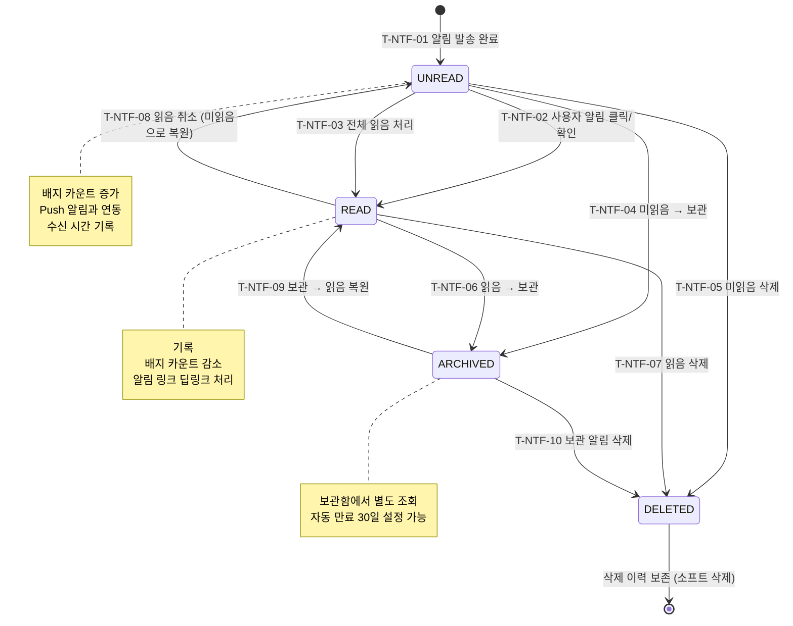

## 1. 개요

알림(Notification) 엔티티의 생명주기 상태를 정의한다. 인앱 알림 및 Push/SMS/카카오 알림의 읽음/미읽음 상태 관리와 보관/삭제 흐름을 포함한다.

- **엔티티**: `Notification`
- **저장 방식**: DB enum
- **관련 화면**: SCR-104(알림 센터), 알림 드로어, 회원앱 알림 목록

---

## 2. 상태 정의

| 상태값 | 한글명 | 설명 | UI 색상 | 종료 여부 |
|--------|--------|------|---------|-----------|
| `UNREAD` | 미읽음 | 발송 완료, 미확인 | #2196F3 (파랑) | 비종료 |
| `READ` | 읽음 | 사용자가 확인 완료 | #9E9E9E (회색) | 비종료 |
| `ARCHIVED` | 보관 | 사용자가 보관 처리 | #607D8B (청회색) | 비종료 |
| `DELETED` | 삭제 | 소프트 삭제 | #F44336 (빨강) | 종료 |

---

## 3. 상태 전이 다이어그램

---

## 4. 전이 이벤트 목록

| 이벤트 ID | From | To | 트리거 | 권한 | 부수효과 | TC 후보 |
|-----------|------|----|--------|------|----------|---------|
| T-NTF-01 | [신규] | UNREAD | 시스템 알림 발송 | 시스템 | 알림 레코드 생성, 배지 카운트 +1 | TC-NTF-01 |
| T-NTF-02 | UNREAD | READ | 사용자 알림 클릭/탭 | STAFF 본인 / 회원 본인 | 기록, 배지 카운트 -1, 딥링크 이동 | TC-NTF-02 |
| T-NTF-03 | UNREAD | READ | 전체 읽음 처리 | STAFF 본인 / 회원 본인 | 전체 일괄 업데이트, 배지 초기화 | TC-NTF-03 |
| T-NTF-04 | UNREAD | ARCHIVED | 미읽음 알림 보관 | STAFF 본인 / 회원 본인 | 기록, 배지 카운트 -1 | TC-NTF-04 |
| T-NTF-05 | UNREAD | DELETED | 미읽음 알림 삭제 | STAFF 본인 / 회원 본인 | 소프트 삭제, 배지 카운트 -1 | TC-NTF-05 |
| T-NTF-06 | READ | ARCHIVED | 읽은 알림 보관 | STAFF 본인 / 회원 본인 | 기록 | TC-NTF-06 |
| T-NTF-07 | READ | DELETED | 읽은 알림 삭제 | STAFF 본인 / 회원 본인 | 소프트 삭제, 기록 | TC-NTF-07 |
| T-NTF-08 | READ | UNREAD | 읽음 취소 (관리자 정정) | MANAGER 이상 | 초기화, 배지 카운트 +1 | TC-NTF-08 |
| T-NTF-09 | ARCHIVED | READ | 보관 알림 읽음 복원 | STAFF 본인 / 회원 본인 | 초기화 | TC-NTF-09 |
| T-NTF-10 | ARCHIVED | DELETED | 보관 알림 삭제 | STAFF 본인 / 회원 본인 | 소프트 삭제 | TC-NTF-10 |

---

## 5. 예외/롤백 분기

| 시나리오 | 조건 | 처리 | 에러 코드 |
|----------|------|------|-----------|
| 삭제된 알림 딥링크 접근 | DELETED 상태 알림 URL 직접 접근 | 404 처리 | E404002 |
| Push 발송 실패 | FCM/APNS 오류 | UNREAD 상태 유지, 재발송 큐 등록 | E501401 |
| 배지 카운트 불일치 | 동시성 이슈로 카운트 오류 | 배지 재계산 API 호출 | E501402 |
| 전체 읽음 처리 부분 실패 | DB 배치 오류 | 부분 처리 후 재시도 | E501403 |
