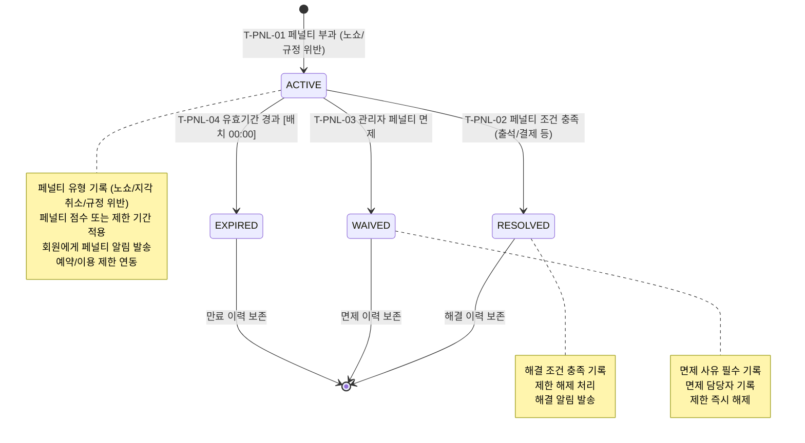

## 1. 개요

페널티(Penalty) 엔티티의 생명주기 상태를 정의한다. 노쇼/취소 위반 등으로 부과된 페널티의 부과, 해결, 면제, 자동 만료까지의 흐름을 포함한다.

- **엔티티**: `Penalty`
- **저장 방식**: DB enum
- **관련 화면**: SCR-M004(회원 상세 - 페널티 탭), SCR-L003(예약 관리), SCR-K003(상담 관리)

---

## 2. 상태 정의

| 상태값 | 한글명 | 설명 | UI 색상 | 종료 여부 |
|--------|--------|------|---------|-----------|
| `ACTIVE` | 활성 | 페널티 부과 중 (적용 중) | #F44336 (빨강) | 비종료 |
| `RESOLVED` | 해결 | 페널티 해소 완료 | #4CAF50 (녹색) | 종료 |
| `WAIVED` | 면제 | 관리자 수동 면제 | #9C27B0 (보라) | 종료 |
| `EXPIRED` | 만료 | 페널티 유효기간 자동 만료 | #9E9E9E (회색) | 종료 |

---

## 3. 상태 전이 다이어그램

---

## 4. 전이 이벤트 목록

| 이벤트 ID | From | To | 트리거 | 권한 | 부수효과 | TC 후보 |
|-----------|------|----|--------|------|----------|---------|
| T-PNL-01 | [신규] | ACTIVE | 노쇼/취소 위반 감지 또는 관리자 수동 부과 | TRAINER 이상 / 시스템 | 페널티 레코드 생성, 유형 기록, 회원 알림, 이용 제한 적용 | TC-PNL-01 |
| T-PNL-02 | ACTIVE | RESOLVED | 페널티 해소 조건 충족 (출석, 결제, 기간 경과 등) | MANAGER 이상 / 시스템 | 해결 일시 기록, 이용 제한 해제, 해결 알림 발송 | TC-PNL-02 |
| T-PNL-03 | ACTIVE | WAIVED | 관리자 페널티 면제 처리 | MANAGER 이상 | 면제 사유 필수 기록, 면제 담당자 기록, 즉시 제한 해제 | TC-PNL-03 |
| T-PNL-04 | ACTIVE | EXPIRED | 유효기간 경과 [배치 00:00] | 시스템 | 만료 처리, 이용 제한 자동 해제 | TC-PNL-04 |

---

## 5. 예외/롤백 분기

| 시나리오 | 조건 | 처리 | 에러 코드 |
|----------|------|------|-----------|
| 중복 페널티 부과 | 동일 사유 동일 날짜 중복 | 거부, 기존 페널티 확인 안내 | E401601 |
| 면제 사유 미입력 | WAIVED 전환 시 사유 없음 | 전환 거부, 사유 입력 요청 | E401602 |
| 만료 배치 실패 | 배치 오류 | 수동 만료 처리 필요, 관리자 알림 | E501601 |
| 이용 제한 해제 실패 | RESOLVED/WAIVED/EXPIRED 후 제한 해제 오류 | 수동 제한 해제 처리 필요 | E501602 |
| 복수 페널티 중 일부 해결 | 회원이 여러 ACTIVE 페널티 보유 | 각 페널티 독립 처리, 전체 해제는 모든 페널티 종료 후 | - |
