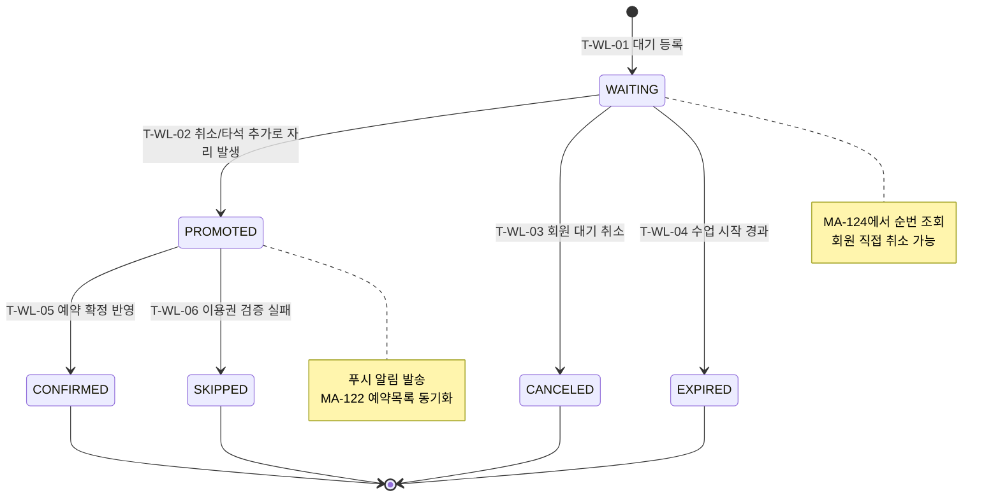

## 1. 개요

회원 앱의 대기 예약은 `정원/타석 마감` 상황에서 생성되며, 취소 발생 또는 자원 추가 시 자동 승격된다. 본 문서는 회원 관점의 대기 상태 수명주기를 정의한다.

- **엔티티**: `lesson_bookings.status=WAITLIST` + `waitlist_position`, `promoted_at`
- **관련 화면**: MA-121, MA-123, MA-124, MA-122

---

## 2. 상태 정의

| 상태값 | 한글명 | 설명 | UI 색상 | 종료 여부 |
|--------|--------|------|---------|-----------|
| `WAITING` | 대기중 | 순번이 부여된 대기 상태 | #03A9F4 | 비종료 |
| `PROMOTED` | 승격됨 | 자리 발생으로 확정 처리 중인 상태 | #FF9800 | 비종료 |
| `CONFIRMED` | 예약확정 | 정식 예약으로 전환 완료 | #4CAF50 | 종료 |
| `CANCELED` | 대기취소 | 회원이 직접 취소 | #9E9E9E | 종료 |
| `SKIPPED` | 승격건너뜀 | 이용권 만료/검증 실패로 다음 순번으로 이월 | #795548 | 종료 |
| `EXPIRED` | 대기만료 | 수업 시작 경과 또는 운영 종료로 만료 | #607D8B | 종료 |

---

## 3. 상태 전이 다이어그램

---

## 4. 전이 이벤트 목록

| 이벤트 ID | From | To | 트리거 | 권한 | 부수효과 |
|-----------|------|----|--------|------|----------|
| T-WL-01 | [신규] | WAITING | 회원이 대기 등록 | member | 순번 계산, 대기 푸시 발송 |
| T-WL-02 | WAITING | PROMOTED | 취소 발생 또는 자원 추가 | system | 이용권 검증 시작, 순번 재정렬 |
| T-WL-03 | WAITING | CANCELED | 회원 직접 취소 | member | 순번 재정렬 |
| T-WL-04 | WAITING | EXPIRED | 수업 시작 시각 경과 | system | 만료 알림, 리스트 종료 |
| T-WL-05 | PROMOTED | CONFIRMED | 예약 생성/전환 성공 | system | 예약 카드 생성, 확정 푸시 발송 |
| T-WL-06 | PROMOTED | SKIPPED | 이용권 만료 또는 검증 실패 | system | 다음 순번 승격 |

---

## 5. 예외/롤백 분기

| 시나리오 | 조건 | 처리 |
|----------|------|------|
| 동시 취소 2건 | 두 자리 이상 동시 발생 | 트랜잭션으로 순차 승격 |
| 회원이 승격 직전 취소 | WAITING 상태에서 취소 요청 | CANCELED 우선 처리 |
| 승격 후 예약 생성 실패 | DB 충돌/네트워크 오류 | PROMOTED 롤백 후 재시도 큐 적재 |

