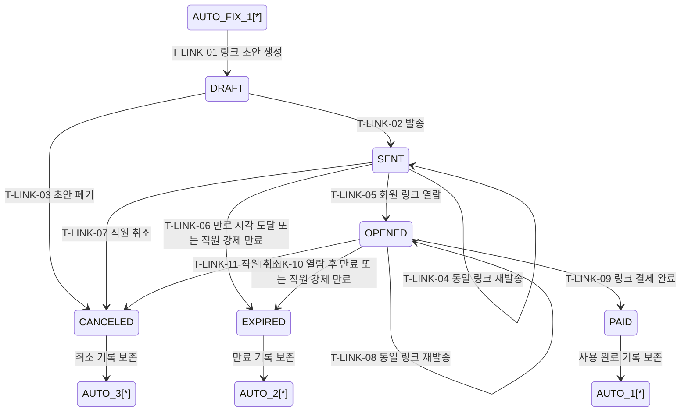

## 1. 개요

직원이 회원에게 발송하는 결제 링크(PaymentLink) 엔티티의 생명주기 상태를 정의한다.

- **엔티티**: `PaymentLink`
- **저장 방식**: DB enum
- **관련 화면**: SCR-S003(결제 처리), DLG-S016(결제링크발송), SCR-S001(매출 현황), SCR-M004(회원 상세 - 결제내역)
- **주의**: 결제 링크 상태는 `Payment` 상태와 별개다.

---

## 2. 상태 정의

| 상태값 | 한글명 | 설명 | UI 색상 | 종료 여부 |
|--------|--------|------|---------|-----------|
| `DRAFT` | 작성중 | 발송 전 임시 저장 상태 | #9E9E9E (회색) | 비종료 |
| `SENT` | 발송됨 | 회원에게 링크 발송 완료 | #03A9F4 (하늘색) | 비종료 |
| `OPENED` | 열람됨 | 회원이 링크를 열어 결제 페이지를 확인함 | #4CAF50 (녹색) | 비종료 |
| `PAID` | 결제완료 | 링크를 통해 결제까지 완료됨 | #2E7D32 (진녹색) | 종료 |
| `EXPIRED` | 만료 | 만료일시 경과 또는 사용 기한 종료 | #FF9800 (주황) | 종료 |
| `CANCELED` | 취소 | 직원이 링크를 회수하거나 발송 후 취소 | #F44336 (빨강) | 종료 |

---

## 3. 상태 전이 다이어그램

---

## 4. 운영 규칙

- 링크 발송 시 회원, 상품, 금액, 할인, 만료일시는 고정되며 회원이 수정할 수 없다.
- 기본 만료 기간은 발송 시점부터 7일 고정이며, 필요 시 운영자가 수동 만료할 수 있다.
- 활성 상태(`SENT`, `OPENED`)의 링크는 동일 원결제 기준 1개만 허용한다.
- 활성 링크는 같은 링크를 재발송할 수 있다.
- 링크 결제가 완료되면 연결된 원결제는 `APPROVED` 또는 `INSTALLMENT` 상태로 전환된다.
- 만료 또는 취소된 링크는 재사용하지 않고 필요 시 새 링크를 생성한다.
- 링크가 만료되어도 기존 미수금/할부 계획은 자동 삭제하지 않는다.
