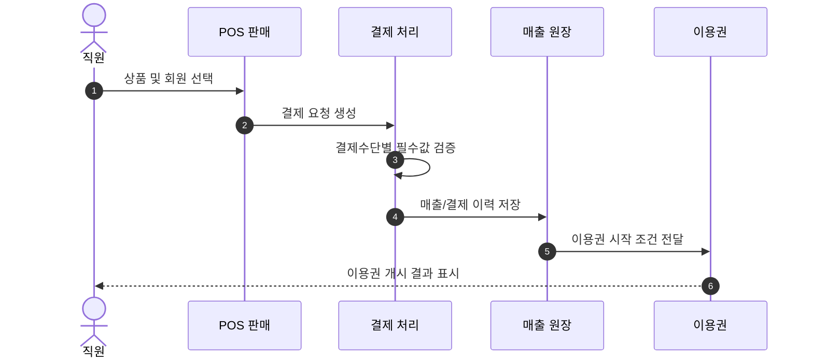

# X05 POS 결제 이용권 개시

## 목적

POS 판매와 결제 처리 화면에서 결제 이후 이용권 개시까지 이어지는 V1 기준 흐름을 정리한다.

```mermaid
sequenceDiagram
    autonumber
    actor Staff as 직원
    participant POS as POS 판매
    participant Payment as 결제 처리
    participant Sales as 매출 원장
    participant Pass as 이용권

    Staff->>POS: 상품 및 회원 선택
    POS->>Payment: 결제 요청 생성
    Payment->>Payment: 결제수단별 필수값 검증
    Payment->>Sales: 매출/결제 이력 저장
    Sales->>Pass: 이용권 시작 조건 전달
    Pass-->>Staff: 이용권 개시 결과 표시
```
