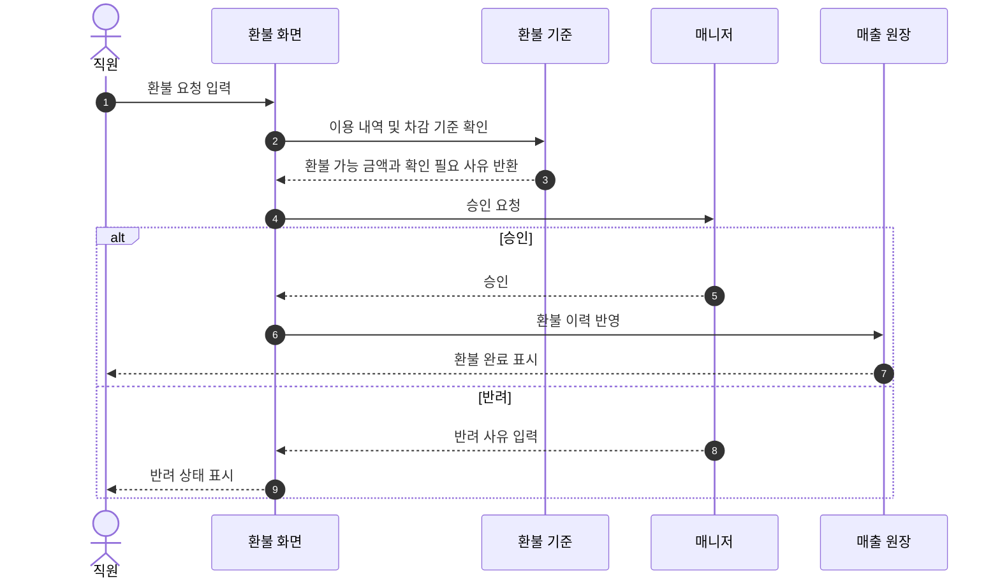

# X06 환불 요청 매니저 승인

## 목적

환불 관리와 결제 취소/부분 환불 화면에서 매니저 승인 중심의 환불 흐름을 정리한다.

```mermaid
sequenceDiagram
    autonumber
    actor Staff as 직원
    participant Refund as 환불 화면
    participant Policy as 환불 기준
    participant Manager as 매니저
    participant Sales as 매출 원장

    Staff->>Refund: 환불 요청 입력
    Refund->>Policy: 이용 내역 및 차감 기준 확인
    Policy-->>Refund: 환불 가능 금액과 확인 필요 사유 반환
    Refund->>Manager: 승인 요청
    alt 승인
        Manager-->>Refund: 승인
        Refund->>Sales: 환불 이력 반영
        Sales-->>Staff: 환불 완료 표시
    else 반려
        Manager-->>Refund: 반려 사유 입력
        Refund-->>Staff: 반려 상태 표시
    end
```
