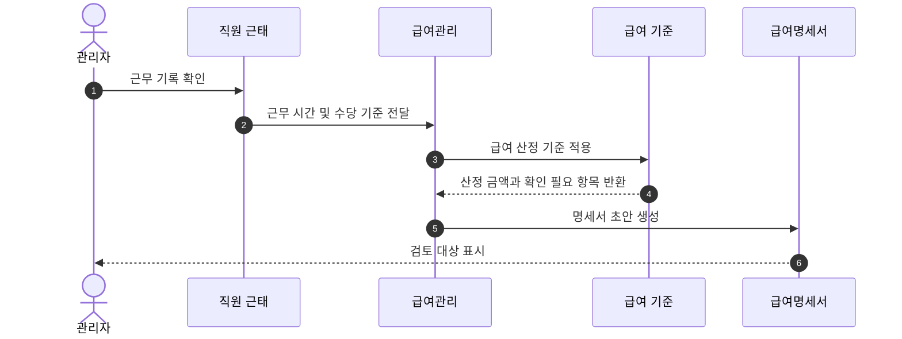

# X08 직원 근태 급여 계산

## 목적

직원 근태와 급여관리 화면에서 근무 기록이 급여 산정으로 이어지는 기본 흐름을 정리한다.

```mermaid
sequenceDiagram
    autonumber
    actor Admin as 관리자
    participant Attendance as 직원 근태
    participant Payroll as 급여관리
    participant Policy as 급여 기준
    participant Statement as 급여명세서

    Admin->>Attendance: 근무 기록 확인
    Attendance->>Payroll: 근무 시간 및 수당 기준 전달
    Payroll->>Policy: 급여 산정 기준 적용
    Policy-->>Payroll: 산정 금액과 확인 필요 항목 반환
    Payroll->>Statement: 명세서 초안 생성
    Statement-->>Admin: 검토 대상 표시
```
