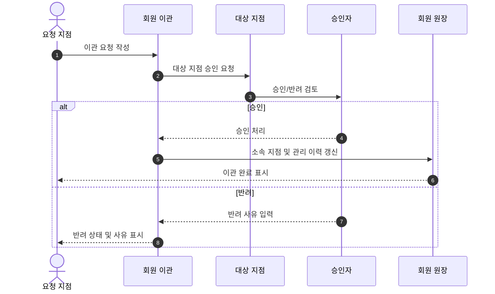

# X19 회원 이관 타지점 승인

## 목적

회원 상세와 회원 이관 화면에서 타지점 승인 흐름을 동일한 기준으로 확인할 수 있도록 정리한다.

```mermaid
sequenceDiagram
    autonumber
    actor Staff as 요청 지점
    participant Transfer as 회원 이관
    participant Target as 대상 지점
    participant Manager as 승인자
    participant Member as 회원 원장

    Staff->>Transfer: 이관 요청 작성
    Transfer->>Target: 대상 지점 승인 요청
    Target->>Manager: 승인/반려 검토
    alt 승인
        Manager-->>Transfer: 승인 처리
        Transfer->>Member: 소속 지점 및 관리 이력 갱신
        Member-->>Staff: 이관 완료 표시
    else 반려
        Manager-->>Transfer: 반려 사유 입력
        Transfer-->>Staff: 반려 상태 및 사유 표시
    end
```
