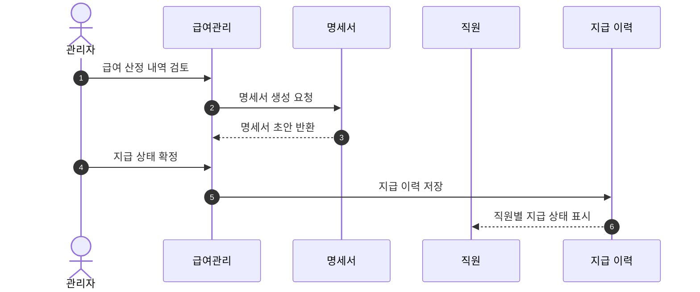

# X24 급여 지급 자동 명세서

## 목적

급여관리 화면에서 급여 확정 후 명세서 생성과 지급 상태 표시 흐름을 정리한다.

```mermaid
sequenceDiagram
    autonumber
    actor Admin as 관리자
    participant Payroll as 급여관리
    participant Statement as 명세서
    participant Staff as 직원
    participant Log as 지급 이력

    Admin->>Payroll: 급여 산정 내역 검토
    Payroll->>Statement: 명세서 생성 요청
    Statement-->>Payroll: 명세서 초안 반환
    Admin->>Payroll: 지급 상태 확정
    Payroll->>Log: 지급 이력 저장
    Log-->>Staff: 직원별 지급 상태 표시
```
