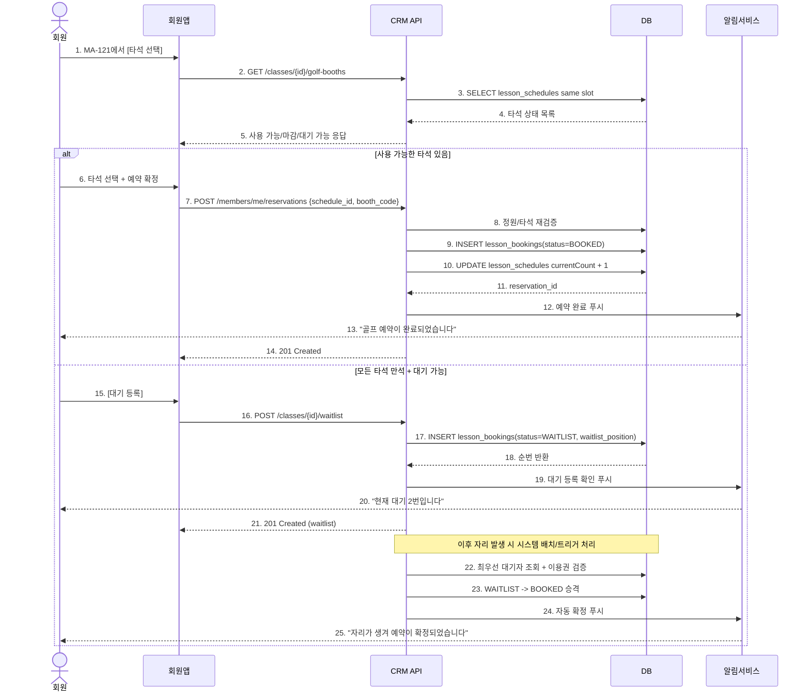

# X31 — 회원앱 골프 예약 → 타석 선택 → 대기 전환

## 1. 시나리오 개요

회원이 골프 수업 상세에서 사용 가능한 타석을 선택해 예약하거나, 만석일 경우 대기 예약으로 전환되는 흐름.

## 2. 시퀀스 다이어그램

## 3. 분기 요약

| 분기 | 조건 | 결과 |
|------|------|------|
| 타석 예약 | 사용 가능한 타석 존재 | 즉시 BOOKED |
| 대기 등록 | 전체 만석 + 대기 허용 | WAITLIST 생성 |
| 예약 실패 | 타석 동시 선점 충돌 | 재조회 후 재선택 유도 |

