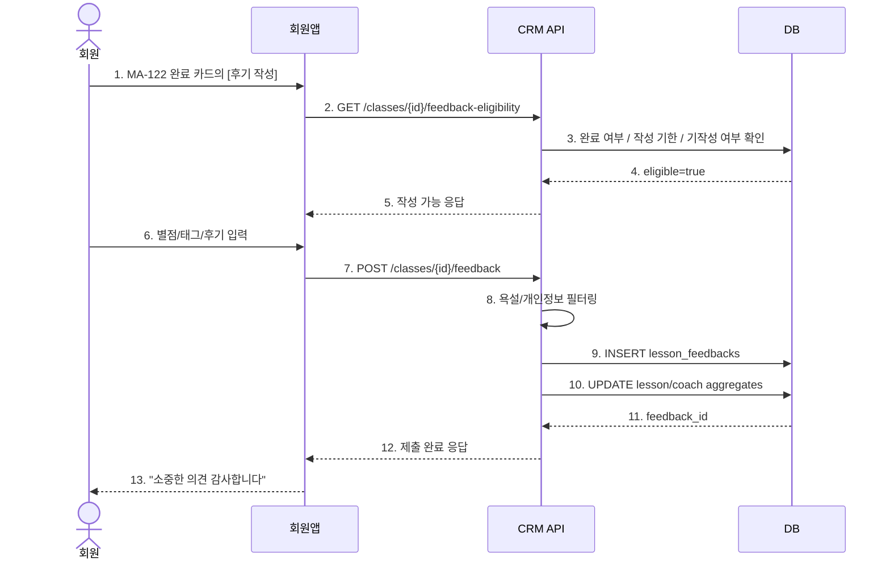

# X32 — 회원앱 수업 후기 / 만족도 등록

## 1. 시나리오 개요

회원이 완료된 수업에 대해 별점과 후기를 남기고, 시스템이 이를 저장 및 집계하는 흐름.

## 2. 시퀀스 다이어그램

## 3. 핵심 룰

| 항목 | 내용 |
|------|------|
| 작성 가능 대상 | 본인의 완료 수업 |
| 작성 기한 | 수업 완료 후 24시간 |
| 작성 횟수 | 예약당 1회 |
| 필수값 | 별점 |

