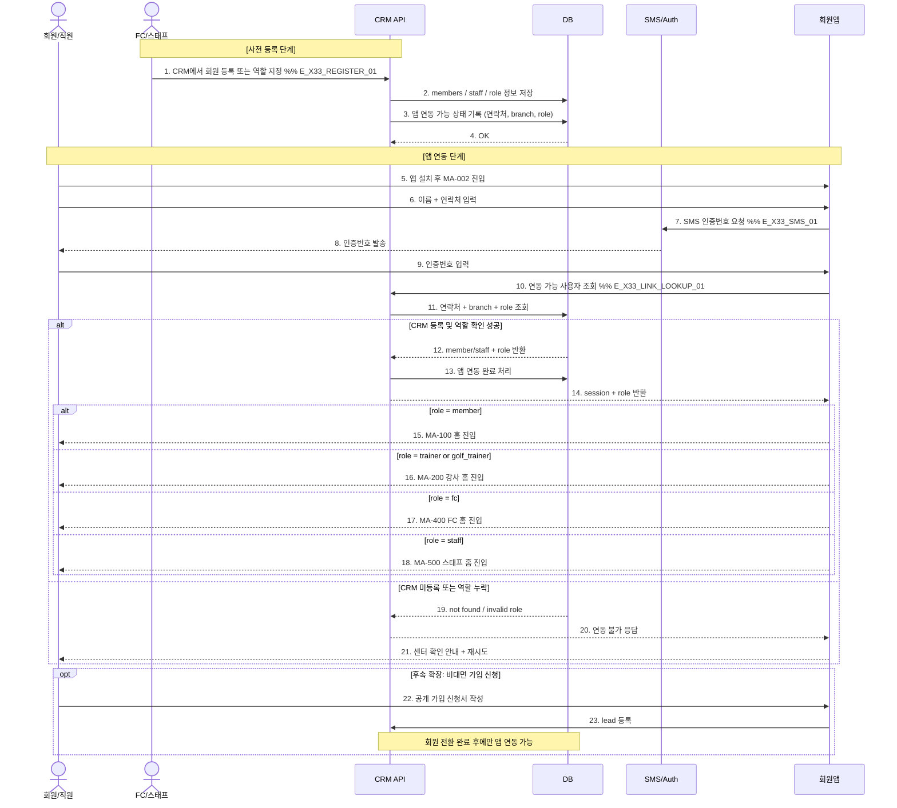

# X33 — CRM 회원 등록 → 앱 연동 → 역할 분기

## 1. 시나리오 개요

CRM에서 회원 또는 현장 역할 사용자를 먼저 등록한 뒤, 모바일 앱에서 SMS 인증으로 계정을 연동하고 role 값에 따라 첫 화면이 분기되는 흐름.

| 항목 | 내용 |
|------|------|
| 트리거 | 센터에서 CRM 회원 등록 또는 역할 계정 지정 완료 |
| 종료 조건 | 앱 연동 성공 + role 기반 첫 화면 진입 |
| 참여 도메인 | 회원관리, 수업관리, 마케팅, 회원앱 |
| 목적 | `온라인 회원가입`과 `센터 등록 후 앱 연동` 사이의 정책 충돌 해소 |

## 2. 전제조건

- CRM에 회원 또는 역할 계정이 이미 등록되어 있다.
- 연락처가 검증 가능한 값으로 저장되어 있다.
- 앱 사용 역할이 CRM에서 하나로 지정되어 있다.

## 3. 시퀀스 다이어그램

## 4. 정책 정리

| 항목 | 현재 기준 | 후속 기준 |
|------|----------|-----------|
| 앱 계정 생성 | CRM 등록 사용자만 연동 | 공개 신청은 리드 생성 후 전환 |
| role 결정 | CRM 원천값 사용 | 앱 내 임의 역할 변경 없음 |
| 첫 화면 분기 | `member/trainer/golf_trainer/fc/staff` | 역할 추가 시 동일 패턴 확장 |

## 5. 예외/분기

| 상황 | 처리 |
|------|------|
| 동일 연락처 중복 | CRM에서 기존 회원 확인 후 연동 대상 1건만 허용 |
| 소속 지점 불일치 | 앱 연동 차단 후 센터 확인 안내 |
| role 누락 | 연동 실패 처리, 운영자 보정 필요 |
