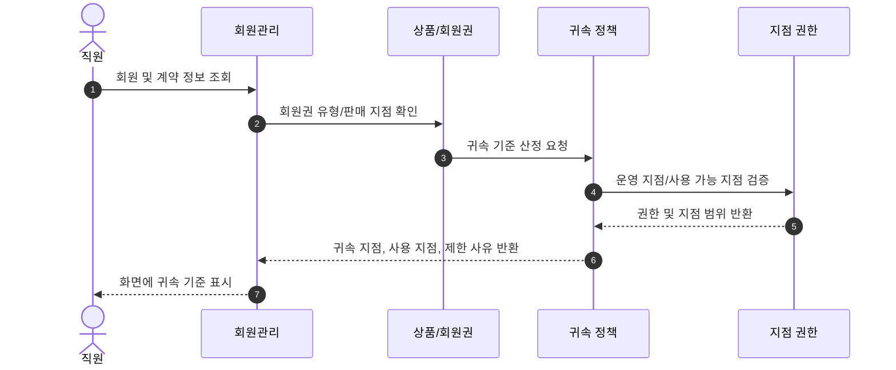

# X35 다지점 회원권 귀속 정책

## 목적

회원 등록, 수정, 상세, 이관, 상품, POS, 환불 화면에서 공통으로 참조하는 다지점 회원권 귀속 기준을 검수 기준으로 정리한다.

```mermaid
sequenceDiagram
    autonumber
    actor Staff as 직원
    participant Member as 회원관리
    participant Product as 상품/회원권
    participant Policy as 귀속 정책
    participant Branch as 지점 권한

    Staff->>Member: 회원 및 계약 정보 조회
    Member->>Product: 회원권 유형/판매 지점 확인
    Product->>Policy: 귀속 기준 산정 요청
    Policy->>Branch: 운영 지점/사용 가능 지점 검증
    Branch-->>Policy: 권한 및 지점 범위 반환
    Policy-->>Member: 귀속 지점, 사용 지점, 제한 사유 반환
    Member-->>Staff: 화면에 귀속 기준 표시
```
