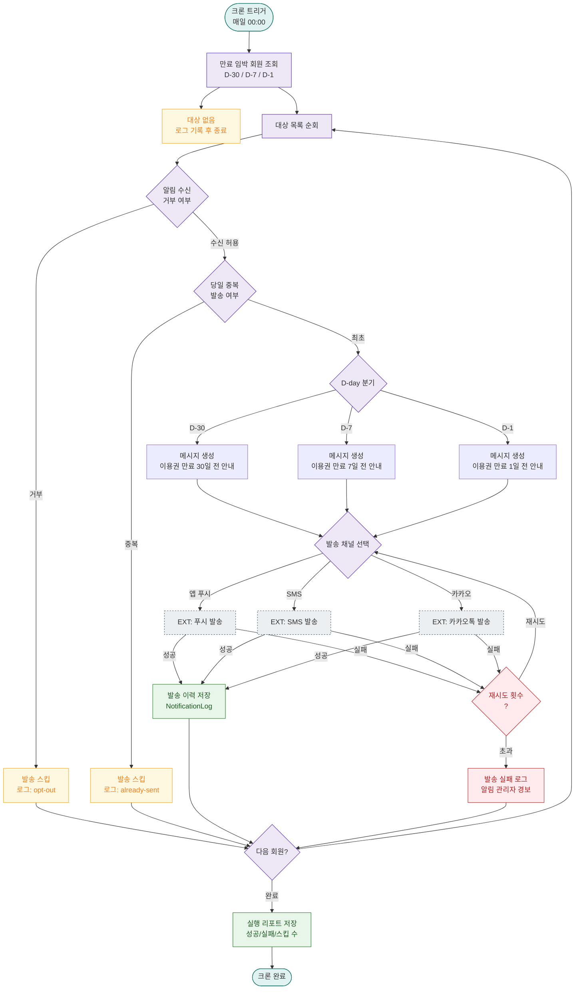

# A01 — 만료 임박 알림 자동 발송

## 1. 개요

| 항목 | 내용 |
|------|------|
| 트리거 | 크론 — 매일 00:00 |
| 대상 엔티티 | Membership (이용권) |
| 조건 | 만료일까지 D-30, D-7, D-1 |
| 결과 | 대상 회원에게 알림(SMS/푸시/카카오) 발송 |
| 관련 화면 | SCR-072 자동 알림 설정, SCR-M004 회원 상세 |

## 2. 발생 조건

- `Membership = ACTIVE`
- `Membership. - NOW() IN (30일, 7일, 1일)`
- 동일 회원에게 동일 D-day 알림은 하루 1회 중복 방지
- 알림 수신 거부() 회원 제외

## 3. 다이어그램

## 4. 복구/재시도 전략

| 상황 | 전략 |
|------|------|
| 채널 발송 실패 | 최대 3회 자동 재시도 (exponential backoff) |
| 3회 모두 실패 | 실패 로그 저장, 관리자 경보 발송 |
| 크론 자체 실패 | 다음 날 동일 조건 재실행 (D-day 재계산) |
| DB 조회 실패 | 크론 즉시 중단, 에러 로그 적재, 운영팀 알림 |

## 5. 사용자 노출 메시지

| D-day | 메시지 예시 |
|-------|------------|
| D-30 | "[FitGenie] 이용권이 30일 후 만료됩니다. 지금 연장하시면 할인 혜택을 받으실 수 있습니다." |
| D-7 | "[FitGenie] 이용권 만료 7일 전입니다. 지점에 방문하거나 앱에서 연장하세요." |
| D-1 | "[FitGenie] 내일 이용권이 만료됩니다. 만료 전 연장을 완료해주세요." |
