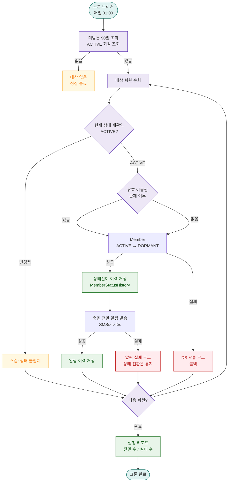

# A02 — 90일 미방문 회원 휴면 자동 전환

## 1. 개요

| 항목 | 내용 |
|------|------|
| 트리거 | 크론 — 매일 01:00 |
| 대상 엔티티 | Member |
| 조건 | 마지막 방문일로부터 90일 초과, status = ACTIVE |
| 결과 | Member = DORMANT 전환, 휴면 안내 알림 발송 |
| 관련 화면 | SCR-M001 회원 목록, SCR-M004 회원 상세 |

## 2. 발생 조건

- `Member = ACTIVE`
- `NOW() - Member.일`
- 이미 DORMANT/SUSPENDED/WITHDRAWN 상태 제외
- 유효한 이용권(ACTIVE Membership) 보유 여부 무관

## 3. 다이어그램

## 4. 복구/재시도 전략

| 상황 | 전략 |
|------|------|
| DB 업데이트 실패 | 트랜잭션 롤백, 해당 회원 스킵, 오류 로그 |
| 알림 발송 실패 | 상태 전환은 유지, 알림만 실패 로그 기록 |
| 크론 중단 | 다음 날 재실행 시 미처리 회원 재포함 (조건 재평가) |

## 5. 사용자 노출 메시지

| 채널 | 메시지 |
|------|--------|
| SMS/카카오 | "[FitGenie] 90일간 방문이 없어 휴면 회원으로 전환되었습니다. 다시 방문하시면 즉시 활성화됩니다." |
| 앱 알림 | "장기 미방문으로 휴면 전환. 센터 방문 또는 앱 로그인으로 활성화하세요." |
