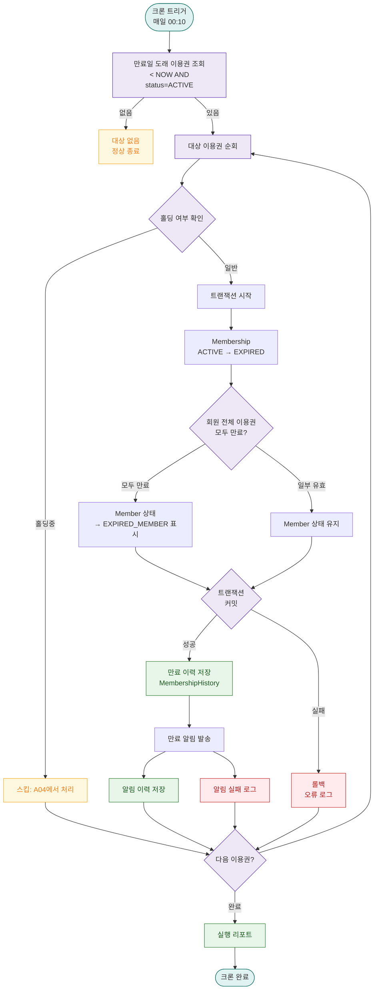

# A03 — 이용권 자동 만료 처리

## 1. 개요

| 항목 | 내용 |
|------|------|
| 트리거 | 크론 — 매일 00:10 |
| 대상 엔티티 | Membership |
| 조건 | ` < NOW()` AND `status = ACTIVE` |
| 결과 | Membership = EXPIRED 전환, 회원 알림 |
| 관련 화면 | SCR-M004-02 이용권 탭, SCR-S001 매출 현황 |

## 2. 발생 조건

- `Membership = ACTIVE`
- `Membership. < NOW()` (당일 00:10 기준)
- 홀딩(HOLDING) 상태 이용권 제외 (A04에서 처리)
- 잔여 횟수가 있어도 만료일 기준 우선

## 3. 다이어그램

## 4. 복구/재시도 전략

| 상황 | 전략 |
|------|------|
| 트랜잭션 실패 | 롤백, 해당 이용권 스킵, 다음 처리 계속 |
| 크론 실패 | 00:10에 재실행 불가 시 다음 날 재처리 |
| 홀딩 상태 오판 | A04 크론(00:20) 에서 홀딩 연장 후 재평가 |

## 5. 사용자 노출 메시지

| 채널 | 메시지 |
|------|--------|
| SMS | "[FitGenie] 이용권이 만료되었습니다. 지점 방문 또는 앱에서 재등록하세요." |
| 앱 알림 | "이용권 만료 — 재등록 시 특별 혜택을 확인하세요." |
