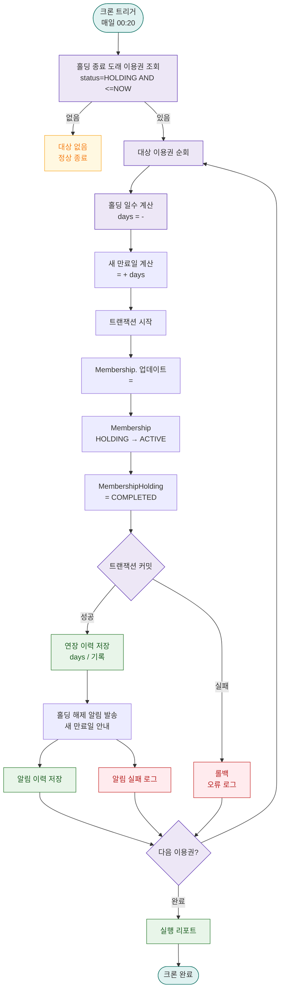

# A04 — 홀딩 자동 연장 계산

## 1. 개요

| 항목 | 내용 |
|------|------|
| 트리거 | 크론 — 매일 00:20 |
| 대상 엔티티 | Membership, MembershipHolding |
| 조건 | 홀딩 종료일이 도래한 이용권 ( <= NOW()) |
| 결과 | 홀딩 기간만큼 연장, status = ACTIVE 복원 |
| 관련 화면 | SCR-M004-02 이용권 탭, DLG-M003 홀딩 등록/해제 |

## 2. 발생 조건

- `Membership = HOLDING`
- `MembershipHolding. <= NOW()`
- 홀딩 일수 = ` - `
- 새 만료일 = 기존 만료일 + 홀딩 일수

## 3. 다이어그램

## 4. 복구/재시도 전략

| 상황 | 전략 |
|------|------|
| 트랜잭션 실패 | 롤백, 오류 로그, 다음 크론 재처리 |
| 홀딩 일수 0 이하 | 연장 없이 ACTIVE 복원만 수행 |
| 중복 실행 방지 | COMPLETED 상태 확인으로 중복 방지 |

## 5. 사용자 노출 메시지

| 채널 | 메시지 |
|------|--------|
| SMS | "[FitGenie] 기간정지가 해제되었습니다. 새 만료일: {}. 다시 이용하세요!" |
| 앱 알림 | "홀딩 해제 완료 — 이용권이 {days}일 연장되었습니다." |
