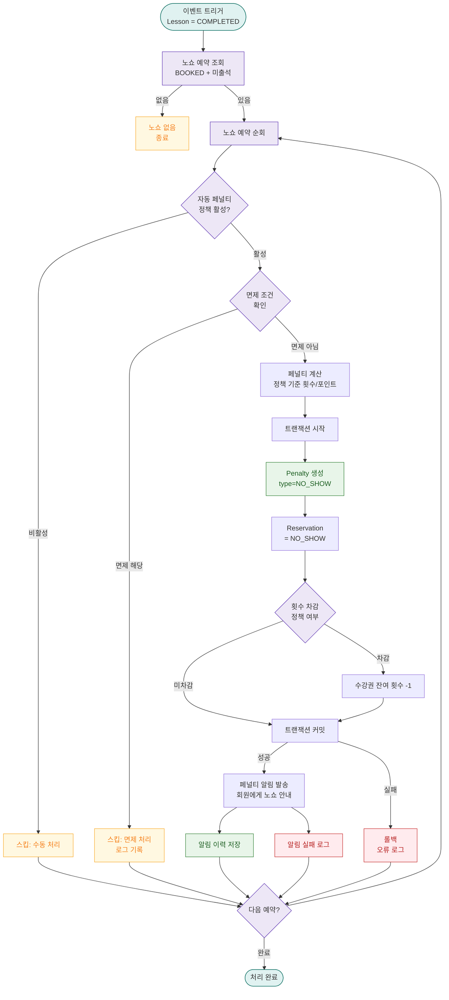

# A05 — 자동 페널티 발생

## 1. 개요

| 항목 | 내용 |
|------|------|
| 트리거 | 이벤트 기반 — 수업 종료 시 노쇼 감지 |
| 대상 엔티티 | Lesson, Reservation, Penalty |
| 조건 | 예약 있음 + 수업 종료 후 출석 미체크 = 노쇼 |
| 결과 | Penalty 생성, 예약 횟수 차감, 알림 발송 |
| 관련 화면 | SCR-C008 페널티 관리, DLG-C013 자동페널티 정책 |

## 2. 발생 조건

- `Lesson = COMPLETED`
- `Reservation = BOOKED` (출석 처리 안 됨)
- 수업 종료 후 N분 이내 자동 트리거 (기본 30분)
- 페널티 정책(AutoPenaltyPolicy)이 활성화된 지점

## 3. 다이어그램

## 4. 복구/재시도 전략

| 상황 | 전략 |
|------|------|
| 트랜잭션 실패 | 롤백, 오류 로그, 이벤트 큐 재투입 |
| 정책 변경 후 소급 적용 | 변경 시점 이후 수업에만 적용 |
| 면제 조건 오판 | 관리자가 SCR-C008에서 수동 취소 가능 |

## 5. 사용자 노출 메시지

| 채널 | 메시지 |
|------|--------|
| SMS | "[FitGenie] {날짜} 수업 노쇼로 페널티가 부여되었습니다. 자세한 내용은 센터에 문의하세요." |
| 앱 알림 | "노쇼 페널티 발생 — 횟수 {N}회 차감. 이의신청은 담당 트레이너에게 연락하세요." |
