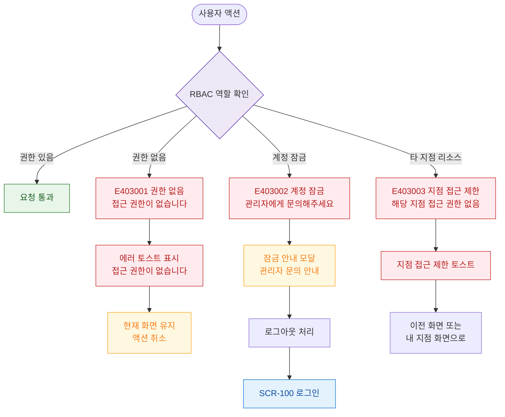

# E02 — 권한 없음 (403)

## 1. 개요

| 항목 | 내용 |
|------|------|
| 에러코드 | E403001 / E403002 / E403003 |
| HTTP | 403 Forbidden |
| 발생 모듈 | 공통 (RBAC) |
| 영향 화면 | 권한 필요 모든 화면, SCR-108 에러 페이지 |

## 2. 발생 조건

| 에러코드 | 조건 |
|----------|------|
| E403001 | 역할(Role) 기반 접근 제어 — 해당 역할에 권한 없음 |
| E403002 | 로그인 실패 5회 이상으로 계정 잠금 |
| E403003 | 멀티테넌트 — 타 지점 리소스 접근 시도 |

## 3. 다이어그램

## 4. 복구/재시도 전략

| 에러 | 복구 경로 |
|------|-----------|
| E403001 | 현재 화면 유지, 권한 있는 기능만 표시 |
| E403002 | 관리자에게 계정 잠금 해제 요청 |
| E403003 | 접근 가능한 지점 화면으로 리다이렉트 |

## 5. 사용자 노출 메시지

| 에러코드 | 메시지 |
|----------|--------|
| E403001 | 접근 권한이 없습니다 |
| E403002 | 계정이 잠겼습니다. 관리자에게 문의해주세요 |
| E403003 | 해당 지점에 대한 접근 권한이 없습니다 |
