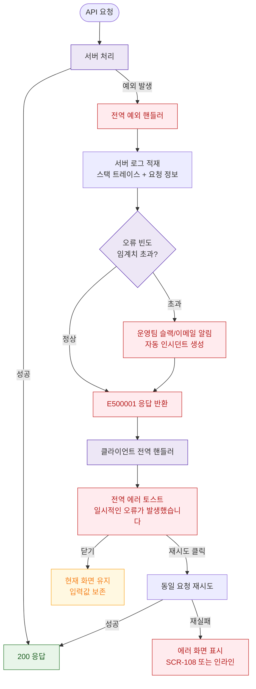

# E06 — 서버 내부 오류 (500)

## 1. 개요

| 항목 | 내용 |
|------|------|
| 에러코드 | E500001 |
| HTTP | 500 Internal Server Error |
| 발생 모듈 | 전 모듈 |
| 영향 화면 | 전체 화면, SCR-108 에러 페이지 |

## 2. 발생 조건

- 서버 unhandled exception
- DB 쿼리 오류
- 메모리 부족, 스레드 데드락
- 예상치 못한 null 참조, 타입 오류

## 3. 다이어그램

## 4. 복구/재시도 전략

| 상황 | 전략 |
|------|------|
| 단발성 오류 | 재시도 버튼 제공 |
| 반복 오류 | 운영팀 알림, 인시던트 생성 |
| 폼 입력 중 발생 | 입력값 보존, 재시도 가능 |
| 크리티컬 오류 | 서버 재시작, 롤백 |

## 5. 사용자 노출 메시지

| 에러코드 | 메시지 |
|----------|--------|
| E500001 | 일시적인 오류가 발생했습니다. 잠시 후 다시 시도해주세요 |
