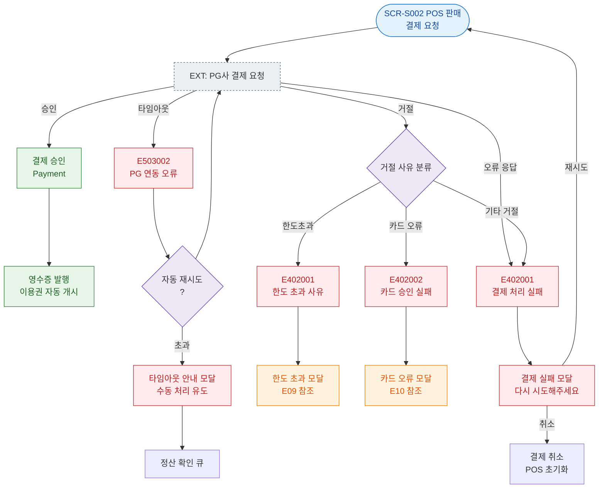

# E08 — 결제 PG 실패

## 1. 개요

| 항목 | 내용 |
|------|------|
| 에러코드 | E402001 / E503002 |
| HTTP | 402 / 503 |
| 발생 모듈 | 매출/결제 |
| 영향 화면 | SCR-S002 POS 판매, SCR-S003 결제 처리 |

## 2. 발생 조건

| 에러코드 | 조건 |
|----------|------|
| E402001 | PG사 결제 응답 실패 (거절/오류) |
| E503002 | PG API 자체 장애 또는 타임아웃 |

## 3. 다이어그램

## 4. 복구/재시도 전략

| 상황 | 전략 |
|------|------|
| PG 거절 | 실패 모달, 다른 결제 수단 유도 |
| PG 타임아웃 | 3회 자동 재시도, 정산 확인 큐 |
| 결제 불명 | 관리자 수동 정산 확인 |

## 5. 사용자 노출 메시지

| 에러코드 | 메시지 |
|----------|--------|
| E402001 | 결제 처리에 실패했습니다. 다시 시도해주세요 |
| E503002 | 결제 서비스에 일시적인 문제가 발생했습니다 |
