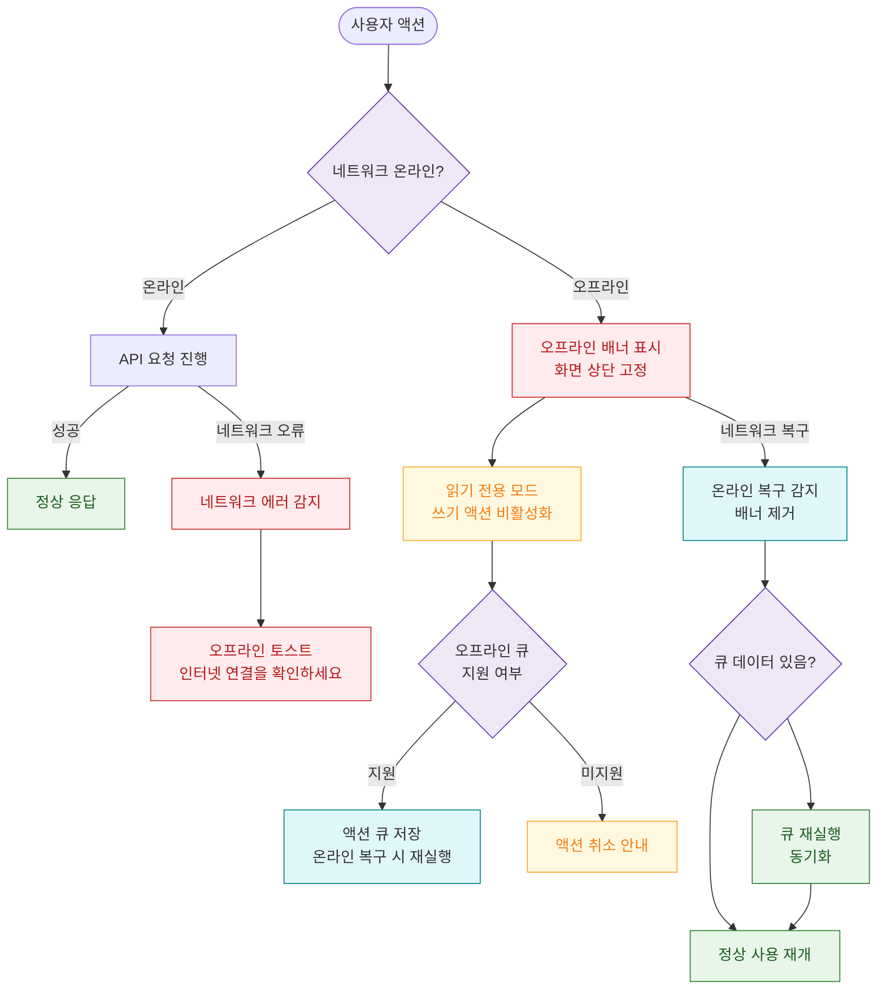

# E11 — 네트워크 오프라인

## 1. 개요

| 항목 | 내용 |
|------|------|
| 에러코드 | 클라이언트 네트워크 오류 (HTTP 에러코드 없음) |
| 발생 위치 | 클라이언트 (브라우저/앱) |
| 발생 모듈 | 전 모듈 |
| 영향 화면 | 전체 화면 — 오프라인 배너/토스트 |

## 2. 발생 조건

- `navigator.` 감지
- fetch/axios 요청 시 `Network Error` 수신
- Wi-Fi/LTE 단절
- 서버 접근 불가 (DNS 실패 등)

## 3. 다이어그램

## 4. 복구/재시도 전략

| 상황 | 전략 |
|------|------|
| 오프라인 감지 | 배너 표시, 쓰기 액션 비활성화 |
| 오프라인 큐 지원 | 액션 저장, 온라인 복구 시 재실행 |
| 오프라인 큐 미지원 | 액션 취소, 재시도 안내 |
| 온라인 복구 | 배너 제거, 큐 재실행, 정상 재개 |

## 5. 사용자 노출 메시지

| 상황 | 메시지 |
|------|--------|
| 오프라인 배너 | "인터넷 연결이 끊겼습니다. 연결을 확인하세요." |
| 오프라인 토스트 | "네트워크 연결을 확인해주세요." |
| 온라인 복구 | "연결이 복구되었습니다." |
