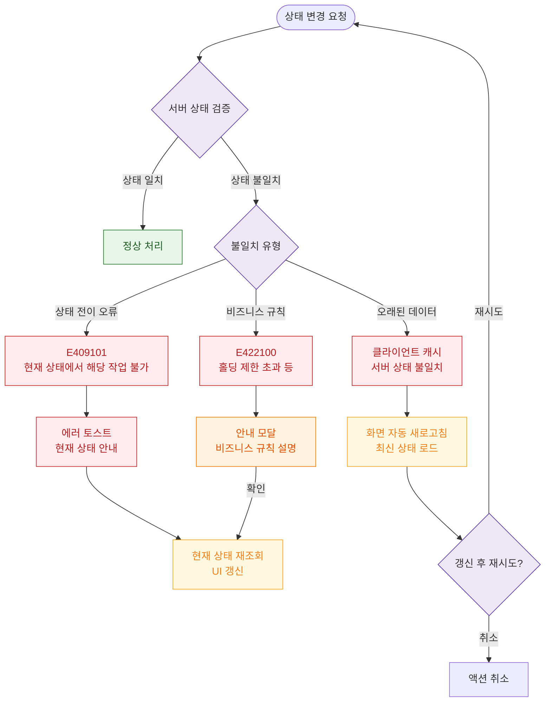

# E13 — 데이터 불일치

## 1. 개요

| 항목 | 내용 |
|------|------|
| 에러코드 | E409101 / E422100 |
| HTTP | 409 / 422 |
| 발생 모듈 | 회원 관리, 수업, 이용권 |
| 영향 화면 | 회원 상태 변경, 이용권 처리, 수업 처리 화면 |

## 2. 발생 조건

- 클라이언트가 보유한 상태와 서버 실제 상태 불일치
- 타 사용자가 동시에 동일 리소스 수정
- 화면 로드 후 오래된 캐시 상태로 액션
- 잘못된 상태 전이 경로 시도

## 3. 다이어그램

## 4. 복구/재시도 전략

| 상황 | 전략 |
|------|------|
| 상태 전이 오류 | 현재 상태 재조회, UI 갱신 후 올바른 액션 유도 |
| 오래된 캐시 | 자동 새로고침, 최신 상태로 재시도 |
| 비즈니스 규칙 위반 | 규칙 안내 모달, 올바른 처리 방법 안내 |

## 5. 사용자 노출 메시지

| 에러코드 | 메시지 |
|----------|--------|
| E409101 | 현재 상태에서는 해당 작업을 수행할 수 없습니다 |
| E422100 | 기간정지 가능 횟수를 초과했습니다 |
| 오래된 데이터 | 데이터가 변경되었습니다. 화면을 새로고침합니다. |
